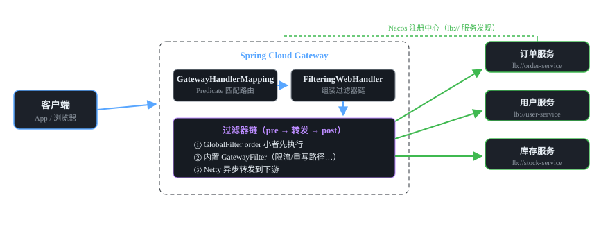
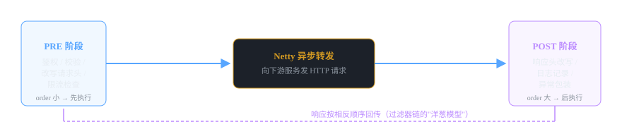

# 微服务组件 01 · 服务网关 Spring Cloud Gateway

> 微服务组件的"总大门"：统一收口所有流量，做路由、鉴权、限流、灰度。基于 Spring WebFlux + Netty 的非阻塞式网关。
>
> 技术栈：Spring Cloud 2021.0.x · Spring Boot 2.7 · WebFlux · Netty

## 目录
1. 是什么 / 解决什么问题
2. 核心原理
3. 核心概念表
4. 代码示例
5. 面试题与回答
6. 小结与口诀

---

## 1. 是什么 / 解决什么问题

**网关（API Gateway）** 是微服务架构中所有外部请求的统一入口。客户端不再直接调用各个微服务，而是先打到网关，由网关负责路由转发和横切处理。

### 1.1 没有网关会怎样？（痛点引入）

- **地址暴露**：每个微服务 IP:端口直接暴露给客户端，容易被攻击。
- **认证分散**：每个服务都要自己写一遍鉴权逻辑，改一处要改 N 处。
- **横切逻辑重复**：日志、限流、跨域、参数校验，每个服务各做各的。
- **无法统一管控**：灰度发布、接口文档、监控埋点都没有统一入口。
- **客户端负担重**：前端要维护一堆服务地址，服务拆分越多越难。

### 1.2 网关能干什么

**核心三板斧：路由转发、断言匹配、过滤器链。**

衍生能力：统一鉴权（JWT 校验）、限流（Redis + RequestRateLimiter）、跨域 CORS、日志埋点、灰度路由（按 Header/Cookie/权重）、协议转换、熔断降级（集成 Sentinel）。

### 1.3 为什么选 Gateway 而不是 Zuul

| 对比项 | Zuul 1.x | Spring Cloud Gateway |
|---|---|---|
| 底层 | Servlet 阻塞 IO（Tomcat） | WebFlux + Reactor + Netty 非阻塞 IO |
| 线程模型 | 一请求一线程，高并发下线程耗尽 | 事件驱动，少量线程扛高并发 |
| 性能 | 相对低 | 吞吐量更高（官方基准约 1.6 倍） |
| 维护状态 | Netflix 已停止维护（2020 年后 Spring Cloud 移除） | Spring Cloud 官方主推 |
| 异步 | 不支持 | 全链路异步 |

> **结论：** 新项目一律用 Gateway。面试被问"为什么不用 Zuul"，回答三个词：**非阻塞、性能高、官方维护**。

### 1.4 Gateway 和 Nginx 的区别（高频追问）

- Nginx：**L4/L7 负载均衡 + 反向代理**，静态资源处理强，但不做业务逻辑（无法解析 JWT、无法调数据库校验权限）。
- Gateway：**应用层 API 网关**，能做协议转换、业务鉴权、限流规则，是"能写代码的入口"。
- 真实架构：**Nginx 在最外层扛流量 → Gateway 做业务网关 → 微服务**，两者是配合关系不是替代关系。

---

## 2. 核心原理

### 2.1 三大核心概念：Route / Predicate / Filter

- **Route（路由）**：一条路由 = id + uri（转发目标）+ 一组 Predicate + 一组 Filter。是"转发规则"的整体。
- **Predicate（断言）**：匹配条件，如 Path=/api/order/**、Header=token、Method=GET。条件满足才走这条路由。
- **Filter（过滤器）**：请求转发前后执行的逻辑，可以修改请求/响应。分 GatewayFilter（路由级）和 GlobalFilter（全局级）。

> **理解关键：** Predicate 决定"**是否走这条路**"，Filter 决定"**路上怎么加工**"，两者都在 Route 里装配。

### 2.2 一次请求的完整流程



### 2.3 过滤器链的执行顺序



- Gateway 有**两套过滤器**：`GatewayFilter`（配在具体路由上，只对该路由生效）+ `GlobalFilter`（全局，所有路由生效）。
- 执行时两套合并排序，都实现 `Ordered` 接口：**order 值越小越先执行**。order 相同则 GatewayFilter 优先于 GlobalFilter。
- pre 逻辑（转发前）按 order 从小到大；post 逻辑（转发后）按相反顺序执行 —— 典型的**洋葱模型**。
- 过滤器是响应式写法：`chain.filter(exchange).then(Mono.fromRunnable(...))`，`then` 里就是 post 阶段。

### 2.4 为什么不阻塞：WebFlux + Netty

Gateway 不用 Servlet（Tomcat 一请求一线程），而是基于 **WebFlux（Reactive Streams）**，底层是 **Netty 事件循环**。IO 等待时不占用线程，少量线程即可支撑高并发，所以网关本身吞吐高、省资源。

> ⚠️ **大坑：** Gateway 项目里**不能引入 spring-boot-starter-web**（会同时起 Tomcat 导致冲突报错）。需要 Web 能力时用 WebFlux 的写法，或在独立模块里做业务。面试官最爱问这个。

---

## 3. 核心概念表

| 概念 | 作用 | 类比 |
|---|---|---|
| Route 路由 | 一条转发规则（id + uri + predicates + filters） | 快递单：目的地 + 收货条件 |
| Predicate 断言 | 请求匹配条件（Path/Header/Method/Query/时间/Cookie…） | 快递单上的"收件人条件" |
| GatewayFilter | 路由级过滤器，只对当前路由生效 | 这条路线的专属加工 |
| GlobalFilter | 全局过滤器，所有路由生效，可自定义（鉴权/日志） | 所有快递都要过的安检 |
| Ordered / order | 过滤器排序，值越小越先执行 | 安检通道的先后顺序 |
| lb:// 前缀 | uri 用 lb://服务名，走注册中心 + 负载均衡 | 按"公司名"找具体门店 |
| StripPrefix | 转发前剥掉 N 层路径前缀（内置过滤器） | 去掉包装再送进去 |
| RequestRateLimiter | 配合 Redis 的令牌桶限流（内置过滤器） | 门口的闸机计数 |

### 常用内置断言（Predicate）一览

```yaml
spring.cloud.gateway.routes:
- id: order-service
  uri: lb://order-service
  predicates:
  - Path=/api/order/**          # 路径匹配
  - Method=GET,POST              # 请求方法
  - Header=token, \d+            # 请求头存在且正则匹配
  - Query=userId                 # 带指定查询参数
  - Before=2026-12-31T23:59:59+08:00[Asia/Shanghai]  # 时间断言
  - Weight=group1, 80            # 权重路由（灰度）
```

---

## 4. 代码示例

> 技术栈：Spring Boot 2.7 + Spring Cloud 2021.0.x（与 RuoYi-Cloud 同代）。

### 4.1 pom.xml 依赖

```xml
<parent>
    <groupId>org.springframework.boot</groupId>
    <artifactId>spring-boot-starter-parent</artifactId>
    <version>2.7.18</version>
</parent>

<dependencies>
    <!-- 网关核心：WebFlux + Netty（注意：不能同时引入 starter-web） -->
    <dependency>
        <groupId>org.springframework.cloud</groupId>
        <artifactId>spring-cloud-starter-gateway</artifactId>
    </dependency>
    <!-- 服务发现：从 Nacos 拉取服务列表（lb:// 需要它） -->
    <dependency>
        <groupId>com.alibaba.cloud</groupId>
        <artifactId>spring-cloud-starter-alibaba-nacos-discovery</artifactId>
    </dependency>
    <!-- 负载均衡（lb:// 前缀解析） -->
    <dependency>
        <groupId>org.springframework.cloud</groupId>
        <artifactId>spring-cloud-starter-loadbalancer</artifactId>
    </dependency>
</dependencies>
```

### 4.2 application.yml：路由配置 + 全局默认过滤器

```yaml
server:
  port: 8080

spring:
  application:
    name: gateway-server
  cloud:
    nacos:
      discovery:
        server-addr: 127.0.0.1:8848
    gateway:
      routes:
        - id: order-service          # 路由唯一 id
          uri: lb://order-service     # lb:// + 服务名 = 注册中心负载均衡
          predicates:
            - Path=/api/order/**
          filters:
            - StripPrefix=2              # 剥掉 /api/order 两层前缀再转发
        - id: user-service
          uri: lb://user-service
          predicates:
            - Path=/api/user/**
          filters:
            - StripPrefix=2
      default-filters:              # 对所有路由生效
        - AddResponseHeader=X-Gateway, SCG
```

示例效果：客户端请求 `/api/order/list` → 网关匹配 order 路由 → 剥掉前缀转发为 `order-service /list`。

### 4.3 自定义 GlobalFilter：JWT 统一鉴权

```java
@Component
@Slf4j
public class AuthGlobalFilter implements GlobalFilter, Ordered {

    // 白名单：登录、验证码等接口直接放行，不校验 token
    private static final List<String> WHITE_LIST = Arrays.asList(
            "/api/user/login", "/api/user/captcha");

    @Override
    public Mono<Void> filter(ServerWebExchange exchange, GatewayFilterChain chain) {
        String path = exchange.getRequest().getURI().getPath();
        // 1. 白名单直接放行
        if (WHITE_LIST.stream().anyMatch(path::startsWith)) {
            return chain.filter(exchange);
        }
        // 2. 取出请求头里的 token
        String token = exchange.getRequest().getHeaders().getFirst("Authorization");
        if (token == null || token.isEmpty()) {
            return unauthorized(exchange, "未携带 token");
        }
        // 3. 校验 token（简化：真实项目可调用户服务 / 本地解析 JWT）
        if (!token.startsWith("Bearer ")) {
            return unauthorized(exchange, "token 格式错误");
        }
        // 4. 放行，进入过滤器链下一环
        return chain.filter(exchange);
    }

    // 统一返回 401 JSON（响应式写法：写 body 用 DataBuffer）
    private Mono<Void> unauthorized(ServerWebExchange exchange, String msg) {
        exchange.getResponse().setStatusCode(HttpStatus.UNAUTHORIZED);
        exchange.getResponse().getHeaders().setContentType(MediaType.APPLICATION_JSON);
        return exchange.getResponse().writeWith(
                Mono.just(exchange.getResponse().bufferFactory()
                        .wrap(("{\"code\":401,\"msg\":\"" + msg + "\"}").getBytes(StandardCharsets.UTF_8))));
    }

    @Override
    public int getOrder() {
        return -100;   // 值越小越先执行，让鉴权最先跑
    }
}
```

> 💡 **面试要点：** 自定义 GlobalFilter 三件事：实现 `GlobalFilter`、实现 `Ordered`（控制顺序）、在 `filter()` 里返回 `Mono<Void>`（要么放行 `chain.filter(exchange)`，要么直接写响应拦截）。

### 4.4 网关限流：RequestRateLimiter + Redis

```yaml
spring.cloud.gateway.routes:
- id: order-service
  uri: lb://order-service
  predicates:
  - Path=/api/order/**
  filters:
  - name: RequestRateLimiter
    args:
      redis-rate-limiter.replenishRate: 10   # 每秒补充令牌数（平均速率）
      redis-rate-limiter.burstCapacity: 20   # 桶容量（允许突发量）
      key-resolver: "#{@ipKeyResolver}"        # 按什么维度限流（这里按 IP）
```

```java
@Configuration
public class RateLimitConfig {
    // 定义"按客户端 IP"作为限流 key
    @Bean
    public KeyResolver ipKeyResolver() {
        return exchange -> {
            String ip = exchange.getRequest().getRemoteAddress().getAddress().getHostAddress();
            return Mono.just(ip);
        };
    }
}
```

> ⚠️ **依赖提醒：** RequestRateLimiter 需要 `spring-boot-starter-data-redis-reactive`，且本机要能连上 Redis，否则启动可能报错。

---

## 5. 面试题与回答

### Q1：为什么用 Spring Cloud Gateway 而不是 Zuul？

**答：** ① 底层模型不同：Zuul 1.x 基于 Servlet 阻塞 IO，一请求一线程，高并发下线程池容易耗尽；Gateway 基于 WebFlux + Netty 事件驱动非阻塞，吞吐高、资源占用低。② 维护状态：Zuul 1.x 已停止维护，Spring Cloud 2020 起从官方组件中移除；Gateway 是 Spring 官方主推。③ 功能上 Gateway 的断言/过滤器更灵活，天然集成限流、熔断、重试等。

> 追问"Zuul 2 呢"：Zuul 2 重构为 Netty 非阻塞，但 Netflix 长期未发布稳定版给 Spring Cloud 集成，市场没起来，实际选型仍是 Gateway。

### Q2：Route、Predicate、Filter 三者的关系和区别？

**答：** 一条 **Route（路由）** = id + uri + 一组 **Predicate（断言）** + 一组 **Filter（过滤器）**。Predicate 负责"匹配"：判断当前请求是否命中这条路由（Path、Method、Header 等条件）；Filter 负责"加工"：请求转发前/后做处理（鉴权、限流、改写头、重试）。Predicate 决定"走不走这条路"，Filter 决定"路上怎么加工"，两者都装配在 Route 里，由 GatewayHandlerMapping 先匹配路由，再由 FilteringWebHandler 执行过滤器链。

### Q3：过滤器执行顺序是怎么控制的？pre 和 post 有什么区别？

**答：** 所有过滤器实现 `Ordered` 接口，**order 值越小越先执行**。整体分两阶段：**pre**（转发前，按 order 从小到大执行：鉴权、参数校验、改写请求头）→ **Netty 异步转发** → **post**（转发后，按 order 从大到小反向执行：记录响应日志、包装异常、改写响应头）。这就是"洋葱模型"：pre 一层层往里，post 一层层往外。代码上用 `chain.filter(exchange).then(Mono.fromRunnable(...))` 表示 post 逻辑。

### Q4：Gateway 里能不能引入 spring-boot-starter-web？

**答：** 不能。Gateway 基于 WebFlux（响应式），starter-web 是 Servlet 栈（Tomcat），两个容器同时存在会冲突，启动报错或行为异常。需要写 Controller 时用 WebFlux 的 `@RestController` + `Mono/Flux` 写法，不引入 starter-web。这也是面试官判断你有没有真正跑过网关的"试金石"。

### Q5：网关做了哪些事？说出你项目里的实践

**答：** 项目里网关做了五件事：① **路由转发**：按 Path 断言把 /api/order/** 转发到订单服务；② **统一鉴权**：自定义 GlobalFilter 校验 JWT，白名单接口放行；③ **限流**：RequestRateLimiter + Redis 按 IP 限流；④ **跨域**：统一配置 CORS；⑤ **日志**：记录请求耗时和响应状态。核心收益是把"横切逻辑"从各服务抽出来，服务只关心业务。

> 诚实加分项：可以补一句"鉴权在网关只做了 token 存在性校验，精细的权限判断还是在下游服务，避免网关过重"——体现你思考过网关定位。

### Q6：网关和 Nginx 的区别？能互相替代吗？

**答：** 不能互相替代。Nginx 是**反向代理 + 负载均衡**，工作在 L4/L7，擅长静态资源、连接层转发，但它是 C 写的配置型软件，做不了业务逻辑（解析 JWT、查库校验权限）。Gateway 是**应用层 API 网关**，可以写代码做鉴权、限流、协议转换、灰度。生产架构通常是：**DNS → Nginx（入口流量/静态资源）→ Gateway（业务网关）→ 微服务**，Nginx 挡在最前面扛流量，Gateway 做精细管控。

### Q7：lb:// 前缀是什么意思？没有它行不行？

**答：** uri 写 `lb://order-service` 表示：从**注册中心**按服务名拿到实例列表，再用**负载均衡**选一个实例转发。如果写死 `http://127.0.0.1:8081`，就是固定转发到单个实例，服务多副本时流量不会分摊，实例挂了也不会自动切换。所以生产都用 lb:// + 服务名，这要求网关引入 nacos-discovery 和 loadbalancer 两个依赖。

### Q8：网关自身的高可用怎么做？（网关挂了怎么办）

**答：** 网关是单点，必须多实例部署 + 前面挂负载均衡（Nginx/LB）做集群。常见三种：① 多实例部署多个 Gateway 进程，Nginx upstream 轮询；② 部署到 K8s 用 Service + 多副本自动扩缩容；③ 网关本身要做轻量设计（只做路由和横切，不做重业务），把状态外置（限流计数放 Redis），保证无状态、可水平扩展。网关无状态是关键：不要在里面存 Session 之类的本地状态。

### Q9：如何在网关做灰度发布？

**答：** 三种思路：① **Weight 断言**：同一服务配两条路由，按权重分流（新版本 10% / 老版本 90%）；② **Header/Cookie 断言**：请求头带 `version=gray` 的走新版本路由，适合内部测试；③ 结合 Nacos 的**权重元数据**或 K8s 的流量管理（Istio）。最轻量的是 Weight 断言，配置即灰度，不用改代码。

### Q10：网关里做了阻塞操作（比如同步调数据库、Thread.sleep）会怎样？

**答：** 会**阻塞 Netty 事件循环线程**，导致整个网关吞吐骤降，甚至把请求线程池占满——这是响应式编程最大的坑。Netty 线程很少（通常 = CPU 核数 ×2），一个线程被阻塞，成千上万的连接都在等它。所以网关里尽量不做重 IO：需要查的东西放 Redis（异步客户端）、鉴权用本地解析 JWT、下游调用交给转发的异步链路。实在要阻塞，可以 `publishOn(boundedElastic())` 丢到弹性线程池。

---

## 6. 小结与口诀

**一句话定位：** 网关 = 微服务的总大门，统一收口流量，把鉴权/限流/路由等横切逻辑从各服务抽出来。

**口诀：** "路由断言过滤器，前置后置一条链；WebFlux 非阻塞，Netty 底层跑得快；lb 前缀找注册，order 小者先执行。"

**三大坑：**
1. 别引入 starter-web（Servlet 冲突）
2. 过滤器里别做阻塞操作（堵死事件循环）
3. 生产必须多实例 + 前置负载均衡（网关单点是灾难）

**下一跳：** lb:// 依赖注册中心，下一篇讲 **Nacos 注册中心**——服务是怎么被找到的。

---

*微服务组件文档系列 · 01/16 · 技术栈 Spring Boot 2.7 + Spring Cloud 2021.0.x + Spring Cloud Alibaba · 生成于 2026-09-19*
