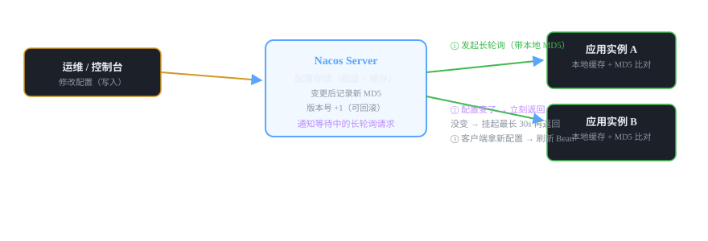
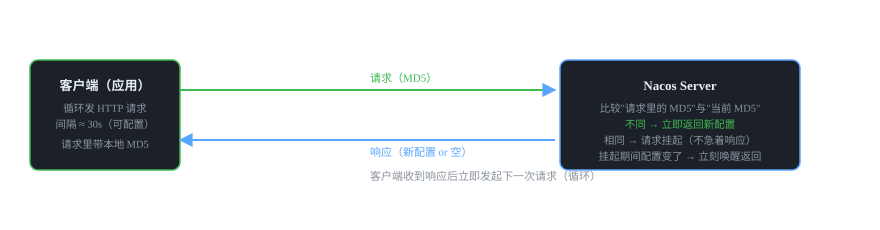

# 微服务组件 03 · 配置中心 Nacos Config

> 把配置从代码里搬到中心：改一处、全部生效、不重启。核心机制是"长轮询"（long polling），不是长连接。
>
> 技术栈：Nacos Config 2.2.x · 长轮询 · @RefreshScope · 动态刷新

## 目录
1. 是什么 / 解决什么问题
2. 核心原理
3. 核心概念表
4. 代码示例
5. 面试题与回答
6. 小结与口诀

---

## 1. 是什么 / 解决什么问题

**配置中心（Config Center）** 把应用的配置从本地文件搬到中央服务器，统一管理、动态下发、支持版本回滚。

### 1.1 没有配置中心会怎样？（痛点引入）

- **改配置要改代码**：数据库地址、开关、阈值写死在 application.yml，改一下就要重新打包发布。
- **改配置要重启**：几十个实例挨个重启，凌晨发版、全量重启，风险高。
- **多环境配置散乱**：dev / test / prod 各一份文件，漏改一个环境就事故。
- **没有审计**：谁改的、改成什么、能不能回滚，全靠记忆。

### 1.2 配置中心的核心能力

1. **集中管理**：所有服务配置在一个控制台维护。
2. **动态刷新**：改配置即时生效，**无需重启**（这是最大的价值）。
3. **多环境隔离**：namespace 隔离 dev/test/prod，配置天然不串。
4. **版本回滚**：每次变更记录版本，出问题一键回退。
5. **灰度/权限**：支持配置加解密、发布审核（部分高级能力需企业版或结合控制台）。

### 1.3 为什么要"动态刷新"而不用重启？

微服务几十上百个实例，重启一次是成本：停机窗口、连接风暴（重启后大量服务同时重连注册中心/数据库）、发布失败回滚。配置中心把"改配置"变成秒级操作，是微服务运维效率的核心基础设施。

---

## 2. 核心原理

### 2.1 配置动态刷新的整体流程



### 2.2 长轮询（Long Polling）原理 —— 面试必考



- **不是长连接**：客户端每次发一个普通 HTTP 请求，服务端如果发现配置没变，**不立刻返回，而是把请求挂起最多 30 秒**；30 秒内配置变了就立刻响应，没变就超时返回空。
- **MD5 比对**：请求携带客户端本地配置的 MD5，服务端比对当前 MD5，不同才返回新配置。这样既省流量又实现"准实时"（最坏延迟 ≈ 挂起时长，默认 30s，实际因为循环连续请求通常秒级）。
- **为什么不用长连接/推送？**：长连接实现简单（Nacos 2.x 的 gRPC 已经支持推送，但配置中心仍保留长轮询兜底）；长轮询的好处是 HTTP 无状态、实现简单、天然兼容负载均衡，客户端断了不影响服务端。
- Nacos 2.x 的配置变更通知也走 gRPC 双向流（推送 + 客户端再拉取确认），但面试答"长轮询 + MD5 比对"永远是对的底层答案。

### 2.3 服务端收到配置变更后，应用里怎么"热更新"？

1. 客户端拉取到新配置 → 更新 `Environment` 里的 PropertySource。
2. 触发 `RefreshEvent` → Spring Cloud 的 `RefreshScope` 监听。
3. 标记为 `@RefreshScope` 的 Bean 被**销毁重建**（不是改属性，是换新对象），`@Value` 字段重新注入新值。

> ⚠️ **关键理解：** `@Value` 注入的值在 Bean 创建时就已经"固化"进对象了，普通 Bean 不重建永远拿不到新值。所以必须加 `@RefreshScope`，让 Spring 把这个 Bean 标记为"可刷新"，配置变更时销毁重建。**不加 @RefreshScope = 配置改了不生效**，这是最经典的踩坑点。

---

## 3. 核心概念表

| 概念 | 说明 |
|---|---|
| dataId | 配置的唯一标识：`前缀 + "." + 文件扩展名`，默认 `spring.application.name + "." + file-extension` |
| Namespace | 环境隔离：dev/test/prod 各一套配置，互不可见 |
| Group | 分组，默认 DEFAULT_GROUP，同环境内细分 |
| 长轮询 | 客户端循环 HTTP + 服务端挂起 30s + MD5 比对，实现准实时推送 |
| MD5 | 配置内容指纹，比对客户端与服务端是否一致 |
| @RefreshScope | 标记 Bean 可动态刷新，配置变更时销毁重建 |
| @Value | 字段注入，配合 @RefreshScope 才能热更新 |
| bootstrap.yml | 引导配置（Spring Cloud 2020 前）；2020 后需 `spring.config.import` |
| 版本回滚 | 每次发布记录版本，可一键回退历史配置 |

---

## 4. 代码示例

> 技术栈：Spring Boot 2.7 + Spring Cloud Alibaba 2021.0.4.0。

### 4.1 pom.xml 依赖

```xml
<dependencies>
    <!-- Nacos 配置中心 -->
    <dependency>
        <groupId>com.alibaba.cloud</groupId>
        <artifactId>spring-cloud-starter-alibaba-nacos-config</artifactId>
    </dependency>
</dependencies>
```

### 4.2 关键：引导配置（Spring Cloud 2020+ 的处理方式）

> ⚠️ **版本坑：** Spring Cloud 2020 起默认**禁用 bootstrap**。两种写法：① 引入 `spring-cloud-starter-bootstrap` 恢复旧写法；② 用新写法 `spring.config.import`（推荐，下面用这种）。RuoYi-Cloud 是 2021 版本，用的就是 import 写法。

```yaml
# application.yml（本地只保留最少的引导信息）
spring:
  application:
    name: order-service          # 必须：决定去 Nacos 找哪个 dataId 的配置
  cloud:
    nacos:
      config:
        server-addr: 127.0.0.1:8848
        file-extension: yaml       # 配置文件的扩展名
        namespace: dev
        group: DEFAULT_GROUP
    config:
      import: optional:nacos:order-service.yaml  # 新写法：导入 Nacos 配置
```

dataId 默认规则：`{spring.application.name}.{file-extension}` → 本例为 `order-service.yaml`。在 Nacos 控制台"配置管理"里新建同名配置即可。

### 4.3 配置写在 Nacos 上（控制台 → 配置管理 → 新建配置）

```yaml
dataId: order-service.yaml   group: DEFAULT_GROUP   配置格式: YAML

order:
  timeout: 5000          # 业务配置示例：订单超时时间
  switch: true            # 功能开关：控制是否走新逻辑
datasource:
  url: jdbc:mysql://127.0.0.1:3306/order_db?useSSL=false
  username: root
  password: '123456'
```

### 4.4 Java 代码：读取 + 动态刷新

```java
@Component
@RefreshScope   // 关键注解：配置变更时销毁重建这个 Bean，@Value 才会拿到新值
public class OrderConfig {

    @Value("${order.timeout:5000}")      // 从 Nacos 配置读取，带默认值
    private int timeout;

    @Value("${order.switch:false}")
    private boolean switchOn;

    public int getTimeout() { return timeout; }
    public boolean isSwitchOn() { return switchOn; }
}

@RestController
public class ConfigDemoController {

    @Autowired
    private OrderConfig config;

    // 控制台改配置后，不重启应用，这个接口返回值会变化
    @GetMapping("/config/demo")
    public String demo() {
        return "timeout=" + config.getTimeout() + ", switch=" + config.isSwitchOn();
    }
}
```

> 💡 **演示步骤（验证动态刷新）：** 启动应用 → 浏览器访问 /config/demo 看初始值 → Nacos 控制台修改 order.timeout → 等 1~5 秒（长轮询周期）→ 刷新页面发现值已变，**全程未重启**。

### 4.5 多环境与多配置源的常见用法

```yaml
# 多环境：启动参数 -Dspring.profiles.active=prod 配合 namespace 隔离
spring.profiles.active: prod          # dev/test/prod 对应不同 namespace

# 多配置源：导入多个 dataId（公共配置 + 私有配置）
spring.config.import:
  - optional:nacos:common.yaml          # 公共配置（所有服务共享）
  - optional:nacos:order-service.yaml   # 本服务私有配置
```

---

## 5. 面试题与回答

### Q1：Nacos 配置中心动态刷新是怎么实现的？说清楚长轮询。

**答：** 核心是**长轮询 + MD5 比对**。客户端维护一个循环：① 发起 HTTP 请求，参数带上本地配置内容的 MD5；② 服务端比较请求里的 MD5 与当前配置 MD5——**不同立即返回新配置**；**相同就把请求挂起最长约 30 秒**，期间配置被修改会立刻唤醒并返回，30 秒没变化就超时返回；③ 客户端收到响应后**立即发起下一次请求**，如此循环。所以配置变更的感知延迟最坏 ≈ 挂起时长（30s），实际由于连续请求通常秒级。它不是长连接，是"每个请求都等一会儿"的轮询优化版。Nacos 2.x 又加了 gRPC 双向流做主动通知，但底层 MD5 比对 + 拉取兜底的模型不变。

### Q2：配置改了，为什么 @Value 不生效？怎么解决？

**答：** 因为 `@Value` 在 Bean 创建时就把值"注入并固化"进对象了，配置变了对象里的值不会自动变。解决：在持有 @Value 字段的类上加 `@RefreshScope`，Spring Cloud 收到配置刷新事件后，会把该作用域下的 Bean **销毁并重新创建**，重新注入新值。注意三个细节：① 静态字段（static）不参与注入刷新；② 如果配置源没配好（import 写错），应用启动直接失败；③ @RefreshScope 的 Bean 不能是单例里被普通 Bean 直接持有并缓存引用的那种，否则拿到的是旧对象。

### Q3：@RefreshScope 的原理是什么？

**答：** RefreshScope 是 Spring Cloud 的**自定义作用域（Scope）**，类似 singleton/prototype。被它标记的 Bean 存入一个缓存 Map；Spring 收到 `RefreshEvent`（配置变更触发）后调用 `refresh()`，**清空缓存 Map**；下次任何地方 getBean 时发现缓存没了，就按配置重新创建 Bean，新创建时 @Value 自然读的是新配置。一句话：**不是修改旧对象，而是"作废旧对象、按新配置重建新对象"**。这就是为什么刷新后实例的引用会变化，也解释了为什么刷新不是完全无感（重建期间有短暂开销）。

### Q4：多环境配置怎么隔离？说说 namespace / group / dataId 的关系。

**答：** 三层：① **Namespace 按环境隔离**：dev/test/prod 各建命名空间，同一 dataId 在不同 namespace 下是不同配置，互不干扰；② **Group 同环境内分组**：如按业务线分，默认 DEFAULT_GROUP；③ **dataId 是配置的 ID**：默认 `应用名.扩展名`（order-service.yaml）。加载时 namespace + group + dataId 三个坐标唯一定位一份配置。项目里我一般：环境用 namespace，公共配置放 common.yaml 用 import 导入，私有配置用应用名.yaml。切换环境只改 spring.profiles.active，namespace 跟着变。

### Q5：Spring Cloud 2020+ 用 bootstrap.yml 为什么配置不生效？

**答：** Spring Cloud 2020 起默认**关闭 bootstrap 机制**（bootstrap context 不再自动创建），所以老的 bootstrap.yml 里写 Nacos 地址不会被执行，应用启动时报"无法解析 ${spring.application.name}"或连不上配置中心。两种解决：① 引入 `spring-cloud-starter-bootstrap` 依赖恢复旧行为；② 用新写法 `spring.config.import: optional:nacos:xxx.yaml`（推荐，RuoYi-Cloud 2021 版就是这种）。面试说出"2020 起 bootstrap 被废弃、用 spring.config.import 替代"，能体现你对版本演进的了解。

### Q6：Nacos 配置中心挂了，应用还能启动/运行吗？

**答：** 分情况：① **运行中**：应用本地已缓存配置，继续用本地副本运行，不受影响（Nacos 客户端有本地快照文件，同时内存中保留已加载配置）。② **启动时**：如果 import 写的是 `optional:nacos:...`，连不上会降级用本地默认值继续启动；如果写 `nacos:...`（非 optional），拉不到配置会**启动失败**。生产建议：核心配置双写本地兜底 + optional 导入，并且配置中心集群部署，避免单点。这个问题的答案也适用于注册中心：基础设施都要做高可用设计。

### Q7：配置中心动态刷新和 Spring Cloud Bus 有什么区别？（扩展题）

**答：** Spring Cloud Config + Bus 的老方案：Config Server 收到配置变更 → 通过 **MQ（Kafka/RabbitMQ）广播 RefreshEvent** → 各服务监听事件刷新。它的关键点是"**事件通过消息总线广播**"，解决了 Config Server 无法主动通知客户端的问题。Nacos 方案不需要 Bus：客户端长轮询/gRPC 直接感知变更，**少一个 MQ 组件**，链路更短。所以 Nacos Config 是"配置中心 + 推送通道"二合一，而 Spring Cloud Config 还要额外搭 Bus。这题能答出来说明你了解两代方案的差异。

### Q8：哪些配置适合放配置中心，哪些不适合？

**答：** 适合：数据库连接、Redis/MQ 地址、业务开关、阈值、超时时间、灰度比例——需要**动态调整、多环境不同、希望可审计**的配置。不适合：① 频繁变化的高频数据（每秒变一次的，应该用 Redis 或数据库，不走配置中心的长轮询链路）；② 敏感凭据（密码/密钥，配置中心要开加密或用 KMS/Secrets 方案）；③ 与环境绑定的部署配置（如 JVM 参数、端口，留在部署层）。一句话：**放"要改的"，不放"要藏的"和"高频变的"**。

### Q9：Nacos 和 Apollo 配置中心怎么选？（扩展）

**答：** Apollo（携程开源）：功能更重更全——细粒度权限管理、发布审核、灰度发布、多环境一键同步，适合大型团队、配置治理要求高的场景。Nacos：轻量、注册配置二合一、与 Spring Cloud Alibaba 生态集成天然、部署简单，中小团队和 RuoYi 系项目默认选它。选型依据：**团队规模和配置治理复杂度**——配置敏感、需要严格审批流程选 Apollo；追求简单一体、注册中心本来就是 Nacos 的，别为配置单独引入 Apollo，增加一套系统要运维。

### Q10：配置中心里数据库密码这类敏感信息怎么处理？

**答：** 三个层次：① **加密存储**：Nacos 支持配置加解密插件（如 jasypt + 自定义算法），控制台存的密文，应用侧解密后使用；② **独立密钥管理**：密钥放 KMS/Vault，配置只存引用；③ **最小可见**：敏感配置用独立 namespace/权限控制，开发环境用开发库的凭据，不共享生产密码。面试重点不是方案多高级，而是表达"**意识到配置中心存的可能是敏感信息，不能明文裸奔**"这个安全意识。

---

## 6. 小结与口诀

**一句话定位：** 配置中心 = 配置的"中央厨房"，改一处、秒级生效、不重启、能回滚。

**口诀：** "长轮询挂三十秒，MD5 比对见分晓；@RefreshScope 重建 Bean，配置改了不重启；namespace 分环境，import 导入新写法。"

**三大坑：**
1. @Value 不加 @RefreshScope 刷新不生效
2. Spring Cloud 2020+ 别写 bootstrap.yml，用 spring.config.import
3. 非 optional 导入在配置中心挂时会导致启动失败

**下一跳：** 调用方怎么优雅地调用服务？下一篇讲 **OpenFeign**——声明式 HTTP 客户端的原理。

---

*微服务组件文档系列 · 03/16 · 技术栈 Spring Boot 2.7 + Spring Cloud Alibaba 2021.0.4.0 + Nacos 2.2 · 生成于 2026-09-19*
