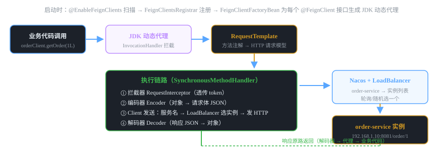

# 微服务组件 04 · 服务调用 OpenFeign

> 声明式 HTTP 客户端：定义一个接口 + 注解，Spring 自动生成实现，像调本地方法一样调远程服务。底层是 JDK 动态代理。
>
> 技术栈：Spring Cloud OpenFeign 3.1 · JDK 动态代理 · LoadBalancer · 声明式调用

## 目录
1. 是什么 / 解决什么问题
2. 核心原理
3. 核心概念表
4. 代码示例
5. 面试题与回答
6. 小结与口诀

---

## 1. 是什么 / 解决什么问题

**OpenFeign** 是 Spring Cloud 生态的**声明式 HTTP 客户端**。你只需要写一个接口，用注解声明"要调谁、什么路径、什么参数"，Feign 在启动时自动生成实现，运行时像调用本地方法一样完成远程调用。

### 1.1 没有 Feign 会怎样？（痛点引入）

- **RestTemplate 样板代码多**：URL 拼接、参数组装、异常处理、响应解析，每个调用写一遍。
- **服务地址硬编码**：调用方直接写 IP，服务迁移/扩容就要改代码。
- **无负载均衡**：多副本服务只会打第一个实例。
- **无统一拦截能力**：传 token、记录日志、统一降级，每个调用点各写各的。

### 1.2 Feign 解决什么

1. **声明式调用**：接口 + 注解，零模板代码。
2. **服务名寻址**：写 `name = "order-service"`，配合注册中心 + LoadBalancer 自动选实例。
3. **统一拦截**：RequestInterceptor 一处配置，所有 Feign 请求都带上（比如透传 JWT）。
4. **超时/日志/降级**：配置化控制，fallback 支持服务不可用时的兜底。
5. **契约与复用**：Feign 接口可以下沉到公共模块，多个调用方复用。

### 1.3 Feign / RestTemplate / WebClient 对比

| 对比项 | RestTemplate | OpenFeign | WebClient |
|---|---|---|---|
| 风格 | 命令式 | 声明式（接口） | 响应式（Mono/Flux） |
| 代码量 | 多（样板代码） | 最少 | 中等 |
| 负载均衡 | @LoadBalanced 支持 | 内置集成 | 支持 |
| 非阻塞 | 阻塞 | 阻塞（默认） | 非阻塞 |
| Spring Cloud 默认 | 可用 | 主推（服务间调用） | WebFlux 栈用 |

> **结论：** Spring Cloud 项目服务间调用默认用 Feign（声明式 + 生态好）；性能极致或网关/响应式场景用 WebClient。RestTemplate 在新项目中逐渐被替代。

---

## 2. 核心原理

### 2.1 一次 Feign 调用的完整链路



### 2.2 动态代理是怎么生成的？（原理拆解）

1. `@EnableFeignClients` 导入 `FeignClientsRegistrar`，启动时扫描 @FeignClient 注解的接口。
2. 为每个接口注册一个 `FeignClientFactoryBean`（FactoryBean：返回的不是自己，而是目标对象）。
3. 创建时用 `Proxy.newProxyInstance` 生成 **JDK 动态代理**，处理器是 `FeignInvocationHandler`。
4. 每次调用接口方法 → 代理拦截 → 根据方法上的 @GetMapping/@RequestBody 等注解构造 `RequestTemplate`（含路径、参数、请求体）。
5. 交给 `Client` 真正发 HTTP：Spring Cloud 里 Client 集成 `LoadBalancerFeignClient`，先按服务名选实例，再发请求。
6. 响应由 `Decoder` 反序列化成接口声明的返回类型。

> ⚠️ **面试记忆点：** Feign 接口**没有实现类**，调用全靠动态代理转发。"接口加注解"是骗过编译器的，运行时代理把方法调用翻译成 HTTP 请求。

### 2.3 关键组件

| 组件 | 作用 |
|---|---|
| @EnableFeignClients | 开启 Feign 扫描（启动类上加） |
| @FeignClient | 声明远程接口：name=服务名、url=直连地址、fallback=降级类 |
| FeignClientFactoryBean | 为接口生成代理的工厂 Bean |
| RequestTemplate | 方法调用翻译成的 HTTP 请求模型 |
| Encoder / Decoder | 请求体编码 / 响应体解码（默认 JSON） |
| RequestInterceptor | 拦截所有 Feign 请求，统一加头（token、traceId） |
| LoadBalancerFeignClient | 集成负载均衡：服务名 → 实例 → 发请求 |
| ErrorDecoder | 非 2xx 响应转成业务异常 |

---

## 3. 核心概念表

| 概念 | 说明 |
|---|---|
| @FeignClient(name = "order-service") | 声明要调用的服务名（注册中心里的名字） |
| @FeignClient(url = "http://127.0.0.1:8081") | 直连固定地址（不走注册中心，联调用） |
| fallback / fallbackFactory | 调用失败时的降级处理（需开启 feign.circuitbreaker.enabled） |
| connectTimeout / readTimeout | 连接超时 / 读取超时（默认 10s / 60s，可全局和按客户端配置） |
| 日志级别 | NONE / BASIC / HEADERS / FULL（默认 NONE，需 Logger.Level Bean） |
| RequestInterceptor | 全局请求拦截，常用于透传 token、加 traceId |
| 契约 Contract | 注解解析规则（SpringMvcContract 解析 Spring 注解） |

---

## 4. 代码示例

> 技术栈：Spring Boot 2.7 + Spring Cloud 2021.0.x（OpenFeign 3.1，负载均衡用 LoadBalancer，不用已移除的 Ribbon）。

### 4.1 pom.xml 依赖

```xml
<dependencies>
    <!-- OpenFeign -->
    <dependency>
        <groupId>org.springframework.cloud</groupId>
        <artifactId>spring-cloud-starter-openfeign</artifactId>
    </dependency>
    <!-- 服务发现：让 name = "order-service" 能解析成实例列表 -->
    <dependency>
        <groupId>com.alibaba.cloud</groupId>
        <artifactId>spring-cloud-starter-alibaba-nacos-discovery</artifactId>
    </dependency>
</dependencies>
```

### 4.2 启动类开启 Feign

```java
@SpringBootApplication
@EnableFeignClients   // 扫描 @FeignClient 接口并生成代理
public class UserServiceApplication {
    public static void main(String[] args) {
        SpringApplication.run(UserServiceApplication.class, args);
    }
}
```

### 4.3 定义 Feign 接口（消费者 user-service 调提供者 order-service）

```java
// 声明式接口：无实现类，运行时动态代理
@FeignClient(value = "order-service",           // 服务名（注册中心里的名字）
        fallbackFactory = OrderClientFallbackFactory.class)  // 降级工厂（可选）
public interface OrderClient {

    // 对应提供者的 GET /order/{id} 接口
    @GetMapping("/order/{id}")
    OrderVO getOrder(@PathVariable("id") Long id);

    // 对应提供者的 POST /order 接口（注意：对象参数默认转 JSON）
    @PostMapping("/order")
    OrderVO createOrder(@RequestBody CreateOrderReq req);

    // 查询参数：多参数必须写 @RequestParam 名字
    @GetMapping("/order/list")
    List<OrderVO> listOrders(@RequestParam("userId") Long userId,
                             @RequestParam(value = "status", required = false) Integer status);
}
```

### 4.4 降级工厂（服务挂了返回兜底，不抛异常）

```java
// 注意：降级需要配置 feign.circuitbreaker.enabled=true（见 4.6）
@Component
public class OrderClientFallbackFactory implements FallbackFactory<OrderClient> {

    @Override
    public OrderClient create(Throwable cause) {
        // 返回一个匿名实现：调用失败时走这里
        return new OrderClient() {
            @Override
            public OrderVO getOrder(Long id) {
                log.warn("order-service 调用失败，降级返回 null，原因：{}", cause.getMessage());
                return null;   // 兜底值，业务侧再处理
            }
            // ... 其他方法同样兜底
        };
    }
}
```

### 4.5 使用（像本地方法一样调用）

```java
@Service
public class UserService {

    @Autowired
    private OrderClient orderClient;

    public OrderVO showOrder(Long id) {
        // 一行调用远程服务：服务发现 + 负载均衡 + HTTP 全被封装
        return orderClient.getOrder(id);
    }
}
```

### 4.6 application.yml：超时、日志、降级开关

```yaml
feign:
  circuitbreaker:
    enabled: true                    # 开启降级（fallback 生效的前提）
  client:
    config:
      default:                        # 全局默认配置
        connectTimeout: 5000       # 连接超时 5s（默认 10s）
        readTimeout: 10000        # 读取超时 10s（默认 60s）
        loggerLevel: BASIC        # 日志级别：打印方法+耗时
      order-service:                 # 按客户端单独覆盖（服务名）
        readTimeout: 30000        # 订单服务慢，放宽到 30s

logging:
  level:
    com.example.feign.OrderClient: debug   # 配合 loggerLevel=FULL 打印完整请求响应
```

### 4.7 请求拦截器：统一透传 Token / traceId（高频需求）

```java
@Configuration
public class FeignConfig {

    @Bean
    public RequestInterceptor requestInterceptor() {
        return template -> {
            // 从请求上下文拿当前登录 token，透传给下游服务
            RequestAttributes attrs = RequestContextHolder.getRequestAttributes();
            if (attrs != null) {
                HttpServletRequest request = ((ServletRequestAttributes) attrs).getRequest();
                template.header("Authorization", request.getHeader("Authorization"));
            }
            // 透传链路 ID（配合 SkyWalking 等追踪）
            template.header("traceId", TraceContext.getTraceId());
        };
    }
}
```

> 💡 **面试加分：** Feign 默认是不带 token 的！服务 A 调服务 B 时，A 的登录态要手动通过 RequestInterceptor 透传，否则 B 校验鉴权会 401。能主动说出这个细节，说明你真实跑过多服务联调。

---

## 5. 面试题与回答

### Q1：Feign 的原理是什么？接口没有实现类，为什么能调用？

**答：** 核心是 **JDK 动态代理**。启动时 @EnableFeignClients 触发扫描，为每个 @FeignClient 接口注册 FeignClientFactoryBean，用 Proxy.newProxyInstance 生成代理对象注入容器。业务代码调用接口方法时，实际是调到了代理的 InvocationHandler：它根据方法上的 Spring MVC 注解（@GetMapping/@RequestParam/@RequestBody）把方法调用翻译成 **RequestTemplate（HTTP 请求模型）**，再经过 Encoder 编码请求体、Client 发送请求（Spring Cloud 中集成 LoadBalancer 按服务名选实例）、Decoder 把响应反序列化成接口声明的返回类型，最终"看起来像本地方法调用"。所以 Feign 本质是"**把接口方法映射成 HTTP 请求的映射框架**"。

### Q2：Feign 怎么做到负载均衡？用的 Ribbon 还是别的？

**答：** Feign 本身不做负载均衡，它把服务名交给 **Client** 处理。Spring Cloud 2021 之前集成的是 Netflix Ribbon；**2021 之后 Ribbon 被移除，默认用 Spring Cloud LoadBalancer**（负载均衡逻辑内嵌在 LoadBalancerFeignClient 里）。流程：Feign 的 name="order-service" → LoadBalancer 从注册中心（Nacos）拿到该服务的实例列表 → 按策略（默认轮询，可自定义随机/权重）选一个实例 → 替换服务名为具体 IP:端口发请求。RuoYi-Cloud 2021 版就是 LoadBalancer，不是 Ribbon——能说出这个版本差异是加分项。

### Q3：Feign 超时怎么配置？超时了会怎样？

**答：** 两个超时：**connectTimeout（连接超时）**——建 TCP 连接的最长时间；**readTimeout（读取超时）**——发请求后等响应数据的最大时间。配置在 feign.client.config 下，default 段是全局，也可以用**服务名做 key** 单独覆盖（如 order-service 慢就单独放宽）。Spring Cloud OpenFeign 默认 connectTimeout=10s、readTimeout=60s。注意：如果项目里还叠了 Sentinel/Hystrix，会有**两层超时**——Feign 的超时和熔断组件的超时取小的生效，配置时容易踩"为什么我改大了 Feign 超时还是 1s 就失败"的坑（其实是熔断组件先超时了）。

### Q4：Feign 服务降级怎么做？fallback 和 fallbackFactory 区别？

**答：** @FeignClient 注解的 fallback 属性指定降级类（实现 Feign 接口，返回兜底值），fallbackFactory 属性指定降级工厂（实现 FallbackFactory\<T\>）。区别：**fallback 拿不到失败原因**，只做兜底；**fallbackFactory 能拿到 Throwable cause**，可以记录失败原因、按异常类型区分处理，更灵活，推荐用 fallbackFactory。前提：`feign.circuitbreaker.enabled=true`（Spring Cloud OpenFeign 通过 CircuitBreaker 包装实现降级）。底层实现是 Hystrix 或 Resilience4j 或 Sentinel 的断路器，取决于引入哪个。

### Q5：Feign 日志怎么开？有几个级别？

**答：** 两个条件都要满足：① 配置 `feign.client.config.xxx.loggerLevel` 为 FULL（或定义 Logger.Level Bean）；② 对应包/类的日志级别设为 debug（logging.level 配置）。四个级别：**NONE**（默认，不输出）、**BASIC**（方法 + URL + 响应码 + 耗时，够用）、**HEADERS**（BASIC + 请求响应头）、**FULL**（HEADERS + 请求响应体，最全，慎用于生产，可能打印敏感信息）。排查"下游到底返回了什么"时把某个 Feign 客户端调到 FULL，比瞎猜快得多。

### Q6：Feign 调用时 GET 请求怎么传对象？有什么坑？

**答：** 坑：Feign 对 GET 请求体支持不好（部分版本忽略 GET 的 body，或直接报错不支持）。正确做法：**GET 多参数用 @RequestParam 展开**，或者**把查询改成 POST 传对象**，或者用 `@SpringQueryMap` 注解把对象展开成查询参数（Spring Cloud OpenFeign 2.1+ 支持）。另外还有两个高频坑：① @PathVariable 不带 value 在 Feign 里可能解析失败，要写全 `@PathVariable("id")`；② 接口方法返回复杂泛型（如 Result\<List\<OrderVO\>\>）时，反序列化容易丢泛型，要保证提供者返回的 JSON 结构一致。

### Q7：Feign 调用 A 服务成功、B 服务失败怎么排查？（实战题）

**答：** 按链路四步：① 先开 **FULL 日志**，看 Feign 实际发出的 URL 和收到的响应；② 确认**服务名/路径**：提供者的 context-path 是否和 Feign 路径对得上（配了 server.servlet.context-path 的特别容易踩）；③ 确认**参数结构**：JSON 字段名大小写、日期格式、null 处理是否一致；④ 确认**鉴权透传**：下游有没有校验 token，Feign 有没有通过 RequestInterceptor 透传。绝大多数"A 通 B 不通"是服务名写错、路径带不带前缀、token 没透传这三类，别一开始就怀疑网络。

### Q8：Feign 和 RestTemplate 怎么选？

**答：** 微服务内部调用选 **Feign**：声明式接口、零模板代码、内置负载均衡和拦截器，团队维护成本低。RestTemplate 适合：① 不想引入 Feign 依赖的轻量场景；② 动态 URL（调用外部不固定的地址）；③ 和老代码风格一致。如果做 WebFlux 响应式项目，用 **WebClient**（非阻塞）。面试答法：项目里服务间调用统一 Feign，RestTemplate 只在调用第三方固定地址时用。

### Q9：Feign 接口下沉到公共模块，有什么注意点？

**答：** 常见做法是把 Feign 接口 + DTO 放到公共模块（如 ruoyi-common 的 api 子包），提供者和消费者共用：① 提供者的 Controller 和消费者的 Feign 接口**路径、参数必须一致**，否则调用 404；② DTO 要有无参构造和 getter/setter（JSON 反序列化需要）；③ 接口里别放复杂对象（File、流），传输对象保持简单；④ 公共模块升级要兼容（Feign 接口改了签名，所有引用方都要跟着升级发布）。面试点到"提供者消费者共用契约"即可。

### Q10：Feign 默认超时为什么"好像不生效"？说说你踩过的坑。

**答：** 两类典型：① **配置 key 写错**：feign.client.config 下面按客户端名配置时，key 必须是 `@FeignClient 的 value（服务名）`，写错成别的名字配置会被忽略；② **被熔断组件抢先**：项目引入 Sentinel/Hystrix 后，熔断超时默认很小（如 1~3s），Feign 的 readTimeout 还没到，熔断先报了超时异常，看起来"Feign 超时配置无效"。排查思路：看异常栈是 SocketTimeoutException（Feign 层）还是 BlockException/TimeoutException（熔断层），对症下药。这题答出"两层超时叠加"就是高分答案。

---

## 6. 小结与口诀

**一句话定位：** Feign = 声明式 HTTP 客户端，接口即契约，动态代理把方法调用翻译成远程 HTTP 请求。

**口诀：** "接口注解无实现，动态代理背后站；RequestTemplate 翻译 HTTP，LoadBalancer 选实例；拦截器透传 token，fallback 兜底防雪崩。"

**三大坑：**
1. GET 传对象不支持，用 @SpringQueryMap 或改 POST
2. 降级必须开 feign.circuitbreaker.enabled 才有 fallback
3. token 不会自动透传，要写 RequestInterceptor

**下一跳：** 服务调用失败会雪崩，怎么防？下一篇讲 **Sentinel**——限流、熔断、降级的流量防卫兵。

---

*微服务组件文档系列 · 04/16 · 技术栈 Spring Boot 2.7 + Spring Cloud 2021.0.x + OpenFeign 3.1 + Nacos 2.2 · 生成于 2026-09-19*
