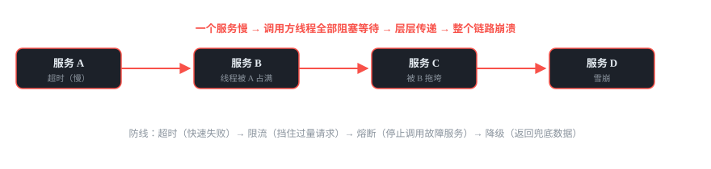
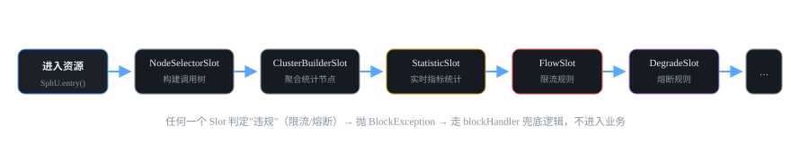
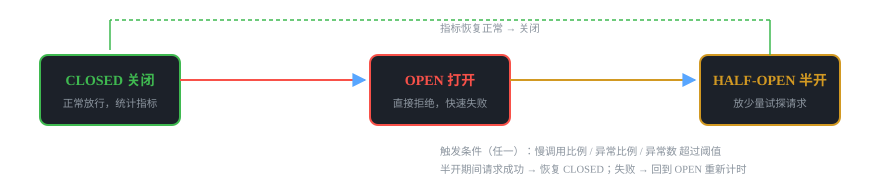

# 微服务组件 05 · 熔断限流 Sentinel

> 阿里的"流量防卫兵"：限流、熔断、降级、热点参数、系统保护五合一，防雪崩的最后一层防线。
>
> 技术栈：Sentinel 1.8.6 · 滑动窗口 · 三态熔断 · 规则持久化

## 目录
1. 是什么 / 解决什么问题
2. 核心原理
3. 核心概念表
4. 代码示例
5. 面试题与回答
6. 小结与口诀

---

## 1. 是什么 / 解决什么问题

**Sentinel** 是阿里开源的**面向分布式服务架构的高可用防护组件**，核心就一件事：**让流量进来得可控、让故障扩散得有限**。轻量级、无侵入（SDK 方式），控制台可视化配置规则。

### 1.1 雪崩是怎么发生的？（痛点引入）



防线：超时（快速失败）→ 限流（挡住过量请求）→ 熔断（停止调用故障服务）→ 降级（返回兜底数据）

### 1.2 Sentinel 能干什么（五大能力）

| 能力 | 解决什么 | 例子 |
|---|---|---|
| 流量控制（限流） | 把 QPS/并发线程数控制在阈值内 | 接口限 100 QPS，多了直接拒绝 |
| 熔断降级 | 下游不稳定时快速失败，不再调它 | 订单服务异常率 50%，熔断 10s |
| 热点参数限流 | 对某个参数值单独限流 | 同一个商品 ID 秒杀限 10 QPS |
| 系统保护 | 按系统负载（CPU/RT/线程）自适应保护 | CPU 超 80% 自动限流 |
| 授权控制 | 黑白名单 | 内部接口只允许网关 IP 调用 |

### 1.3 限流 vs 熔断 vs 降级（先分清概念，面试必问）

- **限流（Flow Control）**：**进**的方向控流量——管住"来的请求太多"，超阈值直接拒绝。保护自己。
- **熔断（Circuit Breaking）**：**出**的方向停调用——下游不行了，主动切断调用，快速失败。保护下游、也保护自己不再被拖。
- **降级（Degradation）**：**降**服务的能力——返回兜底数据/走简化流程，保证核心功能可用。

> **一句话：** 限流管"进来的量"，熔断管"出去的调用"，降级管"失败后怎么办"。三者配合才是完整的防雪崩体系。

---

## 2. 核心原理

### 2.1 核心模型：资源 + 规则

**Sentinel 的哲学：资源定义与规则配置分离。**

- **资源（Resource）**：一切可以被保护的东西——接口、方法、一段代码。用字符串命名（如 "order:create"）。
- **规则（Rule）**：对资源施加的限制——限流规则、熔断规则、热点规则……可以随时动态修改。

先定义资源，再配规则；规则改了立即生效，资源不用改。（对比 Hystrix：命令和规则强绑定，改规则要改代码——这是 Sentinel 的核心优势，见 Q6）

### 2.2 Slot 责任链：一次请求被怎么"审判"



任何一个 Slot 判定"违规"（限流/熔断）→ 抛 BlockException → 走 blockHandler 兜底逻辑，不进入业务

### 2.3 限流算法：固定窗口 / 滑动窗口 / 漏桶 / 令牌桶（高频面试题）

| 算法 | 原理 | 优点 | 缺点 | Sentinel 对应 |
|---|---|---|---|---|
| 固定窗口（计数器） | 1 秒一个窗口，计数超阈值就拒绝，窗口结束清零 | 实现简单 | 临界问题：窗口边界处可突破 2 倍（0.9s 和 1.1s 各来 100 个都通过） | —（基础） |
| 滑动窗口 | 把时间切细粒小格子，窗口随时间滑动，统计当前窗口内请求 | 解决临界问题，统计平滑 | 比固定窗口多一点内存 | **Sentinel 默认**（1s 分 2 格） |
| 漏桶 | 请求进桶，底部匀速流出；桶满拒绝。流出速率恒定 | 流量绝对匀速（削峰填谷） | 无法应对突发流量（突发也排队） | 排队等待模式 |
| 令牌桶 | 桶里按速率放令牌，请求拿到令牌才放行；桶可积攒令牌 | 允许一定突发（积攒的令牌），平滑 + 弹性 | 实现略复杂 | 预热 WarmUp、网关限流（基于令牌桶） |

> ⚠️ **必背结论：** Sentinel 默认用**滑动窗口**统计 QPS/线程数；**预热（WarmUp）**是令牌桶思想的变种（冷启动时缓慢放量，防止刚启动的服务被秒杀流量冲垮）；**排队等待**是漏桶思想的变种（恒定速率放行）。面试把这张表讲清楚就稳了。

### 2.4 熔断降级的三种策略 + 三态转换（官方文档核实）



| 熔断策略 | 触发条件 | 适用场景 |
|---|---|---|
| **慢调用比例** SLOW_REQUEST_RATIO | 统计时长内请求数 ≥ 最小请求数，且 RT > 阈值的慢调用占比 ≥ 比例阈值 | 下游变慢（不报错但很慢） |
| **异常比例** ERROR_RATIO | 统计时长内请求数 ≥ 最小请求数，且异常占比 ≥ 比例阈值 | 下游频繁报错 |
| **异常数** ERROR_COUNT | 统计时长内异常数量 ≥ 阈值（注意：是"近一分钟"累计，不要求最小请求数） | 错误虽占比不高但绝对数量大 |

熔断时长结束后进入 HALF-OPEN：放几个试探请求，成功则恢复 CLOSED，失败则重新 OPEN 并重新计时。核心目的：**给下游恢复的窗口**，避免一恢复就被打爆。

---

## 3. 核心概念表

| 概念 | 说明 |
|---|---|
| 资源 Resource | 被保护对象，字符串命名（方法/接口/代码块） |
| 规则 Rule | 对资源的限制：FlowRule 限流 / DegradeRule 熔断 / SystemRule 系统 / AuthorityRule 授权 / ParamFlowRule 热点 |
| BlockException | 规则拦截异常（限流/熔断触发），用 blockHandler 处理 |
| @SentinelResource | 注解定义资源：value=资源名、blockHandler=规则拦截处理、fallback=业务异常处理 |
| 滑动窗口 | 默认统计模型，1s 分为 2 个 500ms 小格滑动统计 |
| WarmUp 预热 | 冷启动缓慢放量（令牌桶思想），防止冲垮刚启动的服务 |
| 排队等待 | 恒定速率放行（漏桶思想），超过队列长度拒绝 |
| 熔断三态 | CLOSED → OPEN → HALF-OPEN → CLOSED |
| 规则持久化 | 拉模式（客户端定时拉）/ 推模式（控制台→Nacos→客户端监听） |
| 控制台 Dashboard | 可视化监控 + 在线配置规则（默认 8080） |

---

## 4. 代码示例

> 技术栈：Spring Boot 2.7 + Spring Cloud Alibaba 2021.0.4.0 + Sentinel 1.8.6。

### 4.1 pom.xml 依赖

```xml
<dependencies>
    <!-- Sentinel 核心（AOP 支持 @SentinelResource） -->
    <dependency>
        <groupId>com.alibaba.cloud</groupId>
        <artifactId>spring-cloud-starter-alibaba-sentinel</artifactId>
    </dependency>
    <!-- 规则持久化到 Nacos（可选，推荐） -->
    <dependency>
        <groupId>com.alibaba.csp</groupId>
        <artifactId>sentinel-datasource-nacos</artifactId>
    </dependency>
</dependencies>
```

### 4.2 application.yml：接入控制台 + Nacos 持久化规则

```yaml
spring:
  application:
    name: order-service
  cloud:
    sentinel:
      transport:
        dashboard: 127.0.0.1:8080   # Sentinel 控制台地址（可视化监控/配规则）
        port: 8719               # 客户端与控制台通信端口（默认 8719）
      datasource:                    # 规则持久化：从 Nacos 拉流控规则
        flow:
          nacos:
            server-addr: 127.0.0.1:8848
            dataId: order-service-flow-rules
            groupId: SENTINEL_GROUP
            rule-type: flow      # flow=限流规则；degrade=熔断规则
  main:
    allow-circular-references: true   # RuoYi 等老项目需要，避免循环依赖报错
```

### 4.3 用 @SentinelResource 定义资源 + 兜底处理（核心示例）

```java
@RestController
@RequestMapping("/api/order")
public class OrderController {

    // value: 资源名（控制台看到的名字）
    // blockHandler: 被限流/熔断时调用的方法（处理 BlockException，参数必须含 BlockException）
    // fallback: 业务异常时调用的方法（处理 Exception，参数必须含 Throwable）
    @SentinelResource(value = "order:create",
            blockHandler = "createOrderBlock",
            fallback = "createOrderFallback")
    @PostMapping
    public Result<OrderVO> createOrder(@RequestBody CreateOrderReq req) {
        // 模拟业务：可能抛异常（库存不足等）
        if (req.getAmount() > 10000) {
            throw new BusinessException("单笔金额超限");
        }
        return Result.success(orderService.create(req));
    }

    // 1. 限流/熔断兜底：返回提示"系统繁忙"
    public Result<OrderVO> createOrderBlock(CreateOrderReq req, BlockException e) {
        return Result.error("系统繁忙，请稍后重试");
    }

    // 2. 业务异常兜底：返回业务错误信息
    public Result<OrderVO> createOrderFallback(CreateOrderReq req, Throwable t) {
        return Result.error("下单失败：" + t.getMessage());
    }
}
```

> ⚠️ **三个易错点：** ① blockHandler 和 fallback 的**方法签名必须和原方法一致**（参数一一对应），再分别追加 BlockException / Throwable；② blockHandler 处理的是**规则拦截**（限流熔断），fallback 处理的是**业务异常**，两者职责不同；③ 如果两者都触发，blockHandler 优先。方法必须写在**同类或指定类**（blockHandlerClass），且要求 static 或同类内。

### 4.4 在 Nacos 里配一条限流规则（order-service-flow-rules）

```json
// Nacos 配置 dataId=order-service-flow-rules，group=SENTINEL_GROUP，格式 JSON
[
  {
    "resource": "order:create",        // 资源名（与 @SentinelResource value 一致）
    "limitApp": "default",             // 默认对所有来源生效
    "grade": 1,                        // 0=线程数，1=QPS
    "count": 100,                      // 阈值：100 QPS
    "strategy": 0,                     // 0=直接拒绝，1=预热，2=排队等待
    "controlBehavior": 0,
    "clusterMode": false
  },
  {
    "resource": "order:create",
    "grade": 0,                        // 熔断规则（degrade）里：0=慢调用比例
    "count": 500,                      // RT 阈值 500ms
    "timeWindow": 10,                   // 熔断时长 10s
    "minRequestAmount": 5,             // 最小请求数：5 个才开始统计
    "statIntervalMs": 1000,
    "slowRatioThreshold": 0.5          // 慢调用比例阈值 50%
  }
]
```

### 4.5 与 OpenFeign 集成：调用方熔断（防雪崩关键配置）

```yaml
# application.yml：开启 Feign 的 Sentinel 支持
feign:
  sentinel:
    enabled: true    # Feign 调用接入 Sentinel 熔断（替代 feign.circuitbreaker）
```

```java
// Feign 接口加降级工厂（用法同 04 篇，但底层由 Sentinel 兜底）
@FeignClient(value = "stock-service", fallbackFactory = StockClientFallbackFactory.class)
public interface StockClient {
    @GetMapping("/stock/deduct")
    Result<Boolean> deduct(@RequestParam("skuId") Long skuId, @RequestParam("num") Integer num);
}
```

效果：stock-service 异常率触发熔断后，所有 Feign 调用快速返回降级结果，不阻塞线程、不拖垮自己。

---

## 5. 面试题与回答

### Q1：Sentinel 的限流算法有哪些？为什么默认用滑动窗口？

**答：** 四种：固定窗口（计数器）、滑动窗口、漏桶、令牌桶。**固定窗口**实现简单但有"临界问题"——比如限 100 QPS，0.9s 来 100 个、1.1s 再来 100 个，两个窗口各自都没超，但 0.2 秒内实际放过了 200 个。**滑动窗口**把时间切成细粒度小格子（Sentinel 默认 1s 分 2 格），窗口随时间滑动统计，避免了窗口边界的瞬时突破，且开销可控，所以 Sentinel 默认用它统计 QPS/线程数。**漏桶**匀速流出（削峰填谷），对应 Sentinel 的排队等待模式；**令牌桶**可积攒令牌允许突发，对应预热 WarmUp 和网关限流。面试能画出固定窗口的临界问题 + 说出各自对应关系就高分。

### Q2：Sentinel 熔断降级有哪几种策略？熔断后怎么恢复？

**答：** 三种策略：**慢调用比例**（RT 超阈值的请求占比 ≥ 阈值，且请求数 ≥ 最小请求数）、**异常比例**（异常占比 ≥ 阈值，同样有最小请求数要求）、**异常数**（近一分钟累计异常数 ≥ 阈值，无最小请求数要求）。状态机三态：**CLOSED**（正常，统计指标）→ 触发条件 → **OPEN**（熔断，直接快速失败）→ 熔断时长结束后 → **HALF-OPEN**（半开：放少量试探请求）→ 试探成功回 CLOSED，失败回 OPEN 重新计时。半开的目的：给下游留恢复窗口，避免服务刚好转就被打爆。

### Q3：@SentinelResource 的 blockHandler 和 fallback 有什么区别？

**答：** **blockHandler** 处理的是 **BlockException**——被规则拦截（限流、熔断触发）时的兜底，比如返回"系统繁忙"；**fallback** 处理的是**业务异常**——方法本身抛出的异常，比如"库存不足"。两者触发时机不同、异常类型不同。细节：① 方法签名要和原方法参数一致，blockHandler 方法末尾加 BlockException 参数，fallback 方法加 Throwable 参数；② 同时触发时 blockHandler 优先；③ 可以指定 blockHandlerClass 把处理类独立出去。实际项目中我通常两个都配：blockHandler 统一提示"请求过于频繁"，fallback 返回业务错误信息。

### Q4：限流、熔断、降级三者的区别？怎么配合防雪崩？

**答：** 三者管的维度不同：**限流**管"进来的请求量"——QPS/并发超阈值直接拒绝，保护自己不被压垮；**熔断**管"出去的调用"——下游异常率/慢调用超阈值就切断调用，快速失败，不再往故障服务上打流量；**降级**管"失败之后怎么办"——返回兜底数据或走简化流程，保证核心链路可用。配合关系：流量大时先限流（挡住过量）；调用失败累积后熔断（切断病源）；熔断/失败时降级（兜底返回）。加上"超时"就是完整防线：**超时 + 限流 + 熔断 + 降级**，缺一个都可能雪崩。

### Q5：规则放在内存里重启就没了，怎么持久化？说两种模式。

**答：** Sentinel 规则默认放内存，重启丢失。两种持久化模式：**拉模式（pull）**：客户端定时从外部存储（本地文件/数据库）拉取规则，改动延迟高，多个实例不好同步；**推模式（push）**：控制台改规则 → 写入 Nacos（或 Apollo）→ 客户端通过 DataSource 监听配置变更自动更新到内存——**推荐推模式**，配置中心负责下发，应用只需声明 datasource（server-addr/dataId/rule-type）。项目里我就是把限流、熔断规则放 Nacos，控制台和 Nacos 都能改，改完秒级生效、重启不丢。

### Q6：Sentinel 和 Hystrix 有什么区别？

**答：** 官方对比口径：Hystrix 侧重**隔离和熔断**（线程池/信号量隔离 + 熔断 + fallback），Sentinel 侧重**流量控制 + 熔断降级**。关键差异四点：① **规则与资源分离**：Sentinel 先定义资源再动态配规则，规则改了不用改代码；Hystrix 的命令和规则强绑定，改配置要动代码。② **统计模型**：Sentinel 用滑动窗口实时统计，内存占用小；Hystrix 用响应流统计。③ **控制台**：Sentinel 有可视化控制台（监控 + 在线配规则）；Hystrix 监控能力弱。④ **维护状态**：Hystrix 已停止维护（Netflix 2018 后不再更新），Sentinel 由阿里持续维护。结论：新项目用 Sentinel。

### Q7：热点参数限流是什么？用在什么场景？

**答：** 热点参数限流（ParamFlowRule）：对**方法某个参数的值**单独计数限流。普通限流是整个接口 100 QPS；热点限流可以做到"同一个商品 ID 每秒最多 10 次"，而不同商品共享剩余配额。场景：秒杀、抢购、热词搜索——单个 key 流量集中打爆下游。实现：@SentinelResource 的方法参数加 @SentinelHotParam 注解（指定参数索引），在控制台/规则里配置参数值阈值。它比普通限流更精细，是"防单点热点"的关键手段。

### Q8：系统保护规则（SystemRule）是什么原理？

**答：** 系统保护是**自适应限流**：不再盯着单个接口的 QPS，而是看**整机负载**——入口 QPS、CPU 使用率、平均 RT、线程数、入口流量。当系统负载超阈值（如 CPU > 80%），Sentinel 根据系统当前容量**自动计算一个允许的入口 QPS** 并限流，把系统从"过载边缘"拉回来。原理上类似 TCP 的拥塞控制（负载高则降低准入）。适用：整体流量不可预估、只想"别把机器打崩"的场景，和单接口限流互补。

### Q9：你项目里用 Sentinel 做过什么？说具体场景。

**答：** 项目里三处：① **网关层限流**：对下单接口按 IP 限流（基于网关 + Sentinel 网关适配），防刷单；② **下单接口**：@SentinelResource 定义资源，配置 QPS 限流 + 慢调用熔断（RT 超 500ms 比例 50% 熔断 10s），blockHandler 返回"系统繁忙"；③ **Feign 调用库存服务**：开启 feign.sentinel.enabled，配降级工厂，库存服务异常时不阻塞下单主流程。规则通过 Nacos 持久化，控制台观察实时 QPS 和异常曲线。面试这样讲：有资源定义、有规则类型、有持久化、有降级效果，闭环完整。

### Q10：预热（WarmUp）是什么？为什么需要？

**答：** 预热（WarmUp）是限流的**冷启动模式**：服务刚启动时，JIT 还没编译、缓存还没热、数据库连接池还在建立，此时如果直接放满流量，服务容易被瞬间打垮。WarmUp 的做法：限流阈值从**低值（如 1/3）逐步提升到设定值**（预热时间默认 10 秒），给服务"热身"的时间。原理基于令牌桶的变种：冷启动时桶容量小、放令牌慢，随时间逐渐恢复满速。典型场景：应用发布重启后立刻有大流量（电商大促发布、秒杀开始瞬间）。

---

## 6. 小结与口诀

**一句话定位：** Sentinel = 防雪崩的流量防卫兵：限流管"进"，熔断管"出"，降级管"败后"。

**口诀：** "资源规则两分离，滑动窗口来统计；慢调异常三策略，关开半开三态转；热点参数防秒杀，规则持久走 Nacos。"

**三大坑：**
1. blockHandler 只处理 BlockException，业务异常要 fallback
2. 规则默认内存态，重启即失，必须接 Nacos 持久化
3. 和 Feign 叠用时注意超时/熔断优先级（Sentinel 熔断可能先于 Feign 超时触发，见 04 篇 Q10）

**第一批完结：** 网关 → 注册中心 → 配置中心 → 服务调用 → 熔断限流，**微服务"骨架五件套"已闭环**。下一篇开始第二批：**分布式事务 Seata**。

---

*微服务组件文档系列 · 05/16 · 技术栈 Spring Boot 2.7 + Spring Cloud Alibaba 2021.0.4.0 + Sentinel 1.8.6 · 生成于 2026-09-19*
