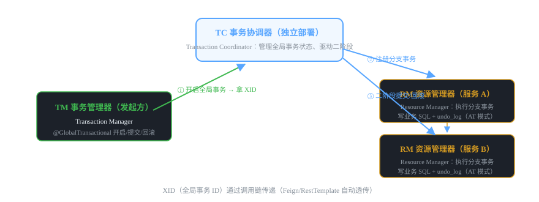
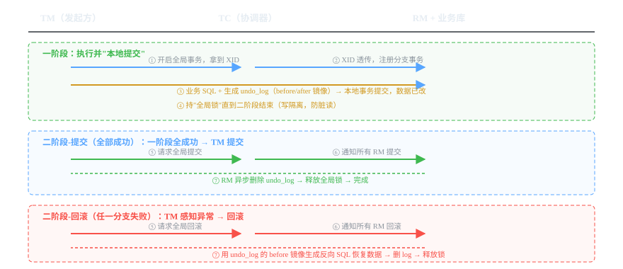

# 微服务组件 06 · 分布式事务 Seata

> 微服务里跨服务、跨数据库的事务保证。Seata 是阿里开源的分布式事务框架，AT 模式"业务零侵入"（加个注解就行）。
>
> 技术栈：Seata 1.6.x · AT / TCC / SAGA / XA 四种模式 · TC/TM/RM 三角色

## 目录
1. 是什么 / 解决什么问题
2. 核心原理
3. 核心概念表
4. 代码示例
5. 面试题与回答
6. 小结与口诀

---

## 1. 是什么 / 解决什么问题

**分布式事务**解决的是：一次业务操作跨多个服务、跨多个数据库时，如何保证"要么全成功、要么全失败"。

### 1.1 为什么本地事务不够了？（痛点引入）

单体时代一个库：`@Transactional` 就够，数据库 ACID 保证原子性。

微服务拆开后：
- 下单要扣库存（库存服务+库存库）、扣余额（账户服务+账户库）、写订单（订单服务+订单库）——三个库三套本地事务，谁也管不了谁。
- 订单库提交了，库存库回滚了 → 数据不一致。

### 1.2 分布式事务方案全家桶（面试先背这张图）

| 方案 | 原理 | 一致性 | 侵入性 | 适用 |
|---|---|---|---|---|
| **2PC / XA** | 两阶段提交：准备 → 提交/回滚，数据库原生支持 | 强一致 | 高（依赖数据库 XA，性能差） | 少用 |
| **Seata AT** | 一阶段本地提交 + undo_log 反向补偿 | 最终一致（事务期间全局锁） | 低（注解驱动，业务零侵入） | **主流，业务系统首选** |
| **Seata TCC** | Try/Confirm/Cancel 三段业务代码 | 最终一致 | 高（业务实现三方法） | 强隔离、高并发场景 |
| **Seata SAGA** | 长事务编排，正流 + 补偿流 | 最终一致 | 中（定义补偿方法） | 长流程、无中间态要求 |
| **本地消息表 / MQ 最终一致** | 业务表 + 消息表同事务写，MQ 异步投递 | 最终一致 | 中（要设计消息幂等） | 允许延迟、高吞吐场景 |

> **结论：** 业务系统里"实时一致性要求高、又不想写太多代码" → 选 Seata AT；"可以接受秒级延迟最终一致" → 本地消息表/MQ 方案（更轻、性能更好）；"高并发强隔离" → TCC。**没有银弹，按场景选**。

### 1.3 什么时候"不需要"分布式事务？（面试加分判断）

- 数据可以接受最终一致的（订单状态、日志、通知）→ 用 MQ，别上 Seata，性能和复杂度都更优。
- 把跨服务操作改成"单库事务"（数据冗余/聚合到同库）→ 最省事。
- 只读、无写操作 → 不需要事务。

---

## 2. 核心原理

### 2.1 三大角色：TC / TM / RM



- **TC（Transaction Coordinator）事务协调器**：独立部署的 seata-server，管理全局事务状态，驱动二阶段提交/回滚。
- **TM（Transaction Manager）事务管理器**：业务发起方，用 @GlobalTransactional 开启/提交/回滚全局事务。
- **RM（Resource Manager）资源管理器**：参与事务的各服务，管理分支事务，向 TC 注册、汇报，执行二阶段。

### 2.2 AT 模式两阶段原理（必考，画图讲）



**一阶段（执行 + 本地提交）：**
1. TM 开启全局事务，拿到 **XID（全局事务 ID）**，沿调用链透传给所有参与服务。
2. 每个 RM 执行业务 SQL，同时生成 **undo_log（回滚日志：记录 before 镜像和 after 镜像）**，和业务 SQL **同一个本地事务**提交。
3. 关键点：**数据此时已经改了**，但持有**全局锁**（写隔离），其他全局事务不能并发改同一行，直到二阶段结束。

**二阶段（全部成功 → 提交）：** TC 通知各 RM 提交 → RM 只需**异步删除 undo_log** → 释放全局锁。很快。

**二阶段（任一失败 → 回滚）：** TM 感知异常 → TC 通知各 RM 回滚 → RM 用 undo_log 的 **before 镜像生成反向 SQL**（把数据恢复原样）→ 删日志 → 释放全局锁。

> 💡 **AT 模式为什么"业务零侵入"？** 框架通过拦截器解析 SQL、自动生成 undo_log 和反向 SQL，业务代码只管写 @GlobalTransactional 注解，不用管补偿逻辑。对比 TCC 要手写 Try/Confirm/Cancel 三个方法，这是 AT 最大的卖点。

### 2.3 全局锁与隔离级别（面试深度题）

- AT 模式默认**写隔离**：一阶段提交后持有全局锁，其他全局事务写同一行数据要等锁，防止"我回滚把你改的数据覆盖了"。
- 读未提交的数据（其他事务正在改的行）：AT 模式下全局事务读取会先查锁，**脏读默认被挡**。
- 代价：持有全局锁时间 = 整个全局事务周期，长事务会拖慢并发。**所以 AT 模式全局事务别开太长**，大事务拆小。

### 2.4 四种模式怎么选（对比）

| 维度 | AT | TCC | SAGA | XA |
|---|---|---|---|---|
| 侵入性 | 低（注解） | 高（3 个方法） | 中（补偿方法） | 低（依赖 DB） |
| 一致性 | 最终一致 | 最终一致 | 最终一致 | 强一致 |
| 性能 | 中（全局锁） | 高（无锁） | 高 | 低 |
| 场景 | 通用业务 | 高并发/强隔离 | 长流程 | 同库强一致（少用） |

---

## 3. 核心概念表

| 概念 | 说明 |
|---|---|
| 全局事务 | 跨多个分支事务的完整业务操作 |
| 分支事务 | 单个服务内的本地事务（RM 执行） |
| XID | 全局事务 ID，沿调用链透传，串联所有分支 |
| TC | 事务协调器（seata-server 独立部署） |
| TM | 事务管理器（发起方，@GlobalTransactional） |
| RM | 资源管理器（各参与服务） |
| undo_log | AT 模式回滚日志（before/after 镜像），存业务库 |
| 全局锁 | AT 模式写隔离手段，二阶段结束才释放 |
| 反向 SQL | 回滚时根据 before 镜像生成的恢复语句 |

---

## 4. 代码示例

> 技术栈：Spring Boot 2.7 + Spring Cloud Alibaba 2021.0.4.0 + Seata 1.6.1。

### 4.1 部署 seata-server（TC）

```bash
# Docker 部署（先建 seata 专用数据库，导入 seata 的 global_table/branch_table/lock_table）
docker run -d --name seata-server -p 8091:8091 -p 7091:7091 \
  -e SEATA_IP=127.0.0.1 -e SEATA_PORT=8091 \
  seataio/seata-server:1.6.1
```

### 4.2 pom.xml 依赖（每个参与事务的服务都要加）

```xml
<dependency>
    <groupId>com.alibaba.cloud</groupId>
    <artifactId>spring-cloud-starter-alibaba-seata</artifactId>
</dependency>
```

### 4.3 application.yml（每个参与服务配置）

```yaml
seata:
  enabled: true
  application-id: order-service          # 本服务名
  tx-service-group: my_test_tx_group     # 事务分组（对应 seata-server 上的配置）
  registry:
    type: nacos                          # 注册中心类型：seata-server 也注册到 Nacos
    nacos:
      server-addr: 127.0.0.1:8848
      application: seata-server          # seata-server 的服务名
  config:
    type: nacos
    nacos:
      server-addr: 127.0.0.1:8848
      group: SEATA_GROUP
```

### 4.4 AT 模式必须建 undo_log 表（每个业务库都建）

```sql
-- 每个参与 AT 模式的业务数据库都要执行
CREATE TABLE IF NOT EXISTS `undo_log` (
  `branch_id`     BIGINT       NOT NULL COMMENT '分支事务 ID',
  `xid`           VARCHAR(128) NOT NULL COMMENT '全局事务 ID',
  `context`       VARCHAR(128) NOT NULL COMMENT '上下文',
  `rollback_info` LONGBLOB     NOT NULL COMMENT '回滚信息（before/after 镜像）',
  `log_status`    INT(11)      NOT NULL COMMENT '0=正常 1=已删除',
  `log_created`   DATETIME(6)  NOT NULL,
  `log_modified`  DATETIME(6)  NOT NULL,
  UNIQUE KEY `ux_undo_log` (`xid`, `branch_id`)
) ENGINE = InnoDB AUTO_INCREMENT = 1 DEFAULT CHARSET = utf8mb4 COMMENT ='AT 模式回滚日志';
```

> ⚠️ **没建 undo_log 表 → AT 模式直接报错**，这是最经典的报错点（Table 'undo_log' doesn't exist）。

### 4.5 业务代码：在调用链入口加一个注解（核心）

```java
@Service
public class OrderService {

    @Autowired
    private OrderMapper orderMapper;
    @Autowired
    private AccountClient accountClient;   // Feign 调账户服务
    @Autowired
    private StockClient stockClient;       // Feign 调库存服务

    /**
     * 下单：扣库存 + 扣余额 + 写订单，三个服务要么全成功要么全回滚
     * @GlobalTransactional 是 TM 入口：开启全局事务，XID 沿 Feign 自动透传
     */
    @GlobalTransactional(name = "create-order", rollbackFor = Exception.class)
    public void createOrder(OrderDTO order) {
        // 1. 写订单（本服务本地事务，生成 undo_log）
        orderMapper.insert(order);
        // 2. 扣库存（远程服务，其 RM 注册分支事务）
        stockClient.deduct(order.getSkuId(), order.getNum());
        // 3. 扣余额（远程服务）
        accountClient.deduct(order.getUserId(), order.getAmount());
        // 4. 任何一个远程调用抛异常 → 全局回滚，前面已提交的分支也会被反向补偿
    }
}
```

### 4.6 注意 Feign 的 XID 透传（版本差异）

- 2021.0.4.0 版 Seata 集成：**Feign 请求会自动带上 XID**（spring-cloud-starter-alibaba-seata 内置了 XID 透传的 RequestInterceptor），只要调用链上的服务都引入了 seata 依赖即可。
- 排查"全局事务没生效"先看：下游有没有引入 seata 依赖、有没有收到 XID（日志里看 txXid）。

### 4.7 什么时候别用 Seata AT（给面试官的判断力）

- 高并发扣减（秒杀）→ 全局锁会成为瓶颈，用 TCC 或乐观锁/Redis 扣减。
- 能接受异步最终一致（通知、状态流转）→ 用 MQ，轻量且吞吐高。
- 只涉及**同一个库**的多个表 → 普通 @Transactional 就够了，别上分布式事务。

---

## 5. 面试题与回答

### Q1：分布式事务有哪些方案？为什么选 Seata AT？

**答：** 方案谱系：① **2PC/XA**：数据库原生两阶段，强一致但性能差、协调者单点，基本被淘汰；② **Seata AT**：一阶段本地提交 + undo_log 回滚日志，业务只加注解，最终一致 + 全局锁，适合大多数业务；③ **TCC**：业务手写 Try/Confirm/Cancel，无锁、性能高，适合高并发强隔离场景；④ **SAGA**：长事务正流 + 补偿流，适合流程长的场景；⑤ **本地消息表/MQ 最终一致**：业务表和消息表同事务，MQ 异步投递，最轻量但一致性延迟。我选 AT 的原因：业务零侵入（不用改业务逻辑）、最终一致对大多数业务足够、生态成熟（Spring Cloud Alibaba 直接集成），只有高并发扣减这类才考虑 TCC。

### Q2：AT 模式的一阶段、二阶段分别做什么？

**答：** **一阶段**：TM 开启全局事务拿 XID → 各 RM 执行业务 SQL 的同时生成 undo_log（before/after 镜像），业务 SQL 和 undo_log 在**同一个本地事务**提交——数据已改但持全局锁。**二阶段提交**（全成功）：TC 通知各 RM 只需**异步删除 undo_log**、释放全局锁，很快。**二阶段回滚**（任一失败）：TC 通知各 RM 用 undo_log 的 **before 镜像生成反向 SQL** 恢复数据，删日志、释放锁。核心思想：一阶段就把事干了（本地提交，性能好），靠 undo_log 支持事后反悔（最终一致）。

### Q3：AT 模式和 XA 有什么区别？

**答：** ① 提交时机：XA 是**两阶段里数据不提交**（prepare 后资源一直锁着，直到协调者说提交）；AT 是**一阶段就本地提交**（数据已可见），用 undo_log + 全局锁保证可回滚。② 锁粒度与时长：XA 持锁时间长（整个事务周期，数据库层面锁）；AT 也持全局锁但只锁被改的行，且依赖应用层。③ 侵入性：XA 靠数据库驱动支持；AT 靠框架解析 SQL。④ 性能：AT 远好于 XA（XA prepare 阶段开销大）。结论：XA 已基本不用，AT 是改进版 2PC。

### Q4：AT 和 TCC 的区别？什么时候必须用 TCC？

**答：** ① 侵入性：AT 只加注解，框架自动生成 undo_log 和补偿 SQL；TCC 要业务手写 **Try（预留资源）/ Confirm（确认）/ Cancel（取消）** 三个方法。② 一致性保证：AT 靠全局锁防并发修改；TCC 靠预留资源，**无锁、并发更高**。③ 适用：**高并发、强隔离**场景（如扣减类业务：预扣库存 Try，支付成功 Confirm，失败 Cancel），以及 AT 无法处理的操作（如调第三方接口、非 SQL 资源）。代价是业务代码复杂很多。业务简单、并发不极端时选 AT 更划算。

### Q5：本地消息表/MQ 最终一致和 Seata 怎么选？

**答：** 本地消息表思路：业务表和消息表**同库同事务**写入 → 定时任务/MQ 投递消息 → 消费者处理，失败重试 + 幂等。特点：**轻量、无独立协调器、吞吐高、一致性有延迟**。Seata AT 特点：**实时性强**（失败立即回滚已改的数据）。选型：下单扣库存这种"用户实时感知、失败要立即反悔"的用 Seata；订单状态流转、通知、积分、日志这类"晚几秒没人在意"的用 MQ。**实际项目两者是组合用**：核心写链路 Seata，非核心旁路 MQ。

### Q6：@GlobalTransactional 的原理是什么？XID 怎么传播？

**答：** 它是 **TM 的入口注解**，本质是 AOP 拦截器（GlobalTransactionalInterceptor）：方法进入时向 TC 发起开启全局事务请求，拿到 **XID** 放到当前线程上下文（RootContext）；方法正常返回则请求提交，抛异常则请求回滚。XID 沿调用链传播靠的是**各服务都引入 Seata 依赖**：Feign/RestTemplate 的拦截器自动把 XID 塞进请求头，下游从请求头取出来放进自己的上下文，这样 TC 知道哪些分支属于同一个全局事务。这也是为什么**参与链路上的服务都必须加 Seata 依赖**，漏一个 XID 就断了。

### Q7：AT 模式的全局锁是什么？会有什么副作用？

**答：** 全局锁是 AT 模式实现**写隔离**的手段：一阶段本地提交后，被改的行在 TC 侧登记"全局锁"，其他全局事务（RM 提交前）写同一行会**等待锁释放**。副作用：① 全局事务**持锁时间 = 整个业务周期**，长事务（慢 SQL、慢远程调用）会严重拖慢并发；② 极端情况可能死锁等待超时（默认 60s）。所以工程上：**全局事务要短、远程调用要设超时、大事务拆小**。这是 AT 模式的性能天花板，也是面试里"什么时候别用 AT"的答案来源。

### Q8：undo_log 里存的是什么？回滚是怎么做的？

**答：** undo_log 存**分支事务的回滚信息**：before 镜像（修改前的行数据）和 after 镜像（修改后的行数据），以及 XID、branch_id。回滚时：框架根据 before 镜像生成**反向 SQL**（把被改的字段恢复成修改前值），执行前还会校验 after 镜像与当前数据是否一致（防止回滚期间数据被别人改过，不一致则报警人工处理），执行完删除 undo_log。一阶段写 undo_log 和业务 SQL 是**同一个本地事务**，所以要么业务改了日志也写了，要么都没写——这是回滚可靠性的基础。

### Q9：Seata 部署需要哪些组件？seata-server 挂了会怎样？

**答：** 组件：① **seata-server（TC）**独立部署，可以注册到 Nacos 并做集群（多实例 + 共享配置/存储）；② 各业务服务引入 seata 依赖（TM/RM 角色）；③ 业务库建 undo_log 表；④ seata-server 自己的元数据表（global_table/branch_table/lock_table）存 MySQL。seata-server 挂了：**正在进行**的全局事务会异常/悬挂（二阶段没法驱动，可能留脏数据 + 全局锁不释放），**已结束**的事务不受影响。所以 TC 生产必须高可用（集群）。这也是为什么非核心链路尽量用 MQ 最终一致、减少对 TC 的依赖。

### Q10：你们项目用了分布式事务吗？（结合你自己的项目）

**答：** 诚实分两种：如果项目没用，就说"**我们项目的分布式事务场景评估后都走了 MQ 最终一致**"并讲为什么（IoT 数据上报落库：设备消息进 Kafka → 消费落库，重试 + 唯一键幂等，秒级最终一致足够；核心下单类业务如果存在才考虑 Seata AT）。如果用过，按 Q6/Q7 讲 AT 原理 + 部署 + 踩坑（undo_log 忘建、全局锁导致并发下降、长事务拆分）。面试官要的是**你会做技术选型**，不是"用了最重的方案"。能说出"什么场景不需要分布式事务"比背概念更值钱。

---

## 6. 小结与口诀

**一句话定位：** Seata = 分布式事务框架，AT 模式用"本地提交 + undo_log 反悔"实现业务零侵入的最终一致。

**口诀：** "TC TM RM 三兄弟，XID 串起全链路；一阶段提交带日志，二阶段删日志或回滚；全局锁防脏写，长事务拆小别贪多；高并发强隔离选 TCC，能异步就别上重方案。"

**三大坑：**
1. AT 模式必须给每个业务库建 undo_log 表
2. 全局事务别开太长（全局锁拖垮并发），远程调用必须设超时
3. 参与链路的服务都要加 Seata 依赖，漏一个 XID 断链事务失效

**下一跳：** 消息队列是"最终一致 + 削峰"的关键基础设施，下一篇讲 **RocketMQ**。

---

*微服务组件文档系列 · 06/16 · 技术栈 Spring Boot 2.7 + Spring Cloud Alibaba 2021.0.4.0 + Seata 1.6.1 · 生成于 2026-09-19*
