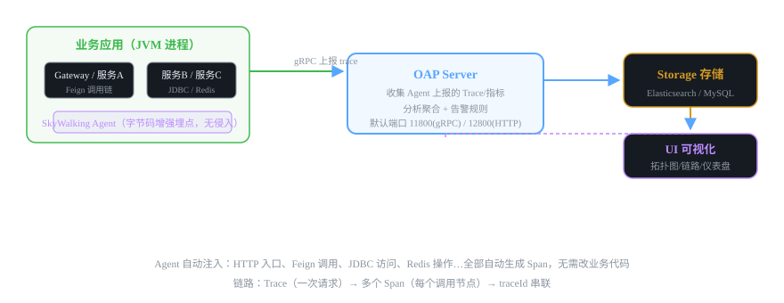
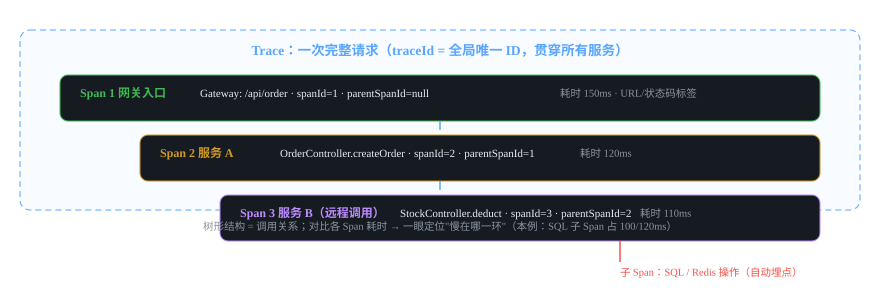

# 微服务组件 08 · 链路追踪 SkyWalking

> 服务多了排障难：一个请求跨 5 个服务，慢了到底卡在哪？SkyWalking 用 traceId 贯穿全链路，把一次请求的调用树画出来。
>
> 技术栈：SkyWalking 9.x · Agent 无侵入埋点 · OAP + ES + UI

## 目录
1. 是什么 / 解决什么问题
2. 核心原理
3. 核心概念表
4. 代码示例
5. 面试题与回答
6. 小结与口诀

---

## 1. 是什么 / 解决什么问题

**链路追踪（APM，Application Performance Monitoring）**：记录一次请求从入口到出口经过的所有服务、每个环节的耗时和状态，用可视化拓扑和调用树展示。

### 1.1 没有链路追踪会怎样？（痛点引入）

- 用户反馈"下单很慢"，但订单服务、库存服务、账户服务都说自己没事——**谁慢不知道**。
- 日志散在 5 个服务的文件里，按时间拼都拼不出完整链路——**上下文丢了**。
- 服务调用关系靠口口相传，新同学根本不知道 A 调了哪些 B——**拓扑不透明**。
- 一个服务拖垮全链路，**排查靠猜**，只能重启碰运气。

### 1.2 链路追踪的三问

一次请求进来，要能回答三个问题：
1. **路径**：请求经过了哪些服务？（拓扑）
2. **耗时**：每个环节花了多久？慢在哪一环？（Span 耗时对比）
3. **状态**：哪里报错了？异常信息是什么？（错误标签）

---

## 2. 核心原理

### 2.1 四层架构：Agent → OAP → Storage → UI



- **Agent（探针）**：以 javaagent 方式挂到 JVM 启动参数，用**字节码增强**自动埋点——HTTP 入口、Feign 调用、JDBC、Redis 操作全部自动生成 Span，**业务代码零改动**。
- **OAP Server（Observability Analysis Platform）**：接收 Agent 上报的数据，分析聚合，执行告警规则。默认端口 11800（gRPC）/ 12800（HTTP）。
- **Storage**：存储链路数据，生产用 **Elasticsearch**（数据量大、查询快），小项目 MySQL/H2 也可。
- **UI**：Web 控制台，看拓扑图、Trace 详情、仪表盘、告警。

### 2.2 Trace / Span 模型（核心概念）



- **Trace**：一次请求的完整调用链。全局唯一 **traceId**。
- **Span**：调用链上的一个环节（一次 HTTP 调用、一个 SQL、一个 Redis 操作），有自己的 spanId 和 parentSpanId，组成树形结构。
- 每个 Span 记录：开始时间、结束时间、耗时、标签（URL、状态码、异常信息）。

### 2.3 怎么做到"无侵入"？（字节码增强）

- Agent 在 JVM 启动时通过 `-javaagent` 加载，用 ByteBuddy/ASM 对目标类的字节码做**插桩**：在 HTTP 框架（Tomcat/Netty）、RPC 框架（Feign/Dubbo）、数据库（JDBC）、缓存（Redis）的关键方法前后插入埋点逻辑。
- 效果：不用改业务代码，不用加注解，Agent 自动识别"这是入口 Span"、"这是子 Span"。
- traceId 跨服务传递：Agent 自动把 traceId 塞进 HTTP 请求头（如 sw8 头），下游 Agent 取出继续挂载。

### 2.4 采样（性能权衡）

全量采集会带来磁盘和性能开销（Agent 自身损耗通常 < 5%）。生产常用**采样率**控制：如 10% 采样（默认 SkyWalking 100%，可配置 `agent.sample_n_per_3_secs`）。采样了不代表没能力，排查问题时可以把采样率临时调高。

### 2.5 告警

OAP 内置规则引擎：慢请求（RT 超阈值）、错误率超标、服务不可用 → 触发告警（对接 Webhook/钉钉/邮件），把"被动排障"变"主动发现"。

---

## 3. 核心概念表

| 概念 | 说明 |
|---|---|
| Trace | 一次请求的完整调用链 |
| Span | 调用链上的一个环节（一次调用/一个操作） |
| traceId | 全局唯一 ID，贯穿所有服务，串起整条链 |
| spanId / parentSpanId | 当前环节 ID / 父环节 ID，构成树形结构 |
| Agent | javaagent 字节码增强探针，无侵入埋点 |
| OAP | 分析平台：收集、聚合、告警 |
| Storage | 存储（生产用 Elasticsearch） |
| UI | 拓扑图 / Trace 详情 / 仪表盘 |
| 采样 | 按比例采集，平衡开销与覆盖 |
| 拓扑图 | 服务间调用关系可视化 |

---

## 4. 代码示例

> SkyWalking 最大的优势：**业务代码零改动**，全部靠 Agent 和配置。所以"代码示例"主要演示启动参数和部署。

### 4.1 启动应用挂载 Agent（核心步骤）

```bash
# 1. 下载 SkyWalking Agent 包，解压后目录含 skywalking-agent.jar

# 2. 启动每个 Java 服务时加 -javaagent 参数
java -javaagent:/opt/skywalking-agent/skywalking-agent.jar \
     -Dskywalking.agent.service_name=order-service \   # 服务名（UI 里显示的）
     -Dskywalking.collector.backend_service=127.0.0.1:11800 \  # OAP 地址
     -jar order-service.jar

# 3. 每个服务都要挂，traceId 才能贯穿全链路
```

> 💡 **关键点：** 只要把 Agent 挂上，HTTP/Feign/JDBC/Redis 的链路自动就有了，**不需要改 pom、不需要加注解**。这是 SkyWalking 与 Zipkin+Sleuth 方案最大的区别（后者要引入依赖和配置）。

### 4.2 部署 OAP + ES + UI（docker-compose 简版）

```yaml
version: "3"
services:
  elasticsearch:                      # 存储
    image: docker.elastic.co/elasticsearch/elasticsearch:7.17.10
    environment:
      - discovery.type=single-node
      - ES_JAVA_OPTS=-Xms512m -Xmx512m
    ports: ["9200:9200"]
  oap:                                # 分析平台
    image: apache/skywalking-oap-server:9.5.0
    depends_on: [elasticsearch]
    environment:
      - SW_STORAGE=elasticsearch
      - SW_STORAGE_ES_CLUSTER_NODES=elasticsearch:9200
    ports: ["11800:11800", "12800:12800"]
  ui:                                 # 可视化
    image: apache/skywalking-ui:9.5.0
    depends_on: [oap]
    environment:
      - SW_OAP_ADDRESS=http://oap:12800
    ports: ["8080:8080"]
```

### 4.3 日志与链路关联（生产排障利器）

把 traceId 打进业务日志，出问题时用 traceId 一键搜日志：

```java
// 配合 logback MDC：SkyWalking 提供 gRPC 日志上报，也可手动注入
// logback.xml 里加 %X{tid}（SkyWalking Agent 自动向 MDC 写入 traceId）

@RestController
public class OrderController {

    @GetMapping("/order/{id}")
    public OrderVO getOrder(@PathVariable Long id) {
        // Agent 自动埋点；日志里自动带上当前请求的 traceId
        log.info("查询订单开始, orderId={}, traceId={}", id, MDC.get("tid"));
        return orderService.getById(id);
    }
}
```

> 排障动作：SkyWalking UI 里点开慢 Trace → 复制 traceId → 在 ELK 里按 traceId 搜所有服务的日志 → 上下游日志拼成完整时间线。

### 4.4 查询"慢在哪一环"

UI 操作路径：**追踪 → 查询** → 输入接口/时间范围 → 选一个慢 Trace → 展开 Span 树：每个 Span 的耗时一目了然，数据库 Span 会显示 SQL 和耗时，一眼定位瓶颈（是 SQL 慢、还是 Feign 调下游慢、还是 GC 卡顿）。

---

## 5. 面试题与回答

### Q1：为什么需要链路追踪？解决了什么问题？

**答：** 微服务下一个请求跨多个服务，出现三个排障难题：**慢**（哪个环节慢）、**错**（哪个服务报错）、**乱**（调用关系是什么样）。链路追踪通过 traceId 把一次请求的所有环节串成一棵树，能回答：① 请求经过了哪些服务（拓扑图）；② 每个环节耗时多少、慢在哪（Span 耗时对比）；③ 哪一环报错、异常信息（错误标签）。没有它，5 个服务的日志拼不出完整链路，排查全靠猜。此外还能做服务依赖分析、容量评估和告警。

### Q2：SkyWalking 的架构有哪些部分？

**答：** 四层：**Agent**（javaagent 字节码增强探针，挂载到 JVM，自动埋点 HTTP/Feign/JDBC/Redis，业务零侵入）；**OAP Server**（分析平台，收集 Agent 上报的数据、聚合、执行告警规则）；**Storage**（存储，生产用 Elasticsearch，小项目 MySQL）；**UI**（Web 控制台，拓扑图、Trace 详情、仪表盘）。数据流：Agent 采集 → gRPC 上报 OAP → 分析后存 ES → UI 查询展示。

### Q3：SkyWalking 和 Zipkin 有什么区别？

**答：** ① **埋点方式**：Zipkin 传统方案要引入 spring-cloud-sleuth + zipkin 依赖，靠**代码/配置埋点**，对 Spring 生态友好但对其他框架侵入；SkyWalking 用 **javaagent 字节码增强**，任何 JVM 应用（甚至不用 Spring）挂上 Agent 就自动埋点，**业务零改动**。② **能力范围**：Zipkin 主要做链路追踪；SkyWalking 是完整 APM——链路 + 拓扑 + 指标 + 告警 + 日志一体化。③ **维护与生态**：Zipkin 相对停滞，SkyWalking 是 Apache 顶级项目、国内主流。结论：新项目选 SkyWalking。

### Q4：SkyWalking 是怎么做到无侵入埋点的？原理是什么？

**答：** 基于 **Java Agent + 字节码增强**：JVM 启动时用 `-javaagent` 加载 skywalking-agent.jar，通过 Instrumentation API + ByteBuddy 对目标类的字节码做插桩——在 HTTP 框架、Feign/Dubbo、JDBC、Redis 客户端的关键方法**前后织入埋点逻辑**，方法进入时创建 Span、退出时记录耗时和结果。因为插桩发生在字节码层，业务源码和编译产物都不用改。traceId 跨服务传递也是 Agent 自动做的：把 traceId 写入 HTTP 请求头（sw8），下游 Agent 拦截请求头取出挂载到新 Span。

### Q5：traceId 是怎么贯穿整个调用链的？（深挖）

**答：** 分三层：① **进程内**：Agent 把 traceId 放进线程上下文（ThreadLocal），同一次请求内的所有 Span 共享；② **跨服务**：Agent 在发出 HTTP 请求（Feign/RestTemplate）时自动把 traceId 塞进请求头（SkyWalking 用 sw8 头），下游服务的 Agent 在入口拦截请求头、取出 traceId 继续挂载，从而实现跨进程传递；③ **异步场景**：线程池切换时 ThreadLocal 会丢，需要 Agent 的跨线程插件（或手动传递上下文）。日志关联：Agent 把 traceId 写入 MDC，日志系统里每行日志带 traceId，排障时按它全链路搜日志。

### Q6：链路追踪和日志、监控（三支柱）是什么关系？

**答：** 可观测性三支柱：**日志（Logging）**——离散事件，记录"发生了什么"，用 ELK 收集；**指标（Metrics）**——聚合数值，记录"系统状态如何"，用 Prometheus/Grafana；**链路（Tracing）**——单次请求的完整路径，回答"为什么慢/为什么错"。三者互补：指标发现异常 → 链路定位到具体请求和服务 → 日志看细节。实际联动：SkyWalking 查到的 traceId，拿到 ELK 里搜全部相关日志。面试能讲出"三支柱 + 联动方式"是很加分的全局观。

### Q7：SkyWalking 的 Agent 会带来性能损耗吗？怎么控制？

**答：** 会，但通常很小（官方说法整体影响 < 5% 左右）：埋点增加方法调用开销、数据上报占网络、存储占磁盘。控制手段：① **采样**：配置 agent.sample_n_per_3_secs 降低采样率（如每 3 秒采 10 个），日常 10%~50% 采样足够，出问题时临时调高；② 控制**保留周期**：ES 里链路数据按天清理（如保留 7 天），避免磁盘膨胀；③ 无关的插件可以关闭。面试口径："用采样和保留策略平衡成本，Agent 自身损耗可忽略，换来的是排障效率。"

### Q8：UI 上怎么定位一个慢请求？（实操题）

**答：** 路径：追踪页按服务/接口/时间范围查 Trace → 按耗时排序找最慢的 → 点开看 Span 树。定位手法：① 对比各 Span 耗时，找占比最大的那个——比如总耗时 2s，某个下游服务 Span 占 1.8s，那就是下游慢；② 数据库 Span 会显示 SQL 和耗时，SQL 慢就看执行计划/索引；③ 看是否有**等待类 Span**（线程池排队、锁等待）说明不是执行慢是资源竞争；④ 结合错误标签看是不是异常重试拖慢了。这题能讲出"Span 耗时对比"和"看 SQL Span"就是实战过的证明。

### Q9：SkyWalking 能做告警吗？怎么配置？

**答：** 可以，OAP 内置告警规则引擎。在 oap 配置里定义规则：如"某服务 3 分钟内 RT 超 1000ms 且请求数超 10 次"、"错误率超 20%"、"服务实例掉线"，触发后通知到 Webhook（钉钉/企业微信/自研平台）。告警的意义是把"用户投诉才知道"变成"指标异常自动发现"，和链路追踪配合：告警事件里带上服务名和时间段，直接跳到链路页排查。面试点到"OAP 规则引擎 + Webhook 对接"即可。

### Q10：你们项目里链路追踪怎么用的？（结合你的项目）

**答：** 我项目里给所有服务统一挂了 SkyWalking Agent：网关、各业务服务。实际价值两个：① **慢请求定位**——设备数据查询接口偶发慢，UI 上点开 Trace 发现瓶颈在数据库端 SQL 排序，加了索引解决；② **故障范围确认**——某服务报错时先看拓扑图和错误率，判断是单点问题还是连带的（比如 Redis 抖动导致全链路 RT 上升）。配合 ELK：UI 里拿 traceId → 搜全链路日志。这套"Agent 零侵入 + traceId 贯穿 + UI 定位"的流程，面试讲出来很有说服力。

---

## 6. 小结与口诀

**一句话定位：** SkyWalking = 无侵入的 APM：Agent 字节码埋点，traceId 贯穿全链路，UI 画调用树，慢在哪一眼可见。

**口诀：** "Agent 挂 JVM，字节码里埋点生；traceId 穿全链，span 父子成树形；OAP 聚合存 ES，拓扑告警一个屏；排障先看 Trace 树，慢的 Span 现原形。"

**三大坑：**
1. 所有服务都要挂 Agent，漏一个 traceId 就断链
2. 生产要配采样率，全量采集会撑爆 ES
3. 日志要带 traceId（MDC），否则链路和日志对不上

**下一跳：** 高频数据靠缓存，下一篇讲 **Redis / Redisson**——缓存三大问题和分布式锁。

---

*微服务组件文档系列 · 08/16 · 技术栈 SkyWalking 9.5 + Elasticsearch 7.17 + Spring Boot 2.7 · 生成于 2026-09-19*
