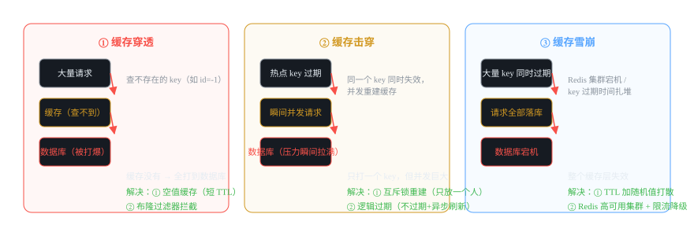
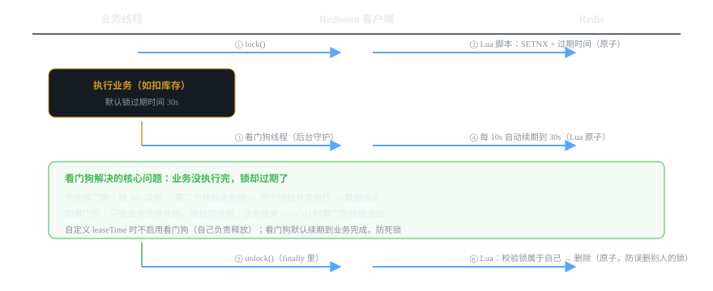

# 微服务组件 09 · 缓存与分布式锁 Redis / Redisson

> 高频读、并发写都靠它：缓存扛读流量，Redisson 分布式锁保证并发安全。缓存三大问题和锁的可靠性是面试重灾区。
>
> 技术栈：Redis 6.x/7.x · Redisson 3.x · RedisTemplate · 分布式锁

## 目录
1. 是什么 / 解决什么问题
2. 核心原理
3. 核心概念表
4. 代码示例
5. 面试题与回答
6. 小结与口诀

---

## 1. 是什么 / 解决什么问题

**Redis** 是内存数据库，微服务里两个核心职责：**缓存**（扛读）和 **分布式锁**（保并发）。

### 1.1 没有 Redis 会怎样？（痛点引入）

- 读多写少的数据（商品详情、字典、配置），每次请求都查数据库 → 数据库连接耗尽，系统撑不过双十一的 1%。
- 多实例部署后，`synchronized` 锁只锁本机 JVM，一个扣库存接口在 3 个实例上**并发扣减**，超卖。
- Session 存在单机内存，负载均衡切到另一台就掉登录。

### 1.2 Redis 用来干什么（五大用途）

| 用途 | 例子 |
|---|---|
| 缓存 | 商品详情、用户信息、字典（读多写少） |
| 分布式锁 | 扣库存、防重提交、定时任务互斥 |
| 计数器/限流 | 访问计数、滑动窗口限流（配合 Lua） |
| 消息/队列 | List 做简单队列（轻量场景） |
| 分布式 Session / 其他 | 登录态共享、排行榜（ZSet） |

### 1.3 为什么快？

- **内存存储**：读写纳秒级，比磁盘快几个数量级。
- **单线程 + IO 多路复用**（epoll）：单线程避免了锁竞争和上下文切换；IO 多路复用让一个线程管理海量连接。**6.0 之后多线程只用于网络 IO 读写，命令执行仍是单线程**。
- **高效数据结构**：跳表（ZSet）、压缩列表等针对场景优化。

---

## 2. 核心原理

### 2.1 缓存三大问题：穿透 / 击穿 / 雪崩（必考，先分清）



| 问题 | 场景 | 危害 | 解决 |
|---|---|---|---|
| **穿透** | 查**不存在**的数据（id=-1、恶意刷） | 缓存永远没有 → 请求全部打数据库 | ① 空值缓存（TTL 短）② 布隆过滤器 |
| **击穿** | **单个热点 key** 过期瞬间，大量并发重建 | 一个 key 的并发全压数据库 | ① 互斥锁（只放一个线程重建）② 逻辑过期（不过期 + 异步刷新） |
| **雪崩** | **大量 key** 同时过期 / Redis 宕机 | 缓存层整体失效，数据库被打爆 | ① TTL 加随机值打散 ② Redis 高可用（哨兵/集群）③ 本地缓存兜底 + 限流降级 |

> **记忆法：** 穿透=查"没有"的，击穿=查"一个热点"，雪崩=查"一片"。穿透靠"挡"（空值/布隆），击穿靠"锁"（互斥重建），雪崩靠"散+备"（随机 TTL + 高可用）。

### 2.2 缓存一致性：Cache Aside 模式（标准答案）

读流程：先查缓存 → 命中返回；未命中查库 → 写缓存。
写流程（**先更新数据库，再删缓存**）：
1. 更新数据库。
2. 删除缓存（而不是更新缓存）。
3. 下次读时未命中 → 查库 → 重建缓存。

**为什么删缓存而不是更新缓存？** 更新缓存要考虑并发写覆盖、写缓存失败一致性，删缓存更简单，且"读时重建"天然保证最终一致。

**删缓存失败怎么办？** 延迟双删：更新库 → 删缓存 → 睡 1s（等可能写缓存的旧读请求过去）→ 再删一次。或者订阅 binlog（Canal）异步删缓存兜底。

> ⚠️ **注意：** 先删缓存再更新库是错的——删完缓存、还没更新库时，有请求读库拿到旧值写回缓存，缓存就一直是旧值了。

### 2.3 分布式锁演进（从入门到 Redisson，面试要能讲出为什么）

| 方案 | 实现 | 问题 |
|---|---|---|
| ① SETNX | `SETNX key value` 抢锁 | 忘了过期时间，死锁 |
| ② SETNX + EXPIRE | 两行命令 | 不是原子的：SETNX 后进程挂了，EXPIRE 没执行，死锁 |
| ③ SET 原子命令 | `SET key value NX EX 30` | 解决了原子性；但业务超 30s 锁过期，别人拿到锁 → 并发；删锁时可能删掉别人的锁 |
| ④ **Redisson** | Lua 脚本保证"加锁/续期/释放"原子 + **看门狗自动续期** | 主流方案，基本无短板（除极端主从切换场景，见 RedLock） |
| ⑤ RedLock | 多个独立 Redis 实例过半加锁 | 极端可靠性场景（分布式锁跨机房），实际项目很少用 |

### 2.4 Redisson 看门狗原理（必考深水区）



- 加锁：Lua 脚本原子执行 `SETNX + 过期时间（默认 30s）`。
- **看门狗（WatchDog）**：加锁成功后启动一个后台定时线程，**每 10 秒把锁的过期时间续到 30 秒**——只要业务还持有锁，锁就不会过期。
- 释放：unlock() 时 Lua 校验"锁的 value 是自己的"再删除（防止删掉别人的锁），并停止看门狗。
- 业务异常/宕机：锁到 30s 自动过期释放，不产生死锁。
- **自定义 leaseTime（如 5s）时不启动看门狗**，由自己负责在期限内释放。

---

## 3. 核心概念表

| 概念 | 说明 |
|---|---|
| Cache Aside | 读写缓存标准模式：先更库再删缓存 |
| 穿透 / 击穿 / 雪崩 | 缓存三兄弟：不存在 / 单热点过期 / 大面积失效 |
| 空值缓存 | 查不到也缓存 null（短 TTL），防穿透 |
| 布隆过滤器 | 判断 key 一定不存在，拦截穿透 |
| 逻辑过期 | key 不过期，存"过期时间"字段，后台异步重建 |
| 延迟双删 | 更新库 → 删缓存 → 延迟 → 再删，防旧值写回 |
| SETNX | 加锁原语（SET if Not eXists） |
| Lua 脚本 | Redis 保证多条命令原子执行（锁的核心） |
| 看门狗 WatchDog | Redisson 后台线程自动续期锁 |
| RedLock | 多实例过半加锁，极可靠场景 |

---

## 4. 代码示例

> 技术栈：Spring Boot 2.7 + spring-boot-starter-data-redis + Redisson 3.x。

### 4.1 依赖 + 配置

```xml
<dependency>
    <groupId>org.springframework.boot</groupId>
    <artifactId>spring-boot-starter-data-redis</artifactId>
</dependency>
<dependency>
    <groupId>org.redisson</groupId>
    <artifactId>redisson-spring-boot-starter</artifactId>
    <version>3.23.5</version>
</dependency>
```

```yaml
spring:
  redis:
    host: 127.0.0.1
    port: 6379
    password: 123456            # 你项目的 Redis 密码
    lettuce:
      pool:
        max-active: 8           # 连接池
        max-idle: 8
```

### 4.2 缓存：Cache Aside 手动实现（读）

```java
@Service
public class OrderQueryService {

    @Autowired
    private StringRedisTemplate redisTemplate;   // 简单场景用 StringRedisTemplate
    @Autowired
    private OrderMapper orderMapper;

    private static final String CACHE_KEY = "order:detail:";

    /**
     * 读流程：缓存优先 → 未命中查库 → 回填缓存
     * 防击穿：缓存重建加互斥锁（分布式场景用 Redisson 锁，见 4.4）
     */
    public OrderVO getById(Long id) {
        // 1. 查缓存
        String json = redisTemplate.opsForValue().get(CACHE_KEY + id);
        if (json != null) {
            return JSON.parseObject(json, OrderVO.class);
        }
        // 2. 防穿透：查不到的数据也缓存空值（短 TTL 30s）
        String emptyFlag = redisTemplate.opsForValue().get(CACHE_KEY + id + ":empty");
        if (emptyFlag != null) {
            return null;
        }
        // 3. 查库
        OrderVO order = orderMapper.selectById(id);
        if (order == null) {
            redisTemplate.opsForValue().set(CACHE_KEY + id + ":empty", "1", 30, TimeUnit.SECONDS);
            return null;
        }
        // 4. 回填缓存（TTL 加随机值，防雪崩）
        int ttl = 60 * 5 + new Random().nextInt(60);
        redisTemplate.opsForValue().set(CACHE_KEY + id, JSON.toJSONString(order), ttl, TimeUnit.SECONDS);
        return order;
    }
}
```

### 4.3 更新：先更库，再删缓存（写）

```java
@Transactional
public void updateOrder(OrderVO order) {
    // 1. 先更新数据库（同事务）
    orderMapper.updateById(order);
    // 2. 再删除缓存（下次读自动重建）
    redisTemplate.delete(CACHE_KEY + order.getId());
    // 生产加固：延迟双删（异步，等可能存在的旧读请求过去）
    // executor.execute(() -> { sleep(1000); redisTemplate.delete(CACHE_KEY + order.getId()); });
}
```

### 4.4 分布式锁：Redisson（推荐写法）

```java
@Service
public class StockService {

    @Autowired
    private RedissonClient redissonClient;

    /**
     * 扣库存：多实例并发安全
     * 看门狗自动续期：业务跑多久，锁就跟多久，不会"锁过期了业务还没完"
     */
    public boolean deductStock(Long skuId, int num) {
        // 锁 key 用业务维度：同一 sku 的扣减互斥
        RLock lock = redissonClient.getLock("stock:lock:" + skuId);
        boolean locked = false;
        try {
            // tryLock：最多等 3 秒拿不到就放弃（不阻塞死等）
            locked = lock.tryLock(3, TimeUnit.SECONDS);
            if (!locked) {
                log.warn("获取库存锁超时, skuId={}", skuId);
                return false;
            }
            // ---- 业务临界区 ----
            Integer stock = stockMapper.selectStock(skuId);
            if (stock < num) {
                return false;                 // 库存不足
            }
            stockMapper.deduct(skuId, num);   // UPDATE ... SET stock = stock - ? WHERE sku_id = ?
            return true;
        } catch (InterruptedException e) {
            Thread.currentThread().interrupt();
            return false;
        } finally {
            // 释放锁：Redisson 校验是自己的锁才删，不会误删别人的
            if (locked && lock.isHeldByCurrentThread()) {
                lock.unlock();
            }
        }
    }
}
```

> ⚠️ **三个细节：** ① unlock 必须放 finally；② 释放前校验 `isHeldByCurrentThread()`（防止锁被续期后本线程已经放弃、却删掉别人的锁）；③ tryLock 带等待时间，别用 lock() 无限阻塞。

### 4.5 防重提交：自定义注解 + Redisson（高频需求示例）

```java
@Target(ElementType.METHOD)
@Retention(RetentionPolicy.RUNTIME)
public @interface NoRepeatSubmit {
    long timeout() default 5;   // 5 秒内同一参数只允许一次
}

@Aspect
@Component
public class NoRepeatSubmitAspect {

    @Autowired
    private RedissonClient redissonClient;

    @Around("@annotation(noRepeatSubmit)")
    public Object around(ProceedingJoinPoint pjp, NoRepeatSubmit noRepeatSubmit) throws Throwable {
        // 用 方法签名 + 参数 拼唯一 key（简化：示例用请求 IP + 方法名）
        String key = "repeat:" + pjp.getSignature().toString() + ":" + getIp();
        RLock lock = redissonClient.getLock(key);
        if (!lock.tryLock(0, noRepeatSubmit.timeout(), TimeUnit.SECONDS)) {
            throw new BusinessException("请勿重复提交");
        }
        try {
            return pjp.proceed();
        } finally {
            if (lock.isHeldByCurrentThread()) lock.unlock();
        }
    }
}
```

---

## 5. 面试题与回答

### Q1：缓存穿透、击穿、雪崩的区别和解决方案？

**答：** 三者都是"缓存没挡住，压力到数据库"。**穿透**：查不存在的数据，缓存永远 miss——解决：空值缓存（短 TTL）+ 布隆过滤器（预判一定不存在的 key 直接拦截）。**击穿**：单个热点 key 过期瞬间大量并发重建——解决：互斥锁（只让一个线程查库重建，其余等待）+ 逻辑过期（key 不过期，存逻辑过期时间，后台异步刷新）。**雪崩**：大量 key 同时过期或 Redis 宕机——解决：TTL 加随机值打散过期时间 + Redis 高可用（哨兵/集群）+ 本地缓存（Caffeine）兜底 + 限流降级。记忆：穿透查"没有"、击穿查"一个热点"、雪崩查"一片"。

### Q2：缓存和数据库一致性怎么保证？

**答：** 用 **Cache Aside**：读——先查缓存，未命中查库回填；写——**先更新数据库，再删除缓存**。为什么删缓存不更新缓存：更新缓存要处理并发覆盖，删缓存简单且"读时重建"天然收敛到最终一致。两个隐患：① 删缓存失败 → 用延迟双删（删 → 等 1s → 再删）或订阅 binlog（Canal）异步删；② 并发读写瞬间可能短暂读到旧值——这是缓存方案的天花板，无法完全避免（要强一致就别用缓存，或用一致性协议如 Raft/本地事务）。面试口径："保证最终一致，接受毫秒级短暂不一致"。

### Q3：分布式锁有哪些实现？为什么不能只用 SETNX？

**答：** 演进路线：① `SETNX` 单独用 → 没设过期时间，宕机死锁；② `SETNX + EXPIRE` 两条命令 → 非原子，中间挂了照样死锁；③ `SET key val NX EX 30` 一条原子命令 → 解决死锁，但业务超 30s 锁自动过期，另一个线程拿到锁 → **两个线程并发执行**；且释放时可能删掉别人的锁；④ **Redisson** → Lua 脚本保证加锁/续期/释放原子，**看门狗自动续期**防"业务没完锁先过期"，释放时校验 value 归属防误删——这是生产标准方案。⑤ 极端场景 RedLock（多实例过半加锁）。所以"SETNX 能加锁"只是入门，面试要说出它四个版本的缺陷演进。

### Q4：Redisson 看门狗的原理？锁过期了业务还没执行完怎么办？

**答：** 看门狗解决的就是"业务没执行完锁先过期"。机制：加锁时默认锁过期时间 30s，Redisson 加锁成功后启动后台守护线程，**每 10 秒自动把锁续期到 30s**——只要业务线程还持有锁，锁就永远不会过期。业务结束 unlock() 时停止看门狗并释放锁；业务宕机，看门狗随之消失，锁 30s 后自动过期释放，不产生死锁。注意：指定了自定义 leaseTime 就不启用看门狗（自己保证期限内释放）。面试再补一句"这是用时间换可靠性，极端情况（GC 停顿超 30s）理论上仍有缝隙，所以锁内业务要短、幂等兜底"更显深度。

### Q5：释放锁时为什么要校验 value？怎么防止误删别人的锁？

**答：** 场景：线程 A 持锁，业务执行超过锁的过期时间（没看门狗时），锁自动释放；线程 B 拿到锁；此时 A 执行完调 unlock()，如果不校验，会把 B 的锁删掉——两个线程同时进临界区。解决：加锁时 value 存**唯一标识**（如 UUID + 线程 ID），释放时用 **Lua 脚本原子执行"比对 value 是自己的才删除"**（GET 比对 + DEL，两条命令必须 Lua 包成原子，否则比对完、删除前锁被别人抢走还是误删）。Redisson 的 unlock 就是这么实现的。

### Q6：Redis 锁和 ZooKeeper 锁有什么区别？什么场景用哪个？

**答：** 核心是**一致性模型不同**：Redis 锁是 AP（最终一致，主从切换瞬间可能丢锁，极端情况两个客户端同时持锁）；ZooKeeper 锁是 CP（临时顺序节点 + Watch，强一致，不会出现两个持锁者，但性能低、依赖 ZK 集群）。选型：**绝大多数业务用 Redis 锁**（快、简单、Redis 本来就有）；**资金/强一致、对"双持锁"零容忍**的场景用 ZK 锁。RedLock（Redis 多实例过半）是试图弥补 Redis 一致性的方案，但实现复杂、社区争议大，实际生产很少用。面试结论："99% 场景 Redisson 够用，强一致才上 ZK"。

### Q7：热 key 和大 key 问题是什么？怎么解决？

**答：** **热 key**：某个 key 被超高并发访问（如明星微博），单节点 Redis 扛不住，甚至打挂。解决：① 本地缓存（Caffeine）挡一层；② 热 key 复制多份（key 加后缀分片，读随机命中）；③ 读写分离。**大 key**：单个 key 的 value 很大（如几 MB 的 List/Hash），导致：读写阻塞 Redis（单线程处理大 key 耗时）、网络传输慢、删除大 key 阻塞。解决：① 拆分（大 Hash 拆成多个小 Hash，按字段分片）；② 压缩 value；③ 删除用 unlink（异步删除）或分批删。面试能举出"热 key 用本地缓存 + 复制，大 key 用拆分 + unlink"就够。

### Q8：Redis 为什么快？单线程为什么反而性能好？

**答：** 四个原因：① **内存存储**，无磁盘 IO（纳秒级）；② **单线程执行命令**：没有线程切换和锁竞争开销，也不用考虑并发安全问题——这是单线程的核心收益；③ **IO 多路复用（epoll）**：一个线程同时监听海量连接的就绪事件，网络 IO 等待不阻塞；④ 高效数据结构（跳表/压缩列表等）。注意：Redis 6.0 起网络 IO 读写改多线程，但**命令执行仍是单线程**。为什么不用多线程：瓶颈不在 CPU（在内存和网络），多线程反而引入锁和上下文切换，收益小于成本。

### Q9：Redis 和本地缓存（Caffeine）怎么配合？各管什么？

**答：** 两级缓存：**本地缓存（Caffeine，JVM 内存）** 最近、最快（纳秒级，无网络），管高频热点数据（字典、配置、热 key）；**Redis 分布式缓存** 管跨实例共享数据（登录态、锁、一致性要求高的）。配合模式：先查本地 → miss 查 Redis → miss 查库回填两级。注意：本地缓存各实例独立，更新时一致性差（要广播失效，或用短 TTL），所以**一致性要求高的数据别放本地缓存**。面试讲"两级缓存 + 各自适用边界"即高分。

### Q10：你们项目里 Redis 用在哪？（结合你的项目）

**答：** 我项目里四处：① **设备数据缓存**：最近 N 条实时数据存 Redis 给大屏/接口读，数据库做持久化，读写分离；② **分布式锁**：设备消息落库的幂等去重（同一消息唯一键先 SETNX，重复直接丢）、定时任务多实例互斥；③ **限流**：滑动窗口计数（Lua 脚本原子操作）配合 Sentinel 做接口限流；④ **登录态**：RuoYi 的 token 就是存 Redis（Redis 里存了 token → 用户信息的映射），多实例登录不丢。面试这么讲：每处都有明确场景 + 用了锁/幂等/Lua 这类"知识点"，比背八股有说服力。

---

## 6. 小结与口诀

**一句话定位：** Redis 扛读（缓存）、保并发（分布式锁），Redisson 把锁做成"可靠且不用操心"：Lua 原子 + 看门狗续期。

**口诀：** "穿透空值布隆挡，击穿互斥锁重建，雪崩随机 TTL 加高可用；先更库来后删缓存，延迟双删兜底忙；SETNX 四步进化到 Redisson，看门狗续期防过期，释放校验防误删。"

**三大坑：**
1. 缓存更新先删缓存再更库 = 必然产生脏缓存（顺序反了）
2. 分布式锁不用 Redisson，自己拼 SETNX 一定踩"锁过期业务没完"或"误删别人的锁"
3. 大 key/热 key 不治理，Redis 单线程会被拖死

**第二批完结：** 事务 → 消息 → 追踪 → 缓存，**数据与一致性四件套完成**。下一篇开始第三批：**认证鉴权 JWT/OAuth2**。

---

*微服务组件文档系列 · 09/16 · 技术栈 Spring Boot 2.7 + Redis 6.x + Redisson 3.23 · 生成于 2026-09-19*
