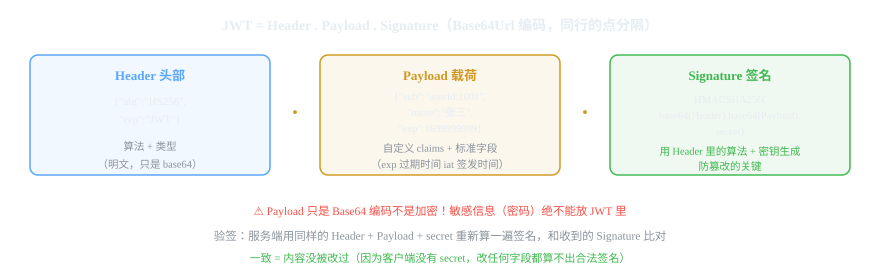
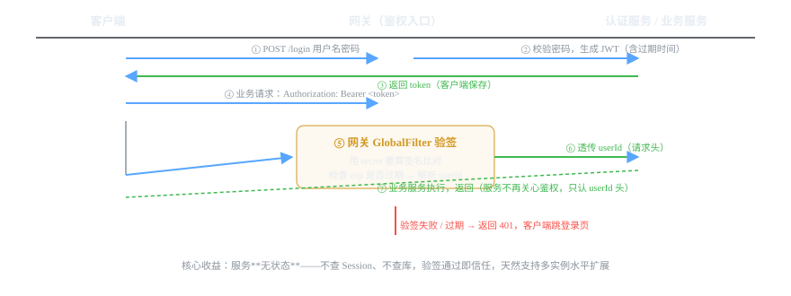

# 微服务组件 10 · 认证鉴权 JWT / OAuth2

> 微服务的"门禁系统"：JWT 做无状态认证，网关统一验签，服务只管业务。OAuth2 解决第三方授权和 SSO。
>
> 技术栈：JWT（jjwt 0.11.x）· Spring Security / 网关 GlobalFilter · OAuth2

## 目录
1. 是什么 / 解决什么问题
2. 核心原理
3. 核心概念表
4. 代码示例
5. 面试题与回答
6. 小结与口诀

---

## 1. 是什么 / 解决什么问题

**认证（Authentication，你是谁）** + **鉴权（Authorization，你能干什么）**。单体时代 Session 一把梭，微服务拆开后登录态必须在多服务间共享、统一管理。

### 1.1 没有统一认证会怎样？（痛点引入）

- Session 存在单机内存，请求被负载均衡到另一台 → **登录态丢失**。
- 每个服务自己写一套登录校验，改一次密码到处改 → **代码重复**。
- 用户调 5 个服务要拿 5 个 token → **体验灾难**。
- 无法统一管理踢人下线、封禁、token 过期策略。

### 1.2 三种方案演进

| 方案 | 思路 | 优点 | 缺点 |
|---|---|---|---|
| Session + Redis 共享 | 登录态存 Redis，服务共享 | 可控性强（能踢人） | 每次请求查 Redis |
| **JWT 无状态** | token 自包含用户信息 + 签名 | 服务无状态、不查存储、水平扩展友好 | 无法主动失效、泄露风险 |
| OAuth2 | 授权框架：第三方登录、令牌颁发 | 标准化、支持 SSO/第三方授权 | 体系重，小项目过杀 |

> **结论：** 微服务内部认证用 **JWT（配合网关统一校验）**；对外提供"第三方登录/授权给别的系统"用 **OAuth2**。两者不是互斥：很多系统 JWT 做应用内认证，OAuth2 做账号授权接入。

---

## 2. 核心原理

### 2.1 JWT 是什么：三部分结构



- **Header**：签名算法（HS256/RS256）和类型。
- **Payload**：用户信息（claims）+ 标准字段（exp 过期时间、iat 签发时间）。**只是 Base64 编码，不是加密！**
- **Signature**：用 Header 里的算法和密钥，对前两部分算出的签名——**防篡改的关键**。
- 验签原理：服务端用同样的 Header + Payload + secret 重算签名，与收到的比对；一致说明内容没被改过（客户端没有 secret，改任何字段都算不出合法签名）。

### 2.2 JWT 认证完整流程



1. 客户端登录 → 认证服务校验密码 → 生成 JWT（含 userId、过期时间）→ 返回。
2. 客户端后续每次请求带 `Authorization: Bearer <token>`。
3. **网关 GlobalFilter 统一验签**（重算签名 + 检查 exp）→ 解析出 userId → 塞进请求头透传给下游。
4. 业务服务不关心鉴权，从请求头拿 userId 干活。

### 2.3 HS256 vs RS256（签名算法）

| 算法 | 类型 | 密钥 | 适用 |
|---|---|---|---|
| HS256 | 对称 | 同一个 secret 签发+验签 | 内部服务（网关和服务共享 secret） |
| RS256 | 非对称 | 私钥签、公钥验 | 多系统/外部（只发公钥给验证方） |

### 2.4 JWT 的痛点和应对（面试深水区）

| 痛点 | 应对 |
|---|---|
| **无法主动失效**（踢人/封禁/改密码后旧 token 仍有效） | ① 黑名单（Redis 存注销的 token/jti，验签时查）② token 携带 jti + Redis 版本号 ③ **短过期 + Refresh Token** |
| **泄露风险**（token 被截获，有效期内随便用） | 短过期（如 2h）+ HTTPS + 敏感操作二次校验 |
| Payload 不加密 | 不放大敏感信息（绝不放密码）；需要可放加密 claims |

### 2.5 OAuth2 核心概念与四种模式

**四个角色：** 资源所有者（用户）、客户端（第三方应用）、授权服务器（认证中心）、资源服务器（API）。

**四种授权模式：**

| 模式 | 流程 | 适用 |
|---|---|---|
| **授权码模式（Authorization Code）** | 用户同意 → 授权码 → 客户端换 token | **主流**（微信/支付宝登录、SSO） |
| 客户端凭证（Client Credentials） | 应用直接凭 client_id/secret 换 token | 服务间调用（机器对机器） |
| 简化模式（Implicit） | 直接回 token（不安全） | 已弃用 |
| 密码模式（Password） | 用户名密码直接换 token | 已不推荐（仅第一方应用） |

**授权码模式流程（必考）：**
1. 客户端引导用户到授权服务器 → 用户登录并同意授权。
2. 授权服务器回调，给客户端一个**授权码（code）**。
3. 客户端拿 code + client_secret 换 **Access Token**。
4. 带 Access Token 访问资源服务器。

---

## 3. 核心概念表

| 概念 | 说明 |
|---|---|
| 认证 / 鉴权 | 你是谁 / 你能干什么（两件事） |
| JWT | Header.Payload.Signature 三段式自包含 token |
| Payload / claims | 用户信息 + exp/iat 等标准字段（不加密） |
| Signature | 签名防篡改（HS256 对称 / RS256 非对称） |
| Bearer token | HTTP 头传递格式：`Authorization: Bearer xxx` |
| 网关验签 | GlobalFilter 统一校验，服务无状态 |
| 黑名单 / jti | JWT 注销机制（Redis） |
| Refresh Token | 长寿命换新 token，配合短过期缓解泄露 |
| OAuth2 | 授权框架：资源所有者/客户端/授权服务器/资源服务器 |
| 授权码模式 | 最安全的 OAuth2 模式，SSO 标配 |

---

## 4. 代码示例

> 技术栈：Spring Boot 2.7 + jjwt 0.11.x。RuoYi 的认证是"JWT + Redis 混合"（token 存 Redis，请求时校验），本质也是无状态化。

### 4.1 依赖

```xml
<dependency>
    <groupId>io.jsonwebtoken</groupId>
    <artifactId>jjwt-api</artifactId>
    <version>0.11.5</version>
</dependency>
<dependency>
    <groupId>io.jsonwebtoken</groupId>
    <artifactId>jjwt-impl</artifactId>
    <version>0.11.5</version>
    <scope>runtime</scope>
</dependency>
<dependency>
    <groupId>io.jsonwebtoken</groupId>
    <artifactId>jjwt-jackson</artifactId>
    <version>0.11.5</version>
    <scope>runtime</scope>
</dependency>
```

### 4.2 JWT 工具类：生成 + 解析（核心）

```java
@Component
public class JwtUtil {

    @Value("${jwt.secret}")              // 生产用环境变量注入，别写死在代码里
    private String secret;
    @Value("${jwt.expire-hours:2}")      // 默认 2 小时过期
    private int expireHours;

    private SecretKey key() {
        return Keys.hmacShaKeyFor(secret.getBytes(StandardCharsets.UTF_8));
    }

    /**
     * 生成 token：把 userId 存进 claims，设置过期时间
     */
    public String createToken(Long userId, String username) {
        Date now = new Date();
        Date exp = new Date(now.getTime() + expireHours * 60 * 60 * 1000L);
        return Jwts.builder()
                .setSubject(String.valueOf(userId))            // 标准 subject 放用户 ID
                .claim("username", username)                   // 自定义 claims
                .setIssuedAt(now)                              // iat
                .setExpiration(exp)                            // exp 过期时间
                .signWith(key(), SignatureAlgorithm.HS256)     // 签名
                .compact();
    }

    /**
     * 校验并解析：签名不对 / 过期会抛异常，调用方统一处理成 401
     */
    public Claims parseToken(String token) {
        return Jwts.parserBuilder()
                .setSigningKey(key())
                .build()
                .parseClaimsJws(token)   // 这一步验签 + 验过期
                .getBody();
    }
}
```

### 4.3 登录接口：生成 token

```java
@RestController
@RequestMapping("/auth")
public class AuthController {

    @Autowired
    private JwtUtil jwtUtil;
    @Autowired
    private UserMapper userMapper;

    @PostMapping("/login")
    public Result<LoginVO> login(@RequestBody LoginReq req) {
        // 1. 校验账号密码（真实项目密码哈希比对 BCrypt）
        User user = userMapper.selectByUsername(req.getUsername());
        if (user == null || !BCrypt.checkpw(req.getPassword(), user.getPassword())) {
            return Result.error("用户名或密码错误");
        }
        // 2. 生成 token
        String token = jwtUtil.createToken(user.getId(), user.getUsername());
        return Result.success(new LoginVO(token, user.getUsername()));
    }
}
```

### 4.4 网关统一验签（Spring Cloud Gateway 场景，参考 01 篇过滤器链）

```java
@Component
public class AuthFilter implements GlobalFilter, Ordered {

    @Autowired
    private JwtUtil jwtUtil;

    private static final List<String> WHITE_LIST = Arrays.asList("/auth/login", "/auth/captcha");

    @Override
    public Mono<Void> filter(ServerWebExchange exchange, GatewayFilterChain chain) {
        String path = exchange.getRequest().getURI().getPath();
        if (WHITE_LIST.stream().anyMatch(path::startsWith)) {
            return chain.filter(exchange);   // 白名单放行
        }
        String token = exchange.getRequest().getHeaders().getFirst("Authorization");
        if (token == null || !token.startsWith("Bearer ")) {
            return unauthorized(exchange);
        }
        try {
            Claims claims = jwtUtil.parseToken(token.substring(7));   // 验签 + 验过期
            // 把 userId 塞进请求头透传给下游服务，服务不再自己鉴权
            ServerHttpRequest newReq = exchange.getRequest().mutate()
                    .header("X-User-Id", claims.getSubject())
                    .build();
            return chain.filter(exchange.mutate().request(newReq).build());
        } catch (Exception e) {
            return unauthorized(exchange);   // 签名错误 / 过期 → 401
        }
    }

    private Mono<Void> unauthorized(ServerWebExchange exchange) { /* 返回 401（见 01 篇） */ }

    @Override
    public int getOrder() { return -100; }   // 最先执行
}
```

### 4.5 业务服务取用户（不鉴权，只信网关透传的头）

```java
@RestController
@RequestMapping("/order")
public class OrderController {

    /**
     * 当前用户 ID 由网关透传，应用层不再解析 token
     */
    @GetMapping("/my")
    public Result<List<OrderVO>> myOrders(@RequestHeader("X-User-Id") Long userId) {
        return Result.success(orderService.listByUser(userId));
    }
}
```

### 4.6 登出 / 主动失效（JWT 的补救）

```java
// 方案：有效期内的 token 记入 Redis 黑名单（jti = token 唯一 ID）
@Service
public class AuthService {

    @Autowired
    private StringRedisTemplate redis;

    public void logout(String token) {
        Claims claims = jwtUtil.parseToken(token.substring(7));
        // 剩余有效期内，这个 token 在黑名单里
        long remainMs = claims.getExpiration().getTime() - System.currentTimeMillis();
        redis.opsForValue().set("blacklist:jwt:" + claims.getId(), "1", remainMs, TimeUnit.MILLISECONDS);
    }

    public boolean isBlacklisted(String jti) {
        return Boolean.TRUE.equals(redis.hasKey("blacklist:jwt:" + jti));
    }
}
```

---

## 5. 面试题与回答

### Q1：Session 和 JWT 的区别？为什么微服务用 JWT？

**答：** **Session**：登录后服务器存会话 ID，客户端带 cookie，服务端查内存/Redis——**有状态**，可主动踢人，但多实例要共享存储，每次请求查一次存储。**JWT**：token 自包含用户信息 + 签名，服务端**无状态**——验签通过即信任，不查存储，天然支持水平扩展、异构系统共用。微服务场景选 JWT 的原因：① 服务无状态，扩缩容零成本；② 网关统一验签，服务之间不用讨论鉴权实现；③ 适合移动端/B 端多端（不依赖 cookie 机制）。代价：无法主动失效、泄露风险，需要配套黑名单/短过期。

### Q2：JWT 的三部分是什么？签名怎么起到防篡改作用？

**答：** **Header**（算法和类型）、**Payload**（用户 claims + exp/iat）、**Signature**（签名）。签名 = 用 Header 声明的算法和密钥，对"Base64(Header).Base64(Payload)"算出的摘要。验签时服务端用同样的算法和密钥重算一遍，和附带的签名比对：**一致 = 没人改过**。因为客户端没有密钥，篡改 Payload 里任何一个字符，重算的签名都对不上。注意两个延伸：① Payload 只是 Base64 **不是加密**，密码这类敏感信息绝不能放；② HS256 的 secret 泄露 = 谁能伪造 token，必须用环境变量/配置中心管理。

### Q3：JWT 过期了怎么办？怎么实现"踢人下线"？

**答：** 过期机制：签发时设置 exp，服务端验签时检查，过期抛异常返回 401，前端跳登录页重新登录。**踢人下线**是 JWT 的痛点（无状态 = 服务不知道 token 还在不在）：常用方案三选一：① **黑名单**：登出/封禁时把 token 的 jti 存 Redis（TTL 到原过期时间），验签时查黑名单；② **版本号**：token 里带 jti，Redis 存"账户当前有效 jti"，不匹配即失效（改密码、踢人时替换版本号）；③ **短过期 + Refresh Token**：Access Token 2 小时、Refresh Token 7 天，刷新时对账——泄露窗口小。面试说"JWT 不能主动失效，用黑名单/版本号/短过期三选一补救"就到位了。

### Q4：网关统一鉴权怎么做？为什么放网关而不是每个服务？

**答：** 网关做**统一的 GlobalFilter**（参考 01 篇）：白名单放行（登录、验证码）→ 取 Authorization 头 → 验签 + 验过期 → 把 userId 塞进请求头透传下游。放网关的原因：① 只写一次，全链路生效，服务不重复造轮子；② 鉴权逻辑集中管控，改策略一处生效；③ 网关拦截后，内部服务可以假设"能进来的都是认证过的"，简化信任模型。注意边界：网关只做**认证（验 token 合法性）**，精细的**权限（角色/菜单）**校验还是在下游或结合 RBAC 服务，网关太胖会拖慢所有请求。

### Q5：JWT 和 OAuth2 是什么关系？能不能互相替代？

**答：** 不能替代，**解决不同问题**。JWT 是一种 **token 格式**（怎么让信息自包含且防篡改）；OAuth2 是一种 **授权框架**（怎么让第三方应用安全地拿到访问权限，含令牌颁发、刷新、撤销整套流程）。关系：OAuth2 颁发的 Access Token **可以是 JWT 格式**——两者经常组合使用。场景区别：自家系统内部认证用 JWT 就够；"允许微信登录我们的应用"、"开放 API 给第三方"是授权问题，必须用 OAuth2 的授权码模式。面试一句话："JWT 是令牌的形态，OAuth2 是令牌的流程，OAuth2 的令牌常用 JWT 实现。"

### Q6：OAuth2 授权码模式的完整流程？

**答：** 四步：① 客户端引导用户跳转授权服务器（带上 client_id、redirect_uri、scope），用户**登录并同意授权**；② 授权服务器回调 redirect_uri，给客户端一个一次性**授权码（code）**（此时还没拿到 token）；③ 客户端用 code + client_secret 在**后端**向授权服务器换 **Access Token**（code 一次有效，且兑换在有 client_secret 的服务器端完成，中间人截获 code 也没用）；④ 客户端带 Access Token 访问资源服务器。为什么用"授权码"中转而不直接回 token：防 token 暴露在浏览器跳转环节。这就是微信/支付宝 OAuth 登录的标准玩法。

### Q7：token 存在哪？localStorage 还是 Cookie？为什么？

**答：** 安全角度都不完美，权衡：**localStorage**：防不了 XSS（脚本能读），但不怕 CSRF；**Cookie（HttpOnly）**：防 XSS（JS 读不到），但要处理 CSRF（SameSite/CSRF token）。移动端存在**安全存储（Keychain/Keystore）**。前端项目常见 localStorage + 网关校验，因为 CSRF 主要威胁"浏览器自动带 cookie 的请求，而 Bearer token 手动塞 header，天然免疫 CSRF"——所以 **token 放 header 的方案优先考虑 XSS 防护**（输入输出转义 + CSP）。面试口径："Bearer header 不怕 CSRF，重点防 XSS；敏感操作短 token + 二次校验。"

### Q8：你说说 RuoYi 的登录认证是怎么实现的？（你项目同栈）

**答：** RuoYi-Vue/RuoYi-Cloud 的认证是 **JWT（无状态）+ Redis（可控）混合**：用户登录成功 → 生成 UUID 作为 token → **token 作为 key，用户信息存 Redis**（带过期时间）→ 把 token 返回前端。请求时网关/拦截器取 token → 查 Redis 拿到用户信息 + 刷新过期时间 → 放行。特点：比纯 JWT 多了"**能主动踢人**"（删 Redis key）和"**可控的会话时长**"（每次请求续期），代价是每次请求查一次 Redis——这是"无状态与可控性的权衡"，也是 RuoYi 系项目的标准做法，和纯 JWT 方案对比着讲最显功力。

### Q9：SSO（单点登录）怎么做？和 JWT 什么关系？

**答：** SSO 的场景：公司有 10 个系统，用户登一次全都能进。实现核心是一个**独立的认证中心（SSO Server）**，配合两种模式：① 基于 **OAuth2 授权码模式**做 SSO——每个系统是 OAuth2 客户端，跳转统一认证中心登录 + 授权码换 token；② 老一点的 **CAS**（Central Authentication Service）——统一票据 TGT/ST 认证。发下来的票据/token 常用 JWT 实现（自包含、各系统验签即可）。Gitee/阿里云的多系统登录就是这套。面试结论："SSO 是产品需求，OAuth2/CAS 是协议实现，token 载体常用 JWT。"

### Q10：token 泄露了怎么办？怎么降低风险？

**答：** 分"防"和"救"两层。**防**：① HTTPS 全链路（防截获）；② token 不放 URL、不放日志；③ 过期时间短（Access Token 2h，Refresh Token 7d）；④ 敏感操作（支付、改密）要求二级验证（短信/验证码，不能只信 token）。**救**：① 黑名单/版本号机制实现"立即失效"；② 泄露检测（异地登录、异常设备提醒）；③ 刷新机制让旧 token 快速作废。面试加分：主动说出"JWT 的最大风险是泄露后无法撤销，所以必须短过期 + 可失效机制 + HTTPS 三件套"，比只背结构强得多。

---

## 6. 小结与口诀

**一句话定位：** JWT 让认证无状态化（验签即信任），网关统一校验（写一次全链路生效），OAuth2 管第三方授权（授权码 + Access Token）。

**口诀：** "头部载荷签名段，base64 不加密；私钥签来公钥验，篡改一验就现形；网关验签透 userId，服务无状态躺赢；主动失效靠黑名单，短过期加 Refresh；第三方登录找 OAuth，授权码模式最安全。"

**三大坑：**
1. Payload 不禁加密——密码等敏感信息绝不能进 JWT
2. secret 别写死在代码里（配置中心/环境变量）
3. 纯 JWT 无法踢人——登出/封禁必须有黑名单或版本号机制

**下一跳：** 定时任务在微服务里怎么保证只跑一次？下一篇讲 **XXL-Job 任务调度**。

---

*微服务组件文档系列 · 10/16 · 技术栈 Spring Boot 2.7 + jjwt 0.11.5 + Spring Security · 生成于 2026-09-19*