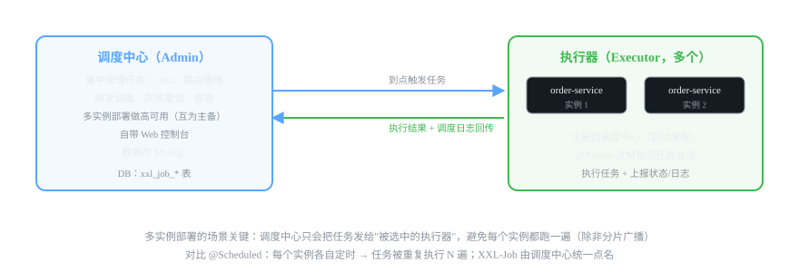
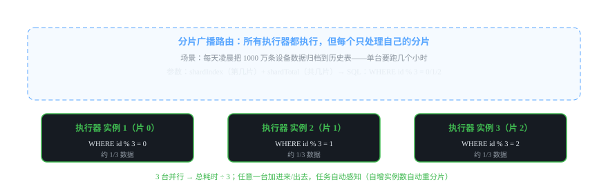

# 微服务组件 11 · 分布式任务调度 XXL-Job

> 定时任务在单机上是 @Scheduled，多实例就变成"每个实例都跑一遍"的灾难。XXL-Job 用"调度中心统一点名 + 执行器干活"解决。
>
> 技术栈：XXL-Job 2.4.x · 调度中心 + 执行器 · 分片广播 · 失败重试

## 目录
1. 是什么 / 解决什么问题
2. 核心原理
3. 核心概念表
4. 代码示例
5. 面试题与回答
6. 小结与口诀

---

## 1. 是什么 / 解决什么问题

**分布式任务调度**：把定时任务从"每个应用内自己跑"变成"中央统一调度、分散执行"，解决多实例下的重复执行、失败重试、任务监控三大问题。

### 1.1 @Scheduled 的局限（痛点引入）

| 痛点 | 说明 |
|---|---|
| **重复执行** | 服务部署 3 个实例，3 个 @Scheduled 同时跑，数据被处理 3 遍（扣款/发消息类直接事故） |
| 无失败重试 | 任务抛异常就没了，没人管 |
| 无监控告警 | 任务到底跑没跑、跑多久，全靠日志翻 |
| cron 改不了 | 改执行时间要改代码重新发布 |
| 无执行记录 | 没有调度日志、没有执行报表 |

### 1.2 XXL-Job 解决什么

- **调度与执行分离**：调度中心统一定时触发，执行器分散执行。
- **路由策略**：多实例时只选一个执行——任务只跑一遍。
- **失败重试 + 告警**：任务失败自动重试（可配次数），可对接钉钉/邮件。
- **Web 控制台**：在线创建任务、改 cron、看调度日志、手动触发。
- **分片广播**：大数据任务多实例并行分片处理（见 2.4）。

---

## 2. 核心原理

### 2.1 架构：调度中心 + 执行器



- **调度中心（Admin）**：独立部署的 Web 应用，集中管理任务（cron、路由策略、阻塞策略），到点触发执行器，收集执行结果。多实例互为主备，做高可用。数据存 MySQL（xxl_job_* 表）。
- **执行器（Executor）**：嵌入业务服务的组件，启动时向调度中心**注册**（自动发现），执行被触发的任务，回传日志和结果。
- 通信：调度中心 → 执行器发 HTTP 请求（触发任务）；执行器回调调度中心上报结果。

### 2.2 一次任务执行的完整流程

1. 控制台创建任务（JobHandler 名称 = 代码里 @XxlJob 的值，cron 表达式，路由策略）。
2. 调度中心到点（cron）触发：按路由策略**选中一个（或全部）执行器实例**。
3. 执行器收到触发请求 → 定位 @XxlJob 对应方法 → 执行任务。
4. 任务执行完（或异常）→ 回传执行结果、执行日志给调度中心。
5. 控制台查看调度日志、执行报表；失败任务按配置重试/告警。

### 2.3 路由策略（多实例怎么选执行器 —— 高频考点）

| 策略 | 行为 | 适用 |
|---|---|---|
| 第一个 / 最后一个 | 固定选序号第一/最后的实例 | 少用 |
| 轮询 | 每次换一个实例 | 负载均衡 |
| 随机 | 随机选一个 | 测试 |
| **故障转移** | 选第一个，失败自动换下一个 | 可靠性要求高 |
| **忙碌转移** | 实例忙就换下一个 | 任务耗时不确定 |
| 一致性哈希 | 按 Job ID 哈希路由 | 保证同一任务固定实例 |
| **分片广播** | **所有实例都执行**，各处理分片 | 大数据并行处理 |

> 面试记忆：**看"一个与多个"**——要"只跑一个实例"选轮询/故障转移/一致性哈希；要"全实例一起干"选**分片广播**。

### 2.4 分片广播：大数据任务并行化



场景：每天凌晨把 1000 万条设备数据归档到历史表，单机跑 3 小时。用分片广播：
- 路由策略选"分片广播" → **所有执行器都会执行**该任务。
- 任务代码里拿 **shardIndex（第几片）和 shardTotal（总片数）**，各自只处理 `WHERE id % shardTotal = shardIndex` 的数据。
- 3 台实例 → 各处理 1/3 → 总耗时 ÷ 3；实例增减自动感知（shardTotal 跟着变）。

### 2.5 阻塞处理策略（任务还没跑完又到点了）

- **单机串行**：排队等（默认）。
- **丢弃后续调度**：上一次没跑完，这次的直接丢。
- **覆盖之前调度**：新任务覆盖旧任务（旧任务线程池里杀了重来）。

### 2.6 失败处理

- **重试次数**：任务配置失败重试 N 次（间隔递增）。
- **失败告警**：对接钉钉/企业微信/邮件告警。
- **调度日志**：控制台可看每次调度的触发时间、执行器、执行结果、失败原因。

---

## 3. 核心概念表

| 概念 | 说明 |
|---|---|
| 调度中心（Admin） | 独立部署的调度服务，管任务、触发、日志、告警 |
| 执行器（Executor） | 嵌入业务应用，注册自己、执行任务 |
| JobHandler | 任务标识，控制台配置的名称 = 代码 @XxlJob 的值 |
| cron | 任务的执行表达式（控制台动态改，不用发版） |
| 路由策略 | 多实例时"选谁执行"：轮询/故障转移/分片广播等 |
| 分片广播 | 所有实例都执行，各自处理分片（大数据并行） |
| shardIndex / shardTotal | 第几片 / 共几片 |
| 阻塞处理 | 上轮没跑完，本轮怎么办：串行/丢弃/覆盖 |
| 失败重试 | 失败自动重试次数 |
| 调度日志 | 每次触发的执行记录（控制台可查） |

---

## 4. 代码示例

> 技术栈：Spring Boot 2.7 + xxl-job 2.4.1（执行器嵌入业务服务）。

### 4.1 依赖 + 配置

```xml
<dependency>
    <groupId>com.xuxueli</groupId>
    <artifactId>xxl-job-core</artifactId>
    <version>2.4.1</version>
</dependency>
```

```yaml
xxl:
  job:
    admin:
      addresses: http://127.0.0.1:8080/xxl-job-admin   # 调度中心地址
    accessToken: default_token                         # 调度中心配的令牌
    executor:
      appname: order-executor          # 执行器名称（控制台"执行器管理"里注册的名字）
      port: 9999                       # 执行器回调端口
      logpath: /data/applogs/xxl-job/
```

### 4.2 执行器配置类（注册到调度中心）

```java
@Configuration
public class XxlJobConfig {

    @Value("${xxl.job.admin.addresses}")
    private String adminAddresses;
    @Value("${xxl.job.executor.appname}")
    private String appname;
    @Value("${xxl.job.executor.port}")
    private int port;

    @Bean
    public XxlJobSpringExecutor xxlJobExecutor() {
        XxlJobSpringExecutor executor = new XxlJobSpringExecutor();
        executor.setAdminAddresses(adminAddresses);
        executor.setAppname(appname);
        executor.setPort(port);
        executor.setAccessToken("default_token");
        executor.setLogPath("/data/applogs/xxl-job/");
        return executor;
    }
}
```

### 4.3 普通定时任务（每天凌晨归档过期订单）

```java
@Component
@Slf4j
public class OrderJob {

    /**
     * 订单超时自动关闭（每天 0 点执行）
     * @XxlJob 的值 = 控制台新建任务时填的"JobHandler"
     */
    @XxlJob("orderTimeoutCloseJob")
    public void orderTimeoutCloseJob() {
        log.info("订单超时关闭任务开始");
        int count = orderService.closeTimeoutOrders(30);   // 关闭 30 分钟未支付的订单
        log.info("订单超时关闭任务结束，关闭 {} 笔", count);
    }

    /**
     * 任务带参数：控制台"任务参数"里传 JSON，业务里解析
     */
    @XxlJob("paramDemoJob")
    public void paramDemoJob() {
        String param = XxlJobHelper.getJobParam();   // 拿控制台传的参数
        XxlJobHelper.log("收到参数: {}", param);      // 写调度日志（控制台可看）
        // ... 业务
    }
}
```

> 💡 **核心记忆：** 控制台建任务时填的 **JobHandler 名称必须等于 @XxlJob 注解的值**，对不上就执行器找不到任务（控制台报"任务不存在"）。

### 4.4 分片广播任务（大数据并行 —— 重点场景）

```java
@Component
public class DataArchiveJob {

    /**
     * 设备数据归档：路由策略选"分片广播"后，
     * 每个实例执行器都会进入这里，但只处理自己的分片
     */
    @XxlJob("deviceDataArchiveJob")
    public void deviceDataArchiveJob() {
        // 1. 拿分片信息
        int shardIndex = XxlJobHelper.getShardIndex();   // 第几片（0 开始）
        int shardTotal = XxlJobHelper.getShardTotal();   // 共几片（当前在线实例数）
        XxlJobHelper.log("分片信息: index={}, total={}", shardIndex, shardTotal);

        // 2. 只处理自己的分片：按主键取模
        //    SELECT * FROM device_data WHERE id % {shardTotal} = {shardIndex} AND date < 昨天
        //    或按范围分片：id BETWEEN 区间
        List<DeviceData> list = dataMapper.selectByShard(shardIndex, shardTotal);
        for (DeviceData data : list) {
            historyMapper.insert(data);   // 归档
            dataMapper.deleteById(data.getId());
        }
        XxlJobHelper.log("本片处理完成: {} 条", list.size());
    }
}
```

### 4.5 控制台操作三步（RuoYi 系项目接入流程）

1. **执行器管理**：新增执行器，AppName 填 `order-executor`（和 yml 一致），加机器地址。
2. **任务管理**：新建任务 → 选执行器 → 填 JobHandler（`orderTimeoutCloseJob`）→ cron（`0 0 0 * * ?`）→ 路由策略（单实例选故障转移/轮询，并行选分片广播）→ 阻塞策略 → 失败重试次数。
3. **调度日志**：跑完后查"调度日志"，看每次触发、执行结果、执行器输出。

> ⚠️ **注意：** 5.x 新版本（如 RuoYi-Cloud 最新拆分的 xxl-job 模块）部分 API 有差异，但 2.4.x 这套 `@XxlJob + XxlJobHelper` 写法是通用核心，面试讲这套就行。

---

## 5. 面试题与回答

### Q1：为什么不用 @Scheduled 而用 XXL-Job？（痛点题）

**答：** @Scheduled 是单机定时器，微服务下四个硬伤：① **重复执行**——服务 3 个实例就有 3 个调度器到点都跑，扣款/发消息/归档这类任务会执行 3 遍（这是最致命的）；② **无失败重试**——任务抛异常就没了，也没有执行记录；③ **无监控**——跑没跑、跑多久、成功率没有统一视图；④ **改 cron 要发版**。XXL-Job 用调度中心统一触发：任务标记"执行器"，路由策略保证只跑一个实例，失败自动重试 + 控制台看调度日志，cron 在线改。一句话："@Scheduled 适合单机脚本，分布式任务必须中央调度。"

### Q2：XXL-Job 的架构是什么样的？调度中心和执行器什么关系？

**答：** 两部分：**调度中心（Admin）**独立部署，管任务定义、cron 触发、路由选择、调度日志、失败重试和告警，数据存 MySQL，可多实例做主备高可用；**执行器（Executor）**嵌入业务服务，启动时向调度中心注册（AppName + 机器地址），被触发后执行任务方法、回传结果和日志。通信：调度中心 HTTP 调执行器触发；执行器回调调度中心上报状态。**调度与执行解耦**是核心设计：加机器不加逻辑，改 cron 不动代码，任务执行能力可横向扩展。

### Q3：路由策略有哪些？多实例怎么保证任务只执行一次？

**答：** 路由策略决定"触发时选哪个执行器实例"：轮询（轮流）、第一个/最后一个（固定）、随机、故障转移（选第一个，失败换下一个）、忙碌转移（实例忙就换）、一致性哈希（同一任务固定同一实例）、**分片广播**（所有实例都执行）。保证"只执行一次"：单实例任务用**故障转移或一致性哈希**——调度中心只选中一个实例触发；分片广播虽然所有实例都执行，但各自只处理自己分片的数据（取模），语义上也是"整批数据只处理一次"。这是 XXL-Job 替代 @Scheduled 的核心价值。

### Q4：分片广播是什么？具体怎么用？

**答：** 分片广播适合**大数据量的任务并行处理**：路由策略选"分片广播"后，所有在线执行器**每个都会执行**该任务，任务代码通过 `XxlJobHelper.getShardIndex()`（第几片）和 `getShardTotal()`（总片数）知道自己负责哪部分，通常用**主键取模**（`WHERE id % total = index`）分片。例：1000 万条设备数据归档，3 个实例各处理 1/3，总耗时 ÷ 3；实例扩容自动重分片，无需改代码。注意事项：① 分片字段要均匀（用 id，别用时间）；② 每个分片最好再做幂等（失败重跑不重复入历史表）。

### Q5：任务执行失败怎么办？重试会重复执行吗？

**答：** 三层机制：① **失败重试**：任务配置重试次数（如 3 次），自动重跑，间隔递增；② **告警**：重试仍失败可对接钉钉/邮件通知负责人；③ **调度日志**：控制台可查每次执行的完整记录和异常堆栈，定位失败原因。**重试导致重复执行**：XXL-Job 的重试是"新一次调度"，之前失败可能已处理了部分数据——所以**任务体必须幂等**（如归档任务先查目标表有没有、扣款任务带业务唯一键）。面试口径："重试解决了无人管的失败，幂等解决重试的副作用，两者必须一起上。"

### Q6：调度中心挂了怎么办？任务还会执行吗？

**答：** 调度中心挂了，**到时点不会有新触发**（cron 判断在调度中心），但已下发到执行器执行的任务不受影响（执行器独立运行）。生产高可用：调度中心**多实例部署互为主备**（集群模式），它们共享 MySQL，通过数据库锁保证同一时刻只有一个实例主调度；主挂了备用顶上，任务不丢。执行器侧则是"执行能力与调度中心解耦"，调度中心恢复后继续正常调度。设计上还有"**过期补偿**"（错过的调度时间可以补触发）。面试要点："调度中心不能单点，集群 + DB 锁选主。"

### Q7：迟到的任务（错过调度时间）会执行吗？有什么策略？

**答：** 可以配置"**过期策略**"：调度中心发现某个任务错过了原定触发时间（如执行器宕机、调度中心重启期间），可以根据配置**过期补偿**执行（把错过的调度补上）或**忽略**。实际业务中注意：像"每分钟对账"这类可以补；像"0 点执行"这类补了会重叠（和当天新调度冲突），要配合阻塞策略选"丢弃后续调度"而不是无脑补。这个点答出来能体现你处理过真实调度延迟问题。

### Q8：XXL-Job、Quartz、ElasticJob 怎么选？

**答：** **Quartz**：老牌任务库，单机/集群部署，需要自己包调度 + 持久化 + 管理界面，工程化弱；**ElasticJob**：当当开源的分布式调度，分片模型优秀，原生支持任务分片和错过补偿，但运维界面和生态弱一些；**XXL-Job**：国内最流行——开箱即用的 Web 控制台、可视化调度日志、丰富的路由策略、告警对接、部署简单（一个 war/jar + MySQL），社区资料多，RuoYi 生态直接集成。选型：小而快选 XXL-Job（默认答案），需要更细粒度分片管理可以看 ElasticJob，老系统保留 Quartz。面试结论："XXL-Job 是工程化最成熟的国产方案。"

### Q9：动态修改 cron 怎么做？不用重启服务吗？

**答：** XXL-Job 天然支持：**控制台任务管理里直接改 cron，立即生效，不用动代码**。原理：任务定义和 cron 存在调度中心的 MySQL，执行器只负责"收到触发请求就执行"——cron 属于调度中心而非法 in 执行器。这是"调度与执行分离"设计带来的红利。想深度控制也可以在代码里动态注册任务（@XxlJob + 控制台 API），但日常改调度时间控制台改即可。面试延伸："和 Quarz 比，XXL-Job 把'调度策略'从代码里挪到了配置里，这是它的产品化优势。"

### Q10：你们的定时任务场景有哪些？（结合你的项目）

**答：** 我项目里三类：① **订单/状态处理**：订单超时未支付自动关闭（30 分钟），cron 每分钟扫一次——用路由策略"故障转移"保证只跑一个实例；② **数据归档**：设备数据定期归档历史表，用**分片广播**并行处理（3 个实例各处理 1/3，解决了单机跑几小时的问题）；③ **报表/统计**：每日生成统计报表（凌晨 2 点低谷期跑）。全部配了失败重试和钉钉告警，控制台看调度日志。面试这样讲：有场景、有策略选择理由、有大数据并行方案，闭环完整。

---

## 6. 小结与口诀

**一句话定位：** XXL-Job = 分布式定时任务的"中央调度 + 分散执行"：统一点名只跑一遍，失败重试有日志，分片广播干大事。

**口诀：** "调度执行两分离，中心点名执行器；路由策略管选人，故障转移只跑一；数据大用分片广播，index 取模各分家；失败重试加告警，幂等任务防重跑；cron 在线改不用发版。"

**三大坑：**
1. JobHandler 名称必须等于 @XxlJob 的值，对不上任务找不到
2. 失败重试会让任务"重跑"，任务体必须幂等
3. 分片字段要均匀（用 id 取模，别用时间范围）

**下一跳：** 排查问题的日志集中到哪？下一篇讲 **ELK 日志收集**。

---

*微服务组件文档系列 · 11/16 · 技术栈 Spring Boot 2.7 + XXL-Job 2.4.1 · 生成于 2026-09-19*