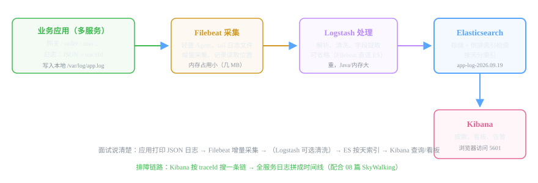
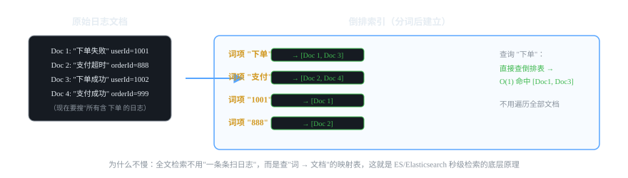

# 微服务组件 12 · 日志收集 ELK / EFK

> 日志散在 N 台机器上，grep 只能查一台。ELK 把日志集中到一处：秒级检索、可视化看板、配合 traceId 做全链路排障。
>
> 技术栈：Elasticsearch 7.17 + Filebeat 7.17 + Logstash（可选）+ Kibana

## 目录
1. 是什么 / 解决什么问题
2. 核心原理
3. 核心概念表
4. 代码示例
5. 面试题与回答
6. 小结与口诀

---

## 1. 是什么 / 解决什么问题

**ELK** = Elasticsearch（存储 + 检索）+ Logstash（采集 + 加工）+ Kibana（可视化）。现代实践用轻量 **Filebeat** 替代 Logstash 采集，变成 EFK。

### 1.1 没有日志平台会怎样？（痛点引入）

- 服务有 10 台机器，报错日志在 3 台上——**ssh 上去 grep，一台一台翻**。
- 日志只会"有"，不会"查"：无法按时间段、按关键字、按用户聚合检索。
- 报错频率、服务健康趋势没有看板，全是事后诸葛亮。
- 跨服务的日志对不上——没有 traceId 关联（联合 08 篇）。

### 1.2 ELK 解决什么

- **集中收集**：所有机器的日志自动汇总到一个地方（Filebeat 采集）。
- **秒级检索**：ES 全文检索，按关键词/时间/字段秒出结果。
- **可视化看板**：Kibana 图表看错误趋势、接口日志量、异常分布。
- **日志与链路打通**：按 traceId 一键搜出整条调用链的所有日志。

---

## 2. 核心原理

### 2.1 数据流：EFK 架构



| 组件 | 职责 | 特点 |
|---|---|---|
| **Filebeat** | 读日志文件（tail），增量采集 | 轻（几 MB 内存）、不丢（记读取位置）、断点续传 |
| **Logstash** | 解析/清洗/字段提取 | 功能强但重（JVM，占资源），可省 |
| **Elasticsearch** | 存储 + 全文检索 | 倒排索引，按天建索引 |
| **Kibana** | 搜索界面 + 看板 + 告警 | 浏览器访问 5601 |

### 2.2 Elasticsearch 为什么快：倒排索引



- 文档写入时**分词**，建立"词项 → 包含该词的文档列表"的倒排索引。
- 查询"下单"：直接查倒排表 → 秒级返回 [Doc1, Doc3]，**不遍历全部文档**。
- 按天索引（app-log-2026.09.19）+ 分片副本：海量数据水平扩展，数据量大到一定程度按策略清理。

### 2.3 日志怎么才能"好检索"：结构化（关键实践）

**非结构化日志**（grep 出来的片段，字段是散的）价值低；**结构化 JSON 日志**每一行自带字段（时间/级别/服务/traceId/业务参数），Kibana 里可以按字段过滤、聚合、画图。**这是 ELK 方案成败的 50%**。

### 2.4 采集链路可靠性

- Filebeat 记录每个文件的**读取位置**（registry），重启不重读不丢段。
- 网络故障时**积压本地**，恢复后续传（有 HWM 下游背压）。
- 建议以"Filebeat 直连 ES"为主干，Logstash 只在需要复杂清洗时加入——少一个环节少一种故障。

---

## 3. 核心概念表

| 概念 | 说明 |
|---|---|
| Filebeat | 轻量日志采集器（tail + 增量 + 断点续传） |
| Logstash | 日志加工管道（可选：解析/过滤/清洗） |
| Elasticsearch | 存储与全文检索（倒排索引） |
| Kibana | 可视化查询界面 + 看板 |
| 索引（Index） | ES 里的"表"，日志通常按天建索引 |
| 倒排索引 | 词 → 文档列表的映射，全文检索快的根本 |
| 结构化日志 | JSON 输出，字段化，可聚合检索 |
| traceId | 日志与链路追踪关联的钥匙 |
| 生命周期（ILM） | 索引按保留天数自动滚动/删除 |

---

## 4. 代码示例

### 4.1 应用侧：logback 输出结构化 JSON 日志（关键第一步）

需要 logstash-logback-encoder 依赖，把日志序列化成 JSON 并自动带上 traceId：

```xml
<!-- logback 的 JSON 编码器（logstash 社区提供） -->
<dependency>
    <groupId>net.logstash.logback</groupId>
    <artifactId>logstash-logback-encoder</artifactId>
    <version>7.4</version>
</dependency>
```

```xml
<!-- logback-spring.xml：Console 输出 JSON（含 traceId） -->
<configuration>
    <appender name="JSON_CONSOLE" class="ch.qos.logback.core.ConsoleAppender">
        <encoder class="net.logstash.logback.encoder.LogstashEncoder">
            <!-- includeMdc=true：把 MDC 里的 traceId 打进每条日志 -->
            <includeMdc>true</includeMdc>
            <customFields>{"service":"order-service"}</customFields>
        </encoder>
    </appender>

    <root level="INFO">
        <appender-ref ref="JSON_CONSOLE"/>
    </root>
</configuration>
```

输出效果（每行一个 JSON，字段可检索）：
```json
{"@timestamp":"2026-09-19T10:00:00.123+08:00","level":"ERROR","logger":"OrderService",
 "message":"扣库存失败","service":"order-service","traceId":"a1b2c3d4e5f6..."}
```

> 💡 **优点：** 不再逐字 grep，Kibana 里直接按 `level:ERROR`、`service:order-service`、`traceId:xxx` 过滤聚合。

### 4.2 采集侧：Filebeat 配置（读日志文件 → 送 ES）

```yaml
# filebeat.yml
filebeat.inputs:
  - type: log
    enabled: true
    paths:
      - /var/log/order-service/*.log      # 应用的日志路径（容器里挂载的目录）
    json.keys_under_root: true             # 日志已是 JSON，直接展开成字段
    json.add_error_key: true

output.elasticsearch:
  hosts: ["es:9200"]
  index: "app-log-%{+yyyy.MM.dd}"          # 按天索引

# 保留策略交给 ES 的 ILM（索引生命周期）：默认保留 30 天自动删除
setup.ilm.enabled: true
```

### 4.3 部署（docker-compose 简版）

```yaml
version: "3"
services:
  elasticsearch:
    image: docker.elastic.co/elasticsearch/elasticsearch:7.17.10
    environment:
      - discovery.type=single-node
      - ES_JAVA_OPTS=-Xms512m -Xmx512m     # 内存要多分点，ES 吃内存
    ports: ["9200:9200"]
  kibana:
    image: docker.elastic.co/kibana/kibana:7.17.10
    environment:
      - ELASTICSEARCH_HOSTS=http://elasticsearch:9200
    ports: ["5601:5601"]
    depends_on: [elasticsearch]
  filebeat:
    image: docker.elastic.co/beats/filebeat:7.17.10
    volumes:
      - ./filebeat.yml:/usr/share/filebeat/filebeat.yml:ro
      - /var/log/apps:/var/log/order-service:ro   # 挂载应用日志目录
    depends_on: [elasticsearch]
```

### 4.5 Kibana 排障三连（实操）

1. **查错误**：Discover → 索引选 app-log-* → 过滤 `level:ERROR` + 时间范围 → 看异常堆栈。
2. **按 traceId 串链路**：SkyWalking 里复制 traceId → Kibana 搜 `traceId:"xxx"` → 所有服务的日志按时间排序 = 完整时间线。
3. **建看板**：Visualize/看板 → 错误数按服务柱状图、接口 RT 折线、ERROR 趋势——团队日报/告警直接取数。

---

## 5. 面试题与回答

### Q1：ELK 是什么？每个组件干什么？

**答：** ELK 是日志集中方案：**Elasticsearch**——存储和全文检索（倒排索引，秒级查亿级日志，按天分索引）；**Logstash**——日志采集和加工管道（解析、清洗、字段提取，功能强但重）；**Kibana**——可视化界面（搜索、看板、告警）。现代实践用 **Filebeat**（轻量采集器，几 MB 内存，读日志文件增量采集、记录读取位置防丢）+ ES + Kibana，Logstash 降级为可选的清洗环节，所以也叫 EFK。数据流：应用打 JSON 日志 → Filebeat tail 采集 →（Logstash）→ ES 建索引 → Kibana 查询。

### Q2：Filebeat 和 Logstash 的区别？为什么现在多用 Filebeat？

**答：** 二者定位不同：**Logstash** 是功能完整的日志加工管道（grok 解析正则、filter 过滤、多种输出），但基于 JVM，吃内存（默认 1G+），采集阶段用它成本高；**Filebeat** 是 Go 写的轻量 Agent，只干一件事——tail 日志文件、增量传输，内存占用极低（几十 MB），还内置了"读取位置记录"（断点续传不丢日志）。所以标准架构：**Filebeat 负责采集（轻）→ Logstash 负责清洗（可选，重但值得在需要 grok 解析时加）→ ES**。面试口径："采集用 Filebeat 保轻量，加工按需上 Logstash。"

### Q3：Elasticsearch 为什么搜索那么快？讲讲倒排索引。

**答：** 因为**倒排索引**：写入时把文档分词，建立"词项 → 包含该词的文档列表"的映射表；查询时直接查词项定位文档，**不需要遍历全部日志**。比如搜"下单"，直接命中倒排表里"下单"这个词对应的文档列表，O(1) 级别返回。配套：文档按字段做分词（中文用 IK 分词），数值/时间字段用正排（doc_values）做聚合排序，副本分片支撑水平扩展。这就是"日志平台能秒级查亿级量"的底层原因。

### Q4：日志为什么要 JSON 结构化？怎么做？

**答：** 非结构化日志（"2026-09-19 10:00 ERROR 下单失败"）在 Kibana 里只能全文搜，没法按字段过滤、聚合、画图。结构化 JSON 后每一行都是字段：`{"@timestamp":..., "level":"ERROR", "message":"...", "service":"order-service", "traceId":"..."}`——可以按 level/service/traceId 过滤，按 service 做错误聚合柱状图。实现：logback 加 **logstash-logback-encoder**，用 LogstashEncoder 输出 JSON，includeMdc 把 traceId 带上。这是 ELK 落地"成败 50%"的实践点，很多团队日志平台搭好了却检索不动，就是没做结构化。

### Q5：怎么按 traceId 把一次请求的日志串起来？（和链路追踪联动）

**答：** 关键"日志带 traceId"：① 入口（网关/拦截器）生成或接收 traceId 放进 **MDC（ThreadLocal）**；② logback 配置 includeMdc，每行日志自动带 traceId 字段；③ 跨服务通过 Feign 的 RequestInterceptor 把 traceId 放请求头透传（见 04 篇），下游取出来放自己的 MDC。排障时：SkyWalking 里拿到 traceId → Kibana 里搜 `traceId:"xxx"` → 所有服务的日志按时间排序 = 一次请求的完整时间线。**日志系统的价值在此放大——从"查单机"变成"查全链路"**。

### Q6：日志数据量太大怎么办？（容量规划）

**答：** 四个手段：① **按天索引 + ILM 生命周期策略**：日志索引保留 30 天自动删除/归档（或冷热分离：热节点存 7 天可查，冷节点存 90 天）；② **采样/分级**：DEBUG 日志开发环境打全，生产只打 INFO，高频接口可降级采样；③ **分片规划**：单分片 30~50G 为宜，副本 1 份；④ **收敛日志源**：业务日志和框架日志分开，避免全量打印请求体。面试答"保留策略 + 分级 + 分片"就是完整容量方案。

### Q7：ELK 和 Loki 有什么区别？（扩展题）

**答：** 核心区别在**存储模型**。**ELK/ES**：采集时解析、建倒排索引，检索快、聚合强，但索引膨胀，**存储成本高**（同一份日志存几份）；**Loki**：借鉴 Prometheus 思路，**只存原始日志 + 标签（label）索引**，不做全文倒排，**存储成本低**、部署轻（单二进制），检索基于标签 + 关键词，复杂聚合能力弱。选型：日志量大、成本敏感、主要按标签查 → Loki（现在云原生很流行）；需要复杂全文检索、聚合分析、现有 ES 技术栈 → ELK。K8s 环境 Prometheus + Loki 全家桶很顺手。

### Q8：Filebeat 会丢日志吗？怎么保证不丢？

**答：** Filebeat 的可靠性设计：① **记录读取偏移量**（registry 文件），重启/崩溃后从上次位置继续，不重读不丢段；② **输出有缓冲和重试**，ES 不可用时数据在本地队列积压，恢复后继续发送；③ 多实例有**背压机制**（下游处理不过来时降速而不是丢弃）。但仍可能出现极端丢失（磁盘满、强制 kill 未 flush）——所以：**关键业务日志建议本地也留一份**（保留 N 天），Filebeat 只是"搬运"，不是"保险箱"。面试说清"断点续传 + 背压 + 本地留底"就完整了。

### Q9：Kibana 除了查日志还能干嘛？

**答：** ① **看板（Dashboard）**：错误数按服务分布、接口 RT 趋势、日志量曲线，团队日报和领导汇报直接出图；② **告警**：Kibana Alerting 或 ES Watcher，错误率超阈值触发钉钉/邮件（注意：日志告警有延迟，实时告警还是用 Prometheus 指标）；③ **聚合分析**：按用户 ID 查所有操作日志、按接口查峰值并发时段；④ **Discover** 交互式探索数据。面试延伸："日志平台的价值不只'搜索'，而是'从日志中看出趋势和问题'——看板和告警是它的第二生产力。"

### Q10：你们项目日志怎么采集和排查的？（结合你的项目）

**答：** 我项目里：应用 logback 输出 JSON 日志（含 service 名和 traceId 字段）→ Filebeat 采集到 ES（按天索引，保留 30 天）→ Kibana 查询。实际排障流程：① 收到"接口慢"反馈 → 先看 SkyWalking 定位到服务和 Span（见 08 篇）→ 复制 traceId；② Kibana 按 traceId 搜出该请求所有服务的日志，按时间排时间线，定位到具体报错或慢 SQL；③ 看板监控每日 ERROR 趋势，异常增长提前发现。这套"SkyWalking 定位链路 + ELK 看日志细节"的组合，是面试最能体现工程实践的部分。

---

## 6. 小结与口诀

**一句话定位：** ELK = 日志的"中央档案馆"：Filebeat 轻量搬运，ES 秒级检索（倒排索引），Kibana 看图排障，traceId 串全链路。

**口诀：** "日志 JSON 结构化，Filebeat tail 不丢段；ES 倒排秒级查，按天索引过期删；Kibana 搜 traceId，全链日志一条线；采集轻量加工可选，容量靠策略不靠无限扩。"

**三大坑：**
1. 日志不结构化（纯文本）→ Kibana 里只能全文搜，聚合看板全废
2. 日志不带 traceId → 无法跨服务串链路
3. Filebeat 路径/权限配错 → 日志悄悄不采集（排查先看 Filebeat 自身日志）

**下一跳：** 日志是"事后"，指标是"实时"。下一篇讲 **Prometheus + Grafana 监控告警**。

---

*微服务组件文档系列 · 12/16 · 技术栈 Elasticsearch 7.17 + Filebeat 7.17 + Kibana 7.17 · 生成于 2026-09-19*