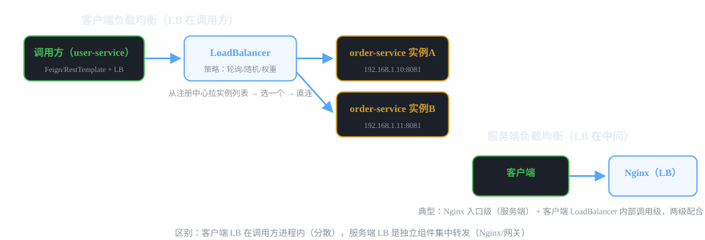
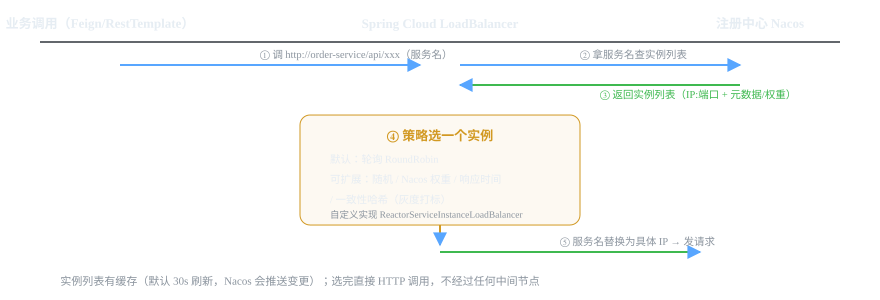

# 微服务组件 14 · 负载均衡 Spring Cloud LoadBalancer

> 服务名解析成"具体调哪个实例"，这就是客户端负载均衡干的活。Ribbon 退役后，Spring Cloud 官方用 LoadBalancer 接棒。
>
> 技术栈：Spring Cloud 2021.0.x LoadBalancer（替代 Ribbon）· 轮询默认 · 可自定义策略

## 目录
1. 是什么 / 解决什么问题
2. 核心原理
3. 核心概念表
4. 代码示例
5. 面试题与回答
6. 小结与口诀

---

## 1. 是什么 / 解决什么问题

**负载均衡**解决：目标服务有 N 个实例，请求到底发给谁？两种形态：

### 1.1 客户端负载均衡 vs 服务端负载均衡



| 对比项 | 客户端负载均衡（LoadBalancer） | 服务端负载均衡（Nginx/网关） |
|---|---|---|
| 位置 | 调用方进程内（分散式） | 独立组件（集中式） |
| 实例列表 | 从注册中心动态拉取 | 配置 upstream（可脚本动态） |
| 单点 | 无（调用方各自为政） | 有（LB 挂了全挂，需高可用） |
| 场景 | 服务间的内部调用（Feign） | 入口流量、外部请求 |
| 典型 | Spring Cloud LoadBalancer | Nginx、Gateway 的 lb:// |

> **理解关键：** Feign/Gateway 里的 `lb://order-service` 前缀，就是交给客户端 LoadBalancer：拿服务名 → 查实例 → 选一个 → 直连。**调用不经过任何中间节点**，这就是"客户端"的含义。

### 1.2 没有负载均衡会怎样？

- 服务 3 个实例，请求永远打第一个——**其他机器闲置、第一台被打爆**。
- 实例挂了，调用方还在发——直到注册中心剔除才恢复。
- 无法做灰度（权重分流）和故障转移（重试到其他实例）。

---

## 2. 核心原理

### 2.1 一次调用的完整流程



1. 业务代码写 `http://order-service/api/xxx`（Feign 的 name 或 RestTemplate 的 URL）。
2. LoadBalancer 从注册中心（Nacos DiscoveryClient）拿 order-service 的实例列表。
3. 列表有**缓存**（约 30s 定时刷新，Nacos 变更也会触发更新）。
4. 按策略（默认**轮询 RoundRobin**）选一个实例。
5. 把服务名替换成 `IP:端口`，发真正的 HTTP 请求。

### 2.2 Ribbon 为什么被移除，换成 LoadBalancer？

- Ribbon 是 Netflix 组件，2018 年后停止维护，Spring Cloud 2020 起进入维护模式、2021 移除。
- 官方推出 **Spring Cloud LoadBalancer**：轻量、响应式（Reactive）设计、易于自定义。
- 对业务无感：Feign、RestTemplate 的 lb:// 用法完全不变，只是底层换了实现。

### 2.3 实例列表从哪来？怎么更新？

- **ServiceInstanceListSupplier** 是实例列表的来源抽象：`DiscoveryClientServiceInstanceListSupplier`（从 Nacos/注册中心拉）。
- 默认**缓存 30 秒**（CachingServiceInstanceListSupplier），并监听注册中心的变更推送，尽量拿到"活"的列表。
- 想调刷新频率/关闭缓存：自定义 ServiceInstanceListSupplier 的配置。

### 2.4 负载策略（默认轮询，其余自定义）

| 策略 | 行为 | 实现方式 |
|---|---|---|
| 轮询（默认） | 列表循环轮流 | RoundRobinLoadBalancer |
| 随机 | 随机选 | 自定义 |
| **Nacos 权重** | 按 Nacos 控制台设置的实例权重 | 自定义（读实例元数据 weight） |
| 一致性哈希 | 同一来源固定实例 | 自定义 |
| 最小响应时间 | 选响应快的 | 自定义 |

> 面试一句话：**LoadBalancer 的策略是可插拔的**，实现 `ReactorServiceInstanceLoadBalancer` 接口即可；灰度加权一般结合 Nacos 权重元数据自定义。

---

## 3. 核心概念表

| 概念 | 说明 |
|---|---|
| lb:// 前缀 | Feign/Gateway 里的服务名寻址写法 |
| 客户端负载均衡 | 调用方进程内选实例，无中间节点 |
| ServiceInstanceListSupplier | 实例列表来源（从注册中心拉取） |
| ReactorServiceInstanceLoadBalancer | 负载策略接口（响应式），默认轮询 |
| RoundRobin | 默认轮询策略 |
| 实例缓存 | 默认 30s 刷新 + 注册中心变更推送 |
| Nacos 权重 | 控制台/元数据设置实例权重，灰度用 |
| Ribbon | 老一代客户端 LB（Netflix，已停更移除） |

---

## 4. 代码示例

> 技术栈：Spring Boot 2.7 + Spring Cloud 2021.0.x（LoadBalancer 默认集成，无需额外依赖即可用轮询）。

### 4.1 依赖（如果项目没有 loadbalancer，显式引入）

```xml
<dependency>
    <groupId>org.springframework.cloud</groupId>
    <artifactId>spring-cloud-starter-loadbalancer</artifactId>
</dependency>
<!-- 配合 Nacos 服务发现 -->
<dependency>
    <groupId>com.alibaba.cloud</groupId>
    <artifactId>spring-cloud-starter-alibaba-nacos-discovery</artifactId>
</dependency>
```

### 4.2 RestTemplate 用例（@LoadBalanced 开启实例选择）

```java
@Bean
@LoadBalanced   // 关键：给 RestTemplate 挂上 LoadBalancer，才能识别 http://服务名
public RestTemplate restTemplate() {
    return new RestTemplate();
}

// 使用：URL 写服务名，LB 自动选实例
String json = restTemplate.getForObject("http://order-service/order/1", String.class);
```

### 4.3 自定义策略：Nacos 权重优先（结合灰度）

```java
@Configuration
public class CustomLoadBalancerConfig {

    /**
     * 自定义负载均衡策略：优先按 Nacos 实例权重选择（weight 0~10000）
     * 权重 = Nacos 控制台可调 → 灰度发布时把新版本实例权重调小
     */
    @Bean
    public ReactorLoadBalancer<ServiceInstance> roundRobinLoadBalancer(
            ObjectProvider<ServiceInstanceListSupplier> serviceInstanceListSupplierProvider,
            Environment environment) {
        String serviceId = environment.getProperty(LoadBalancerClientFactory.PROPERTY_NAME);
        return new RandomWeightLoadBalancer(
                serviceInstanceListSupplierProvider, serviceId);
    }
}

/**
 * 简化版：随机选一个，但按权重加权（Nacos 实例元数据里的 weight）
 */
public class RandomWeightLoadBalancer implements ReactorServiceInstanceLoadBalancer {

    private final ObjectProvider<ServiceInstanceListSupplier> supplierProvider;
    private final String serviceId;

    public RandomWeightLoadBalancer(ObjectProvider<ServiceInstanceListSupplier> sp, String sid) {
        this.supplierProvider = sp;
        this.serviceId = sid;
    }

    @Override
    public Mono<Response<ServiceInstance>> choose(Request request) {
        // 1. 拿实例列表（带缓存的 supplier）
        ServiceInstanceListSupplier supplier = supplierProvider
                .getIfAvailable(() -> new DiscoveryClientServiceInstanceListSupplier(serviceId));
        return supplier.get(request).next().map(instances -> {
            if (instances.isEmpty()) {
                return new Response<>(null);   // 无可用实例
            }
            // 2. 加权随机选实例（重点：读实例元数据的 weight 做加权）
            double total = instances.stream()
                    .mapToDouble(i -> Double.parseDouble(
                            i.getMetadata().getOrDefault("weight", "1"))).sum();
            double r = Math.random() * total;
            for (ServiceInstance in : instances) {
                r -= Double.parseDouble(in.getMetadata().getOrDefault("weight", "1"));
                if (r <= 0) {
                    return new Response<>(in);
                }
            }
            return new Response<>(instances.get(instances.size() - 1));
        });
    }
}
```

> ⚠️ **注意点：** 自定义策略要挂在正确的配置类上：用 `@LoadBalancerClient(name="order-service", configuration=CustomLoadBalancerConfig.class)` 声明只对某个服务生效，或全局配置。

### 4.4 直接使用 LoadBalancerClient（命令式，少用但要知道）

```java
@Service
public class OrderService {

    @Autowired
    private LoadBalancerClient loadBalancerClient;   // 传统命令式客户端

    public String callOrder(Long id) {
        // 手动选实例
        ServiceInstance instance = loadBalancerClient.choose("order-service");
        String url = "http://" + instance.getHost() + ":" + instance.getPort() + "/order/" + id;
        return new RestTemplate().getForObject(url, String.class);
    }
}
```

---

## 5. 面试题与回答

### Q1：客户端负载均衡和服务端负载均衡有什么区别？

**答：** 核心区别在"负载均衡逻辑放哪"。**客户端 LB**：调用方进程内（Feign/LoadBalancer），从注册中心拿实例列表、按策略选一个、**直接连实例**——优点是无单点、无中间跳转、实例变化感知快（注册中心推送），缺点是每个调用方都要实现；典型是 Spring Cloud LoadBalancer。**服务端 LB**：独立组件集中转发（Nginx、网关），客户端只认识 LB 一个地址——优点是调用方简单，但 LB 是单点要搞高可用，且多一跳网络。真实架构两者配合：**Nginx 管外部入口流量（服务端），LoadBalancer 管微服务内部调用（客户端）**。

### Q2：LoadBalancer 的工作原理是什么？

**答：** 三步：① **拿列表**：ServiceInstanceListSupplier 从注册中心（Nacos 的 DiscoveryClient）拉取目标服务的实例列表，默认带 30s 缓存 + 注册中心变更推送；② **选实例**：ReactorServiceInstanceLoadBalancer（默认轮询 RoundRobin）按策略从列表选一个；③ **直连**：把 URL 里的服务名换成 实例的 IP:端口，发真正的 HTTP 请求。调用方（Feign/RestTemplate）通过 lb:// 前缀或 @LoadBalanced 把请求交给它处理。整个过程在调用方进程内完成，不经过任何中间节点。

### Q3：Ribbon 为什么被移除了？RuoYi/老项目里怎么办？

**答：** Ribbon 是 Netflix 组件，Netflix 2018 年起停止维护，Spring Cloud 2020.0（Ilford）将 Ribbon 移入维护模式、2021.0 起从发行版移除。官方替代是 **Spring Cloud LoadBalancer**：更轻、响应式（Reactive）设计、策略可插拔，且对业务**透明**——Feign、RestTemplate 的写法完全不变，只是底层实现换了。老项目升级：去掉 ribbon 依赖、引入 spring-cloud-starter-loadbalancer 即可，通常无需改业务代码；如果你项目还在用 Ribbon 配了自定义 IRule，需要迁移成 LoadBalancer 的自定义策略。面试重点是"知道替换、知道透明迁移"。

### Q4：LoadBalancer 默认什么策略？怎么自定义？

**答：** 默认 **RoundRobinLoadBalancer 轮询**（列表循环取）。自定义方法：实现 `ReactorServiceInstanceLoadBalancer` 接口（如加权随机、一致性哈希、按响应时间），通过 `@LoadBalancerClient(name="服务名", configuration=策略配置类)` 对指定服务生效，或全局配置覆盖。配置类注意：包含自定义 LoadBalancer 的 @Configuration 类**不要被主启动类的 @ComponentScan 扫到**（否则会全局生效），要放进独立包并由 @LoadBalancerClient 显式引用——这是个经典坑，面试说出来加分。

### Q5：Nacos 的实例权重怎么参与负载均衡？（灰度怎么做）

**答：** Nacos 实例注册时有元数据（weight 0~10000，控制台可直接调）。Spring Cloud 默认 LoadBalancer 不读这个权重（纯轮询），要生效需要**自定义策略**：按实例元数据里的 weight 做加权随机/加权轮询（见代码 4.3）。这样灰度发布时：新版本实例权重调成 100（10%），老版本调 900（90%），流量按比例走；验证没问题逐步调高新版本权重直到 100% 完成发布。对比 02 篇还可以补充：Nacos 控制台权重只对"用 Nacos 自带负载均衡/网关"生效，服务间 Feign 调用要配合自定义 LoadBalancer 策略。

### Q6：实例列表是缓存的吗？实例下线多久能感知？

**答：** 是缓存的。LoadBalancer 的 ServiceInstanceListSupplier 默认有 **CachingServiceInstanceListSupplier，缓存约 30 秒**，同时 Nacos 会通过 gRPC 推送实例变更（见 02 篇），两者结合让列表尽量新。感知路径：实例心跳停止 → Nacos 15s 标记不健康、30s 剔除 → 推送/30s 缓存刷新 → LoadBalancer 拿新列表 → 不再选下线实例，**最坏约 30~60 秒**。所以调用侧还要配**重试**（Failover 到其他实例）和**超时**，把感知窗口内的失败消化掉——负载均衡和容错是配套的。

### Q7：LoadBalancer 选中的实例恰好挂了，请求会失败吗？（容错）

**答：** 可能失败——列表有 30s 缓存，实例在下线感知前被选中的概率存在。处理分三层：① **重试**：Spring Cloud 的 Retry 支持（spring.cloud.loadbalancer.retry.enabled=true），对同一服务尝试其他实例；② **熔断降级**：配合 Sentinel/Resilience4j，多次失败熔断不再选它（见 05 篇）；③ **注册中心剔除**：Nacos 剔除下线实例后列表自然不再包含。面试口径："**LB 保证分发，不保证成功**——重试 + 熔断 + 注册中心健康检查一起上，才算完整的高可用调用。"

### Q8：LoadBalancer 和 Gateway 的 lb:// 是什么关系？

**答：** 是同一种东西的两个使用位置：**Gateway 路由的 uri 写 lb://order-service**，转发时也是通过 LoadBalancer 从注册中心选 order-service 的实例再发请求——网关内部的转发用了客户端负载均衡；**Feign/RestTemplate 的 lb://（或 @LoadBalanced）** 是服务间调用用 LoadBalancer。两者共享同一套 LoadBalancer 机制，只是调用方不同。记住：**lb:// = "用 LoadBalancer 解析服务名"**，出现在网关路由和服务调用两处，底层都是注册中心 + 实例选择。

### Q9：WebClient 怎么用 LoadBalancer？（响应式场景）

**答：** 响应式栈（WebFlux）用 WebClient 替代 RestTemplate：引入 spring-cloud-starter-loadbalancer 后，WebClient 的 Builder 上加 `.filter(new LoadBalancerExchangeFilterFunction(loadBalancerClientFactory))`，URL 里写服务名 `http://order-service/xxx` 即可自动选实例。和 RestTemplate 的 @LoadBalanced 等价，但返回 Mono/Flux（非阻塞）。面试一句带过即可："WebFlux 项目用 WebClient + LoadBalancerExchangeFilterFunction，等价于 RestTemplate 的 @LoadBalanced。"

### Q10：你们项目里负载均衡用在哪里？（结合你的项目）

**答：** 两处：① **服务间调用**：Feign 的 name="order-service" 由 Spring Cloud LoadBalancer 解析，默认轮询，多实例自动分摊——这是最基本的使用；② **网关**：路由 uri 用 lb://order-service，网关转发也走 LoadBalancer。灰度场景：自定义了加权策略读取 Nacos 实例权重，控制台调权重实现流量按比例切换。面试这样讲：点明"启动即用轮询 + 灰度时自定义权重策略 + 与网关 lb:// 关系"，说明你不只会用，还清楚它挂在哪一层。

---

## 6. 小结与口诀

**一句话定位：** 客户端负载均衡 = 调用方自己从注册中心挑实例直连：无中间节点、无单点、感知快；Ribbon 退役，LoadBalancer 接棒，写法没变。

**口诀：** "服务名换实例，列表缓存三十秒；默认轮询可插拔，权重灰度写策略；Nacos 推送变更快，重试熔断补容错；网关 Feign 都用它，lb 前缀是暗号。"

**三大坑：**
1. 自定义策略配置类被 @ComponentScan 扫到 → 全局生效（要放独立包用 @LoadBalancerClient 指定）
2. 列表有 30s 缓存，"选到刚下线的实例"要靠重试/熔断兜底
3. Nacos 控制台权重默认对 LoadBalancer 不生效，要自定义策略读元数据

**下一跳：** 数据量大了单库扛不住，下一篇讲 **ShardingSphere 分库分表**。

---

*微服务组件文档系列 · 14/16 · 技术栈 Spring Cloud 2021.0.x LoadBalancer + Nacos 2.2 · 生成于 2026-09-19*