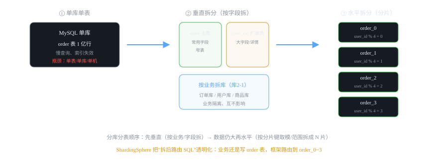
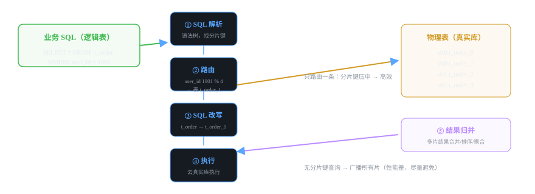

# 微服务组件 15 · 分库分表 ShardingSphere

> 单表数据过亿，索引再快也扛不住。分库分表把数据拆到 N 片，ShardingSphere 把"拆后路由"透明化——业务还是写逻辑表，框架帮你找物理表。
>
> 技术栈：ShardingSphere-JDBC 5.x · 分片 + 读写分离 · 分布式 ID

## 目录
1. 是什么 / 解决什么问题
2. 核心原理
3. 核心概念表
4. 代码示例
5. 面试题与回答
6. 小结与口诀

---

## 1. 是什么 / 解决什么问题

**分库分表**：数据量大到单库单表成为瓶颈时，把数据拆到多个库、多张表。**ShardingSphere** 是 Apache 开源的分库分表中间件，让你写 `t_order`（逻辑表），框架路由到真实的 `t_order_0/1/2/3`。

### 1.1 什么时候该分库分表？（先有判断力）

| 信号 | 说明 |
|---|---|
| 单表数据量 **千万级~亿级** | 索引层级变深、B+ 树 IO 变多，即使命中索引也慢 |
| 单库 **TPS/QPS 打满** | 连接数、IO、CPU 到瓶颈 |
| 磁盘/容量不够 | 单实例存储上限 |
| 冷热数据混杂 | 历史数据拖累热数据查询 |

> ⚠️ **面试重要结论：先优化再拆分！** 分库分表是"最后手段"：先做索引优化、冷热分离（归档）、读写分离、缓存，都不行了才动分片——因为分片带来跨片查询、分布式事务、扩容迁移等一系列复杂度（见 2.4）。

### 1.2 垂直拆分 vs 水平拆分



- **垂直拆分**：按业务拆库（订单库/用户库/商品库），按字段拆表（主表 + 扩展表）。**先做这个**——业务天然隔离，实现简单。
- **水平拆分**：同一张表按分片键拆成 N 片（user_id % 4 → order_0~order_3），**每片数据量减少到 1/N**。这是"分库分表"通常指的部分。

---

## 2. 核心原理

### 2.1 一次分片查询的完整流程（五步）



1. **SQL 解析**：把业务 SQL 解析成语法树，识别表名和**分片键**（WHERE user_id = 1001）。
2. **路由**：user_id 1001 % 4 = 1 → 命中 `t_order_1`（也可能跨多片）。
3. **SQL 改写**：把逻辑表名 `t_order` 改写成物理表 `t_order_1`。
4. **执行**：去真实数据源执行。
5. **归并**：多片结果的合并/排序/分页/聚合（单片时直接返回）。

> **关键：分片键（Sharding Key）。** WHERE 里带分片键 → 精确路由单片，性能最好；不带分片键 → **广播到所有片再归并**（能查但要全表扫，性能差）——所以分片键的选择和使用习惯决定性能。

### 2.2 分片算法

| 算法 | 规则 | 优点 | 缺点 |
|---|---|---|---|
| **取模** | id % 4 → 均匀分布 | 数据均匀、实现简单 | 扩容要重新分配（2→4 要迁移） |
| **范围** | 按时间/ID 区间分片 | 扩容友好（加新片即可） | 热点不均（新数据集中最后一片） |
| 一致性哈希 | 哈希环 | 扩容影响小 | 实现复杂 |

> 业务常见组合：**订单按 user_id 取模**（均匀 + 单用户数据聚在同一片），**流水按时间范围**（热数据最近一片）。

### 2.3 分布式 ID（分片的前提）

分库分表后，数据库自增主键无法保证全局唯一（每张表都从 1 开始）。方案：
- **雪花算法（Snowflake）**：时间戳 + 机器 ID + 序列号 → 64 位自增 ID，趋势递增。ShardingSphere 内置（`SNOWFLAKE`）或 MyBatis-Plus 的 ID_WORKER。
- 其他：Redis 自增、UUID（不推荐作主键，乱序伤索引）。

### 2.4 分片带来的问题（面试必考，要有准备）

| 问题 | 说明 | 应对 |
|---|---|---|
| 跨片 JOIN | 两个分片表没法 join | 冗余字段、反范式设计、应用层组装 |
| 跨片聚合/分页 | ORDER BY + LIMIT 要先归并所有片 | 尽量带分片键；分页用游标 |
| 分布式事务 | 跨库写不能本地事务 | Seata（见 06 篇）或 MQ 最终一致 |
| 扩容迁移 | 取模分片从 4 扩到 8 要重新分布 | 停机迁移 / 双写 / 范围分片 |
| 全局主键 | 自增失效 | 雪花算法 |

### 2.5 绑定表 / 广播表（工程细节）

- **绑定表**：分片规则相同的一组表（t_order 和 t_order_item 都按 user_id 取模），join 时**保证落在同一片**，避免跨片 join。
- **广播表**：每个分片都放一份的字典表（如状态字典），join 不需要跨片。

### 2.6 读写分离（ShardingSphere 也管这个）

主库写、从库读：逻辑数据源配主从，ShardingSphere 把写 SQL 路由主库、读 SQL 路由从库（可选负载均衡策略 + hint 强制主库）。

---

## 3. 核心概念表

| 概念 | 说明 |
|---|---|
| 逻辑表 | 业务写的表名（t_order） |
| 物理表 | 真实的表（t_order_0/1/2/3） |
| 分片键 | 决定路由的字段（user_id） |
| 分片算法 | 取模 / 范围 / 一致性哈希 |
| 分布式 ID | 雪花算法等，全局唯一主键 |
| 绑定表 | 分片规则一致的关联表，join 不跨片 |
| 广播表 | 每片都有的字典表 |
| SQL 解析/路由/改写/归并 | 分片执行五步 |
| 读写分离 | 主写从读，ShardingSphere 透明路由 |
| ShardingSphere-JDBC / Proxy | JDBC 层嵌入式 / 独立代理层 |

---

## 4. 代码示例

> 技术栈：Spring Boot 2.7 + ShardingSphere-JDBC 5.2.x（嵌入式，直接替换数据源，无独立部署）。

### 4.1 依赖

```xml
<dependency>
    <groupId>org.apache.shardingsphere</groupId>
    <artifactId>shardingsphere-jdbc-core-spring-boot-starter</artifactId>
    <version>5.2.1</version>
</dependency>
```

### 4.2 application.yml：分片配置（order 按 user_id 取模分 4 表）

```yaml
spring:
  shardingsphere:
    datasource:
      names: ds0,ds1                     # 两个真实数据源（分库）
      ds0:
        type: com.zaxxer.hikari.HikariDataSource
        driver-class-name: com.mysql.cj.jdbc.Driver
        jdbc-url: jdbc:mysql://127.0.0.1:3306/order_db_0?useSSL=false
        username: root
        password: '123456'
      ds1:
        type: com.zaxxer.hikari.HikariDataSource
        driver-class-name: com.mysql.cj.jdbc.Driver
        jdbc-url: jdbc:mysql://127.0.0.1:3306/order_db_1?useSSL=false
        username: root
        password: '123456'
    rules:
      sharding:
        tables:
          t_order:
            actual-data-nodes: ds$->{0..1}.t_order_$->{0..1}   # 4 张物理表：ds0.t_order_0/1, ds1.t_order_0/1
            table-strategy:               # 分表策略：按 user_id 取模
              standard:
                sharding-column: user_id
                sharding-algorithm-name: order-inline
            key-generate-strategy:        # 主键：雪花算法全局唯一
              column: id
              key-generator-name: snowflake
        binding-tables:                   # 绑定表：t_order 和 t_order_item 分片规则一致，join 不跨片
          - t_order,t_order_item
        broadcast-tables: t_dict           # 广播表：每个分片都同步一份
        sharding-algorithms:
          order-inline:
            type: INLINE                  # 取模分片
            props:
              algorithm-expression: t_order_$->{user_id % 4}   # user_id % 4 → 0/1/2/3
          snowflake:
            type: SNOWFLAKE
    props:
      sql-show: true                      # 打印真实执行 SQL（排查路由对不对）
```

> 💡 **看懂效果：** 业务代码照常 `orderMapper.insert(order)` 写 `t_order`；插入时框架算 `user_id % 4` 落到对应物理表，主键自动雪花 ID。`sql-show: true` 能看到真实 SQL（`INSERT INTO t_order_2 ...`）。

### 4.3 分片键使用建议（口头面试加分）

```java
// ✅ 好：WHERE 带分片键 → 单片精确路由
SELECT * FROM t_order WHERE user_id = 1001 AND status = 1;

// ⚠️ 差：WHERE 不带分片键 → 广播所有片再归并（数据量大时很慢）
SELECT * FROM t_order WHERE status = 1 ORDER BY create_time LIMIT 10;

// 对策：必须全表扫的业务，单独建汇总表/搜索引擎（ES），别在主分片表上查
```

### 4.4 读写分离配置（分片 + 主从组合）

```yaml
rules:
  readwrite-splitting:
    data-sources:
      order_rw:
        write-data-source-name: ds0      # 主库（写）
        read-data-source-names: [ds1]    # 从库（读），可多个
        load-balancer-name: round_robin  # 读负载策略
```

> 效果：写 SQL 走主库 ds0，查 SQL 走从库 ds1。注意主从复制延迟（刚写完就读从库可能读不到，重要场景用 Hint 强制走主库）。

---

## 5. 面试题与回答

### Q1：什么时候该分库分表？怎么判断？

**答：** 两个判断维度：**数据量**——单表千万到亿级、索引深度和 IO 明显恶化；**写入/查询压力**——单库 TPS/QPS 到瓶颈、连接数打满、磁盘不够。但面试重点强调顺序：**先做基础优化再分片**——索引优化 → 冷热数据归档拆分 → 读写分离 → 缓存；都解决不了才上分库分表。因为分片引入跨片 join、分布式事务、扩容迁移三大复杂度，属于"成本最高的优化手段"。给面试官的口径："分库分表是最后手段，能用缓存/归档/读写分离解决就别分片。"

### Q2：垂直拆分和水平拆分什么区别？先做哪个？

**答：** **垂直**：按业务拆库（订单/用户/商品库）、按字段拆表（宽表拆主表 + 扩展表），解决的是"单库压力"和"字段冗余"，实现相对简单、业务天然隔离——**先做垂直**。**水平**：同一张表按分片键拆成多片（user_id % 4），解决"单表数据量"——数据量仍大时才做。现实中：垂直拆分是常规架构手段（RuoYi 拆业务模块也是类似思想），水平分片才是需要中间件和高成本运维的大动作。面试答"垂直先行，水平兜底"最稳。

### Q3：分片键怎么选？为什么？

**答：** 选高频查询的等值条件字段，标准：① **查询最频繁**（WHERE 里最常见的字段），否则大部分查询不带分片键 → 广播全片扫描；② **数据分布均匀**（user_id、order_id 这类业务主键），避免某片过热；③ **和业务聚合性一致**——如订单按 user_id 分片，"查某用户的所有订单"天然落在同一片，不需要跨片归并。反例：按 status 分片（分布不均）、按 create_time 取模（语义差）。最终答案通常是：**主查键 = 用户维度的 user_id 或业务主键 order_id**。

### Q4：取模分片和范围分片怎么选？扩容怎么办？

**答：** **取模**：数据均匀、实现简单，但扩容要重新分布（4 片 → 8 片，原 4 片的每个数据要重算位置，涉及数据迁移/双写）；**范围**（按时间/ID 区间）：扩容只需加新片（新数据进新片），但热点不均（最新数据集中在最后一片）。选型：**均匀 + 已有明确取模键**用取模；**时间序数据（流水/日志）+ 防扩容麻烦**用范围。扩容实操：① 停机迁移（低峰期导出重算）；② 双写方案（新旧都写，对账后切流）；③ 用一致性哈希减少迁移量。面试答出"取模均匀但扩容难、范围扩容易但热点不均、一致性哈希折中"即可。

### Q5：分片之后跨片 JOIN、分页、聚合怎么办？

**答：** 三个对策：① **跨片 JOIN**——尽量避免：用**绑定表**（分片规则一致的表 join 时保证同片）、**冗余字段**（把要 join 的字段冗余进查询表，反范式）、或应用层拆两次查询组装（查订单 → 批量查明细）。② **跨片分页**——ORDER BY+LIMIT 要所有片各自排序归并，深分页很贵：业务上用"按顺序条件查"+ 游标分页（where id > lastId limit 20），别用 `LIMIT 100000,20`。③ **聚合**——ShardingSphere 会做归并，但聚合 SQL 要尽量带分片键缩小范围。面试口径："分片优先保证单片查询，跨片需求用反范式 + 应用层组装 + 游标分页。"

### Q6：分布式 ID 方案有哪些？为什么用雪花算法？

**答：** 分片后数据库自增失效（每片都从 1 开始，会撞主键），方案：① **雪花算法（Snowflake）**：64 位 = 时间戳(41) + 机器(10) + 序列(12)，全局唯一 + **趋势递增**（对索引友好）+ 本地生成（无网络依赖），是主流（ShardingSphere/MyBatis-Plus 内置）；② Redis 自增/号段模式（Leaf）：要维护 Redis，有网络依赖；③ UUID：全局唯一但**乱序**，做主键会让 B+ 树频繁分裂，性能差，慎用。面试结论："雪花算法是分片环境下分布式主键的事实标准，趋势递增是关键——它贴近数据库自增索引的查询习惯。"

### Q7：ShardingSphere-JDBC 和 ShardingSphere-Proxy 有什么区别？怎么选？

**答：** 两种形态：**JDBC（嵌入式）**：以 jar 形式替换应用的数据源，在应用内做解析/路由——性能好（无网络跳）、部署简单（改依赖+配置），**但对应用侵入**（JVM 里）；**Proxy（独立代理）**：部署独立的代理服务（类似 MySQL 前置代理），应用连它就完事——**对应用透明**（SQL 兼容性好，支持异构语言）、集中管理权限，**但多一跳网络**、性能略有损耗。选型：Java 应用团队 → 用 **JDBC 形态**（主流）；多语言/不想改应用、需要集中管控 → Proxy。RuoYi 系项目一般 JDBC 形态。

### Q8：读写分离怎么配置？有什么坑？

**答：** 在 ShardingSphere 里配 readwrite-splitting 数据源：write 主库 + read 从库列表 + 读负载策略（轮询/随机），框架自动把写 SQL（INSERT/UPDATE/DELETE）路由主库、读 SQL 路由从库。坑：① **主从复制延迟**——刚写入立刻读从库可能读不到旧数据（重要场景强制主库：HintManager.setPrimaryRouteOnly() 或事务内自动走主库）；② **事务内必须主库**（框架默认事务中读也走主库，正确）；③ 从库挂了要有降级（ShardingSphere 支持健康检查）。面试答出"延迟读 + 事务内走主库强制"说明亲手配过。

### Q9：分片后分布式事务怎么办？

**答：** 分片涉及多库写 = 分布式事务：① 强实时场景用 **Seata AT**（见 06 篇）：业务零侵入，一阶段本地提交 + undo_log 补偿——但要注意分片和全局锁的叠加性能；② 可异步场景用 **MQ 最终一致**（事务消息 + 消费幂等）；③ 尽量**避免跨片写**：绑定表设计 + 按 user_id 分片让"单用户操作"落在单片，多数写操作本来就不跨库。面试口径："分片设计时就让多数事务单片化（按业务主键分片），真正跨片的用 Seata/MQ 按需上。"

### Q10：你们项目分库分表了吗？（结合你的项目，诚恳回答）

**答：** 分情况：如果没做，说"**现在的数据量还没到需要分片的程度**（表千万以下，索引 + 缓存 + 读写分离兜得住），但做过分片方案设计：订单类按 user_id 取模 4 片 + 雪花 ID，流水按时间范围分片，绑定表 t_order/t_order_item 同规则，跨片需求用冗余字段和游标分页规避——到了量可以直接切"——**体现"知道什么时候不做、方案已备好"的判断力**，比吹牛用过更可信。如果用过，按 2.1 的五步讲路由和归并，讲 sql-show 排查路由，讲分片键使用规范。

---

## 6. 小结与口诀

**一句话定位：** 分库分表把单表数据切成 N 片，ShardingSphere 把路由透明化（逻辑表 → 物理表），代价是跨片 join/事务/扩容三大复杂度——所以"最后手段"。

**口诀：** "先垂直后水平，先优化再分片；分片键选主查键，取模均匀范围扩；SQL 五步解析路由改写执行归并；绑定表防跨片 join，雪花 ID 续主键；跨片事务上 Seata，能用缓存别分片。"

**三大坑：**
1. 查询不带分片键 → 广播全片，性能比不分片还差
2. 分片后再想改分片算法（扩容）是大工程，设计阶段定死
3. 自增主键直接失效，必须换雪花 ID

**下一跳：** 最后一个组件：**Docker + K8s 容器化**——微服务怎么打包和编排。

---

*微服务组件文档系列 · 15/16 · 技术栈 Spring Boot 2.7 + ShardingSphere-JDBC 5.2 · 生成于 2026-09-19*