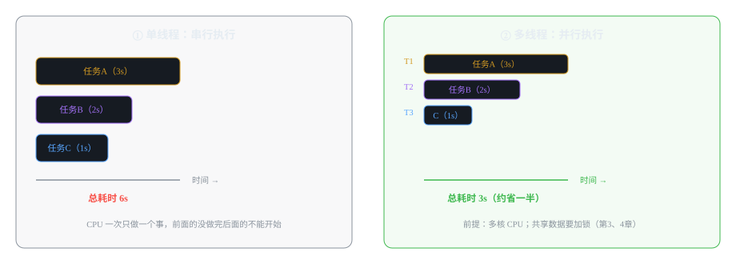
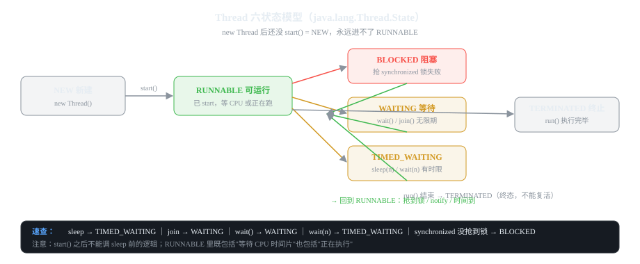

# 第1章 多线程基础：线程状态、启动与生命周期

> 一句话讲清：**线程 = 操作系统里一条能独立执行的指令流；JVM 把 OS 线程包装成 `Thread` 对象，
> 每个线程有自己的栈、程序计数器、局部变量表，但共享堆和方法区。**
> 本章目标：讲清线程六状态流转、四种启动方式、生命周期方法、守护线程——这是后续所有章节的地基。

## 1.1 为什么要多线程

**单线程一次只能做一件事；CPU 有核，能同时干，为什么要闲置？**


*图 1-1：同样是 3 个任务，单线程串行 6s，多线程并行约 3s*

三个真实收益：

1. **提升吞吐**：多核 CPU 充分利用（IoT 平台同时消费 Kafka + 处理入库 + 响应查询）
2. **异步解耦**：主线程不用等慢操作（HTTP 调外部 API 时，主线程可继续干别的）
3. **响应性**：Web 服务器一个连接一线程，互不阻塞

**核心前提（面试必答）：多线程只有在"多核 CPU"上才真正并行；单核上是分时调度（快速切换，看起来像并行，实际是伪并行）。**

## 1.2 Thread.State：六状态模型（★ 面试必考）

JVM 的 `java.lang.Thread.State` 枚举只有 6 个值，**比"操作系统线程状态"少一个"就绪"**（这是高频追问）。


*图 1-2：从 NEW 到 TERMINATED 的完整流转；注意 WAITING / TIMED_WAITING / BLOCKED 三种中间状态都通向 RUNNABLE*

### 每个状态的触发条件

```java
Thread t = new Thread(() -> {});   // NEW 新建：new 出来，还没 start()

t.start();                          // → RUNNABLE 可运行
// RUNNABLE 包含两种情况：
//   ① 正在 CPU 上执行
//   ② 已准备好，在等 CPU 时间片（就绪）
// 注意：这里没有"就绪"状态！JVM 把"等 CPU"也归到 RUNNABLE

Thread.sleep(1000);                 // → TIMED_WAITING 限时等待
obj.wait();                         // → WAITING 无限期等待（需要 notify 唤醒）
obj.wait(1000);                     // → TIMED_WAITING
obj.join();                         // → WAITING 等目标线程结束
synchronized (lock) {               // 抢不到锁 → BLOCKED
}

// run() 执行完 / 抛出未捕获异常 → TERMINATED 终止（终态，不能复活）
```

### 状态机代码：把六个状态全部走一遍

```java
public class ThreadStateDemo {
    private static final Object LOCK = new Object();

    public static void main(String[] args) throws InterruptedException {
        // ① NEW → RUNNABLE
        Thread t = new Thread(() -> {
            synchronized (LOCK) {
                System.out.println("1. 我拿到了锁，状态：" + Thread.currentThread().getState());
                // ② RUNNABLE → TIMED_WAITING
                try { Thread.sleep(100); } catch (InterruptedException e) { }
                // ③ TIMED_WAITING → RUNNABLE（sleep 时间到）
                System.out.println("2. sleep 结束，状态：" + Thread.currentThread().getState());
                // ④ RUNNABLE → WAITING
                try { LOCK.wait(); } catch (InterruptedException e) { }
                // ⑤ WAITING → RUNNABLE（被 notify）
                System.out.println("3. wait 被唤醒，状态：" + Thread.currentThread().getState());
            }
            // ⑥ RUNNABLE → TERMINATED（方法返回）
        });

        System.out.println("0. 创建后未 start，状态：" + t.getState());   // NEW
        t.start();
        Thread.sleep(20);
        synchronized (LOCK) { LOCK.notify(); }                          // 唤醒 t
        t.join();                                                        // 主线程等 t 结束
        System.out.println("4. t 结束，状态：" + t.getState());          // TERMINATED
    }
}
```

**JVM 状态 vs OS 状态的差别（★ 高频追问）：**

| 维度 | JVM Thread.State | OS 线程状态 |
|------|-----------------|-------------|
| 数量 | 6 个 | 7 个（多了 READY） |
| 就绪 | 归入 RUNNABLE | 独立 READY 状态 |
| 阻塞 | BLOCKED 专指抢锁 | 广义阻塞含 I/O、信号、锁等 |

**追问：BLOCKED 和 WAITING 的区别？**
BLOCKED 专指"抢 synchronized 锁失败"，会等锁释放；
WAITING 是主动放弃 CPU 等通知（wait/join/park），要 notify/unpark 才醒。
**这是面试必问，背下来。**

## 1.3 四种启动线程的方式

### 方式 1：继承 Thread（不推荐，单继承限制）

```java
class MyThread extends Thread {
    @Override
    public void run() {
        System.out.println("线程名：" + getName());
    }
}
// 启动
new MyThread().start();
```

### 方式 2：实现 Runnable（推荐，主流写法）

```java
class MyTask implements Runnable {
    @Override
    public void run() {
        // 业务逻辑
    }
}
// 启动
new Thread(new MyTask()).start();
// 优势：可被多个线程共享同一份任务；可把任务扔进线程池
```

### 方式 3：实现 Callable + FutureTask（★ 需要返回值时用）

```java
Callable<Long> callable = () -> {
    Thread.sleep(100);
    return 42L;   // 有返回值，可抛受检异常
};
FutureTask<Long> task = new FutureTask<>(callable);
new Thread(task).start();

Long result = task.get();   // 阻塞直到任务完成，拿到返回值；可能抛 ExecutionException
```

**Runnable vs Callable（★ 必考）：**

| 维度 | Runnable | Callable |
|------|----------|----------|
| 返回值 | 无 | 有（`V call()`） |
| 异常 | 不能抛受检异常 | 可以抛 |
| 启动 | `new Thread(r).start()` | 必须包进 `FutureTask` 再交线程 |
| 使用场景 | 纯动作（发消息、刷数据） | 需要拿结果（算总和、查多表） |

### 方式 4：线程池（生产唯一推荐，第6章详解）

```java
ExecutorService pool = Executors.newFixedThreadPool(4);   // ⚠ 生产禁止用
pool.submit(new MyTask());
```

## 1.4 生命周期方法：哪些能用、哪些坑

```java
// ✅ 推荐
start()        // 启动线程，最多调一次，重复调抛 IllegalThreadStateException
run()          // 业务逻辑入口（start 内部会调它）
join()         // 阻塞当前线程，等目标线程结束
interrupt()    // 中断标记（不等于杀线程，见下）
isAlive()      // 是否未终止

// ⚠ 危险/不推荐
stop()         // 已废弃：直接终止，不释放锁、不清理资源
suspend()      // 已废弃：可能造成死锁（A suspend 后还持有锁，B 拿不到）
resume()       // 已废弃：同上
```

### `isAlive()` 与 `sleep()` 的真实语义

```java
// 一个常见追问：sleep 0 会怎么样？
Thread.sleep(0);   // 不睡眠，但触发线程调度检查（让出时间片）
                   // 用于让出 CPU 给其他线程（自旋时偶尔 sleep(0) 是常见技巧）
```

### `interrupt()` 不是"杀线程"，是"请求中断"

```java
Thread worker = new Thread(() -> {
    try {
        while (!Thread.currentThread().isInterrupted()) {
            doWork();                 // 业务循环
            Thread.sleep(100);        // 可能抛 InterruptedException
        }
    } catch (InterruptedException e) {
        // ★ 规范做法：捕获后要么"重新设置中断标记"要么"返回/终止"
        Thread.currentThread().interrupt();   // 恢复标记（推荐）
        return;                           // 或：放弃
    }
});
worker.start();

// 想停它
worker.interrupt();   // ① 设置中断标记；② 如果它在 sleep/wait/join，会抛 InterruptedException
// 注意：业务代码不检查 isInterrupted，interrupt 就"白发了"——这是 interrupt 的常见误解
```

**面试追问："怎么优雅停止一个线程？"**
答："设一个 volatile 的 boolean 标志位，循环里检查；或调 interrupt() 并让线程在 catch 里退出。
不要用 stop() / suspend()（已废弃）——它们会造成资源不释放、锁不归还。"

## 1.5 线程优先级与守护线程

```java
// 线程优先级：1~10，默认 NORM_PRIORITY=5
// 只是"调度倾向"，不是保证——优先级高不代表一定先跑
Thread t = new Thread(() -> {});
t.setPriority(Thread.MAX_PRIORITY);   // 10

// 守护线程：后台工作线程，所有用户线程结束后自动终止
Thread daemon = new Thread(() -> {
    // 比如日志轮转、缓存清理
    System.out.println("我在跑");
});
daemon.setDaemon(true);      // ★ 必须在 start() 之前设置
daemon.start();
```

**守护线程的坑（高频）：** `daemon.setDaemon(true)` 只能在 start 之前调，
在已启动的线程上调会抛 `IllegalThreadStateException`。生产代码里守护线程要谨慎：
它不会等 JVM 关闭钩子（ShutdownHook）执行，所以关键清理逻辑不能放守护线程里。

## 1.6 线程局部变量 ThreadLocal（★ 重要，独立成节）

```java
// 每个线程各自一份的"局部变量"，用 Map<Thread, Object> 实现（存在 Thread 类里）
private static final ThreadLocal<String> USER = new ThreadLocal<>();

// 用法：线程 A 设的值，线程 B 看不到
public void handler() {
    USER.set("userId=" + userId);        // 当前线程存
    // ... 业务里随时 USER.get() 取
    // 关键：用完一定要 remove()，否则线程池场景下会内存泄漏
    USER.remove();
}
```

**ThreadLocal 的坑（★ 高频追问）：**

1. **必须 remove()**：线程池里线程会被复用，如果 set 之后不 remove，下一个请求拿到上一个请求的值。
   这就是为什么 Servlet 规范里 filter 要成对 set/remove。
2. **内存泄漏**：ThreadLocalMap 的 key 是弱引用（WeakReference），value 是强引用。
   如果不再访问 ThreadLocal 但没 remove，key 会被 GC，value 还留在 map 里（"泄漏"），
   所以**手动 remove 是铁律**。
3. **不要跨线程传值**：ThreadLocal 顾名思义是"线程局部"，线程 A 存的，线程 B 拿不到——
   跨线程要用 InheritableThreadLocal（继承）或显式参数传递。

**结合 IoT 项目：请求级 user 上下文**（Spring 里用 ThreadLocal 存登录用户 id，
Filter 里 set，Controller 里 get，Filter finally 里 remove）——这是企业项目最常见的用法。

## 1.7 常见坑汇总

| # | 坑 | 现象 | 解决 |
|---|----|------|------|
| 1 | 直接调 run() | 不启动新线程，只在主线程里跑 | 必须调 start() |
| 2 | 重复 start() | IllegalThreadStateException | start 一次只能调一次 |
| 3 | stop()/suspend() | 死锁、资源不释放 | 已废弃，用 volatile 标志位或 interrupt |
| 4 | interrupt 不生效 | 线程没停 | 业务循环必须检查 isInterrupted 或 catch InterruptedException |
| 5 | 忘记 ThreadLocal.remove | 线程池串数据 | set 后立即用，finally 里 remove |
| 6 | daemon 启动后才 setDaemon | IllegalThreadStateException | setDaemon 必须在 start 之前 |
| 7 | 以为高优先级会先跑 | 优先级不生效 | 优先级只是调度倾向，不保证 |

## 1.8 面试自测（追问链）

**Q1:JVM 线程有几个状态？和 OS 线程有啥区别？**
一句话:"6 个：NEW、RUNNABLE、BLOCKED、WAITING、TIMED_WAITING、TERMINATED；
OS 多一个 READY，JVM 把'等 CPU'也算作 RUNNABLE。"
追问:BLOCKED 和 WAITING 区别?(BLOCKED 抢 synchronized 锁失败，等锁释放；
WAITING 主动等通知，要 notify/unpark 唤醒)

**Q2:四种启动方式怎么选?**
一句话:"继承 Thread 不推荐；实现 Runnable 是主流；需要返回值/抛异常用 Callable+FutureTask；生产用线程池。"
追问:Runnable vs Callable?(Callable 有返回值、能抛受检异常，必须包 FutureTask)

**Q3:怎么优雅停止一个线程?**
一句话:"设 volatile 标志位循环检查；或 interrupt() + catch 里退出；stop()/suspend() 已废弃。"
追问:为什么 stop 废弃?(直接终止不释放锁、不清理资源，可能数据不一致)

**Q4:什么是守护线程?有什么坑?**
一句话:"后台线程，用户线程都结束后自动终止；坑:setDaemon 必须在 start 之前，且它不等 ShutdownHook。"

**Q5:ThreadLocal 为什么必须 remove?**
一句话:"线程池里线程复用，不 remove 会串数据；ThreadLocalMap 的 value 强引用，不 remove 会内存泄漏。"
追问:怎么实现的?(Thread 类里有 ThreadLocalMap，key 是 ThreadLocal 弱引用，value 是强引用)

---

**本章验收**：能背出 6 个状态和触发条件；能写出"中断一个线程"的规范代码；
能解释 ThreadLocal 为什么要 remove。下一步:第2章 线程安全三大问题与 volatile。
