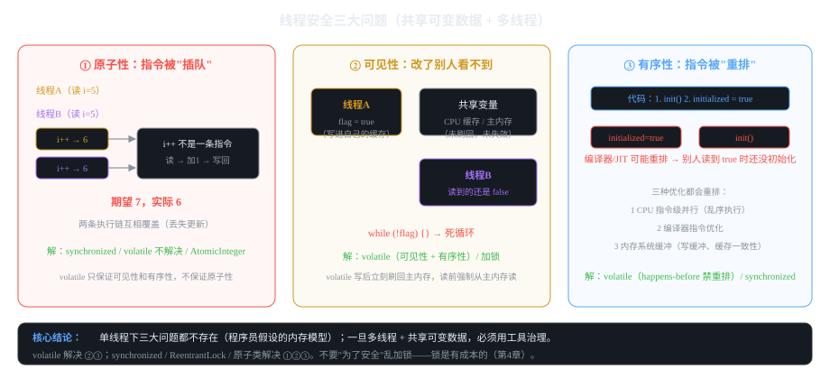

# 第2章 线程安全三大问题与 volatile

> 一句话讲清：**线程安全 = 多个线程同时访问同一份共享可变数据时，结果仍然正确。
> 不正确的根源是三个问题：原子性、可见性、有序性——治理工具就是 volatile / synchronized / Lock。**
> 本章目标：吃透三大问题、理解"内存模型"、掌握 volatile 的"两能保证一不能保"，会写 DCL。

## 2.1 什么是"线程安全"

```java
// 场景：两个线程同时读-改-写一个共享变量
int count = 0;

// 线程 A
synchronized (lock) {
    int temp = count;   // 读
    temp++;              // 改
    count = temp;        // 写
}

// 线程 B 同时也在做同样的事
```

**"线程安全"的严格定义（面试必答）：**
> 当一个方法被多个线程同时调用时，**始终能得到正确的结果**（不需要额外同步），
> 它就是线程安全的。

**关键理解：线程安全 ≠ 没有并发，而是"并发的结果正确"。**

## 2.2 三大问题详解（★ 面试主战场）


*图 2-1：原子性（i++ 被插队）、可见性（改了别人看不到）、有序性（指令被重排）*

### 2.2.1 原子性（Atomicity）

**"一次操作要么全做完，要么全不做；中间不能被别的线程看到。"**

```java
// 反例：count++ 不是原子的
int count = 0;
// 线程 A、B 同时执行 count++，各 1000 次
// 期望 count = 2000，实际几乎每次都是别的数（<2000）
```

**为什么 `count++` 不原子？** 编译成字节码后是**三步**：

```
0. aload_1           // 读 count 的值到操作数栈
1. iconst_1          // 压入 1
2. iadd              // 相加
3. astore_1          // 写回 count
```

**追问：volatile 能保证原子性吗？**
**不能！** 这是经典追问。`volatile` 只保证**单次读写**的原子性，
`count++` 是"读 + 写"两次操作，volatile 不管中间的过程。

**解决原子性的工具：**
- `synchronized`（加锁）
- `AtomicInteger` 等原子类（CAS，第5章）
- 不可变对象（`String`、`Integer`，值不可改就没有"改"）

### 2.2.2 可见性（Visibility）

**"线程 A 改了变量，线程 B 能立刻看到。"**

```java
// 反例：死循环
boolean flag = true;
Thread t = new Thread(() -> {
    while (flag) { /* 等 flag 变 false */ }
});
t.start();
flag = false;   // 主线程改 —— 但 t 可能永远看到 true！
```

**原因：CPU 有缓存（L1/L2/L3），每个核有自己的缓存副本。线程 A 改了值只写进了自己 CPU 的缓存，没立刻刷回主内存，线程 B 在自己 CPU 的缓存里读到旧值。**

**这就是"内存模型"要解决的问题：Java 内存模型（JMM）规定"什么时候必须刷回主内存、什么时候必须从主内存读"。**

**解决可见性的工具：**
- `volatile`（核心作用）
- `synchronized`（锁的释放会刷新主内存）
- 其他同步机制（Lock、原子类等）

### 2.2.3 有序性（Ordering）

**"代码的执行顺序和写出来的顺序一致。"**

```java
// 反例：可能出问题
class Singleton {
    private static Singleton instance;   // ① 分配内存
    // ② 初始化对象
    // ③ 把 instance 指向这个内存地址

    private Singleton() {}

    public static Singleton getInstance() {
        if (instance == null) {           // 检查
            synchronized (Singleton.class) {
                if (instance == null) {   // 双重检查
                    instance = new Singleton();   // 非原子：三步
                }
            }
        }
        return instance;
    }
}
```

**问题在哪？** `new Singleton()` 其实是三步：
① 分配内存 → ② 初始化对象 → ③ 赋值给 instance。

如果 JIT 编译器重排成 **①③②**（分配完先赋值 instance，再初始化对象），
另一个线程可能读到"instance 不为 null 但对象还没初始化"的半初始化状态——**用 NPE 崩溃**。

**这就是 DCL（双重检查锁）必须配合 volatile 的原因。**

**三种会重排的优化（面试必答）：**

1. **CPU 指令级并行**：现代 CPU 可以乱序执行指令，只要最终结果正确（比如两条无依赖的指令）
2. **编译器指令优化**：编译器/JIT 可以重排无依赖的指令顺序
3. **内存系统缓冲**：CPU 和主内存之间有写缓冲、缓存一致性协议（MESI），写入不是立即生效

## 2.3 Java 内存模型（JMM）：抽象的"内存契约"

**JMM 不是物理内存，是"程序员和 JVM 之间的契约"——规定在多线程场景下，
哪些操作什么时候必须可见、按什么顺序看到。**

### 两个抽象概念

```
┌──────────────────────────────────────────────┐
│  主内存（Main Memory）：所有共享变量的"权威值"    │
│                                              │
│    ┌──────────────┐  ┌──────────────┐        │
│    │ 工作内存  A   │  │ 工作内存  B   │        │
│    │ （线程A副本） │  │ （线程B副本） │        │
│    └──────────────┘  └──────────────┘        │
│         ↑↓                ↑↓                  │
└──────────────────────────────────────────────┘
```

**线程操作变量必须走三步：** 主内存读 → 工作内存修改 → 刷新回主内存。
**JMM 规定"什么时候必须刷新/必须重读"，这就是可见性、有序性的根源。**

### happens-before（★ 面试必答）

**JMM 用 happens-before 规则来定义"操作顺序"——如果操作 A happens-before 操作 B，
那么 A 的结果对 B 是可见的、不会被重排到 B 之后。**

```java
// 核心 7 条（背下来 5 条就够了）：
// 1 程序顺序规则：同一线程内，前面写 happens-before 后面读
// 2 监视器锁规则：解锁 happens-before 之后的加锁
// 3 volatile 规则：volatile 写 happens-before 之后的 volatile 读  ★
// 4 线程启动规则：start() 之前 happens-before 线程内的所有操作
// 5 线程终止规则：线程内所有操作 happens-before join() 返回
// 6 传递性：A hb B, B hb C → A hb C
// 7 终态规则：构造函数 happens-before 对象被终结
```

**追问：volatile 的 happens-before 怎么理解？**
"同一个 volatile 变量的写操作，会被所有后来的读操作看到——
这就是 volatile 保证可见性的底层机制。"

## 2.4 volatile 原理（★ 必考）

```java
class FlagDemo {
    private volatile boolean flag = true;   // volatile 修饰
}
```

**volatile 做了什么（底层机制）：**

1. **写时加内存屏障**：volatile 写后，JVM 会插入 StoreStore + StoreLoad 屏障，
   **立刻把值刷回主内存**（其他 CPU 的缓存立刻可见）
2. **读时刷新缓存**：volatile 读前，JVM 会插入 LoadLoad 屏障，
   **强制从主内存读最新值**，丢弃本地缓存
3. **禁止指令重排**：volatile 写之前的代码不能重排到写之后（用内存屏障隔开）

### volatile 的"两能一不能"（★ 面试背）

```java
// ✅ 能保证 ① 可见性：改了就立刻对其他线程可见
// ✅ 能保证 ② 有序性：禁止 volatile 前后重排
// ❌ 不能保证 ③ 原子性：count++ 仍然会丢失更新！
```

**代码演示：volatile 解决可见性 + 有序性，但不解决原子性**

```java
public class VolatileDemo {
    // 场景1：解决可见性（第1章的死循环）
    private volatile boolean flag = true;
    private volatile int count = 0;   // 场景2：volatile 修饰 i++ 仍不安全

    public void setFlag(boolean f) { this.flag = f; }    // 主线程改
    public boolean getFlag() { return flag; }             // 另一线程立刻能看到

    // ⚠ 反例：volatile 保证不了原子性
    public void increment() {
        count++;   // 读-加-写三步，volatile 管不了中间过程
    }
}
```

### 使用 volatile 的三个经典场景

**场景1：状态标志位（最常用）**

```java
private volatile boolean running = true;

public void stop() { this.running = false; }   // 主线程设
public void work() {
    while (running) { doWork(); }              // 子线程立刻能看到变化
}
```

**场景2：双重检查锁（DCL）单例（★ 必考）**

```java
public class Singleton {
    // 关键：必须有 volatile，否则可能被重排成"半初始化"
    private static volatile Singleton instance;

    private Singleton() {}

    public static Singleton getInstance() {
        if (instance == null) {                       // 第一次检查：无锁，快
            synchronized (Singleton.class) {          // 加锁
                if (instance == null) {               // 第二次检查：防止重复创建
                    instance = new Singleton();       // 分配 + 初始化 + 赋值
                }
            }
        }
        return instance;
    }
}
```

**为什么必须有 volatile？** 没 volatile 时，JIT 可能把 `new` 重排成"先赋值后初始化"，
另一个线程读到非 null 的 instance 但对象还没构造完 → NPE。
volatile 的内存屏障禁止这个重排。

**为什么加锁？** 不加锁，两个线程同时看到 null，都进去 new，创建两个对象。
**为什么双重检查？** 第一次不加锁性能高（实例已存在时不走 synchronized）；
第二次在锁内，防止多线程同时进入。

**追问：DCL 还有别的坑吗？**
答："构造器如果是 public，别人可以 `new Singleton()` 破坏单例——
所以**构造器必须私有**，且要防止反射/序列化破坏。"

**场景3：发布共享对象（"安全发布"）**

```java
private volatile MyData data;

public void publish() { this.data = new MyData(...); }   // 写
public MyData get() { return data; }                      // 读：能看到完整的构造结果
```

## 2.5 volatile 的典型误解（★ 高频追问）

| 误解 | 真相 |
|------|------|
| "volatile 能让 i++ 安全" | ❌ 只能保证读写原子，不能保证读-加-写的原子性，用 AtomicInteger |
| "volatile 是轻量级锁" | ❌ volatile 不用加锁，是 CPU 内存屏障；锁是 mutex，会阻塞 |
| "volatile 变量有锁开销" | ❌ volatile 没有"抢锁"概念，开销只有屏障 + 缓存一致性；比 synchronized 轻量得多 |
| "volatile 能保证复合操作原子" | ❌ 例如 `if (x > 0) x = y;` 的读-判断-写三步仍不安全 |
| "两个 volatile 变量有顺序保证" | ⚠ 同一个 volatile 变量保证顺序；**不同** volatile 变量之间没有 |

## 2.6 三种同步方式速查

| 工具 | 原子性 | 可见性 | 有序性 | 性能 | 适用 |
|------|-------|-------|-------|------|------|
| `volatile` | ❌ 单变量读写原子 | ✅ | ✅ | 最快 | 状态标志、单例 DCL |
| `synchronized` | ✅ | ✅ | ✅ | 中等 | 代码块/方法级别互斥 |
| `ReentrantLock` | ✅ | ✅ | ✅ | 灵活 | 可中断/超时/公平/多条件 |
| `AtomicXxx` | ✅ CAS | ✅ | ✅ | 高竞争时下降 | 计数器、累加 |

## 2.7 常见坑汇总

| # | 坑 | 现象 | 解决 |
|---|----|------|------|
| 1 | 以为 volatile 能保 i++ | count 仍丢失更新 | 用 AtomicInteger 或加锁 |
| 2 | DCL 忘加 volatile | 偶发 NPE | `private static volatile Singleton instance` |
| 3 | 用 volatile 保复合操作 | 判断+写仍不安全 | 加锁或拆成原子对象 |
| 4 | 单例构造器公开 | 单例被破坏 | 构造器 private |
| 5 | 把 volatile 当锁 | 误以为有互斥 | volatile 只保证可见性/有序性，不互斥 |
| 6 | 误用 volatile 修复合并字段 | 多字段不一致 | 用不可变对象封装，或加锁 |

## 2.8 面试自测（追问链）

**Q1:线程安全的定义？**
一句话:"多线程同时调用时，始终得到正确结果，不需要额外同步。"
追问:线程安全 = 没有并发吗?(不是——是"并发结果正确")

**Q2:三大问题分别是什么？怎么解决？**
一句话:"原子性（i++ 被插队）、可见性（改了别人看不到）、有序性（指令被重排）。
volatile 解决可见性+有序性，synchronized/Lock 解决全部，AtomicXxx 解决原子性。"
追问:volatile 能保证原子性吗?(不能，只保证单变量读写原子；count++ 要 AtomicInteger)

**Q3:volatile 底层原理？**
一句话:"写时插内存屏障刷回主内存，读时强制从主内存读、禁指令重排。"
追问:为什么不加锁?(volatile 基于 CPU 内存屏障，不是 mutex 互斥，开销比锁小)

**Q4:volatile 的两能一不能？**
一句话:"能保可见性、有序性；不能保原子性（复合操作）。"
追问:那 volatile 有什么用?(状态标志、单例 DCL、安全发布共享对象)

**Q5:为什么 DCL 必须 volatile？**
一句话:"没 volatile，new 可能被重排成'先赋值后初始化'，其他线程读到半初始化对象。"
追问:为什么双重检查?(第一次无锁走快路径；第二次锁内防止重复创建)

**Q6:什么是 happens-before？**
一句话:"定义操作顺序的契约——A happens-before B 表示 A 的结果对 B 可见、不会重排到 B 之后。"
追问:volatile 的 hb 规则?(同一 volatile 变量的写 hb 之后的读)

---

**本章验收**：能讲清三大问题各举个例子；能说出 volatile 的"两能一不能"；
能手写 DCL 并解释为什么必须有 volatile。下一步:第3章 synchronized 原理与锁升级。
