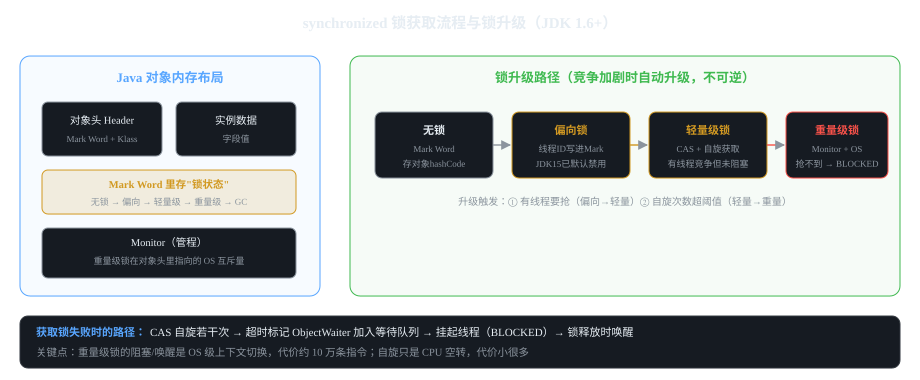

# 第3章 synchronized 原理与锁升级

> 一句话讲清：**synchronized 是 Java 内置的互斥锁，靠字节码层面的 `monitorenter / monitorexit`
> 进入和退出 Monitor；锁的对象在 Mark Word 里升级，从偏向→轻量级→重量级。**
> 本章目标：能画出锁升级路径、能讲清可重入和 Monitor 的关系、能说出 JDK 1.6 后的所有优化。

## 3.1 synchronized 三种用法：锁的是什么（★ 高频）

```java
class SyncDemo {
    private int count = 0;
    private final Object lock = new Object();

    // 用法1：锁实例方法 —— 锁的是 this（调用方法的对象）
    public synchronized void methodA() { count++; }
    // 等价于
    public void methodA() { synchronized (this) { count++; } }

    // 用法2：锁静态方法 —— 锁的是 Class 对象
    public static synchronized void methodB() { /* 锁的是 SyncDemo.class */ }
    // 等价于
    public static void methodB() { synchronized (SyncDemo.class) { /* ... */ } }

    // 用法3：锁代码块 —— 锁任意对象引用
    public void methodC() {
        synchronized (lock) { count++; }
    }
}
```

**"锁什么"决定"互斥谁"——这是高频追问：**

| 用法 | 锁对象 | 效果 |
|------|--------|------|
| 实例方法 | `this` | 同一实例的多个线程互斥；不同实例不互斥 |
| 静态方法 | `Xxx.class` | 所有实例共享这一把锁（类级别互斥） |
| 代码块 | 显式引用 | 锁粒度最细，可锁任意对象 |

**追问：实例方法A 和 静态方法B 能同时执行吗？**
答："能——它们锁的不是同一个对象（this vs Class）。
锁是'基于对象的'，不同对象互不干扰。"

```java
// 经典误解：两个线程用不同锁，不互斥
SyncDemo a1 = new SyncDemo();
SyncDemo a2 = new SyncDemo();
// 线程1: a1.methodA()  → 锁 a1
// 线程2: a2.methodA()  → 锁 a2
// 两者同时执行，count 各自 +1（不互斥）
```

## 3.2 字节码原理：monitorenter / monitorexit

**`javap -c` 查看 synchronized 编译出的字节码：**

```
// 方法级：编译器自动加 monitorenter / monitorexit（两条指令）
public synchronized void foo() {
    count++;
}
// 字节码：
// 0. monitorenter       // 进入 Monitor
// ... 方法体 ...
// 6. monitorexit        // 正常退出
// 8. monitorexit        // 异常退出（异常也会释放锁，否则永远死锁）
// 异常表覆盖两条 monitorexit

// 代码块级：显式两条指令
synchronized (lock) { count++; }
// 字节码：
// 0. aload lock         // 把锁对象压栈
// 2. monitorenter       // 进入
// ...
// monitorexit
```

**关键点（面试必答）：**

1. **synchronized 是 JVM 内置指令**，编译器直接生成 monitorenter/monitorexit，
   对应 Java 对象头里的 **Monitor（管程）** 结构。
2. **异常路径也有 monitorexit**：不管方法正常返回还是抛异常，都会执行退出，
   **不会"持有锁卡死"整个进程**——这是 synchronized 比"手写互斥量"安全的地方。
3. **可重入的实现**：Monitor 里有一个 **owner（持有者线程）+ count（持有次数）**，
   同线程再次进入就 count++，退出就 count--，归零才真正释放。

```java
// 可重入示例
public synchronized void outer() {
    System.out.println("outer, count=" + threadLocalCount);
    inner();   // 同线程再次进入，count 变成 2
}
public synchronized void inner() {
    // 不会死锁，因为 owner 是同一个线程
}
```

**追问：为什么 synchronized 可重入？**
答："Monitor 的 owner 和 count 机制——同一个线程重入时只 count++，
不阻塞自己；退出时 count--，归零才释放。
**好处**：避免死锁（自调用）；**坏处**：写错容易嵌套过深、锁粒度过粗。"

## 3.3 对象内存布局：Mark Word 里存什么


*图 3-1：对象头里的 Mark Word 记录锁状态；右侧是从无锁升级到重量级锁的完整路径*

```
Java 对象内存布局（64 位 JVM）：
┌─────────────────────────────┐
│  对象头 Header               │
│  ┌─────────────────────┐    │
│  │  Mark Word (64位)    │    │
│  │  - 无锁：hashCode +  │    │  ← 锁状态写在这里
│  │    分代年龄 + 锁标志  │    │
│  │  - 轻量级锁：Mark     │    │
│  │    Word 前 41 位指向 │    │
│  │    栈里的锁记录       │    │
│  │  - 重量级锁：指向     │    │
│  │    Monitor 对象       │    │
│  └─────────────────────┘    │
│  ┌─────────────────────┐    │
│  │  Klass Pointer       │    │  ← 指向元空间的方法区
│  └─────────────────────┘    │
├─────────────────────────────┤
│  实例数据（字段值）           │
├─────────────────────────────┤
│  对齐填充（8 字节对齐）       │
└─────────────────────────────┘
```

## 3.4 锁升级四阶段（★ 面试核心）

**JDK 1.6 开始，synchronized 从"重量级锁"演进到"渐进式升级"，
竞争加剧时才逐步升级，没有竞争时几乎零开销。**

```
无锁  ──(有线程要抢)──>  偏向锁  ──(有第二个线程要抢)──>  轻量级锁  ──(自旋失败)──>  重量级锁
 ↑                        ↑                              ↑                          ↑
 默认状态               JDK 15 默认禁用                CAS 自旋获取                Monitor + OS
                                                                ↓
                                                         自旋超阈值后阻塞线程（BLOCKED）
```

### ① 无锁（默认）

- **Mark Word 存 hashCode + 分代年龄 + 锁标志（"无锁"标记）**
- 没有线程访问同步块时，就是无锁状态

### ② 偏向锁（JDK 15 默认禁用，JDK 18 移除）

**核心思想：如果同步块只被一个线程访问，那"锁"就是多余的——把锁"偏"到那个线程上。**

```java
// 偏向锁机制：
// 第一次进入：把当前线程 ID 写进 Mark Word，之后这个线程再进不用再 CAS
// 只要没别的线程来抢，就一直"偏"着，几乎零开销
```

**追问：为什么 JDK 15 禁用、JDK 18 移除？**
答："偏向锁撤销很贵——如果多线程交替访问同步块，撤销成本比不加锁还高。
加上 Java 8 主流场景是多线程，偏向锁适用面很窄，所以先禁用、后移除。"

### ③ 轻量级锁（有线程竞争但未阻塞）

**核心思想：用 CAS + 自旋代替阻塞——抢不到锁就 CPU 空转几圈，比 OS 级阻塞便宜得多。**

```
线程 A：CAS 把 Mark Word 换成自己栈里的"锁记录"，成功持有
线程 B：CAS 失败 → 进入自旋（默认 10 次，可 -XX:PreemptSize 调）
线程 B：自旋次数超阈值 → 升级到重量级锁 → 阻塞（BLOCKED）
线程 A：释放 → 唤醒 B
```

**追问：自旋的代价？**
答："CPU 空转，不释放 CPU，但避免了 OS 级上下文切换（约 10 万条指令的开销）。
**适用场景**：锁持有时间很短（几条指令），自旋能等到；
**不适用**：锁持有时间长，自旋浪费时间——这种情况直接用重量级锁更好。"

### ④ 重量级锁（Monitor + OS 互斥量）

**核心思想：自旋失败后，把线程挂起（BLOCKED），交给 OS 调度。**

```
Monitor 内部：
- _owner_        : 持有锁的线程
- _count_        : 重入次数
- _wait_set_     : wait() 等待队列（ObjectWaiter 节点）
- _entry_list_   : 加锁等待队列（BLOCKED 的线程）
- _Mutex_        : OS 层的互斥量（Linux 的 futex）
```

**性能代价：上下文切换约 10 万条指令的开销；频繁阻塞会拖垮吞吐。**

## 3.5 锁升级路径速查表

| 阶段 | Mark Word 内容 | 触发条件 | 性能开销 |
|------|--------------|----------|---------|
| 无锁 | hashCode + 年龄 + 锁标志 | 默认 | 零 |
| 偏向锁 | 线程 ID + 偏向标志 | 同线程多次进入 | 接近零 |
| 轻量级锁 | 指向栈内锁记录 | 第二个线程来抢 | CAS 自旋 |
| 重量级锁 | 指向 Monitor | 自旋失败 / 锁竞争严重 | OS 上下文切换 |

**JDK 版本演进（面试可加分）：**
- JDK 1.5 之前：全部重量级锁
- JDK 1.6：引入偏向锁、轻量级锁（渐进式升级）
- JDK 15：偏向锁默认禁用（`-XX:-UseBiasedLocking`）
- JDK 18：偏向锁移除

## 3.6 JDK 1.6 其他锁优化（★ 加分项）

### 锁消除

**编译器能证明"锁对象是线程私有的"，就把锁去掉。**

```java
public String concat(String a, String b) {
    StringBuilder sb = new StringBuilder();   // 局部变量，只有当前线程能访问
    synchronized (sb) {                       // JIT 会消除这个锁
        sb.append(a);
        sb.append(b);
    }
    return sb.toString();
}
```

**追问：什么时候锁能被消除？**
答："JIT 编译时能证明锁对象的生命周期不出当前线程（局部变量、构造器内的字段初始化等），
就会在字节码里去掉 monitorenter/monitorexit。"

### 锁粗化

**相邻的 synchronized 块，被合并成一个大锁，避免反复获取释放。**

```java
// 反例：相邻两段锁，中间有非同步代码
synchronized (sb) { sb.append("a"); }
sb.foo();                    // 不在锁里
synchronized (sb) { sb.append("b"); }

// JIT 会优化成：
synchronized (sb) {
    sb.append("a");
    sb.foo();
    sb.append("b");
}
```

**注意**：锁粗化只适用于"同一个锁对象"的连续 synchronized 块，跨对象不粗化。

### 自适应自旋

**JDK 6 加入：自旋次数根据"上次自旋是否成功"动态调整。**
上次自旋成功 → 下次多自旋几次；上次白转 → 下次少自旋或直接阻塞。

## 3.7 wait / notify 与 synchronized（★ 经典必考）

**`wait()` 必须在 synchronized 块里调，否则会抛 `IllegalMonitorStateException`。**

```java
class ProducerConsumer {
    private final Object lock = new Object();
    private boolean ready = false;

    // 生产者
    public void produce() throws InterruptedException {
        synchronized (lock) {
            while (ready) lock.wait();       // ⚠ 要写在 while 里！防虚假唤醒
            ready = true;
            lock.notifyAll();
        }
    }

    // 消费者
    public void consume() throws InterruptedException {
        synchronized (lock) {
            while (!ready) lock.wait();
            ready = false;
            lock.notifyAll();
        }
    }
}
```

**核心要点：**

1. **`wait()` 释放锁并进入 WAITING**；`notify()` 只是唤醒，**真正拿到锁要等当前持有者释放**
2. **`notify()` 唤醒的是"等待这个 monitor 的线程"中的一个**，`notifyAll()` 唤醒全部
3. **`wait()` 必须写在 while 循环里**——被唤醒后条件可能又变了（"虚假唤醒"）

**`wait()` vs `sleep()`（★ 必考对比）：**

| 维度 | wait() | sleep() |
|------|--------|---------|
| 所属 | `Object` 方法 | `Thread` 静态方法 |
| 释放锁 | ✅ 释放 | ❌ 不释放 |
| 需要锁 | ✅ 必须在 synchronized 块 | ❌ 不需要 |
| 唤醒方式 | `notify/notifyAll` | 时间到 / `interrupt` |
| 状态 | WAITING | TIMED_WAITING |

**追问：wait 和 sleep 都能被 interrupt 中断吗？**
答："都能。中断时，sleep 直接抛 InterruptedException；
wait 如果条件满足，从 WAITING 直接退出，下次循环再检查 isInterrupted。"

## 3.8 死锁与活锁

### 死锁（4 必要条件，必背）

1. **互斥**：资源同一时刻只能被一个线程持有
2. **持有并等待**：线程持有 A 资源的同时等 B
3. **不可剥夺**：已持有的资源不能被强夺
4. **循环等待**：A 等 B，B 等 C，C 等 A 形成环

```java
// 死锁最小复现
final Object lockA = new Object();
final Object lockB = new Object();

new Thread(() -> {
    synchronized (lockA) {
        Thread.sleep(100);              // 持有 A，等 B
        synchronized (lockB) { /* 永远进不来 */ }
    }
}).start();

new Thread(() -> {
    synchronized (lockB) {
        Thread.sleep(100);              // 持有 B，等 A
        synchronized (lockA) { /* 永远进不来 */ }
    }
}).start();
```

**追问：怎么破死锁？**
答："破其中一个必要条件：
① 让锁有序（永远按 id 排序获取，比如先拿 lockA 再拿 lockB）—— 破循环等待
② tryLock 超时放弃 —— 破持有并等待
③ synchronized 释放后可重新申请 —— 已经避免了强夺。"

```java
// 用 tryLock 超时打破循环等待
RLock a = ...; RLock b = ...;
if (a.tryLock(1, TimeUnit.SECONDS)) {
    try {
        if (b.tryLock(1, TimeUnit.SECONDS)) { /* 都拿到了 */ }
        else { /* 拿不到 b，主动退让，等下次 */ }
    } finally { a.unlock(); }
}
```

**活锁**（少见）：线程在忙等但不推进，比如两个线程互相道歉"你先用"——永远不让步。

### 常见排查工具

```bash
# jstack 看死锁（jstack 输出里会有 "Found one Java-level deadlock" 段）
jstack <pid>

# 或在代码里：
Thread.getAllStackTraces().forEach((t, stack) -> ...);   # 打印所有线程栈
```

## 3.9 synchronized vs ReentrantLock（★ 必考对比表）

| 维度 | synchronized | ReentrantLock |
|------|--------------|---------------|
| 实现 | JVM 内置（字节码 monitorenter） | JDK 实现（AQS，Java 层面） |
| 可中断 | ❌ 不能中断抢锁 | ✅ `lockInterruptibly()` |
| 可超时 | ❌ | ✅ `tryLock(timeout)` |
| 公平锁 | ❌ 默认非公平 | ✅ 构造参数可选 |
| 多条件 | ❌ 只有 wait/notify | ✅ `newCondition()` 多个 Condition |
| 释放 | 自动（方法退出或异常） | 手动 `unlock()`（必须 try-finally） |
| 性能 | JDK 1.6+ 两者接近 | 略优，可中断/超时更灵活 |
| 适合 | 简单场景 | 复杂场景（超时、公平、多条件） |

**追问：ReentrantLock 一定要 unlock 吗？**
答："必须！否则死锁。规范写法：
```java
try { lock.lock(); /* 业务 */ }
finally { lock.unlock(); }
```
**这就是为什么简单场景优先用 synchronized——自动释放，不易出错。**"

## 3.10 常见坑汇总

| # | 坑 | 现象 | 解决 |
|---|----|------|------|
| 1 | 锁不同对象 | 以为互斥，其实没互斥 | 明确"锁的是哪个对象" |
| 2 | 实例方法锁 this | 不同实例不互斥 | 需要类级互斥用静态方法 |
| 3 | 忘记 unlock | 死锁 | ReentrantLock 必须 try-finally |
| 4 | wait 写在 if 里 | 虚假唤醒 | wait 必须写在 while 循环 |
| 5 | wait 在锁外调 | IllegalMonitorStateException | 必须在 synchronized 块内 |
| 6 | 循环获取多个锁 | 死锁 | 按顺序获取 或 tryLock 超时 |
| 7 | 锁粒度过粗 | 性能差 | 只锁必要的代码段 |
| 8 | 静态方法同步 | 全部实例共享 | 慎重，粒度粗 |

## 3.11 面试自测（追问链）

**Q1:synchronized 锁的是什么？**
一句话:"锁的是对象引用。实例方法锁 this、静态方法锁 Class、代码块锁显式引用。"
追问:不同实例同步吗?(实例方法锁不同 this，不互斥)

**Q2:synchronized 怎么实现的？**
一句话:"字节码 monitorenter/monitorexit + 对象头的 Monitor 管程。"
追问:可重入怎么实现?(Monitor 的 owner + count，同线程重入只 count++)

**Q3:锁升级四阶段？**
一句话:"无锁 → 偏向锁（JDK15禁）→ 轻量级锁（CAS 自旋）→ 重量级锁（Monitor + OS）。"
追问:为什么升级?(无竞争零开销，有竞争逐步加重；JDK 1.6 引入)

**Q4:wait 和 sleep 区别？**
一句话:"wait 释放锁需锁块内 notify 唤醒；sleep 不释放锁不需要锁，时间到自然醒。"
追问:wait 为啥要在 while 里?(防虚假唤醒——唤醒后条件可能又变)

**Q5:死锁四条件？**
一句话:"互斥、持有并等待、不可剥夺、循环等待。"
追问:怎么破?(按顺序拿锁、tryLock 超时、缩小锁粒度)

**Q6:synchronized vs ReentrantLock？**
一句话:"synchronized 简单自动释放；ReentrantLock 可中断/可超时/可公平/多条件但必须手动 unlock。"
追问:优先用哪个?(简单场景 synchronized；复杂需求 ReentrantLock)

---

**本章验收**：能画出锁升级路径并讲每一步；能对比 synchronized vs ReentrantLock；
能写死锁最小复现和破解方案。下一步:第4章 ReentrantLock 与 AQS。
