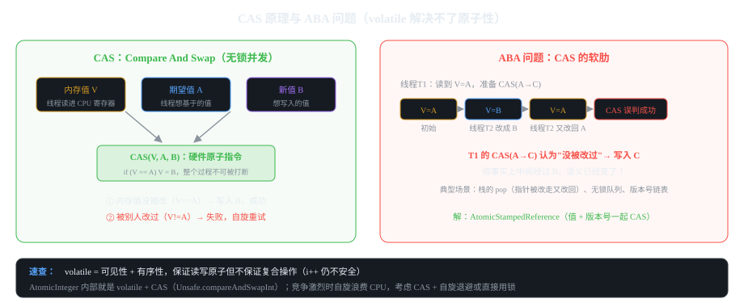

# 第5章 CAS 与原子类

> 一句话讲清：**CAS（Compare And Swap）是硬件提供的原子指令，
> "比较并交换"三步一体不可打断；所有 AtomicXxx 原子类都是 volatile + CAS 的组合。
> 它解决了 synchronized 的"阻塞"问题，但引入了自旋浪费 CPU 和 ABA 问题。**
> 本章目标：能讲清 CAS 原理、能说出 ABA 问题、能熟练使用 AtomicInteger/AtomicLong/AtomicReference。

## 5.1 为什么要 CAS

**synchronized / Lock 是"悲观锁"——假设一定会冲突，所以先加锁。
CAS 是"乐观锁"——假设不会冲突，先操作，失败了再重试。**

| 维度 | 悲观锁（synchronized/Lock） | 乐观锁（CAS） |
|------|---------------------------|--------------|
| 假设 | 一定会冲突 | 一般不会冲突 |
| 机制 | 阻塞等锁 | 自旋重试 |
| 冲突少时 | 有锁开销 | **更快** |
| 冲突多时 | 稳（一次排队） | 慢（自旋浪费 CPU） |
| 适用 | 高竞争 | 低竞争、读多写少 |

**追问：CAS 一定比 synchronized 快吗？**
答："**不一定**——CAS 在低竞争下快得多，但高竞争下 CPU 一直在自旋，反而更慢。
所以 `AtomicXxx` 内部会做"自适应自旋"：连续失败几次后放弃自旋，让出 CPU。"

## 5.2 CAS 原理（★ 面试必考）


*图 5-1：CAS 的三步操作 + ABA 问题的时间线*

```java
// CAS 的伪代码（底层是 CPU 指令 cmpxchg / CMPXCHG）：
// compareAndSwap(int* addr, int expected, int new):
//     while (true) {
//         if (*addr == expected) {    // 比较
//             *addr = new;             // 交换
//             return true;
//         }
//         // 值已被别人改了 → 重试
//     }
```

**关键特性（面试必答）：**

1. **硬件原子性**：CAS 是 CPU 提供的原子指令，"比较 + 交换"中间不会被切换
2. **无阻塞**：失败时不阻塞线程，只是重试
3. **自旋浪费**：长时间失败会浪费 CPU 时间片
4. **ABA 问题**：见 5.3

### Java 里的 CAS：Unsafe 类

```java
import sun.misc.Unsafe;   // JDK 9+ 用 VarHandle

// 所有 AtomicXxx 都基于 Unsafe.compareAndSwapInt/Long/Object 实现
// 伪代码：
public class AtomicInteger {
    private volatile int value;   // 注意：是 volatile！
    
    public final int get() { return value; }
    
    public final boolean compareAndSet(int expect, int update) {
        return unsafe.compareAndSwapInt(this, valueOffset, expect, update);
    }
    
    public final int getAndIncrement() {
        for (;;) {
            int current = get();
            int next = current + 1;
            if (compareAndSet(current, next)) return current;   // CAS 成功
            // 失败则重试
        }
    }
}
```

**追问：为什么 AtomicXxx 的字段必须是 volatile？**
答："volatile 保证可见性——一个线程改了 value，其他线程立刻能看到最新值。
**volatile + CAS = 完整的无锁并发原语**：volatile 管可见性/有序性，CAS 管原子性。"

## 5.3 ABA 问题（★ 必考追问）

**"线程 T1 读到值 A，准备 CAS(A→C)；期间 T2 把值改成 B 又改回 A；
T1 的 CAS 看到值还是 A，以为没被改过，成功写入 C——但事实上中间经过 B，语义已经变了。"**

```java
// ABA 最小复现（用栈模拟）
class Stack<T> {
    AtomicReference<T> top = new AtomicReference<>();
    
    void push(T item) {
        top.set(item);   // 简化版，真实要用 CAS 循环
    }
    
    T pop() {
        while (true) {
            T currentTop = top.get();
            T next = currentTop.next;
            if (top.compareAndSet(currentTop, next)) {   // CAS 成功
                return currentTop;                        // 弹出
            }
            // 失败重试
        }
    }
}

// 问题：
// T1: top = A，准备 CAS(A → B)
// T2: CAS(A → C)  然后 CAS(C → A)   // 把值改走又改回
// T1: CAS(A → B)  成功！但语义错了——它以为没被改过
```

### 解决方案：AtomicStampedReference（值 + 版本号）

```java
import java.util.concurrent.atomic.AtomicStampedReference;

AtomicStampedReference<Integer> ref = new AtomicStampedReference<>(1, 0);   // 值=1, 版本号=0
int[] stamp = new int[1];

// 取出值和当前版本号
int value = ref.get();
ref.getStamp(stamp);
int currentStamp = stamp[0];

// CAS：值从 1 改成 2，同时版本号从 0 改成 1
boolean ok = ref.compareAndSet(1, 2, currentStamp, currentStamp + 1);
```

**原理：版本号每次 CAS 都递增，别人动过就算改回原值，版本号也不对，CAS 失败。**

**追问：AtomicStampedReference 怎么解决的？**
答："把值和一个版本号打包 CAS——
T2 把值改走又改回时，版本号也变了（1→2），T1 的 CAS 版本号不匹配，失败重试。
**代价**：版本号管理复杂，性能略低。**替代方案**：用 `LongAdder` 或 Lock。"

## 5.4 AtomicXxx 原子类全景（★ 必会）

### 原子基本类型（最常用）

```java
import java.util.concurrent.atomic.AtomicInteger;
import java.util.concurrent.atomic.AtomicLong;

// 用法和原始类型几乎一样
AtomicInteger count = new AtomicInteger(0);
count.incrementAndGet();      // 原子 +1（CAS 循环）
count.getAndIncrement();      // 先取后 +1
count.decrementAndGet();
count.addAndGet(5);           // 原子 +5
count.compareAndSet(0, 1);    // CAS

// 常见坑：get 之后再 addAndGet 不是原子的
int v = count.get();          // 可能别人已经改了
count.set(v + 1);             // ❌ 丢失更新！
// ✅ 用 addAndGet 或 incrementAndGet
```

### 原子引用类

```java
import java.util.concurrent.atomic.AtomicReference;

AtomicReference<String> ref = new AtomicReference<>("hello");
ref.set("world");
ref.getAndSet("foo");         // 返回旧值并设置新值
ref.compareAndSet("world", "foo");
```

### 原子数组类

```java
import java.util.concurrent.atomic.AtomicIntegerArray;

AtomicIntegerArray arr = new AtomicIntegerArray(10);   // 10 个 int 槽
arr.incrementAndGet(0);   // 第 0 个槽 +1
arr.getAndAdd(0, 5);
```

### 累加器（高并发场景，★ 加分）

**`AtomicLong` 在极端高竞争下自旋会浪费 CPU——改用 `LongAdder` 分片累加。**

```java
import java.util.concurrent.atomic.LongAdder;
import java.util.concurrent.atomic.LongAccumulator;

LongAdder adder = new LongAdder();
for (int i = 0; i < 1000; i++) {
    new Thread(() -> {
        for (int j = 0; j < 10000; j++) adder.increment();
    }).start();
}
// ... 主线程稍后读取
System.out.println(adder.sum());   // 把所有分片加起来
```

**`AtomicLong` vs `LongAdder`（★ 面试加分）：**

| 维度 | AtomicLong | LongAdder |
|------|-----------|-----------|
| 结构 | 单值 + CAS | 多分片（Cell 数组） |
| 低竞争 | 快 | 快 |
| 高竞争 | 自旋浪费 CPU | **快（分片减少 CAS 冲突）** |
| 精确读取 | 直接 get | 要 sum（遍历分片） |
| 适用 | 一般场景 | 高并发的累加（计数器、监控） |

**原理：LongAdder 把值分散到多个 Cell，每次自增随机选一个 Cell 累加——
减少了 CAS 冲突，性能高几倍。代价：`sum()` 要遍历所有分片，不是实时精确值。**

### 原子数组元素修改

```java
// 数组的某一元素原子修改
import java.util.concurrent.atomic.AtomicIntegerFieldUpdater;
AtomicIntegerFieldUpdater<int[]> updater = 
    AtomicIntegerFieldUpdater.newUpdater(int[].class, "value");
// 实际项目少用，了解即可
```

## 5.5 常见 AtomicXxx 用法示例

```java
// 1. 并发计数器
AtomicInteger count = new AtomicInteger(0);
ExecutorService pool = Executors.newFixedThreadPool(8);
for (int i = 0; i < 1000; i++) {
    pool.submit(() -> count.incrementAndGet());
}
pool.shutdown();
pool.awaitTermination(5, TimeUnit.SECONDS);
System.out.println(count.get());   // 1000
```

```java
// 2. 并发安全的序列号生成
AtomicLong seq = new AtomicLong(1000L);
String nextSeq = "ORD-" + seq.getAndIncrement();   // ORD-1000, ORD-1001, ...
```

```java
// 3. CAS 实现状态机（一次只允许从状态 A 切换到 B）
AtomicReference<State> state = new AtomicReference<>(State.INIT);
state.compareAndSet(State.INIT, State.RUNNING);   // 只允许 INIT → RUNNING
```

```java
// 4. 配合 LongAdder 做并发监控计数
LongAdder requestCount = new LongAdder();
for (Request req : requests) {
    requestCount.increment();   // 每个请求 +1
}
System.out.println("总请求: " + requestCount.sum());
```

## 5.6 原子类 vs synchronized vs volatile（★ 对比表）

| 工具 | 原子性 | 可见性 | 有序性 | 高竞争性能 | 适用 |
|------|-------|-------|-------|----------|------|
| `volatile` | ❌ | ✅ | ✅ | 快 | 状态标志 |
| `AtomicXxx` | ✅ CAS | ✅ | ✅ | **中竞争好，高竞争差** | 计数器、序列号 |
| `synchronized` | ✅ | ✅ | ✅ | 高竞争好（阻塞一次） | 复杂场景 |
| `ReentrantLock` | ✅ | ✅ | ✅ | 灵活 | 超时/中断/公平 |

**追问：什么时候用 AtomicXxx 什么时候用 Lock？**
答："低竞争用 AtomicXxx（CAS 快），高竞争用 Lock（避免 CAS 自旋浪费 CPU）。
**临界判断：竞争度 < 30% 用 Atomic，> 50% 用 Lock**（具体阈值看场景）。"

## 5.7 常见坑汇总

| # | 坑 | 现象 | 解决 |
|---|----|------|------|
| 1 | get + set 组合 | 丢失更新 | 用 addAndGet 或 incrementAndGet |
| 2 | 高竞争用 AtomicLong | CPU 烧满 | 换 LongAdder |
| 3 | ABA 不处理 | 偶发诡异 bug | AtomicStampedReference |
| 4 | 用 AtomicXxx 存复合对象 | 字段不一致 | 用不可变对象或加锁 |
| 5 | 自旋不退出 | 死循环 | 让比较条件能稳定收敛 |
| 6 | CAS 用于复杂对象 | 性能差 | 拆小或用 Lock |
| 7 | 高并发读用 AtomicInteger | 缓存行伪共享 | 加 @Contended 或 LongAdder |

**追问：什么是"伪共享"（False Sharing）？**
答："两个线程修改不同变量，但它们在**同一缓存行**（通常 64 字节）——
一个线程改了导致另一线程的缓存失效，反复刷新，性能暴跌。
**解决**：@Contended 注解（JDK 8+）让变量各占独立缓存行，或手动填充 padding。"

## 5.8 面试自测（追问链）

**Q1:CAS 是什么？**
一句话:"Compare And Swap，硬件原子指令，比较并交换三步不可打断，失败自旋重试。"
追问:优点?(无阻塞；低竞争下快。缺点:高竞争自旋浪费 CPU、ABA)

**Q2:AtomicXxx 怎么实现的？**
一句话:"字段是 volatile + 方法用 CAS 循环（Unsafe.compareAndSwap）。"
追问:为什么字段要 volatile?(保证可见性——一个线程改了别人立刻看到)

**Q3:ABA 问题？**
一句话:"值改走又改回，CAS 误以为没被改过。解:AtomicStampedReference(值+版本号)。"
追问:其他解法?(用 LongAdder 避开；或加版本号字段手动管理；或干脆用 Lock)

**Q4:AtomicLong vs LongAdder？**
一句话:"AtomicLong 单值 CAS，高竞争自旋；LongAdder 分片累加，高竞争更快但要 sum。"
追问:为什么 LongAdder 快?(分散 CAS 冲突，不同线程打到不同分片)

**Q5:什么时候用原子类什么时候用锁？**
一句话:"低竞争原子类，高竞争锁；临界值看竞争度（~30%）。"
追问:原子类不能用复杂对象?(能用但不推荐——字段不一致；用不可变对象或加锁)

**Q6:什么是伪共享？**
一句话:"不同线程改同一缓存行内的不同变量，互相引起缓存失效，性能暴跌。"
追问:解决?(@Contended 或 padding)

---

**本章验收**：能讲清 CAS 原理和 ABA；能熟练使用 AtomicInteger/LongAdder；
能对比 AtomicXxx vs synchronized。下一步:第6章 线程池。
