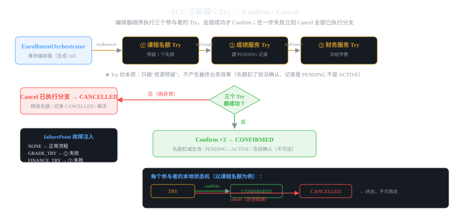

# 第1章 难题一:分布式事务(TCC 选课写扩散)

> 一句话讲清:**TCC = Try / Confirm / Cancel 三个阶段。Try 只做"资源预留"不产生最终效果,
> 全部 Try 成功才 Confirm(不可逆);任一步失败就 Cancel 已执行分支(补偿回滚)。
> 本质是「用业务代码手写两阶段提交」。**

## 1.1 难题是什么:选课要改三个库

选课业务一次要动三个服务:

```
选课 → ① 课程名额服务：名额 -1
     → ② 成绩服务：   创建选课记录
     → ③ 财务服务：   冻结学费
```

**单体的解法:一个 `@Transactional` 包起来,任一失败全部回滚。** 简单优雅。

**微服务下:`@Transactional` 失效了**——三个服务各有各的数据库连接,
A 的本地事务根本管不到 B 和 C 的库。这就必须自己解决。


*图 1-1:Try 阶段顺序执行三个参与者,全部成功才 Confirm;任一步失败立刻 Cancel 已执行分支*

## 1.2 三种主流解法先有个印象

| 方案 | 思路 | 适用 |
|------|------|------|
| **2PC/XA** | 事务管理器协调,所有参与者 prepare 后统一 commit | 强一致要求、库支持 XA(生产少用,阻塞) |
| **TCC** | 业务手写 Try/Confirm/Cancel 三个方法 | 需要强一致、能写业务补偿逻辑(本章) |
| **本地消息表/MQ** | 最终一致,靠消息保证下游一定收到 | 可接受秒级延迟(见第4章) |
| **Saga** | 一系列本地事务 + 补偿动作链 | 长流程、步骤多 |

**为什么本章用 TCC 而不是 2PC?** 2PC 需要事务协调器和数据库的 XA 支持,依赖重;
TCC 只需要业务代码自己实现三个方法,能直观理解「补偿」的本质。
生产环境一般用 Seata 框架自动做 TCC 编排,本教程手写一遍看清底层。

## 1.3 TCC 三个阶段到底是什么

```
┌──────────────────────────────────────────────────────────┐
│ Try    「能预留吗？」                                       │
│   每个参与者锁定自己需要的资源，但不提交最终业务效果          │
│   名额：available -1（但还没确认扣减）                       │
│   成绩：建 PENDING 记录（不是 ACTIVE）                       │
│   财务：冻结金额（不是真扣款）                               │
│   ★ 关键：Try 失败 = 还没做任何事，不需要回滚                │
├──────────────────────────────────────────────────────────┤
│ Confirm  「全部预留成功，提交！」                            │
│   释放 Try 锁定的资源，产生最终业务效果                       │
│   ★ 假设 Try 全部成功，Confirm 一定成功（否则是系统故障）     │
├──────────────────────────────────────────────────────────┤
│ Cancel   「有人失败，撤销所有已执行的 Try」                   │
│   释放资源回到原状                                           │
│   ★ 必须处理「空回滚」和「幂等」两个坑                       │
└──────────────────────────────────────────────────────────┘
```

## 1.4 动手搭建:项目骨架

```
微服务四大难题/
├── pom.xml
└── src/main/java/com/example/tcc/
    ├── TccDemoApplication.java      启动类
    ├── domain/                        领域模型（record + 枚举）
    │   ├── FailurePoint.java
    │   ├── EnrollmentCommand.java
    │   └── EnrollmentSnapshot.java
    ├── api/                           控制层
    │   ├── EnrollmentController.java
    │   └── EnrollmentRequest.java
    ├── application/                   编排层
    │   └── EnrollmentOrchestrator.java
    ├── student/                       参与者①课程名额
    │   └── CourseQuotaService.java
    ├── grade/                         参与者②成绩
    │   └── GradeRecordService.java
    └── finance/                       参与者③财务
        └── TuitionFreezeService.java
```

**注意这个包结构就是"用包模拟微服务"**:`student/` `grade/` `finance/` 三个包相当于三个独立服务,
各自维护自己的内存数据,**互相不 import 对方的内部实现**——这正是微服务的边界。

### pom.xml(依赖极简,只有 web + validation)

```xml
<parent>
    <groupId>org.springframework.boot</groupId>
    <artifactId>spring-boot-starter-parent</artifactId>
    <version>3.3.5</version>
</parent>
<properties><java.version>17</java.version></properties>
<dependencies>
    <dependency>
        <groupId>org.springframework.boot</groupId>
        <artifactId>spring-boot-starter-web</artifactId>
    </dependency>
    <dependency>
        <groupId>org.springframework.boot</groupId>
        <artifactId>spring-boot-starter-validation</artifactId>
    </dependency>
</dependencies>
```

## 1.5 领域模型:三个 record + 一个故障注入枚举

### 1.5.1 FailurePoint:故障注入是教学的核心工具

```java
package com.example.tcc.domain;

public enum FailurePoint { NONE, GRADE_TRY, FINANCE_TRY }
```

**为什么要有故障注入?**
分布式系统的 bug **99% 只在故障时出现**——正常路径本地怎么测都对,
线上才因为某个服务超时而暴露问题。所以教学必须能**主动制造故障**。

这个枚举就是"故障开关":传 `GRADE_TRY` 就让成绩服务在 Try 阶段抛异常,
你可以完整观察「失败发生在哪一步 → 哪些分支需要补偿 → 最终状态是什么」。

### 1.5.2 EnrollmentCommand:编排器的输入

```java
package com.example.tcc.domain;

public record EnrollmentCommand(
    String studentId,      // 学生ID
    String courseId,       // 课程ID
    int tuition,           // 学费
    FailurePoint failurePoint   // 故障注入点（教学用）
) {}
```

**为什么用 record?** Java 17 特性,一个命令对象不可变,
没有 setter 就不可能被意外修改,在多线程场景下更安全。

### 1.5.3 EnrollmentSnapshot:返回给前端的快照

```java
package com.example.tcc.domain;

public record EnrollmentSnapshot(
    String transactionId,      // 全局事务ID（xid）
    String transactionStatus,  // CONFIRMED / CANCELLED
    String quotaStatus,        // 名额分支状态
    String gradeStatus,        // 成绩分支状态
    String financeStatus,      // 财务分支状态
    String message             // 失败原因
) {}
```

**为什么返回每个分支的状态?**
这就是 TCC 的**可观测性**——分布式事务出问题时必须知道「卡在哪一步、哪个分支成功哪个失败」,
否则没法排查。生产环境这个信息通常落在**全局事务表**里。

## 1.6 三个参与者:每个只有三个方法

### 1.6.1 课程名额服务(最完整,把幂等和空回滚都写了)

```java
package com.example.tcc.student;

import java.util.HashMap;
import java.util.Map;

public class CourseQuotaService {
    // 课程 → 可用名额
    private final Map<String, Integer> available = new HashMap<>();
    // xid → 分支状态（TRY / CONFIRMED / CANCELLED）
    private final Map<String, String> branches = new HashMap<>();

    public CourseQuotaService() { available.put("CS101", 2); }

    /** Try：预留名额。幂等 —— 同一个 xid 重复 Try 直接返回 */
    public void tryReserve(String xid, String courseId) {
        String current = branches.get(xid);
        if (current != null) return;                    // ← 幂等点①
        int count = available.getOrDefault(courseId, 0);
        if (count <= 0) throw new IllegalStateException("课程没有可用名额");
        available.put(courseId, count - 1);            // 预留（不确认扣减）
        branches.put(xid, "TRY");
    }

    /** Confirm：确认扣减。只在 TRY 状态可确认 */
    public void confirm(String xid) {
        if ("TRY".equals(branches.get(xid))) branches.put(xid, "CONFIRMED");
    }

    /** Cancel：释放名额。★ 处理空回滚 ★ */
    public void cancel(String xid, String courseId) {
        String current = branches.get(xid);
        if ("TRY".equals(current)) {
            available.put(courseId, available.getOrDefault(courseId, 0) + 1);  // 释放名额
            branches.put(xid, "CANCELLED");
        } else if (current == null) {
            // ★ 空回滚：Try 还没执行（或失败后重试时 Try 被跳过），但 Cancel 已经到了
            // 必须记录成 CANCELLED，否则后续 Try 重试会误以为可以预留
            branches.put(xid, "CANCELLED");
        }
    }

    public String status(String xid) { return branches.getOrDefault(xid, "CANCELLED"); }
    public int available(String courseId) { return available.getOrDefault(courseId, 0); }
}
```

**这段代码里藏了 TCC 的三个必考点:**

**① 幂等(Try 和 Cancel 都要)**
```java
if (current != null) return;   // Try 幂等
```
为什么必须幂等?分布式环境里**方法会被重试**——网络超时后协调者重试,
参与者可能收到两次 Try。如果不幂等,第二次会重复预留名额,数据错乱。

**② 空回滚**
```java
} else if (current == null) {
    branches.put(xid, "CANCELLED");   // 记录空回滚
}
```
场景:Try 因为网络超时**根本没到达参与者**,但协调者以为超时=失败,发起了 Cancel。
参与者收到 Cancel 时 Try 还没执行——这就是空回滚。
**如果空回滚时不记录状态,后续 Try 重试到达,预留成功,就会出现「已取消的事务又被执行了」。**

**③ 状态机是单向的**
```
TRY → CONFIRMED（终态）
TRY → CANCELLED（终态）
null → CANCELLED（空回滚）
```
CONFIRMED 和 CANCELLED 都是终态,不可再改。这个约束是排查问题的基础。

### 1.6.2 成绩服务(注意失败注入)

```java
public class GradeRecordService {
    private final Map<String, String> records = new HashMap<>();

    public void tryCreate(String xid, String studentId, String courseId, FailurePoint failurePoint) {
        if (records.containsKey(xid)) return;                        // ← 幂等
        // ★ 故障注入：模拟成绩服务异常
        if (failurePoint == FailurePoint.GRADE_TRY) throw new IllegalStateException("成绩记录服务模拟失败");
        records.put(xid, "PENDING");                                // 注意是 PENDING 不是 ACTIVE
    }

    public void confirm(String xid) { if ("PENDING".equals(records.get(xid))) records.put(xid, "ACTIVE"); }
    public void cancel(String xid) { if (records.containsKey(xid)) records.put(xid, "CANCELLED"); else records.put(xid, "CANCELLED"); }
    public String status(String xid) { return records.getOrDefault(xid, "CANCELLED"); }
}
```

**注意 Try 写的是 `PENDING` 不是 `ACTIVE`**——这是 TCC 的核心设计:
**Try 只做"资源预留",不产生最终业务效果**。
成绩记录创建了但状态是 PENDING,只有 Confirm 才变 ACTIVE。
这样 Cancel 时只需要标记 CANCELLED,不需要"撤销一次已完成的成绩写入"。

### 1.6.3 财务服务

```java
public class TuitionFreezeService {
    private final Map<String, String> freezes = new HashMap<>();

    public void tryFreeze(String xid, int tuition, FailurePoint failurePoint) {
        if (freezes.containsKey(xid)) return;                       // ← 幂等
        if (failurePoint == FailurePoint.FINANCE_TRY) throw new IllegalStateException("财务服务模拟失败");
        freezes.put(xid, "FROZEN");                                 // 冻结（不真扣款）
    }

    public void confirm(String xid) { if ("FROZEN".equals(freezes.get(xid))) freezes.put(xid, "CONFIRMED"); }
    public void cancel(String xid) { if ("FROZEN".equals(freezes.get(xid))) freezes.put(xid, "UNFROZEN"); else if (!freezes.containsKey(xid)) freezes.put(xid, "UNFROZEN"); }
    public String status(String xid) { return freezes.getOrDefault(xid, "UNFROZEN"); }
}
```

**Try 阶段"冻结"而不是"扣款"**——冻结意味着钱还在账上但不可用,
Confirm 才真正扣款。这样 Cancel 时只需解冻,不需要"退一笔已扣的钱"。

## 1.7 编排器:把三个阶段串起来

```java
package com.example.tcc.application;

import java.util.LinkedHashMap;
import java.util.Map;
import java.util.UUID;
import org.springframework.stereotype.Service;

@Service
public class EnrollmentOrchestrator {
    private final CourseQuotaService quota = new CourseQuotaService();
    private final GradeRecordService grade = new GradeRecordService();
    private final TuitionFreezeService finance = new TuitionFreezeService();
    private final Map<String, EnrollmentSnapshot> transactions = new LinkedHashMap<>();

    public EnrollmentSnapshot enroll(EnrollmentCommand command) {
        String xid = UUID.randomUUID().toString();       // 1. 生成全局事务ID
        try {
            // 2. Try 阶段：顺序执行，任一抛异常立即进入补偿
            quota.tryReserve(xid, command.courseId());
            grade.tryCreate(xid, command.studentId(), command.courseId(), command.failurePoint());
            finance.tryFreeze(xid, command.tuition(), command.failurePoint());

            // 3. Confirm 阶段：三个都成功，提交
            quota.confirm(xid);
            grade.confirm(xid);
            finance.confirm(xid);
            return save(snapshot(xid, "CONFIRMED", "选课成功"));
        } catch (RuntimeException ex) {
            // 4. Cancel 阶段：补偿所有已执行的 Try
            cancelBranches(xid, command.courseId());
            return save(snapshot(xid, "CANCELLED", ex.getMessage()));
        }
    }

    private void cancelBranches(String xid, String courseId) {
        finance.cancel(xid);       // 注意：补偿顺序与 Try 相反
        grade.cancel(xid);
        quota.cancel(xid, courseId);
    }

    private EnrollmentSnapshot snapshot(String xid, String status, String message) {
        return new EnrollmentSnapshot(xid, status,
            quota.status(xid), grade.status(xid), finance.status(xid), message);
    }

    private EnrollmentSnapshot save(EnrollmentSnapshot s) {
        transactions.put(s.transactionId(), s);
        return s;
    }

    public EnrollmentSnapshot find(String xid) { return transactions.get(xid); }
    public int availableQuota(String courseId) { return quota.available(courseId); }
}
```

**三个值得琢磨的设计点:**

**① Cancel 顺序与 Try 相反**
```
Try:    quota → grade → finance
Cancel: finance → grade → quota
```
为什么?Try 阶段 quota 是第一个执行的——如果 quota 失败,后面根本没执行,Cancel 时它们需要处理**空回滚**。
反过来,如果 finance 失败,quota 和 grade 已经成功,Cancel 时 quota 的恢复可能依赖 finance 已经解冻
(业务上不一定,但**反序补偿是保守约定**,能减少状态依赖)。

**② Confirm 和 Cancel 都可能失败**
真实 TCC 里,Confirm 失败要**重试直到成功**(Try 全部成功意味着资源一定够,Confirm 不可能业务失败)。
本教程简化:只在内存里做,失败概率极低。生产环境要有重试机制 + 死信队列。

**③ xid 是全局事务 ID**
`UUID.randomUUID()` 生成,贯穿三个阶段所有参与者。
生产环境这个 xid 通常用 Snowflake 或数据库自增,便于排查和落库。

## 1.8 控制层:加参数校验和 404 处理

```java
package com.example.tcc.api;

import com.example.tcc.domain.*;
import jakarta.validation.Valid;
import org.springframework.http.ResponseEntity;
import org.springframework.validation.annotation.Validated;
import org.springframework.web.bind.annotation.*;

@RestController
@RequestMapping("/api/enrollments")
@Validated
public class EnrollmentController {
    private final EnrollmentOrchestrator orchestrator;

    // 构造器注入（不要字段注入 @Autowired，测试时没法传 mock）
    public EnrollmentController(EnrollmentOrchestrator orchestrator) {
        this.orchestrator = orchestrator;
    }

    @PostMapping
    public EnrollmentSnapshot enroll(@Valid @RequestBody EnrollmentRequest request) {
        return orchestrator.enroll(new EnrollmentCommand(
            request.studentId(), request.courseId(),
            request.tuition(), request.failurePointOrNone()));
    }

    @GetMapping("/{transactionId}")
    public ResponseEntity<EnrollmentSnapshot> find(@PathVariable String transactionId) {
        EnrollmentSnapshot snapshot = orchestrator.find(transactionId);
        // ★ 不存在返回 404，不是返回 null 让前端崩溃
        return snapshot == null ? ResponseEntity.notFound().build() : ResponseEntity.ok(snapshot);
    }
}
```

```java
package com.example.tcc.api;

import com.example.tcc.domain.FailurePoint;
import jakarta.validation.constraints.*;

public record EnrollmentRequest(
    @NotBlank String studentId,
    @NotBlank String courseId,
    @Min(0) int tuition,
    FailurePoint failurePoint
) {
    /** 空值兜底为 NONE，前端不传也能正常选课 */
    public FailurePoint failurePointOrNone() {
        return failurePoint == null ? FailurePoint.NONE : failurePoint;
    }
}
```

## 1.9 跑起来并观察三个场景

```powershell
# 1. 编译打包
mvn package -DskipTests

# 2. 启动
java -jar target\tcc-demo-0.0.1-SNAPSHOT.jar
# 端口 8080
```

### 场景一:正常选课(初始名额 2,成功后剩 1)

```powershell
curl.exe -X POST http://localhost:8080/api/enrollments ^
  -H "Content-Type: application/json" ^
  -d '{"studentId":"S001","courseId":"CS101","tuition":1200,"failurePoint":"NONE"}'
```

```json
{
  "transactionId": "a1b2c3...",
  "transactionStatus": "CONFIRMED",
  "quotaStatus": "CONFIRMED",
  "gradeStatus": "ACTIVE",
  "financeStatus": "CONFIRMED",
  "message": "选课成功"
}
```

**三个分支状态全部终态,事务成功。** 名额剩 1。

### 场景二:成绩服务 Try 失败(名额已预留 → 需要释放)

```powershell
curl.exe -X POST http://localhost:8080/api/enrollments ^
  -H "Content-Type: application/json" ^
  -d '{"studentId":"S002","courseId":"CS101","tuition":1200,"failurePoint":"GRADE_TRY"}'
```

```json
{
  "transactionStatus": "CANCELLED",
  "quotaStatus": "CANCELLED",       ← 名额预留了，被 Cancel 释放
  "gradeStatus": "CANCELLED",       ← Try 失败，空回滚记录成 CANCELLED
  "financeStatus": "CANCELLED",     ← Try 根本没执行，空回滚
  "message": "成绩记录服务模拟失败"
}
```

**关键观察:** 名额被释放了(再次查 `availableQuota` 还是 1,不是 0)。
财务分支 Try 根本没执行,但 Cancel 到了——这就是**空回滚**。

### 场景三:财务服务 Try 失败(前两个 Try 都成功)

```json
{
  "transactionStatus": "CANCELLED",
  "quotaStatus": "CANCELLED",       ← 名额释放
  "gradeStatus": "CANCELLED",       ← PENDING 记录标记 CANCELLED
  "financeStatus": "UNFROZEN",      ← Try 失败前的空回滚
  "message": "财务服务模拟失败"
}
```

### 场景四:名额不足(Try 就失败,不需要补偿)

把 courseId 改成一个不存在的,或把名额用完后:

```json
{
  "transactionStatus": "CANCELLED",
  "message": "课程没有可用名额"
}
```

**名额不足的 Try 抛异常时,后面两个 Try 根本没执行,
Cancel 会处理两个空回滚。这是 TCC 最优雅的地方:**
**「Try 失败 = 还没做坏事,后面的参与者自然走空回滚」**。

## 1.10 这个设计的取舍与局限

### 做得对的地方

| 设计点 | 为什么 |
|--------|--------|
| 故障注入枚举 | 分布式 bug 只在故障时出现,必须能主动制造 |
| Try 只做预留不做最终效果 | Cancel 只需标记状态,不需要撤销已生效的业务 |
| Try/Confirm/Cancel 全幂等 | 网络超时会重试,重复执行必须安全 |
| 处理空回滚 | Try 未到达但 Cancel 到达是分布式常见场景 |
| 反序 Cancel | 减少分支间的状态依赖 |
| 快照返回每个分支状态 | 可观测性,排查问题必须知道卡在哪 |
| 用包模拟服务边界 | 三个参与者互不 import,像真实微服务 |

### 刻意简化的地方(生产必须补)

| 本教程简化 | 生产要做什么 |
|-----------|-------------|
| Confirm 失败不处理 | 需要重试机制 + 死信队列,Confirm 必须最终成功 |
| 内存 Map 存事务 | 要落库(全局事务表 + 分支表),进程重启不丢 |
| xid 用 UUID | 用 Snowflake 便于排查,或数据库自增 |
| 三个服务用 `new` 创建 | 真实是远程调用(RPC/HTTP),要处理超时、重试、限流 |
| 没有悬挂防护 | Try 在 Cancel 之后到达(网络延迟)会误预留资源,要检查 |
| 同步执行三个阶段 | 生产 TCC 由 Seata TCC 模式自动编排,参与者注册为 TCC 分支 |

**「悬挂」是什么?** Try 因为网络延迟,在 Cancel 之后才到达参与者。
参与者看到 `branches` 里已经是 CANCELLED,但 Try 不知道,继续预留资源——
**资源被预留了但事务已经取消,永远泄漏**。
防护:Try 进来先检查分支状态,如果是 CANCELLED 就直接返回(不预留)。

## 1.11 面试速答

**Q1:TCC 的三个阶段分别做什么?**
A:"Try 做资源预留不产生最终效果,Confirm 提交不可逆,Cancel 补偿回滚。
核心是 Try 只做'能撤销的事'。"

**Q2:TCC 和 2PC 的区别?**
A:"2PC 是协议层,事务管理器协调,依赖数据库 XA,阻塞式;
TCC 是业务层,自己写三个方法,细粒度控制,不需要库支持。
2PC 强一致但有阻塞问题,TCC 灵活但要处理空回滚和悬挂。"

**Q3:TCC 三个必须处理的坑?**
A:"幂等(Try/Confirm/Cancel 都要,因为会重试)、
空回滚(Cancel 到达时 Try 还没到,要记录状态防止后续 Try 误执行)、
悬挂(延迟的 Try 在 Cancel 之后到达,要检查状态直接返回)。"

**Q4:为什么 Try 要设计成'只做预留'?**
A:"因为 Cancel 要能撤销它。如果 Try 已经产生了不可逆效果(比如真的扣款了),
Cancel 就变成'退款'了,复杂度和风险都爆炸。预留是最小化不可逆性的设计。"

**Q5:你用过 Seata 吗?**
A:"没在生产用过,但理解原理——Seata TCC 模式把这三个阶段抽象成接口,
业务方实现三个方法,Seata 负责编排、重试、状态落库、悬挂/空回滚防护。
自己手写一遍的价值在于知道框架帮你做了什么。"
