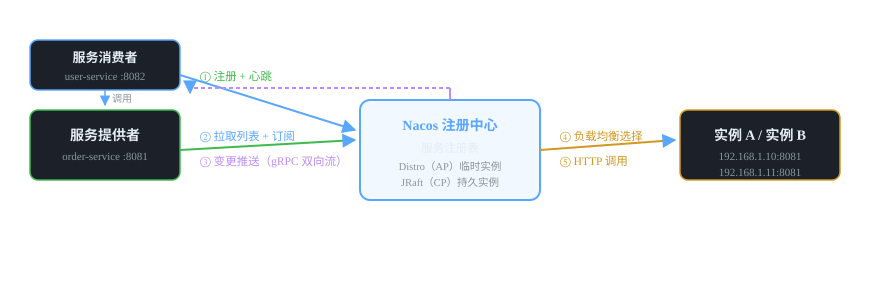

# 微服务组件 02 · 注册中心 Nacos

> 微服务的"通讯录"：服务启动把自己登记上去，调用方按名字找到可用的实例。同时承担配置中心职责（见 03 篇）。
>
> 技术栈：Nacos 2.2.x · AP + CP 双模式 · gRPC 长连接 · 注册 + 配置二合一

## 目录
1. 是什么 / 解决什么问题
2. 核心原理
3. 核心概念表
4. 代码示例
5. 面试题与回答
6. 小结与口诀

---

## 1. 是什么 / 解决什么问题

**注册中心（Service Registry）** 是微服务之间的"通讯录"。服务实例启动后向注册中心登记自己的地址，服务调用方从注册中心查询目标服务的实例列表并调用。

### 1.1 没有注册中心会怎样？（痛点引入）

- **地址写死**：调用方把对方的 IP:端口写死在配置里，服务一扩容/迁移就崩。
- **多副本没法感知**：服务部署 3 个实例，调用方不知道该轮询哪个。
- **宕机无感知**：实例挂了，调用方还在往死地址上发请求，故障蔓延。
- **无法动态伸缩**：K8s 里 Pod 随时增减，地址天然动态变化。

### 1.2 注册中心的核心能力

1. **服务注册**：实例启动时登记（IP + 端口 + 元数据）。
2. **服务发现**：调用方按服务名拿到实例列表。
3. **健康检查**：实例失联后从列表剔除，保证列表里都是"活人"。
4. **变更推送**：实例增减时主动通知订阅方，让调用方列表保持最新。

### 1.3 主流注册中心对比

| 对比项 | Nacos | Eureka | Consul | ZooKeeper |
|---|---|---|---|---|
| 一致性模型 | AP（临时）/ CP（持久） | AP | CP | CP |
| 健康检查 | 心跳 + 主动探测 | 客户端心跳 | 服务端探测 | 客户端会话 |
| 控制台 | 自带，功能丰富 | 简陋 | 一般 | 无（需另装） |
| 配置中心 | 自带（二合一） | 无 | 支持（KV） | 支持（节点） |
| 生态 | Spring Cloud Alibaba 标配 | 已停止维护 | HashiCorp 系 | 老牌，运维重 |

> **结论：** 国内 Spring Cloud 项目默认选 Nacos——注册 + 配置一体，控制台好用，AP/CP 可切换，社区活跃。RuoYi-Cloud 就是 Nacos。

---

## 2. 核心原理

### 2.1 服务注册与发现的完整流程



### 2.2 心跳与健康检查（关键机制）


- **临时实例（默认）**：客户端每 **5s** 发一次心跳，服务端 **15s** 没收到标记不健康，**30s** 未续约则剔除实例。走 **AP** 模式——注册中心宁可短暂不一致，也要保证"能查到、能访问"。
- **持久实例**：服务端主动探测（HTTP / TCP / MySQL 探测），走 **CP** 模式——保证数据强一致，但可用性降低（选举期间可能不可写）。适合需要严格数据一致的特殊场景，日常用不到。
- Nacos 1.x 心跳走 HTTP；**Nacos 2.x 客户端与服务端建立 gRPC 双向流长连接**，心跳与数据推送都走这条通道，性能大幅提升。

### 2.3 集群一致性：Distro（AP）与 JRaft（CP）

- **Distro**（临时实例用）：无主节点的最终一致协议。每个节点负责一部分服务的数据，写请求由负责节点处理，其他节点异步复制。任何节点挂了，剩余节点继续对外服务——**可用性优先**。
- **JRaft**（持久实例用）：Raft 的 Java 实现，选主 + 日志复制，数据**强一致**——一致性优先，但会牺牲部分可用性。
- 面试记一句：**注册中心选 AP**（服务发现要"活"，不要"卡"），配置中心靠 JRaft/CP 保证不丢配置。

### 2.4 命名空间三级隔离模型

```text
Namespace（命名空间）→ Group（分组）→ Service（服务）→ Cluster（集群）→ Instance（实例）
  │ dev / test / prod         │ 同一环境内分组      │ order-service       │ 容灾/就近      │ IP:端口+元数据
```

- **Namespace**：最外层隔离，用于**多环境**（dev/test/prod 的注册表互不可见）或**多租户**。
- **Group**：同一环境内再分组（如按业务线分），不指定默认 DEFAULT_GROUP。
- **Cluster**：同服务的多机房分组，支持**就近访问**。
- **Instance 权重**：0~10000，控制负载均衡时被分到流量的比例（灰度利器：权重调小 = 少接流量）。

---

## 3. 核心概念表

| 概念 | 作用 | 说明 |
|---|---|---|
| Service | 服务名 | 实例的集合，调用方按它查找 |
| Instance | 服务实例 | IP:端口 + 权重 + 元数据 |
| 临时实例 / 持久实例 | 健康检查方式 | 临时=客户端心跳(AP)；持久=服务端探测(CP) |
| Namespace | 环境隔离 | dev/test/prod 注册表隔离 |
| Group | 分组 | 同环境内业务分组，默认 DEFAULT_GROUP |
| Distro | AP 一致性协议 | 无主、异步复制、最终一致 |
| JRaft | CP 一致性协议 | Raft 实现、选主、强一致 |
| 8848 / 9848 | 端口 | 8848 HTTP 管理端；9848 gRPC 客户端连接（8848+1000） |

---

## 4. 代码示例

> 技术栈：Spring Boot 2.7 + Spring Cloud Alibaba 2021.0.4.0（与 RuoYi-Cloud 一致）。

### 4.1 pom.xml（提供者 / 消费者都要加）

```xml
<!-- 依赖管理：锁定 Spring Cloud Alibaba 版本 -->
<dependencyManagement>
    <dependencies>
        <dependency>
            <groupId>com.alibaba.cloud</groupId>
            <artifactId>spring-cloud-alibaba-dependencies</artifactId>
            <version>2021.0.4.0</version>
            <type>pom</type>
            <scope>import</scope>
        </dependency>
    </dependencies>
</dependencyManagement>

<dependencies>
    <!-- Nacos 服务发现 -->
    <dependency>
        <groupId>com.alibaba.cloud</groupId>
        <artifactId>spring-cloud-starter-alibaba-nacos-discovery</artifactId>
    </dependency>
    <!-- 负载均衡（消费者用 RestTemplate/OpenFeign 需要） -->
    <dependency>
        <groupId>org.springframework.cloud</groupId>
        <artifactId>spring-cloud-starter-loadbalancer</artifactId>
    </dependency>
</dependencies>
```

### 4.2 application.yml（注册中心连接配置）

```yaml
spring:
  application:
    name: order-service          # 服务名 = 注册到 Nacos 的服务名，调用方靠它查找
  cloud:
    nacos:
      discovery:
        server-addr: 127.0.0.1:8848       # Nacos 地址（集群写多个用逗号分隔）
        namespace: dev                  # 命名空间 ID，隔离环境；不配默认 public
        group: DEFAULT_GROUP           # 分组
        weight: 1                       # 实例权重 0~10000，越小分到流量越少
        ephemeral: true                # true=临时实例(AP，默认)；false=持久实例(CP)
```

### 4.3 消费者：RestTemplate 走负载均衡调用（最简单入门）

```java
@SpringBootApplication
@EnableDiscoveryClient   // Spring Cloud 2021 起可省略（自动装配），写上更直观
public class ConsumerApplication {
    public static void main(String[] args) {
        SpringApplication.run(ConsumerApplication.class, args);
    }

    @Bean
    @LoadBalanced   // 关键：给 RestTemplate 加上负载均衡能力，才能用服务名调
    public RestTemplate restTemplate() {
        return new RestTemplate();
    }
}

@RestController
@RequestMapping("/api/order")
public class OrderController {

    @Autowired
    private RestTemplate restTemplate;

    // 用服务名 order-service 调用，由负载均衡选一个真实实例
    @GetMapping("/{id}")
    public String getOrder(@PathVariable Long id) {
        String url = "http://order-service/order/" + id;
        return restTemplate.getForObject(url, String.class);
    }
}
```

> 💡 **运行前提：** 本机要有 Nacos Server。容器环境：`docker run -d --name nacos -p 8848:8848 -p 9848:9848 -p 9849:9849 nacos/nacos-server:v2.2.3`（注意 2.x 必须同时映射 9848/9849 gRPC 端口）。

> ⚠️ **常见坑 ①：** Nacos 2.x 客户端连不上时先查 **9848** 端口是否放通——客户端"主端口 8848 + 偏移 1000 自动推导 gRPC 端口"，只开 8848 会一直报连接超时。
> ⚠️ **常见坑 ②：** namespace 不匹配：控制台建了命名空间，配置里没写或写错 ID，服务会注册到"看不见"的命名空间，表现为控制台找不到服务。名字空间用**命名空间 ID**，不是显示名。

---

## 5. 面试题与回答

### Q1：Nacos 是 AP 还是 CP？为什么这样设计？

**答：** Nacos 两者都支持，按实例类型区分：**临时实例（默认）走 AP**，一致性协议是 Distro，无主节点、异步复制、最终一致；**持久实例走 CP**，用 JRaft（Raft 实现）保证强一致。注册中心场景选 AP 的原因：服务发现追求"**可用性优先**"——消费者只要还能查到服务就能继续调用，短暂的列表不一致（比如刚注册还没同步到所有节点）远好过注册中心因为选主/同步而短暂不可用。CAP 定理下必须做取舍：Eureka 纯 AP，ZooKeeper 纯 CP，Nacos 把选择权交给用户。

### Q2：服务提供者宕机了，消费者多久才能感知并切走流量？

**答：** 分两段：① **注册中心侧**：临时实例心跳 5s 一次，15s 未收到标记不健康，30s 剔除实例；② **消费者侧**：Nacos 2.x 通过 gRPC 双向流**主动推送**实例变更，消费者收到通知后刷新本地缓存，所以从宕机到流量切走，最坏大约 **30~40 秒**（1.x 是拉取 + UDP 推送，延迟更大）。这个"感知窗口"就是为什么还需要**调用侧容错**（超时/重试/熔断）——注册中心只能保证最终一致，不能保证即时。

### Q3：临时实例和持久实例的区别？

**答：** ① 健康检查方式：临时实例是**客户端心跳**（5s 一次，服务端被动收）；持久实例是**服务端主动探测**（HTTP/TCP/MySQL 探活）。② 一致性：临时实例 AP（Distro，无主最终一致），持久实例 CP（JRaft，强一致）。③ 生命周期：临时实例进程退出即注销；持久实例需要显式注销。④ 适用场景：临时实例是微服务默认选择；持久实例适合服务端管理、不依赖 SDK 心跳的场景（比如数据库代理、网关管理的上游）。面试只要记住：**默认临时 = 心跳 + AP；持久 = 探测 + CP**。

### Q4：Nacos 与 Eureka 的区别？

**答：** ① 一致性：Eureka 只有 AP；Nacos 支持 AP/CP 切换。② 功能：Nacos 注册 + 配置二合一，Eureka 只有注册，配置要另配 Spring Cloud Config。③ 健康检查：Eureka 只有客户端心跳；Nacos 临时实例心跳、持久实例主动探测都支持。④ 控制台：Nacos 自带管理界面（服务列表、权重调整、下线操作）；Eureka 控制台简陋。⑤ 维护状态：Eureka 官方已停止维护（2.x 未发布），Nacos 社区活跃，是国内事实标准。

### Q5：Nacos 2.0 相比 1.x 最大的变化是什么？

**答：** 核心是**通信协议从 HTTP/UDP 升级为 gRPC 长连接**：客户端与服务端建立双向流，注册、心跳、订阅、变更推送都走这条长连接。带来的收益：① 服务变更**由服务端主动推送**，消费者秒级感知实例变化（1.x 靠拉取 + UDP，有丢失风险）；② 省去频繁建连开销，大规模实例下性能大幅提升；③ 端口规划变了：客户端配置还是 8848，但实际 gRPC 通信走 **9848（8848+1000）**，服务端之间走 9849。所以 Nacos 2.x 部署必须放通 9848/9849。

### Q6：namespace、group、service 三个层级怎么用？

**答：** ① **Namespace** 用于**环境隔离**：dev / test / prod 各建一个命名空间，配置里指定 namespace ID，环境的注册表互相不可见——防止测试环境的服务被生产调用方发现。② **Group** 用于同环境内的**业务分组**（如按团队或业务线），不写默认 DEFAULT_GROUP。③ **Service** 就是服务名，是调用方查找的最小单位。日常开发只配 namespace + 服务名就够；group 更多用于同一环境多套同名服务并存（如联调/灰度场景）。

### Q7：注册中心集群部署时数据怎么保持一致？节点挂了会怎样？

**答：** 分协议：① 临时实例（AP/Distro）：集群**无主节点**，每台节点负责一部分服务的数据分片，写请求由负责节点处理，再**异步复制**给其他节点；任何一台挂了，剩余节点继续对外服务（**可用性优先**），可能短暂出现列表不一致，最终一致。② 持久实例（CP/JRaft）：Raft 选主 + 日志复制，多数派确认才提交，数据强一致；主节点挂了会重新选举，选举期间**短暂不可写**。生产部署一般 3 节点起步，配合 Nginx/VIP 对外暴露 8848。

### Q8：注册中心挂了，服务之间还能调通吗？

**答：** 已建立的调用**不受影响**：消费者本地缓存了服务实例列表（Nacos 客户端有本地快照 + 故障时降级到本地文件），只要不发新请求去查注册中心，正常 HTTP 调用照常。受影响的是：① 新服务注册不上；② 消费者首次启动拉不到列表（有本地快照的能起来）；③ 实例变化无法感知。所以生产要求注册中心高可用（集群部署），同时客户端配置好本地快照目录，双保险。这也是"注册中心是基础设施、绝不能单点"的面试点。

### Q9：如何用 Nacos 做灰度发布？

**答：** 三种由简到繁：① **权重法**：Nacos 控制台直接调整实例权重，新版本实例权重调小（如 10%），老版本调大（90%），流量按权重分配，逐步调大新版本权重完成灰度——最简单，无需改代码。② **元数据 + 负载均衡策略**：实例注册时打标（version=gray），自定义负载均衡策略按请求头选择走灰度实例。③ **结合网关**：Gateway 按 Header/Cookie 断言把灰度用户路由到新版本服务。面试先说权重法，再说元数据方案，体现"会用控制台 + 懂原理"。

### Q10：你项目里 Nacos 报过什么错？怎么排查的？

**答：** 两类高频：① **Client not connected / connect timeout**：先查 8848 连通性，再查 9848 gRPC 端口是否放通（2.x 通病），最后看 namespace/group 是否匹配。② **服务注册上了但调用 404/没有可用实例**：检查服务名是否一致（消费者写的服务名必须等于提供者的 spring.application.name），检查是否都注册在同一个 namespace。排查思路固定：**控制台先看服务列表 → 确认注册成功 → 确认 namespace/服务名一致 → 确认端口放通**。真实项目里这两个错误占比最高，能讲出具体报错和排查路径，比背概念加分。

---

## 6. 小结与口诀

**一句话定位：** 注册中心 = 微服务的动态通讯录，解决"服务在哪、活着没有、列表怎么更新"三个问题。

**口诀：** "启动注册心跳续，十五秒挂三十秒剔；临时 AP 走 Distro，持久 CP 靠 JRaft；命名空间管隔离，2.x 通信走 gRPC。"

**三大坑：**
1. 2.x 必须放通 9848/9849 gRPC 端口
2. namespace ID 不匹配会导致服务"看不见"
3. 生产必须集群部署，注册中心不能单点

**下一跳：** Nacos 除了注册中心还是**配置中心**，下一篇讲配置动态刷新的原理——长轮询。

---

*微服务组件文档系列 · 02/16 · 技术栈 Spring Boot 2.7 + Spring Cloud Alibaba 2021.0.4.0 + Nacos 2.2 · 生成于 2026-09-19*
