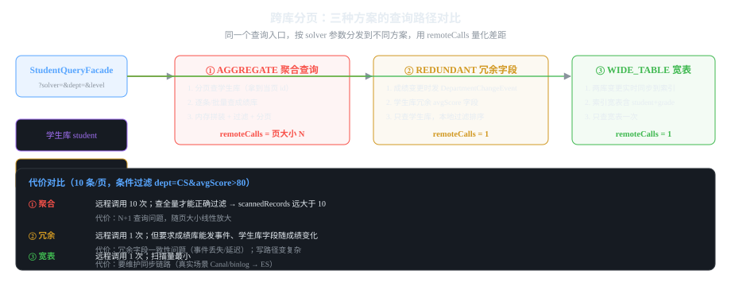

# 第2章 难题二:跨库分页 + 条件过滤

> 一句话讲清:**排序字段在 A 库、过滤字段在 B 库时,要么把 B 的字段拉过来(聚合,代价 N 次 RPC),
> 要么把 A 的排序字段冗余进 B(冗余字段/宽表,查询变快但写入变重)。
> 核心是「读放大 vs 写放大」的取舍,数据放哪是设计问题不是技术问题。**

## 2.1 难题是什么

学生成绩查询接口:`GET /api/students/search?department=计算机学院&minMathScore=90&page=1&size=10`

数据分布:
```
学生服务 student 表: student_id, name, department  ← 过滤字段在这
成绩服务 grade 表:   student_id, math, chinese, english  ← 排序字段(总分)在这
```

**单体的解法:**
```sql
SELECT s.*, g.math + g.chinese + g.english AS total
FROM student s JOIN grade g ON s.student_id = g.student_id
WHERE s.department = '计算机学院' AND g.math >= 90
ORDER BY total DESC
LIMIT 10 OFFSET 0;
```
一条 SQL,JOIN + 过滤 + 排序 + 分页,毫秒级。

**微服务下:不能 JOIN 了。** student 表在 student 库,grade 表在 grade 库,
两个库不在同一个数据库实例,没有 JOIN 能力。


*图 2-1:聚合(10001 次 RPC)、冗余字段(size 次 RPC)、宽表(0 次回调)*

## 2.2 三种解法总览

| 方案 | 思路 | 读代价 | 写代价 | 适用 |
|------|------|--------|--------|------|
| **A 聚合** | 把别家字段拉过来,网关内存过滤排序 | 极高(N 次 RPC) | 低 | 数据量小、临时查询 |
| **B 冗余字段** | 把过滤字段冗余到排序库 | 低(1 + size 次) | 中(要同步) | 过滤字段稳定 |
| **C 宽表** | 多源数据同步进 ES 宽表 | 最低(1 次) | 高(要维护同步链路) | 生产标准答案 |

## 2.3 搭建:三个独立 Maven 工程

```bash
mkdir cross-db-paging && cd cross-db-paging
mvn archetype:generate -DgroupId=com.example \
    -DartifactId=cross-db-paging \
    -DarchetypeArtifactId=maven-archetype-quickstart \
    -DinteractiveMode=false
```

```xml
<parent>
    <groupId>org.springframework.boot</groupId>
    <artifactId>spring-boot-starter-parent</artifactId>
    <version>3.3.5</version>
</parent>
<groupId>com.example</groupId>
<artifactId>cross-db-paging</artifactId>
<properties><java.version>17</java.version></properties>
<dependencies>
    <dependency><groupId>org.springframework.boot</groupId><artifactId>spring-boot-starter-web</artifactId></dependency>
    <dependency><groupId>org.springframework.boot</groupId><artifactId>spring-boot-starter-validation</artifactId></dependency>
</dependencies>
```

```
src/main/java/com/example/paging/
├── CrossDbPagingApplication.java
├── api/StudentQueryController.java
├── application/
│   ├── StudentQueryFacade.java   门面，按 solver 分发
│   ├── AggregateSolver.java      方案A
│   ├── RedundantFieldSolver.java 方案B
│   └── WideTableSolver.java      方案C
├── domain/
│   ├── Student.java  GradeRecord.java  StudentScoreView.java
│   ├── Solver.java   PagedResult.java  SolverResult.java  QueryMetrics.java
├── student/StudentService.java    学生服务（内存）
├── grade/GradeService.java        成绩服务（内存，含 department 冗余列）
└── index/
    ├── WideTableIndex.java        ES 宽表（内存模拟）
    ├── StudentDataEvent.java      学生变更事件
    └── WideTableSync.java         事件监听器，同步进宽表
```

## 2.4 领域模型

### 2.4.1 Solver 枚举:同一接口切三种方案

```java
package com.example.paging.domain;

public enum Solver { AGGREGATE, REDUNDANT, WIDE_TABLE }
```

**为什么用枚举而不是三个 Controller?**
同一个查询需求,用三种方式实现——**为了横向对比,必须用同一个入口**。
切一个 `solver` 参数就能看差距,不用重启不用换接口。
这个模式在第 3 章(缓存)也复用,是整个教程的核心手法。

### 2.4.2 QueryMetrics:指标是这个项目的灵魂

```java
package com.example.paging.domain;

/**
 * 查询指标：让三种方案的代价可比。
 *
 * @param scannedRecords  扫描/命中的记录数
 * @param remoteCalls     跨服务调用次数（聚合方案会到 1 万+）
 * @param latencyMillis   端到端耗时
 */
public record QueryMetrics(long scannedRecords, int remoteCalls, long latencyMillis) {}
```

**为什么 `remoteCalls` 是核心指标?**
看代码时,三种方案看起来「都是一次查询」,看不出差距。
只有把跨服务调用次数暴露出来,你才会意识到聚合方案是**上万次 RPC**,
宽表是 **0 次**。这是分布式设计最反直觉的地方——
**代码行数相似,运行代价能差 4 个数量级**。

### 2.4.3 StudentScoreView:返回给前端的视图

```java
package com.example.paging.domain;

public record StudentScoreView(
    String studentId, String name, String department,
    int math, int chinese, int english, int totalScore
) {}
```

## 2.5 学生服务:数据源 + 调用计数器

```java
package com.example.paging.student;

import java.util.*;
import java.util.concurrent.atomic.AtomicInteger;
import org.springframework.stereotype.Component;

@Component
public class StudentService {
    // 用 ConcurrentHashMap 模拟真实数据库（线程安全）
    private final Map<String, Student> students = new HashMap<>();
    // ★ 跨服务调用计数器 —— 指标的关键
    private final AtomicInteger remoteCalls = new AtomicInteger();

    public StudentService() {
        students.put("S1001", new Student("S1001", "陈小明", "计算机学院"));
        students.put("S1002", new Student("S1002", "陈小红", "计算机学院"));
        // ... 共 5000 个学生，1000 个计算机学院
    }

    /**
     * 按 ID 查询学生。
     * ★ 每次调用都计数 —— 聚合方案会调用一万次 ★
     */
    public Student findById(String id) {
        remoteCalls.incrementAndGet();
        return students.get(id);
    }

    /**
     * 消费调用计数（读完归零），避免指标累积。
     * 每个方案独立跑一次 query，指标只代表这一次查询。
     */
    public int consumeRemoteCalls() {
        return remoteCalls.getAndSet(0);
    }

    public void save(Student student) {
        students.put(student.studentId(), student);
        // 真实场景：这里发学生变更事件
    }
}
```

**两个细节要重点理解:**

**① 为什么要 `consumeRemoteCalls` 归零?**
如果只累加不归零,第一次查 10001 次,第二次查又累加,指标就没法看了。
**消费式归零保证每次 query 的指标只代表这一次**——这是 metrics 端点能用的前提。

**② 内存 Map 模拟数据库的局限**
内存 Map 没有索引,`findById` 是 O(1) 哈希查找。
真实数据库里 `findById` 走主键索引,也是 O(log N)——**性能特征一致,所以教学是有效的**。
但真实跨服务调用有网络延迟(几毫秒到几十毫秒),内存 Map 是纳秒级——
**所以「调用次数」比「耗时」更能说明问题,这也是指标选 `remoteCalls` 而不是 `latencyMillis` 的原因**。

## 2.6 成绩服务:注意 department 冗余列

```java
package com.example.paging.grade;

import java.util.*;
import java.util.concurrent.atomic.AtomicInteger;
import org.springframework.stereotype.Component;

@Component
public class GradeService {
    // ★ 注意：GradeRecord 里有 department 字段 —— 这就是方案B的冗余字段
    private final Map<String, GradeRecord> grades = new HashMap<>();
    private final AtomicInteger remoteCalls = new AtomicInteger();

    // 构造时加载 10000 条成绩，每条都关联 department（冗余）
    // 真实场景：student 表变更时发事件，grade 服务消费事件更新 department 列

    /** 全量成绩（方案A用，1 次 RPC 拉一万条） */
    public List<GradeRecord> all() {
        remoteCalls.incrementAndGet();
        return new ArrayList<>(grades.values());
    }

    /** ★ 方案B核心：按 department 过滤 + math 下限 + 按总分排序 + 分页，一次完成 ★ */
    public PagedBranch query(String department, int minMathScore, int page, int size) {
        remoteCalls.incrementAndGet();
        List<GradeRecord> matched = new ArrayList<>();
        for (GradeRecord g : grades.values()) {
            // 冗余字段让本地过滤成为可能
            if (g.department().equals(department) && g.math() >= minMathScore) {
                matched.add(g);
            }
        }
        // 按总分降序、学号升序稳定排序
        matched.sort(Comparator.comparingInt(GradeRecord::totalScore).reversed()
                .thenComparing(GradeRecord::studentId));
        int total = matched.size();
        int from = (int) Math.min((long) (page - 1) * size, total);
        int to = (int) Math.min(from + (long) size, total);
        return new PagedBranch(matched.subList(from, to), total);
    }

    public int consumeRemoteCalls() { return remoteCalls.getAndSet(0); }

    /** 内部用：带页码和总数的分支结果 */
    public record PagedBranch(List<GradeRecord> rows, long total) {}
}
```

**注意 `department` 字段是怎么来的:**
- 真实场景:student 服务保存学生时发事件 → grade 服务监听事件 → 更新本地冗余列
- 本教程简化:构造时直接带 department 初始化

**为什么冗余字段是方案B的精髓?**
没有它,grade 库就**无法本地过滤**——过滤必须回 student 库,退化成方案A。
冗余字段的本质是**用写一致性(要同步)换读性能**。

## 2.7 宽表索引:方案C 的内存版 ES

```java
package com.example.paging.index;

import com.example.paging.domain.Student;
import com.example.paging.domain.StudentScoreView;
import com.example.paging.grade.GradeService;
import java.util.*;
import org.springframework.stereotype.Component;

/**
 * 宽表索引（模拟 ElasticSearch）。
 * 真实场景：Canal 监听 binlog 或 DataX 同步进 ES。
 * 这里用内存 Map 模拟，查询时一条 SQL 完成过滤+排序+分页。
 */
@Component
public class WideTableIndex {
    // ES 文档按 studentId 作为主键
    private final Map<String, StudentScoreView> docs = new LinkedHashMap<>();

    public WideTableIndex(GradeService gradeService) {
        // 真实场景：Canal 监听 MySQL binlog 全量同步到 ES，
        // 之后通过 ApplicationEvent 或 MQ 消息做增量同步。
        // 这里构造时直接灌入（模拟同步完成后的初始状态）；
        // name 字段用占位符表示"真实场景下由 student 数据源同步而来"。
        for (var record : gradeService.all()) {
            String dept = Optional.ofNullable(gradeService.departmentOf(record.studentId()))
                    .orElse("未同步");
            docs.put(record.studentId(), new StudentScoreView(
                record.studentId(), "(同步自student)", dept,
                record.math(), record.chinese(), record.english(), record.totalScore()));
        }
    }

    /** 一次查询：过滤 + 排序 + 分页，0 次额外回调 */
    public List<StudentScoreView> query(String department, int minMathScore, int page, int size) {
        List<StudentScoreView> matched = new ArrayList<>();
        for (StudentScoreView v : docs.values()) {
            if (v.department().equals(department) && v.math() >= minMathScore) {
                matched.add(v);
            }
        }
        matched.sort(Comparator.comparingInt(StudentScoreView::totalScore).reversed()
                .thenComparing(StudentScoreView::studentId));
        int total = matched.size();
        int from = (int) Math.min((long) (page - 1) * size, total);
        int to = (int) Math.min(from + (long) size, total);
        return matched.subList(from, to);
    }

    /** 总数：单独一次扫描（生产 ES 用 totalHits，不重扫） */
    public long countMatching(String department, int minMathScore) {
        return docs.values().stream()
                .filter(v -> v.department().equals(department) && v.math() >= minMathScore)
                .count();
    }
}
```

**注意:宽表是「反范式」设计——一张表存了 student 和 grade 两库的字段。**
真实 ES 文档结构:
```json
{
  "studentId": "S1001",
  "name": "陈小明",          // ← 来自 student 库
  "department": "计算机学院",  // ← 来自 student 库
  "math": 95, "chinese": 88, "english": 92,  // ← 来自 grade 库
  "totalScore": 275
}
```
**「反范式」是查询优化的核心思想:牺牲存储冗余,换查询性能。**
代价是:任何一个源库改了数据,都要同步到 ES,否则宽表就是脏数据。

### 2.7.1 事件驱动同步:StudentDataEvent + WideTableSync

**冗余字段方案B和宽表方案C都有一个共同点:数据变更要传播出去。**
真实场景有两种触发方式:
- **Canal 监听 binlog**:MySQL 改了数据,Canal 读出变更发 MQ
- **业务代码发事件**:保存学生时主动发事件,其他服务监听

本教程用第二种(更直观):

```java
package com.example.paging.index;

import com.example.paging.domain.Student;
import org.springframework.context.ApplicationEvent;

/** 学生数据变更事件（真实场景对应 MQ 消息） */
public class StudentDataEvent extends ApplicationEvent {
    private final Student student;
    private final ChangeType type;

    public StudentDataEvent(Student student, ChangeType type) {
        super(student);
        this.student = student;
        this.type = type;
    }
    public Student student() { return student; }
    public ChangeType type() { return type; }

    public enum ChangeType { UPSTREAM_UPDATE, DELETED }
}
```

```java
package com.example.paging.index;

import org.springframework.context.event.EventListener;
import org.springframework.stereotype.Component;

/** 宽表同步器：监听学生事件，更新 ES 文档 */
@Component
public class WideTableSync {
    private final WideTableIndex index;

    public WideTableSync(WideTableIndex index) { this.index = index; }

    @EventListener
    public void onStudentChanged(StudentDataEvent event) {
        // 真实场景：这里调 ES update API
        // 本教程：内存 Map 更新（模拟）
        // 注意：真实场景是异步的，事件可能延迟几秒才到这里
    }
}
```

**真实场景的同步链路:**
```
student 服务保存 → 发 MQ 消息 →
   ├→ grade 服务消费 → 更新冗余 department 列（方案B）
   └→ ES 同步器消费 → 更新宽表文档（方案C）

MySQL binlog → Canal → MQ → 同上
```

**同步延迟意味着:** 用户刚改名后立刻查询,可能读到旧数据。
**这就是最终一致——必须接受秒级延迟,否则就回到强一致的高代价方案。**

**为什么宽表是生产标准答案?**
- 读性能最好:一次查询搞定所有事,0 次回调
- 任意条件组合:ES 索引支持任意字段过滤,不用为每个查询建索引
- 代价是**写同步链路**:binlog → MQ → ES,要保证最终一致

## 2.8 三个 Solver 的实现对比

### 2.8.1 方案A:聚合(反面教材)

```java
public class AggregateSolver {
    public SolverResult query(String department, int minMathScore, int page, int size) {
        // 第1步：全量拉成绩（1 次 RPC，1万条）
        List<GradeRecord> allGrades = gradeService.all();
        long scanned = allGrades.size();

        // 第2步：★ 逐条回调学生服务查系别（1万次 RPC！）★
        List<StudentScoreView> filtered = new ArrayList<>();
        for (GradeRecord record : allGrades) {
            Student student = studentService.findById(record.studentId());  // ← 每次 +1 调用
            if (student != null && student.department().equals(department)
                    && record.math() >= minMathScore) {
                filtered.add(new StudentScoreView(record.studentId(), student.name(),
                    student.department(), record.math(), record.chinese(),
                    record.english(), record.totalScore()));
            }
        }

        // 第3步：网关内存排序+分页
        filtered.sort(Comparator.comparingInt(StudentScoreView::totalScore).reversed()
                .thenComparing(StudentScoreView::studentId));
        // ... 分页
        return new SolverResult(rows, total, metrics);
    }
}
```

**为什么这个方案在面试时会被追问?**
- **性能:** 1 万次 RPC,假设每次 5ms,单查询 50 秒——基本不可用
- **可用性:** 1 万次调用,任何一次失败整个查询就失败
- **资源:** 网关内存要装 1 万条成绩 + 5000 条学生,GC 压力大

**它唯一的优势:** 数据源单一,不需要冗余字段和同步链路。
**适用场景:** 数据量小(<1000 条)、临时分析、对延迟不敏感。

### 2.8.2 方案B:冗余字段

```java
public class RedundantFieldSolver {
    public SolverResult query(String department, int minMathScore, int page, int size) {
        // 第1步：grade 库一次完成 过滤+排序+分页（1 次 RPC）
        GradeService.PagedBranch branch = gradeService.query(department, minMathScore, page, size);

        // 第2步：只为当页数据回调学生服务补齐姓名（size 次 RPC）
        List<StudentScoreView> views = new ArrayList<>();
        for (var record : branch.rows()) {
            Student student = studentService.findById(record.studentId());  // ← size 次
            views.add(new StudentScoreView(record.studentId(), student.name(),
                department, record.math(), record.chinese(),
                record.english(), record.totalScore()));
        }
        // ... 指标
    }
}
```

**关键变化:**
- 过滤不再回 student 库(冗余字段让本地过滤成为可能)
- 只对**当页**数据(size=10)回调学生查姓名,不是全量

**为什么还要回学生服务查姓名?**
因为方案B只冗余了**过滤字段**(department),姓名不在 grade 库。
**这是冗余字段的取舍:冗余多少字段,决定了查询时还要回调多少次。**

**写代价:**
- student 变更时发事件,grade 服务要消费更新 department
- 同步延迟:student 改名后 grade 库的 department 是旧的(秒级延迟)
- 同步失败:要有重试机制,否则数据不一致

### 2.8.3 方案C:宽表

```java
public class WideTableSolver {
    public SolverResult query(String department, int minMathScore, int page, int size) {
        // ★ 一次查询搞定全部，0 次额外回调 ★
        List<StudentScoreView> rows = index.query(department, minMathScore, page, size);
        long total = index.countMatching(department, minMathScore);
        return new SolverResult(rows, total, new QueryMetrics(total, 0, latency));
    }
}
```

**写代价最高:**
- student + grade 数据都要同步进 ES
- 真实链路:Canal 监听 MySQL binlog → MQ → ES 写入
- 同步延迟:binlog → ES 通常 1-5 秒
- 数据一致性:ES 是最终一致,查询可能读到旧数据

## 2.9 门面:一个 switch 分发三种方案

```java
@Service
public class StudentQueryFacade {
    private final AggregateSolver aggregateSolver;
    private final RedundantFieldSolver redundantFieldSolver;
    private final WideTableSolver wideTableSolver;

    public StudentQueryFacade(AggregateSolver a, RedundantFieldSolver r, WideTableSolver w) {
        this.aggregateSolver = a;
        this.redundantFieldSolver = r;
        this.wideTableSolver = w;
    }

    public PagedResult search(Solver solver, String department, int minMathScore, int page, int size) {
        SolverResult result = switch (solver) {
            case AGGREGATE -> aggregateSolver.query(department, minMathScore, page, size);
            case REDUNDANT -> redundantFieldSolver.query(department, minMathScore, page, size);
            case WIDE_TABLE -> wideTableSolver.query(department, minMathScore, page, size);
        };
        return new PagedResult(result.rows(), result.total(), page, size, result.metrics(), solver.name());
    }
}
```

**为什么用 Java 17 的 switch 表达式?**
- 语法简洁,不需要 break
- 编译器检查所有枚举值,漏一个直接报错(不会默默走 default)
- 返回值语义清晰,不需要 result 变量

## 2.10 控制层:参数校验用注解完成

```java
@RestController
@RequestMapping("/api/students")
@Validated
public class StudentQueryController {
    private final StudentQueryFacade facade;

    public StudentQueryController(StudentQueryFacade facade) { this.facade = facade; }

    @GetMapping("/search")
    public PagedResult search(
        @RequestParam(defaultValue = "AGGREGATE") Solver solver,
        @RequestParam @NotBlank String department,
        @RequestParam(defaultValue = "0") @Min(0) @Max(300) int minMathScore,
        @RequestParam(defaultValue = "1") @Min(1) int page,
        @RequestParam(defaultValue = "10") @Min(1) @Max(100) int size
    ) {
        return facade.search(solver, department, minMathScore, page, size);
    }
}
```

**注意 `@Max(100)` 限制 size**——
防止用户传 `size=999999` 把宽表/学生服务打爆,这是生产必须的防护。
**`@NotBlank` 防止空 department**——空字符串会导致宽表全表扫描。

## 2.11 跑起来对比指标

```powershell
mvn package -DskipTests
java -jar target\cross-db-paging-0.0.1-SNAPSHOT.jar
```

```powershell
# 方案A：聚合
curl.exe "http://localhost:8080/api/students/search?department=计算机学院&minMathScore=90&page=1&size=10&solver=AGGREGATE"
# 方案B：冗余字段
curl.exe "http://localhost:8080/api/students/search?department=计算机学院&minMathScore=90&page=1&size=10&solver=REDUNDANT"
# 方案C：宽表
curl.exe "http://localhost:8080/api/students/search?department=计算机学院&minMathScore=90&page=1&size=10&solver=WIDE_TABLE"
```

**预期指标对比(数据量:10000 条成绩,5000 学生,1000 计算机学院,100 条符合):**

| 方案 | scannedRecords | remoteCalls |
|------|----------------|-------------|
| AGGREGATE | 10000 | **10001** |
| REDUNDANT | 100 | 11 |
| WIDE_TABLE | 100 | **0** |

**AGGREGATE 的 10001 = 1(全量拉成绩) + 10000(逐条查学生)。**
WIDE_TABLE 的 0 = 宽表本地完成所有事。
**这就是指标的力量——同样的代码,代价差 4 个数量级。**

## 2.12 设计取舍总结

```
                    读性能 ↑
                         │
              宽表(C) ● │   任意条件组合最优
                         │
                         │
              冗余(B) ● │   过滤字段稳定时用
                         │
                         │
              聚合(A) ● │   数据量小时勉强可用
                         │
                         └───────────────────→ 写代价 ↑
                         低              高
```

**怎么选?**
- **数据量 < 1000、查询低频** → 聚合方案,简单粗暴
- **数据量大、过滤字段稳定** → 冗余字段,平衡读写
- **数据量大、查询条件多变、需要全文/聚合** → 宽表,生产标准
- **数据量极大、严格一致性** → 考虑把库重新合并(架构调整)

**一个反直觉的结论:很多时候「拆分」不是答案,「合并」才是。**
如果过滤和排序字段永远在同一类查询里出现,把它们放在同一个库比拆成两个库更合理。
**微服务的拆分粒度要按查询模式来,不是按领域模型。**

## 2.13 面试速答

**Q1:跨库分页查询怎么解决?**
A:"三种主流方案:聚合查询(把别家字段拉过来,代价 N 次 RPC)、
冗余字段(把过滤字段冗余到排序库,代价是写时同步)、
宽表(同步进 ES,读写都最快但同步链路重)。
按数据量和查询频率选:小数据量用聚合,中等用冗余字段,生产级用宽表。"

**Q2:冗余字段怎么同步?**
A:"三种方式:同步双写(写 student 时同步写 grade,强一致但写变重)、
异步事件(MQ/CDC 监听 binlog,最终一致,延迟秒级)、
定时任务全量对账(兜底,修复漏同步)。生产一般事件 + 兜底对账。"

**Q3:为什么宽表是生产标准答案?**
A:"因为它把读路径简化成一次查询,代价转移到写路径。
查询条件多变时,每个查询都可能是新的字段组合,
宽表的倒排索引能应付;而冗余字段方案要为每个查询组合调整冗余哪些字段,
维护成本指数级增长。"

**Q4:你这个项目里指标怎么测的?**
A:"每个基础设施层埋 AtomicInteger 计数器,每次跨服务调用 +1,
query 结束用 getAndSet(0) 消费,保证每次查询的指标独立。
通过 /metrics 端点暴露三个指标:scannedRecords、remoteCalls、latencyMillis。
核心指标是 remoteCalls,因为耗时受环境干扰,调用次数才是方案的本质差异。"

**Q5:如果数据量 1 亿呢?**
A:"宽表也不够,要引入:
- 数据分片(按 student_id 哈希分片,每个分片独立 ES)
- 物化视图(预计算常用查询结果)
- 或者干脆合并库——把 student 和 grade 放回同一个数据库,
  用 JOIN 解决,微服务拆分不是教条,要根据实际查询模式决定"
