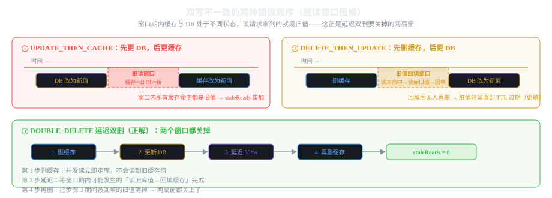

# 第3章 难题三:缓存一致性(穿透/击穿/雪崩/双写)

> 一句话讲清:**DB 和缓存是两个系统,任何更新操作都有一段「不一致窗口」。
> 5 个方案里 3 个是正解(裸缓存的防护版、延迟双删、订阅 binlog),
> 2 个是错误顺序对照,专门演示窗口里发生了什么。**
> **关键概念:缓存回填时盖数据库版本戳,读时比对版本判定脏读——这是本教程的杀手级设计。**

## 3.1 缓存四大难题

```
┌──────────────────────────────────────────────────────────┐
│ 缓存穿透  查一个不存在的数据，每次都打库                       │
│            缓存永远装不进去 → 缓存失效                        │
├──────────────────────────────────────────────────────────┤
│ 缓存击穿  热点 key 过期的瞬间，N 个并发全部打库                │
│            缓存空了，但 DB 还没回填 → 缓存暂时失效             │
├──────────────────────────────────────────────────────────┤
│ 缓存雪崩  大量 key 同时过期，DB 被打爆                        │
│            比如启动时一起预热、或都设了同一 TTL → 整体失效    │
├──────────────────────────────────────────────────────────┤
│ 双写不一致  DB 改了缓存没改（或反之）                          │
│            读到的还是旧值 → 一致性失效                       │
└──────────────────────────────────────────────────────────┘
```

**前三个是「缓存失效」,解法是「让缓存永远不失效」(空值缓存 + 互斥锁)。**
**后一个是「不一致」,解法是「缩短/消除窗口」(延迟双删 / 订阅 binlog)。**

## 3.2 五个方案总览

| 方案 | 类型 | 解决什么 | 代价 |
|------|------|---------|------|
| **BARE** | 反面教材 | 无 | 穿透+击穿全踩 |
| **LOCK** | 正解 | 穿透 + 击穿 | 加锁有延迟,空值有占位 |
| **DOUBLE_DELETE** | 正解 | 双写一致性 | 更新路径多 1 次删除 + 延迟 |
| **UPDATE_THEN_CACHE** | 错误对照① | 先改 DB 再改缓存 | 窗口内全脏读 |
| **DELETE_THEN_UPDATE** | 错误对照② | 先删缓存再改 DB | 旧值回填长期驻留 |

**为什么保留两个错误方案?**
教学上,「先理解为什么错」比「直接给正解」重要。
两个错误顺序覆盖了双写一致性的两种典型坑——
一个让缓存**短期脏**,一个让缓存**长期脏**——
延迟双删要消灭的是这两个窗口的**并集**。

## 3.3 搭建:第三个独立 Maven 工程

```
cache-consistency/src/main/java/com/example/cache/
├── CacheConsistencyApplication.java
├── api/StockController.java
├── domain/
│   ├── Solver.java           方案枚举(5 个)
│   ├── StockSnapshot.java    返回值
│   └── QueryMetrics.java     指标
├── store/                    「基础设施层」(真实是 Redis + MySQL)
│   ├── CacheStore.java       模拟 Redis(带 TTL + 版本戳)
│   ├── Database.java         模拟 MySQL(带版本号)
│   ├── DistributedLock.java  模拟 Redis SETNX 锁
│   └── MetricsRegistry.java  脏读 + 耗时指标
└── application/              业务层
    ├── BareCacheSolver.java       方案A
    ├── LockCacheSolver.java       方案B
    ├── DoubleDeleteSolver.java    方案C
    ├── WrongOrderSolver.java      错误对照
    └── StockQueryFacade.java      门面
```

### 3.3.1 核心设计:版本戳判定脏读

**这是本模块最精妙的设计,值得先讲清楚。**

```java
// CacheStore 里,缓存条目不仅存值和 TTL,还存"回填时数据库的版本"
private record CacheEntry(Object value, long expireAt, long dbVersion) { }

// Database 里,每次写操作自增版本号
public void decrease(String productId, int delta) {
    stocks.computeIfPresent(productId, (k, v) -> v - delta);
    versions.merge(productId, 1L, Long::sum);  // ← 版本号 +1
}

// 读路径:命中缓存后,比对"缓存版本" vs "DB 当前版本"
if (cacheStore.loadedVersion(cacheKey) < database.versionOf(productId)) {
    metricsRegistry.recordStaleRead();  // ← 脏读!
}
```

**为什么需要这个?**
正常情况下「读到旧值」是不可避免的瞬态——
你必须有一种**可量化**的方式来证明「方案 A 比方案 C 多读了几次旧值」。
版本戳就是这个量化手段。

**真实场景对应什么?**
- **Redis 没有版本号**——只能用 TTL 控制一致性边界
- **MySQL 有 binlog 位点**——订阅 binlog 异步删缓存正是用位点判定「缓存是否落后」
- **本教程用版本号模拟 binlog 位点**——所以延迟双删和 binlog 方案在本教程里是「同一类」

## 3.4 领域模型

```java
package com.example.cache.domain;

/** 解法枚举 */
public enum Solver {
    /** 方案A:裸缓存,无任何防护 */
    BARE,
    /** 方案B:空值缓存 + 互斥锁重建,防穿透防击穿 */
    LOCK,
    /** 方案C:延迟双删,保证双写最终一致 */
    DOUBLE_DELETE,
    /** 错误顺序对照①:先更新 DB 再更新缓存 */
    UPDATE_THEN_CACHE,
    /** 错误顺序对照②:先删缓存再更新 DB */
    DELETE_THEN_UPDATE
}
```

```java
package com.example.cache.domain;

/** 商品库存快照 */
public record StockSnapshot(String productId, int stock, boolean cached) {}
```

```java
package com.example.cache.domain;

/**
 * 缓存一致性指标。
 * @param dbCalls      数据库调用次数(穿透/击穿的直接代价)
 * @param cacheHits    缓存命中次数
 * @param staleReads   读到旧值(脏读)的次数
 * @param elapsedMillis 最近一次查询的真实耗时
 */
public record QueryMetrics(int dbCalls, int cacheHits, int staleReads, long elapsedMillis) {}
```

**注意 `staleReads` 这个指标**——
它是双写一致性方案的核心评价维度。
其他三个指标(读次数、缓存命中、耗时)是性能指标,
**`staleReads` 是正确性指标**——分布式系统里,正确性往往比性能更值钱。

## 3.5 基础设施层

### 3.5.1 CacheStore:带 TTL + 版本戳的缓存

```java
@Component
public class CacheStore {
    private final Map<String, CacheEntry> cache = new ConcurrentHashMap<>();
    private final AtomicInteger cacheHits = new AtomicInteger(0);

    /** 缓存条目:值 + 过期时间 + 回填时盖的数据库版本 */
    private record CacheEntry(Object value, long expireAt, long dbVersion) {
        boolean expired() { return System.currentTimeMillis() > expireAt; }
    }

    /** 读缓存:null = 未命中或过期,NULL_MARKER = 命中空值缓存 */
    public Object get(String key) {
        CacheEntry entry = cache.get(key);
        if (entry == null || entry.expired()) {
            cache.remove(key);
            return null;
        }
        cacheHits.incrementAndGet();
        return entry.value();
    }

    /** 读缓存条目回填时盖的数据库版本(配合 versionOf 判定脏读) */
    public long loadedVersion(String key) {
        CacheEntry entry = cache.get(key);
        return entry == null ? -1L : entry.dbVersion();
    }

    /** 写缓存,带 TTL,并盖上当前数据库版本 */
    public void put(String key, Object value, long ttlMillis, long dbVersion) {
        cache.put(key, new CacheEntry(value, System.currentTimeMillis() + ttlMillis, dbVersion));
    }

    public void delete(String key) { cache.remove(key); }
    public void clear() { cache.clear(); }
    public int cacheHits() { return cacheHits.get(); }
    public void resetMetrics() { cacheHits.set(0); }
}
```

**注意 `get` 里过期就 remove**——
避免过期条目一直占内存。
**这是 Redis TTL 的简化模拟**:Redis 用 lazy + active expiration,内存 Map 直接判断即可。

### 3.5.2 Database:带版本号的数据库

```java
@Component
public class Database {
    private final Map<String, Integer> stocks = new ConcurrentHashMap<>();
    private final Map<String, Long> versions = new ConcurrentHashMap<>();
    private final AtomicInteger dbCalls = new AtomicInteger(0);
    private final long queryDelayMs;   // 模拟查询耗时

    public Database() { this(0L); }
    public Database(long queryDelayMs) {
        this.queryDelayMs = queryDelayMs;
        stocks.put("P001", 100);
        stocks.put("P002", 50);
    }

    private void simulateQueryDelay() {
        if (queryDelayMs > 0) {
            try { Thread.sleep(queryDelayMs); }
            catch (InterruptedException e) { Thread.currentThread().interrupt(); }
        }
    }

    /** 查询库存(每次计数,真实场景就是一次 SQL) */
    public Integer findStock(String productId) {
        dbCalls.incrementAndGet();
        simulateQueryDelay();
        return stocks.get(productId);
    }

    /** 扣减库存(每次计数),写操作自增版本号 */
    public void decrease(String productId, int delta) {
        dbCalls.incrementAndGet();
        simulateQueryDelay();
        if (stocks.containsKey(productId)) {
            versions.merge(productId, 1L, Long::sum);   // ← 版本 +1
        }
        stocks.computeIfPresent(productId, (k, v) -> v - delta);
    }

    /** 当前数据版本(从未写为 0) */
    public long versionOf(String productId) {
        return versions.getOrDefault(productId, 0L);
    }

    public int dbCalls() { return dbCalls.get(); }
    public void resetMetrics() { dbCalls.set(0); }
}
```

**`queryDelayMs` 是干嘛的?**
- 默认 0:内存操作纳秒级,看不到并发窗口
- 设为 100ms:模拟真实 SQL 的几十毫秒延迟,**让并发穿透/击穿可观测**

**这是分布式教学的关键:真实网络延迟是看不见的手,但你能通过模拟延迟把它「显性化」。**

### 3.5.3 DistributedLock:Redis SETNX 的进程内模拟

```java
@Component
public class DistributedLock {
    private final ConcurrentHashMap<String, ReentrantLock> locks = new ConcurrentHashMap<>();

    /** 获取锁(阻塞式,最多等待 timeout) */
    public boolean tryLock(String key, long timeoutMs) {
        ReentrantLock lock = locks.computeIfAbsent(key, k -> new ReentrantLock());
        try {
            return lock.tryLock(timeoutMs, TimeUnit.MILLISECONDS);
        } catch (InterruptedException e) {
            Thread.currentThread().interrupt();
            return false;
        }
    }

    public void unlock(String key) {
        ReentrantLock lock = locks.get(key);
        if (lock != null && lock.isHeldByCurrentThread()) {
            lock.unlock();
        }
    }
}
```

**真实 Redis 实现长这样:**
```lua
-- SETNX 加锁
SET lock:stock:P001 "owner-{uuid}" NX EX 2

-- 释放锁:Lua 脚本保证原子性(先检查 owner 再删,防止误删别人的锁)
if redis.call("GET", KEYS[1]) == ARGV[1] then
    return redis.call("DEL", KEYS[1])
end
return 0
```

**注意 `unlock` 里检查 `isHeldByCurrentThread`**——
真实 Redis 里对应「先 GET 验证 owner 再 DEL」,
**否则线程 A 超时后线程 B 拿了锁,A 醒来时把 B 的锁删了**。
这是分布式锁最经典的坑。

### 3.5.4 MetricsRegistry:脏读 + 耗时

```java
@Component
public class MetricsRegistry {
    private final AtomicInteger staleReads = new AtomicInteger(0);
    private final Map<String, Long> timings = new ConcurrentHashMap<>();
    private volatile long lastElapsedMillis = 0L;

    public void recordStaleRead() { staleReads.incrementAndGet(); }
    public int staleReads() { return staleReads.get(); }

    public void recordTiming(String solver, long millis) {
        timings.put(solver, millis);
        lastElapsedMillis = millis;
    }
    public long lastElapsedMillis() { return lastElapsedMillis; }
    public Long timingOf(String solver) { return timings.get(solver); }
    public void reset() { staleReads.set(0); timings.clear(); lastElapsedMillis = 0L; }
}
```

## 3.6 方案 A:BareCacheSolver(反面教材)

```java
@Component
public class BareCacheSolver {
    private static final long CACHE_TTL_MS = 30_000L;
    private static final String CACHE_PREFIX = "stock:";

    private final CacheStore cacheStore;
    private final Database database;
    private final MetricsRegistry metricsRegistry;

    public BareCacheSolver(CacheStore c, Database d, MetricsRegistry m) {
        this.cacheStore = c; this.database = d; this.metricsRegistry = m;
    }

    /** 查询库存:命中缓存直接返回,未命中查库回填 */
    public StockSnapshot query(String productId) {
        String cacheKey = CACHE_PREFIX + productId;
        Object cached = cacheStore.get(cacheKey);
        if (cached != null) {
            // 命中也比对版本,统计脏读
            if (cacheStore.loadedVersion(cacheKey) < database.versionOf(productId)) {
                metricsRegistry.recordStaleRead();
            }
            return new StockSnapshot(productId, (Integer) cached, true);
        }
        // 未命中 → 查数据库(穿透/击穿的代价集中在这里)
        Integer stock = database.findStock(productId);
        if (stock != null) {
            cacheStore.put(cacheKey, stock, CACHE_TTL_MS, database.versionOf(productId));
        }
        return new StockSnapshot(productId, stock == null ? 0 : stock, false);
    }
}
```

**为什么这是反面教材?**

**问题①:缓存穿透**
```java
Integer stock = database.findStock(productId);  // ← 不存在的数据,每次打库
if (stock != null) {                            // ← null 不缓存
    cacheStore.put(...);
}
```
不存在的商品每次都查库,因为查出来是 null,缓存装不进去。
**攻击者可以用不存在的 ID 把数据库打爆。**

**问题②:缓存击穿**
热点 key 过期瞬间:
```
T0: 缓存过期
T0+1ms: 100 个并发请求同时进来
T0+1ms: 全部 cacheStore.get() 返回 null
T0+1ms: 100 个请求同时调 database.findStock() ← DB 被打 100 次!
T0+50ms: 第 1 个请求回填缓存
T0+51ms: 剩下 99 个请求还是没缓存,继续打库
```
**没有锁的话,缓存击穿会让数据库瞬间被同样的请求打 N 次。**

## 3.7 方案 B:LockCacheSolver(防穿透 + 防击穿)

```java
@Component
public class LockCacheSolver {
    private static final long CACHE_TTL_MS = 30_000L;
    private static final long NULL_TTL_MS = 3_000L;     // 空值缓存短 TTL
    private static final long LOCK_TIMEOUT_MS = 2_000L;
    private static final String CACHE_PREFIX = "stock:";
    private static final String LOCK_PREFIX = "lock:stock:";
    private static final Object NULL_MARKER = new Object();

    public StockSnapshot query(String productId) {
        String cacheKey = CACHE_PREFIX + productId;
        Object cached = cacheStore.get(cacheKey);
        if (cached != null) {
            // 命中空值缓存 → 商品不存在,直接返回 0 库存
            if (cached == NULL_MARKER) {
                return new StockSnapshot(productId, 0, true);
            }
            recordStaleReadIfStale(cacheKey, productId);
            return new StockSnapshot(productId, (Integer) cached, true);
        }

        // 缓存未命中 → 尝试拿锁
        String lockKey = LOCK_PREFIX + productId;
        boolean locked = distributedLock.tryLock(lockKey, LOCK_TIMEOUT_MS);
        try {
            // 拿锁后二次检查(double check)
            Object recheck = cacheStore.get(cacheKey);
            if (recheck != null) {
                if (recheck != NULL_MARKER) {
                    recordStaleReadIfStale(cacheKey, productId);
                }
                return new StockSnapshot(productId, recheck == NULL_MARKER ? 0 : (Integer) recheck, true);
            }
            // 真正查库
            Integer stock = database.findStock(productId);
            if (stock == null) {
                // ★ 空值缓存:不存在的商品也缓存,防穿透 ★
                cacheStore.put(cacheKey, NULL_MARKER, NULL_TTL_MS, database.versionOf(productId));
                return new StockSnapshot(productId, 0, false);
            }
            cacheStore.put(cacheKey, stock, CACHE_TTL_MS, database.versionOf(productId));
            return new StockSnapshot(productId, stock, false);
        } finally {
            if (locked) {
                distributedLock.unlock(lockKey);
            }
        }
    }

    private void recordStaleReadIfStale(String cacheKey, String productId) {
        if (cacheStore.loadedVersion(cacheKey) < database.versionOf(productId)) {
            metricsRegistry.recordStaleRead();
        }
    }
}
```

**两道防线:**

**① 空值缓存(防穿透)**
```java
if (stock == null) {
    cacheStore.put(cacheKey, NULL_MARKER, NULL_TTL_MS, ...);
    return new StockSnapshot(productId, 0, false);
}
```
不存在的商品也缓存,但用**短 TTL(3 秒)**而不是正常的 30 秒——
**短 TTL 是因为业务可能下一秒就创建这个商品,长期缓存会读到错的「不存在」**。
**这是一个重要的细节:空值缓存的 TTL 必须远小于正常值的 TTL。**

**② 互斥锁重建(防击穿)**
```java
boolean locked = distributedLock.tryLock(lockKey, LOCK_TIMEOUT_MS);
```
热点 key 过期瞬间,100 个并发进来,只有 1 个能拿到锁,
其余 99 个等锁,等锁期间第 1 个已经把缓存回填了——
**拿锁后 double check 发现缓存已存在,直接返回,不打库。**
**击穿窗口从「N 个并发打 N 次库」降为「1 个打库」。**

**还有一个细节:为什么锁超时也要打库?**
```java
// 真实场景可改为继续等待重读缓存或快速失败,教学演示从简
```
锁超时意味着锁竞争严重,真实场景应该:
- **快速失败**(返回缓存或报错)——避免雪崩
- **或重试**——但要退避

本教程简化为「超时就打库」,这是为了让教学焦点在锁机制本身,
**真实生产应该有更细的超时策略**。

## 3.8 方案 C:DoubleDeleteSolver(延迟双删)


*图 3-1:两种错误顺序的脏读窗口 + 延迟双删的时间线*

```java
@Component
public class DoubleDeleteSolver {
    private static final long CACHE_TTL_MS = 30_000L;
    private static final long DELETE_DELAY_MS = 50L;     // 延迟时长(教学用 50ms)
    private static final String CACHE_PREFIX = "stock:";

    /** 查询库存(读路径与方案A 相同) */
    public StockSnapshot query(String productId) {
        String cacheKey = CACHE_PREFIX + productId;
        Object cached = cacheStore.get(cacheKey);
        if (cached != null) {
            if (cacheStore.loadedVersion(cacheKey) < database.versionOf(productId)) {
                metricsRegistry.recordStaleRead();
            }
            return new StockSnapshot(productId, (Integer) cached, true);
        }
        Integer stock = database.findStock(productId);
        if (stock != null) {
            cacheStore.put(cacheKey, stock, CACHE_TTL_MS, database.versionOf(productId));
        }
        return new StockSnapshot(productId, stock == null ? 0 : stock, false);
    }

    /** 扣减库存:延迟双删 */
    public int decrease(String productId, int delta) {
        String cacheKey = CACHE_PREFIX + productId;
        // 第1步:先删缓存
        cacheStore.delete(cacheKey);
        // 第2步:更新数据库
        database.decrease(productId, delta);
        Integer updated = database.findStock(productId);
        // 第3步:短暂延迟(等并发读回填完成)
        try { Thread.sleep(DELETE_DELAY_MS); }
        catch (InterruptedException e) { Thread.currentThread().interrupt(); }
        // 第4步:再删缓存
        cacheStore.delete(cacheKey);
        return updated == null ? 0 : updated;
    }
}
```

**为什么延迟双删是「正解」?**

### 3.8.1 两个错误顺序的窗口

**错误①:先改 DB 再改缓存(UPDATE_THEN_CACHE)**
```
T0: DB 从 100 → 95(已更新)
T1: 缓存还是 100(未更新)
T2: 读请求命中缓存,读到 100 ← 脏读!
... 窗口内所有读都是脏读 ...
T3: 更新缓存为 95(窗口关闭)
```
**问题:窗口期内所有缓存命中都是脏读。** 但窗口关闭后(缓存已更新)就一致了——
**这是短期脏读,可以容忍但需要观察**。

**错误②:先删缓存再改 DB(DELETE_THEN_UPDATE)**
```
T0: 缓存被删
T1: 读请求未命中,查 DB 拿到 100(还是旧值,因为 DB 还没改)
T2: 读请求把 100 回填到缓存
T3: DB 更新为 95
T4: 读请求命中缓存,读到 100 ← 脏读!
... 直到 TTL 过期,这份 100 一直留在缓存里 ...
```
**问题:旧值被回填,且没人再删——脏读持续到 TTL 过期(30 秒!)**
**这是长期脏读,远比错误①严重。**

### 3.8.2 延迟双删怎么消灭两个窗口

```
T0: 删缓存(消除窗口① 的"DB 已改缓存未改")
T1: 更新 DB
T2: 延迟 50ms
    ← 这 50ms 内,如果有读请求回填了旧值,会被下一步清掉
T3: 再删缓存(消除窗口② 的"旧值回填")
T4: 读请求未命中,重新查库拿到新值,回填新缓存
```

**延迟 50ms 是关键**——
它必须**大于「一次 SQL 查询 + 一次缓存写入」的耗时**。
真实场景通常 100-500ms,因为网络 + DB 慢查询。
**延迟太短 → 回填还没发生就删了,旧值残留;延迟太长 → 写路径变慢。**

### 3.8.3 延迟双删的局限

**延迟双删不是绝对正确的——**
- 如果并发写操作重叠,仍可能出现短暂不一致
- 延迟值需要调优,环境不同结果不同
- 第二次删除可能因为网络失败而没执行——**要有重试机制**

**生产环境更彻底的做法:订阅 binlog 异步删缓存**
```
业务代码更新 DB → binlog → Canal → 发 MQ → 缓存删除消费者 → DEL key
```
**这种方案业务代码完全不用关心缓存——只有 DB 写操作,缓存维护是异步旁路。**
代价:延迟更长(几百毫秒),需要维护 Canal + MQ 链路。

## 3.9 错误对照:WrongOrderSolver

```java
@Component
public class WrongOrderSolver {
    private static final long CACHE_TTL_MS = 30_000L;
    private static final long WRITE_DELAY_MS = 200L;     // 模拟写操作的网络耗时
    private static final String CACHE_PREFIX = "stock:";

    /** 查询(同方案A + 脏读检测) */
    public StockSnapshot query(String productId) { /* 同上,省略 */ }

    /** 按错误顺序扣减 */
    public int decrease(String productId, int delta, Solver order) {
        return switch (order) {
            case UPDATE_THEN_CACHE -> decreaseUpdateThenCache(productId, delta);
            case DELETE_THEN_UPDATE -> decreaseDeleteThenUpdate(productId, delta);
            default -> throw new IllegalArgumentException("不是错误顺序: " + order);
        };
    }

    /** 错误顺序①:先更新 DB,隔了 200ms 才更新缓存 */
    private int decreaseUpdateThenCache(String productId, int delta) {
        String cacheKey = CACHE_PREFIX + productId;
        database.decrease(productId, delta);                 // T0: 更新 DB
        Integer updated = database.findStock(productId);
        sleep(WRITE_DELAY_MS);                              // T0-T1: 200ms 窗口
        cacheStore.put(cacheKey, updated, CACHE_TTL_MS, database.versionOf(productId));  // T1: 更新缓存
        return updated == null ? 0 : updated;
    }

    /** 错误顺序②:先删缓存,隔了 200ms 才更新 DB */
    private int decreaseDeleteThenUpdate(String productId, int delta) {
        String cacheKey = CACHE_PREFIX + productId;
        cacheStore.delete(cacheKey);                        // T0: 删缓存
        sleep(WRITE_DELAY_MS);                              // T0-T1: 200ms 窗口(并发读回填旧值)
        database.decrease(productId, delta);                 // T1: 更新 DB
        Integer updated = database.findStock(productId);
        return updated == null ? 0 : updated;
    }
}
```

**注意 `WRITE_DELAY_MS = 200ms` 把窗口撑大到可观察**——
真实写操作可能几十毫秒就完成,窗口小得看不出来脏读。
**教学必须放大窗口,你才能在指标上看到 staleReads 增加。**

**这就是分布式教学的核心手法:把真实世界的「瞬态」放大,才能在桌面环境看到。**

## 3.10 门面:同一个 API 切方案

```java
@Component
public class StockQueryFacade {
    // 注入 4 个 solver + 3 个基础设施

    /** 按方案查询库存,并记录耗时 */
    public StockSnapshot query(Solver solver, String productId) {
        long start = System.nanoTime();
        StockSnapshot snapshot = switch (solver) {
            case BARE -> bareCacheSolver.query(productId);
            case LOCK -> lockCacheSolver.query(productId);
            case DOUBLE_DELETE -> doubleDeleteSolver.query(productId);
            case UPDATE_THEN_CACHE, DELETE_THEN_UPDATE -> wrongOrderSolver.query(productId);
        };
        metricsRegistry.recordTiming(solver.name(), (System.nanoTime() - start) / 1_000_000);
        return snapshot;
    }

    /** 扣减库存(写路径) */
    public int decrease(Solver solver, String productId, int delta) {
        return switch (solver) {
            case DOUBLE_DELETE -> doubleDeleteSolver.decrease(productId, delta);
            case UPDATE_THEN_CACHE -> wrongOrderSolver.decrease(productId, delta, Solver.UPDATE_THEN_CACHE);
            case DELETE_THEN_UPDATE -> wrongOrderSolver.decrease(productId, delta, Solver.DELETE_THEN_UPDATE);
            default -> throw new IllegalArgumentException("方案 " + solver + " 不提供写路径");
        };
    }

    /** 汇总指标 */
    public QueryMetrics metrics() {
        return new QueryMetrics(
            database.dbCalls(),
            cacheStore.cacheHits(),
            metricsRegistry.staleReads(),
            metricsRegistry.lastElapsedMillis()
        );
    }
}
```

**注意:`metrics()` 不能把各方案计数器相加**——
BARE/LOCK/DOUBLE_DELETE 共用同一个 `Database` 和 `CacheStore`,
**dbCalls 和 cacheHits 是全局的,每个方案看到的都是同一份计数。**
**staleReads 也是全局的**(因为脏读检测在每个 solver 里都做)。

这是 metrics 设计的常见陷阱:**指标聚合时要考虑共享资源,不要重复计数。**

## 3.11 控制层 + 错误处理

```java
@RestController
@RequestMapping("/api/stocks")
public class StockController {
    private final StockQueryFacade facade;
    public StockController(StockQueryFacade facade) { this.facade = facade; }

    @GetMapping("/{productId}")
    public StockSnapshot query(@RequestParam(defaultValue = "LOCK") Solver solver,
                               @PathVariable String productId) {
        return facade.query(solver, productId);
    }

    @PostMapping("/{productId}/decrease")
    public StockSnapshot decrease(@PathVariable String productId,
                                  @RequestParam(defaultValue = "1") int delta,
                                  @RequestParam(defaultValue = "DOUBLE_DELETE") Solver solver) {
        int stock = facade.decrease(solver, productId, delta);
        return new StockSnapshot(productId, stock, false);
    }

    @GetMapping("/metrics")
    public QueryMetrics metrics() { return facade.metrics(); }

    /** 参数组合无效返回 400,而不是未处理异常的 500 */
    @ExceptionHandler(IllegalArgumentException.class)
    public ResponseEntity<String> badRequest(IllegalArgumentException e) {
        return ResponseEntity.badRequest().body(e.getMessage());
    }
}
```

**为什么用 `@ExceptionHandler`?**
如果没这个,`IllegalArgumentException` 会冒泡成 500 错误。
**前端拿到 500 不知道是参数错还是服务崩了**——这是生产环境的可观测性反模式。

## 3.12 跑起来观察三种场景

```powershell
cd cache-consistency
mvn package -DskipTests
java -jar target\cache-consistency-0.0.1-SNAPSHOT.jar
```

### 场景 1:缓存穿透对比

```powershell
# 查不存在的商品 P999
# 方案A 裸缓存:每次都打库
for ($i=0; $i -lt 5; $i++) {
    curl.exe "http://localhost:8080/api/stocks/P999?solver=BARE"
}
# 方案B 空值缓存:第 1 次打库,后 4 次命中空值缓存
for ($i=0; $i -lt 5; $i++) {
    curl.exe "http://localhost:8080/api/stocks/P999?solver=LOCK"
}
```

```powershell
curl.exe "http://localhost:8080/api/stocks/metrics"
```

**预期指标:**
```json
{
  "dbCalls": 6,        ← BARE 5 次 + LOCK 1 次
  "cacheHits": 4,      ← LOCK 命中空值缓存 4 次
  "staleReads": 0
}
```
**5 倍差距**——同样的请求量,BARE 打库 5 次,LOCK 打库 1 次。

### 场景 2:缓存击穿对比(需要并发压测)

```powershell
# 先让缓存过期(等 30 秒)
# 然后并发 10 个请求
$jobs = 1..10 | ForEach-Object {
    Start-Job { curl.exe "http://localhost:8080/api/stocks/P001?solver=BARE" }
}
$jobs | Wait-Job | Receive-Job
```

**预期:**
- BARE:10 个并发全部打库,dbCalls +10
- LOCK:1 个打库 + 9 个等锁后命中缓存,dbCalls +1

**这就是锁的价值:把 N 次库访问降为 1 次。**

### 场景 3:双写一致性对比

```powershell
# 先读一次预热缓存
curl.exe "http://localhost:8080/api/stocks/P001?solver=BARE"
# 用不同顺序更新
curl.exe -X POST "http://localhost:8080/api/stocks/P001/decrease?delta=5&solver=UPDATE_THEN_CACHE"
curl.exe -X POST "http://localhost:8080/api/stocks/P001/decrease?delta=5&solver=DELETE_THEN_UPDATE"
curl.exe -X POST "http://localhost:8080/api/stocks/P001/decrease?delta=5&solver=DOUBLE_DELETE"

# 观察脏读
curl.exe "http://localhost:8080/api/stocks/metrics"
```

**预期指标差异:**
- `UPDATE_THEN_CACHE`:staleReads 增加(窗口内读到的都是旧值)
- `DELETE_THEN_UPDATE`:staleReads 大幅增加(旧值回填,长期驻留)
- `DOUBLE_DELETE`:staleReads 最少(延迟双删消除了两个窗口)

## 3.13 一个反直觉的发现

**很多教程说「先更新缓存再更新 DB」也能行——其实是错的。**

```
T0: 更新缓存为 95
T1: 读请求命中缓存,读到 95 ← 看起来对了
T2: 更新 DB 为 95(成功)
T3: 写 DB 时突然崩溃!
```

**问题:** DB 还是 100,缓存是 95——**不一致且无解**。
因为 DB 写失败了,而缓存已经改了,没有「回滚缓存」的机制(除非事务跨系统)。

**所以正确的双写顺序只能是:**
- **先改 DB,再改缓存**(错误①,短期脏)
- **先删缓存,改 DB,延迟再删缓存**(方案C,最终一致)

**永远不要「先改缓存再改 DB」——这是分布式双写的铁律。**

## 3.14 设计取舍总结

| 方案 | 防穿透 | 防击穿 | 防雪崩 | 双写一致性 | 实现复杂度 |
|------|--------|--------|--------|-----------|-----------|
| BARE | ✗ | ✗ | ✗ | ✗ | 最低 |
| LOCK | ✓(空值缓存) | ✓(互斥锁) | 部分(随机 TTL) | ✗ | 中 |
| DOUBLE_DELETE | ✗(读路径) | ✗(读路径) | ✗ | ✓ | 中 |
| binlog 订阅 | ✗ | ✗ | ✗ | ✓✓(最彻底) | 高 |

**实际生产中通常组合使用:**
- **LOCK 的读路径**(空值缓存 + 互斥锁)防止读侧打爆 DB
- **DOUBLE_DELETE 的写路径**(延迟双删)保证写侧最终一致
- **TTL 加随机抖动**防止雪崩

## 3.15 面试速答

**Q1:缓存穿透、击穿、雪崩分别是什么?怎么解决?**
A:"穿透是查不存在的数据每次都打库,用空值缓存或布隆过滤器解决。
击穿是热点 key 过期瞬间 N 个并发全打库,用互斥锁重建解决。
雪崩是大量 key 同时过期,用 TTL 加随机抖动或本地缓存兜底解决。"

**Q2:延迟双删为什么能解决双写一致性?**
A:"先删缓存 + 改 DB + 延迟 + 再删缓存。
第一次删消除了'先改 DB 再改缓存'的短期脏读;
延迟让并发读的旧值回填有机会发生;
第二次删清掉回填的旧值。
本质是把两个错误顺序的窗口合并消灭。"

**Q3:延迟双删的延迟时间怎么定?**
A:"必须大于'一次 DB 写 + 一次缓存写'的耗时。
生产通常 100-500ms,要看实际环境的 DB 慢查询分布。
延迟太短旧值残留,太长写路径变慢。
更彻底的做法是订阅 binlog 异步删缓存,延迟由 Canal 链路决定,业务代码无感。"

**Q4:你为什么用版本号判定脏读?**
A:"因为分布式里'读到旧值'是不可避免瞬态,只能量化不能消除。
缓存回填时盖当时 DB 的版本,读时比对缓存版本 vs DB 当前版本,
小于就是脏读。真实场景 Redis 没有版本号,对应的是 binlog 位点。
这个量化手段是评估双写方案优劣的基础。"

**Q5:先改缓存再改 DB 为什么不行?**
A:"因为 DB 写可能失败,但缓存已经改了——没有跨系统的事务回滚机制。
先改 DB 失败还能保持原状,先改缓存失败就是'缓存脏且无法回滚'。
所以正确顺序永远是先 DB 后缓存(或先删缓存),永不先缓存后 DB。"
