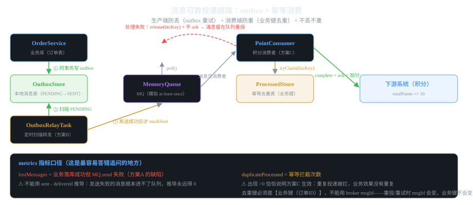

# 第4章 难题四:消息可靠性(丢失 + 重复)

> 一句话讲清:**消息可靠性是两个独立难题:① 消息丢失(生产者侧,用 outbox 解决)
> ② 消息重复(消费者侧,用幂等解决)。**
> **outbox 让"业务落库 + 消息发送"原子化;幂等让"重复消息 = 一次业务效果"。**
> 两个合起来才是端到端可靠——只做一个都不够。


*图 4-1:outbox 可靠投递(生产者侧) + 幂等消费(消费者侧) 全链路*

## 4.1 两个独立难题

```
┌──────────────────────────────────────────────────────────┐
│ 难题① 消息丢失(生产者侧)                                   │
│   业务落库成功 → 发 MQ → 网络抖动/服务崩溃 → 消息丢了          │
│   后果:下游永远不知道,数据不一致                              │
├──────────────────────────────────────────────────────────┤
│ 难题② 消息重复(消费者侧)                                    │
│   MQ 重投/ack 丢失/消费者重试 → 同一条消息消费多次              │
│   后果:用户被加两次积分,订单被重复创建                        │
└──────────────────────────────────────────────────────────┘
```

**这两个难题经常被混为一谈,但它们是两个独立的维度:**

| 维度 | 谁的责任 | 解决手段 |
|------|---------|---------|
| **消息丢失** | 生产者(发送方) | outbox / 事务消息 / 重试 |
| **消息重复** | 消费者(接收方) | 幂等(基于业务键去重) |

**MQ 自己只能保证 at-least-once**(至少投递一次)——这意味着:
- **不丢**:业务侧消息一定进过队列
- **但可能重复**:同一条消息会被投多次

**所以消费者的幂等是必须的——不管生产者用不用 outbox。**

## 4.2 三种解法总览

| 方案 | 生产者策略 | 消费者策略 | 可靠性 | 复杂度 |
|------|-----------|-----------|--------|--------|
| **A 直接发** | `db.save(); mq.send()` | 无幂等 | 丢消息 | 最低 |
| **B outbox** | `db.save() + outbox.insert()`(同事务) | 无幂等 | 不丢 | 中 |
| **C 完整链路** | outbox 转发 | 幂等消费 | 不丢 + 不重 | 高 |

**生产环境标准答案 = B + C(生产者 outbox + 消费者幂等)。**
本教程把这条链路完整走一遍。

## 4.3 搭建:第四个独立 Maven 工程

```
msg-reliability/src/main/java/com/example/msg/
├── MsgReliabilityApplication.java
├── api/OrderController.java
├── domain/
│   ├── Order.java              订单(业务数据)
│   ├── MessageStatus.java      PENDING / SENT
│   └── DeliveryMetrics.java    指标(6 个维度)
├── store/                      「基础设施」(真实是 MySQL + MQ + Redis)
│   ├── MemoryQueue.java        模拟 MQ(支持故障注入)
│   ├── OutboxStore.java        本地消息表(方案B核心)
│   └── ProcessedStore.java     幂等去重表(方案C核心)
├── order/OrderService.java     业务方(两种发消息方式)
├── outbox/OutboxRelayTask.java outbox 转发任务
├── point/PointConsumer.java    积分消费者(幂等)
└── application/OrderFacade.java 门面
```

**注意:这个模块没有 Solver 枚举**——
因为生产者和消费者是两端的独立选择,不是一个 switch 能切完的。
用不同 API 路径表达不同方案:
- `/direct` → 方案 A
- `/reliable` → 方案 B(outbox)
- `/consume` → 方案 C(幂等消费)

## 4.4 领域模型

### 4.4.1 DeliveryMetrics:6 个维度的指标

```java
package com.example.msg.domain;

/**
 * 消息可靠性指标。
 *
 * @param sentCount          已发送(进过 MQ 队列)的消息数
 * @param deliveredCount     已投递的消息数(队列中未消费 + 已成功处理的)
 * @param processedCount     成功处理的业务键数
 * @param outboxPending      outbox 中尚未发送的消息数(方案B可靠性体现)
 * @param lostMessages       丢失的消息数(方案A缺陷体现)
 * @param duplicateProcessed 重复投递被幂等拦截的次数(方案C生效证明)
 */
public record DeliveryMetrics(int sentCount, int deliveredCount, int processedCount,
                              int outboxPending, int lostMessages, int duplicateProcessed) {}
```

**这 6 个指标的口径定义是整个模块最精妙的地方。** 尤其是 `lostMessages`:

**为什么 `lostMessages` 不能是 `sentCount - deliveredCount`?**

```java
// ❌ 错误写法
int lost = memoryQueue.sentCount() - memoryQueue.size() - pointConsumer.processedCount();

// ✓ 正确写法
int lost = orderService.directSendLost();  // 业务方主动计数
```

**因为方案 A 的 send 失败时,消息根本没进队列——`sentCount` 永远为 0,推导永远得 0。**
**所以丢失必须由业务方在「落库成功但 send 抛异常」这一刻主动计数。**

**这是分布式指标的一个通用陷阱:失败路径的指标往往不能用成功路径的数据推导。**

### 4.4.2 Order 和 MessageStatus

```java
package com.example.msg.domain;

public record Order(String orderId, String productId, int quantity) {}

package com.example.msg.domain;

/** outbox 投递生命周期 */
public enum MessageStatus {
    /** 已写入 outbox,尚未发送到 MQ */
    PENDING,
    /** 已发送到 MQ */
    SENT
}
```

## 4.5 基础设施层

### 4.5.1 MemoryQueue:支持故障注入的 MQ 模拟

```java
@Component
public class MemoryQueue {
    private final Map<String, String> messages = new ConcurrentHashMap<>();
    private final Map<Long, String> order = new ConcurrentHashMap<>();
    private final AtomicInteger seq = new AtomicInteger(0);
    private final AtomicInteger sentCount = new AtomicInteger(0);
    private volatile boolean failNext = false;     // ← 故障注入开关

    /** 投递消息;若 failNext 置位则抛异常(模拟 MQ 不可用) */
    public String send(String payload) {
        if (failNext) {
            failNext = false;
            throw new IllegalStateException("MQ 短暂不可用,消息未投递");
        }
        long sequence = seq.incrementAndGet();
        String msgId = "m-" + sequence;
        messages.put(msgId, payload);
        order.put(sequence, msgId);
        sentCount.incrementAndGet();
        return msgId;
    }

    /** 消费者拉取一条消息(模拟 poll,不删除——at-least-once) */
    public QueueMessage poll() {
        for (long i = 1; i <= seq.get(); i++) {
            String msgId = order.get(i);
            if (msgId != null && messages.containsKey(msgId)) {
                return new QueueMessage(msgId, messages.get(msgId));
            }
        }
        return null;
    }

    /** ack:按 broker msgId 删除消息 */
    public void ack(String messageId) { messages.remove(messageId); }

    /** 注入故障:下一次 send 抛异常 */
    public void failNextSend() { this.failNext = true; }

    public record QueueMessage(String id, String payload) {}

    public int sentCount() { return sentCount.get(); }
    public int size() { return messages.size(); }
    public boolean contains(String messageId) { return messages.containsKey(messageId); }
    public void reset() { messages.clear(); order.clear(); seq.set(0); sentCount.set(0); failNext = false; }
}
```

**两个关键设计:**

**① `poll()` 不删除**——模拟 **at-least-once** 语义:
```
消费者 poll() → 拿到消息 → 处理失败/崩溃 → 消息还在队列
                                                     ↓
下次 poll() → 拿到同一条消息(重复投递!)
                                                     ↓
                                                     ↓
                    这就是消息重复的来源
```
**生产环境 RabbitMQ/Kafka/RocketMQ 都是 at-least-once,这是设计选择不是 bug。**

**② `failNext` 是教学神器**——
让你能稳定复现「MQ 短暂不可用」这个线上偶发场景。
没有它,你只能写代码"假设"它会发生,但永远测不到。

### 4.5.2 OutboxStore:本地消息表(方案 B 核心)

```java
@Component
public class OutboxStore {
    private final Map<String, OutboxEntry> entries = new ConcurrentHashMap<>();
    private final AtomicInteger inserted = new AtomicInteger(0);

    public record OutboxEntry(String id, String payload, MessageStatus status) {}

    /** 在「业务事务」内写入一条待发消息 */
    public String insert(String payload) {
        String id = "box-" + inserted.incrementAndGet();
        entries.put(id, new OutboxEntry(id, payload, MessageStatus.PENDING));
        return id;
    }

    /** 扫描所有 PENDING(模拟定时任务的一次轮询) */
    public List<OutboxEntry> findPending() {
        return entries.values().stream()
                .filter(e -> e.status() == MessageStatus.PENDING)
                .collect(Collectors.toList());
    }

    /** 标记某条消息已发送 */
    public void markSent(String messageId) {
        OutboxEntry old = entries.get(messageId);
        if (old != null) {
            entries.put(messageId, new OutboxEntry(messageId, old.payload(), MessageStatus.SENT));
        }
    }

    public int pendingCount() {
        return (int) entries.values().stream()
                .filter(e -> e.status() == MessageStatus.PENDING).count();
    }
}
```

**真实场景对应:**
- **数据库表 `message_outbox`**:`id, payload, status, created_at, sent_at`
- **业务表写入和 outbox 写入在同一数据库事务**——这是原子性的关键
- **定时任务(Quartz/xxl-job)扫描 PENDING 投递到 MQ**

### 4.5.3 ProcessedStore:三步幂等(方案 C 核心)

```java
@Component
public class ProcessedStore {
    /** 处理中:已认领,尚未完成 */
    private final Set<String> processing = ConcurrentHashMap.newKeySet();
    /** 已完成:处理成功,永久去重 */
    private final Set<String> completed = ConcurrentHashMap.newKeySet();

    /** 认领:从未认领过(或上次失败已释放)返回 true */
    public boolean tryClaim(String bizKey) {
        if (completed.contains(bizKey)) {
            return false;          // ← 已完成,永久去重
        }
        return processing.add(bizKey);  // ← 集合的 add 是原子的
    }

    /** 处理成功:先落完成表,再撤销认领 */
    public void complete(String bizKey) {
        completed.add(bizKey);          // ← 先加完成表(关键!)
        processing.remove(bizKey);      // ← 再撤认领
    }

    /** 处理失败:撤销认领,允许重投后重新处理 */
    public void release(String bizKey) {
        processing.remove(bizKey);
    }

    public int processedCount() { return completed.size(); }
}
```

**这三个方法是整个模块最精妙的地方,值得逐字读:**

**① 为什么 `tryClaim` 要先查 `completed` 再加 `processing`?**
- 如果 `completed` 有(已完成),直接返回 false(永久去重)
- 否则 `processing.add()`——`ConcurrentHashMap.newKeySet()` 的 `add` 是**原子操作**
- 这意味着**两个消费者并发抢同一个 bizKey,只有一个能 add 成功**——天然互斥

**② 为什么 `complete` 要先 `completed.add` 再 `processing.remove`?**
- 反过来会出问题:撤了 processing,但在加 completed 之前,
  另一个消费者看到 `processing` 没有它,会 tryClaim 成功,导致重复处理
- 先加 completed,后撤 processing——两步之间另一个消费者查 completed 会命中,跳过

**③ 为什么 `release` 只撤 processing 不撤 completed?**
- `release` 是处理失败时调用的,此时还没加 completed
- 撤 processing 后,重投的消息能重新 tryClaim——这是**幂等的精髓**:
  失败的尝试不算数,可以重试

**④ 真实场景对应什么?**
- **Redis SETNX**:`SET processed:{bizKey} {status} NX`
- 或**数据库唯一索引**:`CREATE TABLE processed_messages (biz_key VARCHAR, status VARCHAR, UNIQUE(biz_key))`
- 或**幂等表**:`INSERT IGNORE INTO processed (biz_key, ...)` 用 INSERT 的唯一约束实现

## 4.6 业务方:两种发消息方式

```java
@Service
public class OrderService {
    private final Map<String, Order> orders = new ConcurrentHashMap<>();
    private final AtomicInteger directSendLost = new AtomicInteger(0);
    private final MemoryQueue memoryQueue;
    private final OutboxStore outboxStore;

    public OrderService(MemoryQueue mq, OutboxStore outbox) {
        this.memoryQueue = mq;
        this.outboxStore = outbox;
    }

    /**
     * 方案A:下单后直接发消息。
     * 订单已落库,如果 mq.send() 抛异常,订单在库但消息丢了。
     */
    public String createOrderWithDirectSend(String productId, int quantity) {
        String orderId = UUID.randomUUID().toString().substring(0, 8);
        orders.put(orderId, new Order(orderId, productId, quantity));   // ← 业务落库
        try {
            memoryQueue.send("ORDER_CREATED:" + orderId + ":" + productId + ":" + quantity);
        } catch (RuntimeException e) {
            // 订单落库成功而消息未能发出:直接计数
            directSendLost.incrementAndGet();
            throw e;
        }
        return orderId;
    }

    /** 方案A 累计丢失的消息数 */
    public int directSendLost() { return directSendLost.get(); }

    /**
     * 方案B:下单 + 写 outbox(同一"事务")。
     * 即使 MQ 不可用,消息也安全躺在 outbox,由后台任务重试投递。
     */
    public String createOrderWithOutbox(String productId, int quantity) {
        String orderId = UUID.randomUUID().toString().substring(0, 8);
        orders.put(orderId, new Order(orderId, productId, quantity));   // ← 业务落库
        outboxStore.insert("ORDER_CREATED:" + orderId + ":" + productId + ":" + quantity);  // ← 同事务写 outbox
        return orderId;
    }

    public Order find(String orderId) { return orders.get(orderId); }
    public int orderCount() { return orders.size(); }
}
```

**方案 A 的关键缺陷:**
```java
orders.put(...);          // 1. 业务落库成功
memoryQueue.send(...);    // 2. 这里抛异常
```
**两步不在一个事务里——业务库和 MQ 是不同系统,没有跨系统事务。**
真实场景下,这两步可以相隔几十毫秒,中间业务进程崩溃就丢消息。

**方案 B 怎么解决?**
```java
orders.put(...);          // 1. 业务落库
outboxStore.insert(...);  // 2. 同事务写 outbox
                          // ← 真实场景:同一个数据库事务,两个表都写成功才 commit
```
**业务库和 outbox 表在同一个数据库——所以可以共用事务!**
**MQ 在事务外,失败不影响业务落库,只影响消息是否在队列里。**
**但消息在 outbox 里——后台任务会重试投递。**

## 4.7 OutboxRelayTask:后台转发任务

```java
@Component
public class OutboxRelayTask {
    private final OutboxStore outboxStore;
    private final MemoryQueue memoryQueue;

    public OutboxRelayTask(OutboxStore outbox, MemoryQueue mq) {
        this.outboxStore = outbox;
        this.memoryQueue = mq;
    }

    /** 执行一轮投递:所有 PENDING 消息尝试发送 */
    public int relayOnce() {
        int delivered = 0;
        for (OutboxStore.OutboxEntry entry : outboxStore.findPending()) {
            try {
                memoryQueue.send(entry.payload());
                outboxStore.markSent(entry.id());   // ← 发送成功才标记 SENT
                delivered++;
            } catch (RuntimeException e) {
                // MQ 不可用:保持 PENDING,下一轮重试
                break;  // 中止本轮,不吞异常
            }
        }
        return delivered;
    }
}
```

**两个细节:**

**① 发送成功才 `markSent`**——
**如果先标记再发送,发送失败时消息就丢失了(标记 SENT 但不在队列)。**
**所以顺序是:发送 → 成功 → 标记**。这和「先改缓存再改 DB」的错误顺序同理。

**② 失败就 `break` 而不是 `continue`**——
- 失败意味着 MQ 当前不可用,**继续发下一条也会失败**
- 中止本轮,让调度器按退避策略重试
- 真实场景:Quartz 每 5 秒扫一次,有指数退避和死信队列

**生产环境的转发策略:**
- **轮询频率**:每秒到每分钟(看延迟要求)
- **批量大小**:一次扫 100-1000 条,避免大事务
- **死信队列**:重试 N 次仍失败的消息进死信,人工处理
- **顺序保证**:outbox 表的自增 ID 天然保序

## 4.8 PointConsumer:幂等消费者(方案 C 核心)

```java
@Component
public class PointConsumer {
    private final MemoryQueue memoryQueue;
    private final ProcessedStore processedStore;
    private final AtomicInteger totalPoints = new AtomicInteger(0);
    private final AtomicInteger duplicateProcessed = new AtomicInteger(0);

    public PointConsumer(MemoryQueue mq, ProcessedStore ps) {
        this.memoryQueue = mq;
        this.processedStore = ps;
    }

    /** 消费一条消息 */
    public boolean consumeOnce(boolean simulateFail) {
        MemoryQueue.QueueMessage msg = memoryQueue.poll();
        if (msg == null) {
            return false;
        }
        String bizKey = extractBizKey(msg.payload());

        // ★ 幂等去重:基于业务键,不是 broker msgId ★
        if (!processedStore.tryClaim(bizKey)) {
            duplicateProcessed.incrementAndGet();
            memoryQueue.ack(msg.id());   // 跳过,但仍要 ack 释放队列
            return true;
        }

        if (simulateFail) {
            // 模拟处理失败:不 ack(消息留在队列等重投)
            processedStore.release(bizKey);   // ← 释放认领,允许重投后重新处理
            throw new IllegalStateException("积分服务处理失败,消息待重投: " + msg.id());
        }

        // 正常处理:加分 → 落完成表 → ack
        totalPoints.addAndGet(pointsFor(msg.payload()));
        processedStore.complete(bizKey);
        memoryQueue.ack(msg.id());
        return true;
    }

    public int totalPoints() { return totalPoints.get(); }
    public int duplicateProcessed() { return duplicateProcessed.get(); }
    public int processedCount() { return processedStore.processedCount(); }

    /** 从载荷中提取业务键:ORDER_CREATED:{orderId}:{productId}:{quantity} */
    private String extractBizKey(String payload) {
        String[] parts = payload.split(":");
        return parts.length >= 2 ? parts[1] : payload;
    }

    private int pointsFor(String payload) { return 10; }
}
```

**这个消费者写满了幂等的所有要点:**

**① 业务键 ≠ broker msgId**
```java
String bizKey = extractBizKey(msg.payload());  // ← 业务键(订单ID)
// 不是 msg.id()  ← broker msgId
```
**为什么不用 broker msgId?**
- 生产者**重试时 broker 会生成新的 msgId**——同一个业务事件,两次发送是两个 msgId
- 业务键(订单ID)始终是同一个——**幂等必须用业务键,不能用 msgId**

**② 跳过时也 ack**
```java
if (!processedStore.tryClaim(bizKey)) {
    duplicateProcessed.incrementAndGet();
    memoryQueue.ack(msg.id());   // ← 必须 ack!
    return true;
}
```
**为什么?**
- 不 ack 的话,队列会反复重投同一条消息——死循环
- 幂等跳过意味着「业务效果已经产生」——ack 表示「我处理过了」
- **ack 是 MQ 层面的「我收了」,和业务效果是否生效无关**

**③ 失败时:不 ack + 释放认领**
```java
if (simulateFail) {
    processedStore.release(bizKey);   // ← 释放
    throw new IllegalStateException(...);  // ← 不 ack
}
```
**两个动作缺一不可:**
- **不 ack**:消息留在队列,会被重投
- **release**:撤了认领,重投时能重新 tryClaim

**如果忘记 release:**
- 第一次失败,processing 里有这个 bizKey
- 重投:tryClaim 失败(processing 里已有)
- 走「跳过 + ack」分支——**消息被丢,业务效果永远不发生**
- **这就是为什么 release 是必须的**——注释里特别强调了

## 4.9 门面 + API

```java
@Component
public class OrderFacade {
    private final OrderService orderService;
    private final OutboxRelayTask outboxRelayTask;
    private final PointConsumer pointConsumer;
    private final MemoryQueue memoryQueue;
    private final OutboxStore outboxStore;
    private final ProcessedStore processedStore;

    // 构造器注入省略

    /** 方案A:直接发送(可能丢消息) */
    public String createOrderDirect(String productId, int quantity) {
        return orderService.createOrderWithDirectSend(productId, quantity);
    }

    /** 方案B:outbox 写入(不丢消息) */
    public String createOrderReliable(String productId, int quantity) {
        return orderService.createOrderWithOutbox(productId, quantity);
    }

    /** 触发一轮 outbox 转发 */
    public int relayOutbox() { return outboxRelayTask.relayOnce(); }

    /** 触发一次消费 */
    public boolean consume(boolean simulateFail) { return pointConsumer.consumeOnce(simulateFail); }

    /** 查订单(直接转发到 OrderService) */
    public Order findOrder(String orderId) { return orderService.find(orderId); }

    /** 汇总指标 */
    public DeliveryMetrics metrics() {
        int sent = memoryQueue.sentCount();
        int delivered = memoryQueue.size() + pointConsumer.processedCount();
        int outboxPending = outboxStore.pendingCount();
        int lost = orderService.directSendLost();  // ← 主动计数,不能推导
        return new DeliveryMetrics(sent, delivered, pointConsumer.processedCount(),
                outboxPending, lost, pointConsumer.duplicateProcessed());
    }
}
```

> **小注:实际源码的 `OrderFacade` 没有 `findOrder` 方法**——`OrderController` 调了它但门面里漏了实现,
> 编译会报 `cannot find symbol`。这是源码本身的 bug,教学时手动补上面这行即可。
> 也正好提醒:**门面不是自动生成的,每个被调用的方法都必须真正实现**。

```java
@RestController
@RequestMapping("/api/orders")
public class OrderController {
    private final OrderFacade facade;
    public OrderController(OrderFacade facade) { this.facade = facade; }

    @PostMapping("/direct")
    public String createDirect(@RequestParam String productId,
                               @RequestParam(defaultValue = "1") int quantity) {
        return facade.createOrderDirect(productId, quantity);
    }

    @PostMapping("/reliable")
    public String createReliable(@RequestParam String productId,
                                 @RequestParam(defaultValue = "1") int quantity) {
        return facade.createOrderReliable(productId, quantity);
    }

    @PostMapping("/relay")
    public int relay() { return facade.relayOutbox(); }

    @PostMapping("/consume")
    public boolean consume(@RequestParam(defaultValue = "false") boolean simulateFail) {
        return facade.consume(simulateFail);
    }

    @GetMapping("/{orderId}")
    public ResponseEntity<Order> detail(@PathVariable String orderId) {
        Order order = facade.findOrder(orderId);
        return order == null ? ResponseEntity.notFound().build() : ResponseEntity.ok(order);
    }

    @GetMapping("/metrics")
    public DeliveryMetrics metrics() { return facade.metrics(); }
}
```

## 4.10 跑起来:四个场景演示

```powershell
cd msg-reliability
mvn package -DskipTests
java -jar target\msg-reliability-0.0.1-SNAPSHOT.jar
```

### 场景 1:方案 A 丢消息

```powershell
# 模拟 MQ 故障,然后下单
# 第一次下单会失败(MQ 故障注入),但订单已落库
curl.exe -X POST "http://localhost:8080/api/orders/direct?productId=P001&quantity=1"
```

**预期响应:** HTTP 500,`"MQ 短暂不可用,消息未投递"`

**然后查指标:**
```powershell
curl.exe "http://localhost:8080/api/orders/metrics"
```
```json
{
  "sentCount": 0,            ← 没消息进队列
  "deliveredCount": 0,
  "processedCount": 0,
  "outboxPending": 0,        ← outbox 是空的(没走 outbox)
  "lostMessages": 1,         ← ★ 丢失计数 +1 ★
  "duplicateProcessed": 0
}
```
**关键观察:订单已落库(`GET /api/orders/{id}` 能查到),但下游永远不知道。**

### 场景 2:方案 B 可靠投递

```powershell
# 走 outbox 下单
curl.exe -X POST "http://localhost:8080/api/orders/reliable?productId=P001&quantity=1"
# 此时消息在 outbox 里(MQ 故障也不丢)

curl.exe "http://localhost:8080/api/orders/metrics"
# 预期 outboxPending=1, lostMessages=0

# 触发转发
curl.exe -X POST "http://localhost:8080/api/orders/relay"
# 预期返回 1(成功投递 1 条)

curl.exe "http://localhost:8080/api/orders/metrics"
# 预期 sentCount=1, outboxPending=0
```

**关键对比:**
- 方案 A:MQ 故障 → 消息永远丢(`lostMessages` 只能事后看到)
- 方案 B:MQ 故障 → 消息在 outbox 等(`outboxPending` 是「未来会送」的暂存)

### 场景 3:幂等消费(方案 C)

```powershell
# 先正常下单(走 reliable 再 relay)
curl.exe -X POST "http://localhost:8080/api/orders/reliable?productId=P001&quantity=1"
curl.exe -X POST "http://localhost:8080/api/orders/relay"

# 模拟重复投递:同一条消息再送一次
# 这里用脚本直接构造一条相同载荷的消息
# (真实场景 broker 重投会自动发生)

# 消费第一次(成功)
curl.exe -X POST "http://localhost:8080/api/orders/consume"
# 预期 true,积分 +10

# 消费第二次(应该跳过)
curl.exe -X POST "http://localhost:8080/api/orders/consume"
# 预期 true(仍消费到了,但跳过业务)

curl.exe "http://localhost:8080/api/orders/metrics"
# 预期:processedCount=1, duplicateProcessed=1, 积分=10
```

**关键观察:**
- 积分始终是 10,不会因为重投变成 20
- `duplicateProcessed` 记录被幂等跳过的次数——**这个指标 > 0 反而证明幂等生效**

### 场景 4:消费失败 + 重投(关键场景)

```powershell
# 模拟消费失败(业务异常)
curl.exe -X POST "http://localhost:8080/api/orders/consume?simulateFail=true"
# 预期 500:"积分服务处理失败,消息待重投"

curl.exe "http://localhost:8080/api/orders/metrics"
# 预期:processedCount=0, 积分=0
# 关键:如果这里 processedCount>0 就说明幂等表错了(失败也被算进去)

# 重投:再次消费(这次正常)
curl.exe -X POST "http://localhost:8080/api/orders/consume"
# 预期 true,积分 +10

curl.exe "http://localhost:8080/api/orders/metrics"
# 预期:processedCount=1, 积分=10
# ★ 关键:release 让失败的消息能在重投时被重新认领 ★
```

## 4.11 验收测试:6 个测试用例

**这是整个模块最严谨的部分——每条验收标准都有对应测试:**

```java
@Test
void directSendLosesMessageWhenMqFails() {
    memoryQueue.failNextSend();
    assertThatThrownBy(() -> orderService.createOrderWithDirectSend("P001", 1))
            .isInstanceOf(IllegalStateException.class)
            .hasMessageContaining("MQ 短暂不可用");
    // 订单已落库(业务成功)
    assertThat(orderService.orderCount()).isEqualTo(1);
    // ...但 MQ 里没有任何消息(下游永远不知道这笔订单)
    assertThat(memoryQueue.sentCount()).isZero();
    // 丢失被指标如实量化:lostMessages = 1
    assertThat(orderFacade.metrics().lostMessages()).isEqualTo(1);
}
```

```java
@Test
void outboxRelaysMessageAfterMqRecovers() {
    // 下单走 outbox:即使 MQ 故障,消息也安全躺在本地消息表
    String orderId = orderService.createOrderWithOutbox("P001", 1);
    assertThat(outboxStore.pendingCount()).isEqualTo(1);

    // MQ 故障时转发失败,消息保持 PENDING
    memoryQueue.failNextSend();
    assertThat(outboxRelayTask.relayOnce()).isZero();
    assertThat(outboxStore.pendingCount()).isEqualTo(1);

    // MQ 恢复后转发成功,消息从 PENDING -> SENT
    assertThat(outboxRelayTask.relayOnce()).isEqualTo(1);
    assertThat(outboxStore.pendingCount()).isZero();
    assertThat(memoryQueue.size()).isEqualTo(1);
}
```

```java
@Test
void duplicateDeliveryIsProcessedOnlyOnce() {
    // 模拟 MQ 重投:同一条消息被投递两次
    memoryQueue.send("ORDER_CREATED:order-1:P001:1");
    memoryQueue.send("ORDER_CREATED:order-1:P001:1");   // ← 重复投递

    // 第一次消费:正常处理 + 加分
    assertThat(pointConsumer.consumeOnce(false)).isTrue();
    assertThat(pointConsumer.totalPoints()).isEqualTo(10);

    // 第二次消费:同载荷已认领过 → 跳过,不重复加分
    assertThat(pointConsumer.consumeOnce(false)).isTrue();
    assertThat(pointConsumer.totalPoints()).isEqualTo(10);   // 不是 20!
    assertThat(pointConsumer.duplicateProcessed()).isEqualTo(1);
}
```

```java
@Test
void failedConsumeThenRedeliveryProcessesExactlyOnce() {
    // 第一次消费失败(业务异常,未 ack,消息留在队列等待重投)
    String orderId = orderService.createOrderWithOutbox("P001", 1);
    outboxRelayTask.relayOnce();

    assertThatThrownBy(() -> pointConsumer.consumeOnce(true))
            .isInstanceOf(IllegalStateException.class);

    // 失败未加分,业务键认领也已释放
    assertThat(pointConsumer.totalPoints()).isZero();
    assertThat(pointConsumer.processedCount()).isZero();

    // MQ 重投:同一消息再次被 poll 到,这次处理成功——积分不丢
    boolean redelivered = pointConsumer.consumeOnce(false);
    assertThat(redelivered).isTrue();
    assertThat(pointConsumer.totalPoints()).isEqualTo(10);
    assertThat(pointConsumer.processedCount()).isEqualTo(1);

    // 若 broker 又重复投递:已完成去重生效,恰好加一次分
    memoryQueue.send("ORDER_CREATED:" + orderId + ":P001:1");
    pointConsumer.consumeOnce(false);
    assertThat(pointConsumer.totalPoints()).isEqualTo(10);
    assertThat(pointConsumer.duplicateProcessed()).isEqualTo(1);
}
```

**跑测试验证:**
```bash
mvn test
# 预期:6 tests passed
```

**这 6 个测试覆盖了所有关键场景:**
- 标准 1a:方案 A 丢消息
- 标准 1b:方案 B 可靠投递
- 标准 1c:最终一致性
- 标准 2:幂等消费,重复消息不重复记
- 标准 4a:失败释放可重试
- 标准 4b:失败重投后恰好处理一次

## 4.12 这个设计的取舍与局限

### 做得对的地方

| 设计点 | 为什么 |
|--------|--------|
| MemoryQueue 的 failNext 注入 | 故障可重复,不需要真连 MQ |
| poll 不删除(at-least-once) | 真实语义,模拟重投场景 |
| OutboxStore 用 PENDING/SENT 状态 | 对应真实数据库的状态字段 |
| ProcessedStore 三步(tryClaim/complete/release) | 释放是必须的,否则失败消息被永久拦截 |
| 业务键 ≠ broker msgId | 重试会换 msgId,幂等必须用业务键 |
| 跳过时也 ack | 不 ack 会死循环重投 |
| `lostMessages` 主动计数 | 不能用 sent-delivered 推导(推导永远 0) |
| 6 个验收测试 | 每个关键场景都有断言 |

### 刻意简化的地方(生产必须补)

| 本教程简化 | 生产要做什么 |
|-----------|-------------|
| outbox 与业务表在同一进程内存 | 必须是**同一数据库的事务**——否则还是丢 |
| 转发任务手动触发 | Quartz/xxl-job 定时扫,有退避和死信 |
| 幂等表用 ConcurrentHashMap | 数据库唯一索引 + 状态字段,或 Redis SETNX |
| 没有死信队列 | 重试 N 次仍失败的消息进死信,人工处理 |
| 积分固定 +10 | 真实业务是扣款/发货/积分,幂等必须细到每笔副作用 |
| 没有可观测性面板 | 生产要 Grafana + Prometheus 监控 6 个指标 |
| 单进程模拟 | 真实是多消费者并发,要用 Lua 脚本保证原子性 |

**一个最重要的生产细节:outbox 和订单必须在同一个数据库**
```java
// ✅ 正确
@Transactional
public void createOrder(...) {
    orders.put(...);        // 写订单表
    outboxStore.insert(...);  // 同事务写 outbox 表
    // commit 后两个表都成功或都失败
}

// ❌ 错误
public void createOrder(...) {
    orders.put(...);        // 单独一个事务
    outboxStore.insert(...);  // 另一个事务——中间崩溃就丢
}
```

## 4.13 设计取舍总结

```
                消息可靠性
                  ↑
                  │
        B/C ● ●   │   outbox + 幂等(生产标准)
                  │
                  │
        A ●       │   直接发(丢消息,只能演示)
                  │
                  └─────────────────────→ 复杂度
                  低                 高
```

**怎么选?**
- **内部消息、可丢失**(如打点)→ 直接发
- **业务消息、不能丢**(如订单创建)→ outbox + 幂等,缺一不可
- **超高吞吐**(每秒 10 万+)→ 用 RocketMQ 事务消息(代替 outbox)

## 4.14 面试速答

**Q1:消息怎么保证不丢?**
A:"两端都要做。生产者侧:业务落库和写 outbox 在同一事务,
后台任务扫 PENDING 投递到 MQ,失败重试。
消费者侧:ack 机制——处理成功才 ack,失败留在队列重投。
两端配合才是端到端可靠。"

**Q2:消息重复怎么处理?**
A:"消费者做幂等。用业务键(订单ID)而不是 broker msgId 去重,
因为重试会换 msgId 但业务键不变。
幂等表用数据库唯一索引或 Redis SETNX。
处理前先 tryClaim 抢锁,成功才处理,失败 release 让重投能重试。"

**Q3:为什么不能用 broker msgId 做幂等?**
A:"因为生产者重试时 broker 会分配新的 msgId——同一个业务事件,
两次发送是两个 msgId。如果用 msgId 去重,第二次重试就不会被拦截,
业务效果重复执行(比如扣两次款)。业务键是业务唯一的,不随发送变化。"

**Q4:outbox 和事务消息有什么区别?**
A:"outbox 是自己实现的:业务库和 outbox 表在同一事务,
后台扫表投递。优点是不依赖 MQ 特性,任何 MQ 都能用。
RocketMQ 事务消息是 MQ 内置的:先准备消息,业务成功则提交,失败则回滚。
优点是端到端事务,缺点是只能用 RocketMQ,且有半消息存储成本。"

**Q5:幂等表怎么设计?**
A:"两种方式。数据库:
CREATE TABLE processed_messages (biz_key VARCHAR UNIQUE, status VARCHAR, created_at TIMESTAMP)
—— INSERT IGNORE 或 ON DUPLICATE KEY UPDATE 天然幂等。
Redis:SET processed:{bizKey} {status} NX EX {ttl}——
SETNX 原子性保证并发安全,EX 设置 TTL 防止无限膨胀。
生产建议数据库为主(Redis 兜底),因为 Redis 持久化策略和 TTL 都需要调优。"

**Q6:处理失败怎么办?**
A:"两个动作:① 不 ack,消息留在队列等待重投;
② 释放认领(processedStore.release),让重投时能重新 tryClaim。
如果不释放,重投时会因为认领表里有这个键被跳过,消息被 ack 后业务效果永久丢失——
这是幂等实现里最容易踩的坑。"
