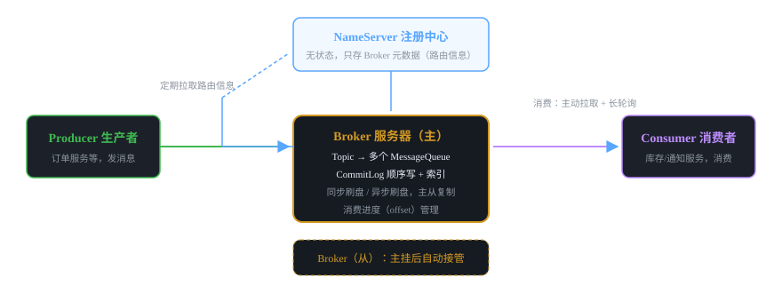
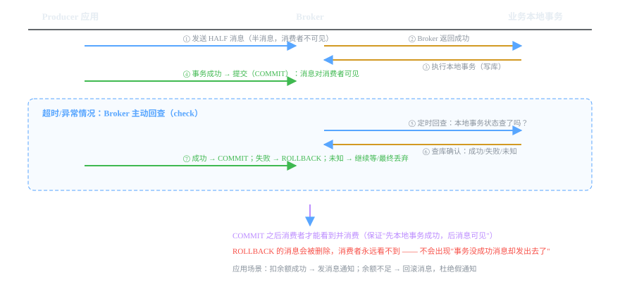

# 微服务组件 07 · 消息队列 RocketMQ

> 削峰填谷、异步解耦、最终一致性的核心基础设施。RocketMQ 是阿里开源的分布式消息中间件，国内微服务项目标配。
>
> 技术栈：RocketMQ 4.9.x · NameServer + Broker · 顺序消息 · 事务消息

## 目录
1. 是什么 / 解决什么问题
2. 核心原理
3. 核心概念表
4. 代码示例
5. 面试题与回答
6. 小结与口诀

---

## 1. 是什么 / 解决什么问题

**消息队列（MQ）** 是生产者和消费者之间的异步中转站：生产者把消息丢给队列，消费者按自己的节奏取。微服务里 MQ 解决三类问题。

### 1.1 三大核心价值

**① 削峰填谷：** 秒杀瞬间 10 万请求，数据库扛不住。请求先进 MQ（毫秒级），消费者按数据库能承受的速度（如 1000/s）慢慢消费。峰值被"削平"。

**② 异步解耦：** 下单后要发短信、发积分、更新统计——同步调用这些服务，一个慢全慢。改成发消息，主流程只写订单 + 发消息，立刻返回。下游各管各的，挂了也不影响下单。

**③ 最终一致性：** 两个服务的数据不用实时一致，靠"消息一定送达 + 消费成功"最终对齐。是分布式事务的轻量替代（见 06 篇 Q5）。

### 1.2 哪些场景适合用 MQ（判断力）

- 高写入、低实时要求的旁路逻辑（日志、通知、统计）→ 用
- 需要严格实时返回结果（用户下单必须马上知道成功）→ 别用，走同步调用
- 消息丢失会造成资金问题且无补偿 → 慎用，必须有对账/幂等

---

## 2. 核心原理

### 2.1 整体架构：NameServer + Broker + Producer + Consumer



- **Producer 生产者**：业务应用，把消息发给 Broker。
- **Consumer 消费者**：业务应用，从 Broker 拉取消息处理。
- **NameServer 注册中心**：**无状态**、互相独立，只存 Broker 的路由信息（Topic → Broker 列表）。Producer/Consumer 启动时从它拉路由，之后每 30s 更新一次。它挂了不影响已建立连接的收发。
- **Broker 消息服务器**：真正的存储和转发者。Topic 在 Broker 上分为多个 **MessageQueue（队列）**。主从部署（Master/Slave），主挂从接管。
- **Topic 主题 / MessageQueue 队列**：Topic 是消息的分类；一个 Topic 有多个 Queue，消息均匀落到各 Queue，消费并行度 = Queue 数量。

### 2.2 存储设计：为什么性能好？

- **CommitLog**：所有消息**顺序写**到同一个文件（像日志追加），顺序写磁盘 ≈ 内存写的速度，这是 RocketMQ 高性能的根本。
- **ConsumeQueue**：按 Topic/Queue 建的索引（消息偏移量），消费时按索引定位，不扫全量文件。
- 刷盘策略：**同步刷盘**（写磁盘才返回，最安全）/ **异步刷盘**（写内存就返回，快，可能丢极少消息）。生产关键消息用同步刷盘。

### 2.3 消费模型

| 模式 | 说明 | 适用 |
|---|---|---|
| 集群消费（默认） | 一条消息只被**一个**消费者实例消费，多个实例分摊队列 | 并行处理，默认 |
| 广播消费 | 一条消息被**所有**消费者实例各消费一次 | 每个实例都要拿到全量数据（如本地缓存刷新） |

消费方式：Consumer 主动**拉取（Pull）+ Broker 长轮询**，接近推送的实时性，但由消费者控制节奏。

### 2.4 顺序消息（面试高频）

- **全局顺序**：一个 Topic 只设 1 个 Queue，天然全局有序（吞吐受限，少用）。
- **局部顺序（常用）**：同一业务 key（如同一订单号）的消息通过**消息 key 取模路由到同一个 Queue**，这个 Queue 单线程消费，保证"同一订单的消息有序"。不同订单并行不受影响。

### 2.5 事务消息（RocketMQ 独有杀手锏，必考）



核心流程：
1. 发送 **HALF（半）消息**：Broker 收到但**消费者不可见**。
2. 执行**本地事务**（如写数据库）。
3. 本地事务成功 → 提交消息（COMMIT，消费者可见）；失败 → 回滚消息（ROLLBACK，删除）。
4. **异常兜底**：第 3 步没执行（进程挂了、网络断了），Broker 会**定时回查**（check）询问本地事务结果，应用查库回复成功/失败/未知。

**解决的问题：** 先发消息再本地事务？消息发了事务失败 → 假消息。先本地事务再发消息？事务成功但发消息失败 → 漏消息。事务消息让两者**原子**：消息可见 ⇔ 本地事务成功。

### 2.6 消息不丢失三端保证（必考）

| 环节 | 风险 | 解法 |
|---|---|---|
| 生产端 | 发消息失败、网络抖动 | **同步发送 + 失败重试**（默认 2 次）；或事务消息 |
| Broker 端 | 宕机丢内存数据 | 同步刷盘 + 主从同步（Master 挂了从接管） |
| 消费端 | 消费失败丢消息 | 消费成功才返回 ACK（手动提交 offset），失败重试 |

RocketMQ 保证的是 **At Least Once（至少一次）**：消息不丢，但可能**重复**。所以消费端必须**幂等**（见 Q4）。

### 2.7 重试与死信队列

- 消费失败默认重试 16 次（间隔递增），重试期间消息进入**重试队列**（%RETRY%topic）。
- 超过 16 次仍失败 → 进入**死信队列**（%DLQ%topic），人工排查处理，不会无限重试拖死消费者。

---

## 3. 核心概念表

| 概念 | 说明 |
|---|---|
| Topic | 消息分类（主题） |
| MessageQueue | Topic 下的队列，消费并行度 = 队列数 |
| NameServer | 无状态注册中心，存路由信息 |
| Broker | 消息存储与转发（主从部署） |
| Producer / Consumer | 生产 / 消费端 |
| 集群消费 / 广播消费 | 一条消息一人消费 / 人人消费 |
| 顺序消息 | 同一 key 路由到同一队列，保证局部有序 |
| 事务消息 | HALF + 本地事务 + 回查，消息可见 = 事务成功 |
| At Least Once | 不丢但可能重复，消费端要幂等 |
| 死信队列 | 重试 16 次失败的消息，人工处理 |
| Offset | 消费进度，Broker 存，消费完才提交 |

---

## 4. 代码示例

> 技术栈：Spring Boot 2.7 + RocketMQ 4.9.x（spring-boot-starter-rocketmq 或 rocketmq-spring-boot-starter）。

### 4.1 依赖

```xml
<dependency>
    <groupId>org.apache.rocketmq</groupId>
    <artifactId>rocketmq-spring-boot-starter</artifactId>
    <version>2.2.3</version>
</dependency>
```

### 4.2 application.yml

```yaml
rocketmq:
  name-server: 127.0.0.1:9876          # NameServer 地址（多个逗号分隔）
  producer:
    group: order-producer-group        # 生产者组
    send-message-timeout: 3000         # 发送超时
```

### 4.3 生产者：同步发送 + 失败重试（保证不丢）

```java
@Service
public class OrderProducer {

    @Autowired
    private RocketMQTemplate rocketMQTemplate;

    /**
     * 下单成功后发消息通知下游（库存/通知服务）
     */
    public void sendOrderCreated(OrderVO order) {
        // 同步发送：返回 SendResult，可检查发送状态
        SendResult result = rocketMQTemplate.syncSend(
                "order-created-topic",     // Topic
                order,                     // 消息体（对象自动 JSON）
                3000);                     // 超时 3s
        if (result.getSendStatus() != SendStatus.SEND_OK) {
            log.error("消息发送失败: {}", order.getOrderId());
            // 失败处理：重试 / 落本地消息表补偿（保底方案）
        }
    }
}
```

### 4.4 消费者：集群消费 + 手动 ACK（消费成功才提交进度）

```java
@Component
public class OrderConsumer {

    /**
     * 消费订单创建消息：更新库存
     * 注意：消费逻辑必须幂等（同一消息重复到达要能安全处理）
     */
    @RocketMQMessageListener(topic = "order-created-topic",
            consumerGroup = "stock-consumer-group",
            messageModel = MessageModel.CLUSTERING)   // 集群消费：一条消息一个实例处理
    public static class StockListener implements RocketMQListener<OrderVO> {

        @Override
        public void onMessage(OrderVO order) {
            // 幂等：先查是否已处理过（Redis/数据库唯一键）
            if (duplicateChecker.isProcessed("order:" + order.getOrderId())) {
                return;   // 已处理过，直接跳过
            }
            try {
                stockService.deduct(order.getSkuId(), order.getNum());
                duplicateChecker.markProcessed("order:" + order.getOrderId());
                // 方法正常返回 = ACK，消费进度提交
            } catch (Exception e) {
                // 抛异常 = 不 ACK，消息进入重试队列（最多 16 次）
                throw new RuntimeException("库存扣减失败，进入重试", e);
            }
        }
    }
}
```

### 4.5 顺序消息（局部有序：同一订单号的消息进同一队列）

```java
// 发送端：用 key 路由，同一 key 的消息进同一 Queue
rocketMQTemplate.syncSendOrderly(
        "order-status-topic",          // Topic
        orderStatusMsg,                // 消息
        order.getOrderId().toString());// hashKey：同一订单号 → 同一队列

// 消费端：MessageListenerOrderly 保证队列内单线程顺序消费
@RocketMQMessageListener(topic = "order-status-topic", consumerGroup = "status-group")
public static class StatusListener implements RocketMQListener<OrderStatusMsg> {
    @Override
    public void onMessage(OrderStatusMsg msg) {
        orderService.updateStatus(msg.getOrderId(), msg.getStatus());  // 顺序更新状态
    }
}
```

### 4.6 事务消息（本地事务 + 消息原子提交）

```java
@Service
public class PayService {

    @Autowired
    private RocketMQTemplate rocketMQTemplate;

    /**
     * 扣款：本地事务成功 → 消息才可见；失败 → 消息回滚
     */
    public void pay(OrderVO order) {
        String txId = UUID.randomUUID().toString();
        // 1. 发送事务消息（先到 Broker 的 HALF 状态，消费者看不见）
        rocketMQTemplate.sendMessageInTransaction(
                "pay-success-topic",    // Topic
                order,                  // 消息体
                txId,                   // 事务 ID（本地事务执行参数）
                order.getOrderId().toString());   // hashKey
        // 2. 返回后由 executeLocalTransaction 执行本地事务
    }

    // ★ 本地事务执行器：sendMessageInTransaction 的回调
    @RocketMQTransactionListener
    public static class PayTransactionListener implements RocketMQLocalTransactionListener {

        /**
         * 执行本地事务：在这里扣款（和 HALF 消息发送是"半原子"的）
         */
        @Override
        public RocketMQLocalTransactionState executeLocalTransaction(Message msg, Object arg) {
            try {
                OrderVO order = parseOrder(msg);
                accountService.deduct(order.getUserId(), order.getAmount());  // 本地库事务
                return RocketMQLocalTransactionState.COMMIT;   // 成功 → 消息对消费者可见
            } catch (Exception e) {
                return RocketMQLocalTransactionState.ROLLBACK; // 失败 → 消息删除
            }
        }

        /**
         * 回查：executeLocalTransaction 没执行完（进程挂了），Broker 会来回查
         */
        @Override
        public RocketMQLocalTransactionState checkLocalTransaction(Message msg) {
            // 查库确认这笔扣款到底成没成功
            return accountService.isPaid(parseOrder(msg).getOrderId())
                    ? RocketMQLocalTransactionState.COMMIT
                    : RocketMQLocalTransactionState.ROLLBACK;
        }
    }
}
```

---

## 5. 面试题与回答

### Q1：RocketMQ 的架构有哪些组件？各自职责？

**答：** 四大组件：**NameServer**（无状态注册中心，只存 Broker 路由信息，互相独立，Producer/Consumer 启动时拉取路由并定时更新，它挂了不影响已建立的收发——这是 RocketMQ 比 Kafka 依赖 ZK 更轻的地方）；**Broker**（真正的存储转发，Topic 分为多个 MessageQueue，CommitLog 顺序写 + ConsumeQueue 索引，主从部署）；**Producer**（发送消息，支持同步/异步/单向）；**Consumer**（拉取消费，集群/广播两种模式，进度 offset 由 Broker 存）。消息路径：Producer 从 NameServer 拿路由 → 发到 Broker 的某个 Queue → Consumer 从 NameServer 拿路由 → 从 Broker 拉取消费。

### Q2：消息不丢失怎么保证？（生产端 / Broker / 消费端）

**答：** 三端分别处理：**生产端**：用同步发送 + 失败重试（默认 2 次），返回 SEND_OK 才算成功；重要场景用事务消息保证"本地事务成功才发消息"。**Broker 端**：同步刷盘（消息落盘才返回）+ 主从同步（Master 宕机从节点接管），关键 topic 用主从同步复制。**消费端**：消费方法**正常返回才 ACK**（提交 offset），抛异常则不提交、进重试队列。整体是 **At Least Once** 语义：保证不丢，但可能重复——所以消费端必须有幂等处理（唯一键/状态机/去重表）。

### Q3：重复消费怎么解决？什么是幂等？

**答：** 因为 MQ 是 At Least Once，网络重试、消费端宕机后重投都会造成**同一条消息被消费多次**。解决靠**消费端幂等**：同一个业务操作执行多次结果一样。常用四种：① **唯一键/数据库唯一索引**（如订单号做唯一键，重复插入报错忽略）；② **Redis 去重标记**（先 SETNX 处理标记，已存在直接跳过）；③ **状态机**（订单只有"已支付"才能流转到"已发货"，重复消息到不了下一状态）；④ **数据库乐观锁**（version 字段）。我项目里用的是订单号唯一键 + Redis 标记双保险。

### Q4：顺序消息怎么保证？全局顺序和局部顺序区别？

**答：** 全局顺序：Topic 只建 1 个 Queue，所有消息顺序消费——吞吐极低，基本不用。**局部顺序（主流）**：发送时指定 hashKey（如订单号），框架把相同 key 的消息路由到**同一个 Queue**，该队列由单线程顺序消费，保证"同一订单的消息有序"，不同订单落在不同队列可并行。注意：顺序消息的消费端如果**批量消费要关掉**，且消费失败会阻塞该队列后续消息（重试期间后面消息等待）——这是顺序性的代价。

### Q5：事务消息的原理？解决了什么问题？

**答：** 解决"本地事务和发消息的原子性"：先发消息再本地事务 → 事务失败发了个假消息；先本地事务再发消息 → 事务成功但消息没发出去。事务消息流程：① 发 **HALF（半）消息**，Broker 存下但消费者不可见；② 执行**本地事务**（写库）；③ 成功 → COMMIT（消息对消费者可见），失败 → ROLLBACK（删除）；④ **异常兜底**：步骤③没执行（宕机/断网），Broker **定时回查**，应用查库回复状态。一句话：**消息对消费者可见 ⇔ 本地事务成功**。典型场景：扣款 + 发支付成功通知。

### Q6：消息堆积怎么办？怎么快速解决？

**答：** 堆积 = 消费速度 < 生产速度。排查思路：① 先看**消费是否报错**（消费失败重试会阻塞）——查日志和死信队列；② 看**消费者实例数**是否少于 Queue 数——扩大消费并发（一个实例可以多线程，实例数 ≤ Queue 数才是上限）；③ 看**消费逻辑性能**——批量消费、减少 RPC、优化 SQL。紧急处理：临时**扩容消费者**、或加 Queue（Topic 队列数创建后扩容要重启）；**别随便清消息**，先看业务能不能重放。根治：评估是不是该走批量/离线处理，或者生产端限流。

### Q7：RocketMQ 和 Kafka 有什么区别？怎么选？

**答：** ① 定位：RocketMQ 面向**业务消息**（事务消息、延迟消息、死信、精确的 tag 过滤、消息轨迹）；Kafka 面向**大数据流**（日志、埋点、流计算），吞吐更高、生态更全（Flink/Spark 配套）。② 一致性：RocketMQ 有**事务消息**和**死信队列**，业务可靠性强；Kafka 没有事务消息（有幂等和事务 API 但语义不同）。③ 消费模型：RocketMQ 支持广播模式、按 tag 过滤；Kafka 主要分区消费。④ 运维：RocketMQ 不依赖 ZooKeeper（新版），Kafka 依赖 ZK/KRaft。选型：**业务系统（订单、支付、通知）用 RocketMQ**；**日志大数据、流计算用 Kafka**。你的 IoT 项目两种都合理：数据上报用 Kafka，业务通知用 RocketMQ。

### Q8：延迟消息 / 定时消息是什么？怎么用？

**答：** RocketMQ 支持**延迟消息**：发送时指定延迟级别（1s/5s/10s/30s/1m/2m...18 个固定级别，4.x 不支持任意时间，5.x 支持任意延迟），Broker 到期才投递给消费者。典型场景：订单 30 分钟未支付自动关闭（发延迟消息，到期检查支付状态）、超时重试提醒。注意：延迟消息的延迟时间从**消息到达 Broker** 开始算，且按级别不是任意秒数（4.x）；需要精确时间用定时任务或 xxl-job 轮询更合适。

### Q9：RocketMQ 的刷盘和主从复制有几种方式？

**答：** 刷盘两种：**同步刷盘**（消息写磁盘才返回，最安全，性能略低，关键消息用）；**异步刷盘**（写页缓存就返回，快，宕机可能丢极少量消息）。主从复制两种：**同步复制**（主写成功并等从写成功才返回，无消息丢失，延迟略高）；**异步复制**（主返回即可，从异步同步，主宕机可能丢消息）。高可用组合：**同步刷盘 + 同步复制**最安全（牺牲性能），一般生产用异步刷盘 + 同步复制即可。

### Q10：你们项目里 MQ 用来做什么？（结合你的 IoT 项目）

**答：** 我项目里 Kafka/RocketMQ 用在两个地方：① **设备数据上报削峰**：设备高频上报的采集数据先进 Kafka，落库程序按批消费写库——数据库不会被打爆，这也是"削峰填谷"最典型的应用；② **业务解耦**：数据入库后的告警分析、通知下发走消息异步处理。消费端统一做**幂等**（设备消息天然会重发：TCP 重传、Kafka 重投，用消息唯一键去重）。选型考虑：高吞吐数据流用 Kafka，业务强可靠的通知用 RocketMQ。这样讲既真实又有深度。

---

## 6. 小结与口诀

**一句话定位：** MQ = 异步解耦 + 削峰填谷 + 最终一致的"消息邮局"，RocketMQ 是业务型 MQ 的国产标准。

**口诀：** "NameServer 管路由，Broker 顺序写日志；集群消费一人取，事务消息 HALF 起步；同步发送防丢失，消费成功才 ACK；重复消费要幂等，重试十六进死信。"

**三大坑：**
1. 消费端不做幂等 → 重复消息引发重复扣款/重复入库
2. 消费失败抛异常才能重试，吞异常 = 消息静默丢失
3. 顺序消息消费失败会阻塞队列，别把慢操作放顺序消费

**下一跳：** 服务多了排障难，下一篇讲 **SkyWalking 链路追踪**——traceId 怎么贯穿全链路。

---

*微服务组件文档系列 · 07/16 · 技术栈 Spring Boot 2.7 + RocketMQ 4.9.x · 生成于 2026-09-19*
