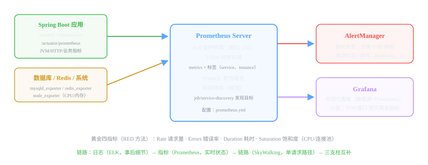

# 微服务组件 13 · 监控告警 Prometheus + Grafana

> 日志是"事后"，指标是"实时"。Prometheus 定时抓取各服务的指标，Grafana 画成大盘，超阈值自动告警——系统还没挂就先发现。
>
> 技术栈：Prometheus 2.x + Grafana 10.x + micrometer + AlertManager

## 目录
1. 是什么 / 解决什么问题
2. 核心原理
3. 核心概念表
4. 代码示例
5. 面试题与回答
6. 小结与口诀

---

## 1. 是什么 / 解决什么问题

**监控**回答三件事：**系统现在怎么样**（实时指标）、**历史趋势如何**（一段时间的变化）、**什么时候该报警**（阈值规则）。

### 1.1 没有监控会怎样？（痛点引入）

- 用户投诉"系统很卡"，一看 CPU 99% 烧了 2 小时——**发现永远是事后**。
- 内存慢慢涨，一周后 OOM，没人提前看见趋势。
- 接口成功率掉到 50%，**没人收到通知**，等出大事才知道。
- 扩容/压测没有数据支撑，全凭感觉。

### 1.2 Prometheus 解决什么

- **自动抓取指标**：定期从各服务的 /metrics 拉取（默认 15s）。
- **时序存储**：指标带时间戳和标签，天然适合趋势分析。
- **PromQL 查询**：灵活聚合（按服务、按接口、按实例）。
- **内置告警**：规则引擎 + AlertManager 推送钉钉/邮件。
- **生态标准**：Spring Boot/micrometer、MySQL、Redis、K8s 都有现成 exporter。

---

## 2. 核心原理

### 2.1 架构：Pull 模型 + Exporter + TSDB + AlertManager + Grafana



- **Pull 模式**：Prometheus Server 主动去各 target 的 `/metrics` 端点抓取，应用侧只需暴露一个 HTTP 端点（Spring Boot 用 actuator 自动暴露）。
- **Exporter**：本身不产生指标的系统（MySQL、Redis、Linux）用 exporter 翻译成 Prometheus 格式（mysqld_exporter、node_exporter）。
- **TSDB**：时序数据库，指标 = 指标名 + 标签 + 时间序列（sample）。
- **PromQL**：查询语言，如 `sum(rate(http_requests_total[5m])) by (service)`。
- **AlertManager**：规则触发告警后，负责分组、去重、静默、路由到钉钉/邮件。

### 2.2 四种指标类型（必考）

| 类型 | 特点 | 典型例子 | 常用函数 |
|---|---|---|---|
| **Counter 计数器** | 只增不减（重启清零） | 请求总数、错误总数 | rate() / increase() |
| **Gauge 瞬时值** | 可增可减 | CPU 使用率、内存、当前连接数 | 直接查 |
| **Histogram 直方图** | 观测值分桶统计，可算分位数 | 请求耗时（桶：10ms/50ms/100ms…） | histogram_quantile() |
| **Summary 摘要** | 客户端侧分位数（不可聚合） | 少数场景 | — |

> 面试要点：**Counter 算速率用 rate()**（每秒增量），**Histogram 算 P99 用 histogram_quantile()**——接口耗时压测必看 P99 而不是平均值。

### 2.3 Spring Boot 怎么暴露指标（micrometer 统一规范）

Spring Boot 2.x 用 **micrometer**（指标门面，类似 slf4j）对接 Prometheus：引入 micrometer-registry-prometheus + actuator，自动暴露 JVM、HTTP、线程池等指标，业务也可以埋自定义指标（见代码 4.2）。

### 2.4 告警流程（四步）

1. Prometheus 的 rules（如 `max_over_time(jvm_memory_used[5m]) > 90%`）持续评估。
2. 持续超阈值（for 时间避免抖动误报）→ 生成告警发给 AlertManager。
3. AlertManager 分组/去重/静默，按路由发给钉钉机器人/邮件/Webhook。
4. 值班人收到告警 → 看 Grafana 大盘 → 定位 → 处理。

### 2.5 监控什么：黄金四指标（RED 方法）

| 指标 | 含义 | 例子 |
|---|---|---|
| **Rate** | 请求量 | QPS（每服务/接口） |
| **Errors** | 错误率 | 5xx 比例 |
| **Duration** | 耗时 | P50 / P95 / P99 |
| **Saturation** | 饱和度 | CPU、内存、连接池使用率 |

---

## 3. 核心概念表

| 概念 | 说明 |
|---|---|
| Pull 模型 | Prometheus 定期抓取（15s），应用暴露 /metrics |
| Exporter | 翻译器：MySQL、Redis、系统指标 → Prometheus 格式 |
| TSDB | 时序存储：指标名 + 标签 + 时间序列 |
| Counter / Gauge | 只增计数 / 可增可减瞬时值 |
| Histogram | 分桶直方图 → P99 分位数 |
| PromQL | 查询语言（rate、sum、histogram_quantile） |
| AlertManager | 告警分组/去重/静默/推送 |
| micrometer | Spring Boot 指标门面（对接 Prometheus） |
| 黄金指标 | Rate / Errors / Duration / Saturation |

---

## 4. 代码示例

### 4.1 Spring Boot 暴露指标（pom + yml）

```xml
<!-- 指标暴露：micrometer 对接 Prometheus -->
<dependency>
    <groupId>org.springframework.boot</groupId>
    <artifactId>spring-boot-starter-actuator</artifactId>
</dependency>
<dependency>
    <groupId>io.micrometer</groupId>
    <artifactId>micrometer-registry-prometheus</artifactId>
</dependency>
```

```yaml
management:
  endpoints:
    web:
      exposure:
        include: health,info,prometheus   # 只暴露这几个端点
  metrics:
    tags:
      application: order-service           # 给所有指标打上服务名标签
```

验证：`curl localhost:8080/actuator/prometheus` 能看到一堆指标（jvm_*、http_server_requests_*、process_*）。

### 4.2 自定义业务指标（比如埋"下单量"计数器）

```java
@Service
public class OrderService {

    // 注册一个业务计数器：order_create_total{status=success/fail}
    private final Counter orderCreateCounter = Metrics.counter("order_create_total", "status", "success");

    public void createOrder(OrderVO order) {
        try {
            // ...业务...
            orderCreateCounter.increment();          // 成功 +1
        } catch (Exception e) {
            Metrics.counter("order_create_total", "status", "fail").increment();  // 失败 +1
            throw e;
        }
    }
}
```

Grafana 里就能画"下单成功率"曲线：`sum(rate(order_create_total{status="success"}[5m])) / sum(rate(order_create_total[5m]))`。

### 4.3 Prometheus 配置：抓取目标（prometheus.yml）

```yaml
global:
  scrape_interval: 15s           # 抓取间隔
rule_files:
  - /etc/prometheus/alert-rules.yml   # 告警规则

scrape_configs:
  - job_name: "order-service"
    metrics_path: /actuator/prometheus
    static_configs:
      - targets: ["order-service:8080"]    # 服务地址（容器内用服务名）
        labels: { service: order-service }
  - job_name: "mysql"
    static_configs:
      - targets: ["mysqld-exporter:9104"]  # MySQL exporter
  - job_name: "linux-host"
    static_configs:
      - targets: ["node-exporter:9100"]    # 系统指标
```

### 4.4 告警规则（alert-rules.yml）

```yaml
groups:
  - name: app-alerts
    rules:
      - alert: ServiceDown          # 服务挂了
        expr: up{job="order-service"} == 0
        for: 1m                     # 持续 1 分钟才触发（防抖动）
        labels: { severity: critical }
        annotations:
          summary: "order-service 不可用！"

      - alert: HighErrorRate        # 错误率超 20%（5 分钟）
        expr: |
          sum(rate(http_server_requests_seconds_count{status=~"5.."}[5m]))
            / sum(rate(http_server_requests_seconds_count[5m])) > 0.2
        for: 5m
        labels: { severity: warning }

      - alert: HeapHigh             # JVM 堆内存超 90%
        expr: jvm_memory_used_bytes{area="heap"} / jvm_memory_max_bytes{area="heap"} > 0.9
        for: 10m
        labels: { severity: warning }
```

### 4.5 AlertManager 通知钉钉（alertmanager.yml 简版）

```yaml
route:
  receiver: "dingtalk"
receivers:
  - name: "dingtalk"
    webhook_configs:
      - url: "http://dingtalk-webhook/api/alert"   # 钉钉机器人 Webhook
        send_resolved: true                        # 恢复也通知
```

### 4.6 Grafana 接入

数据源：添加 Prometheus（URL http://prometheus:9090）。导入模板：官方市场搜 "Spring Boot Statistics"（ID 19004 等）一键导入 JVM/HTTP 大盘；再建自己的业务大盘（QPS、错误率、P99、下单成功率）。告警也可以在 Grafana 配（访问 Grafana → Alerting），但规则放 Prometheus 是标准做法。

---

## 5. 面试题与回答

### Q1：Prometheus 是什么？和 Zabbix 比有什么区别？

**答：** Prometheus 是云原生监控标准（CNCF 毕业项目），核心：**Pull 模型**定期抓取指标 → TSDB 时序存储 → PromQL 查询 → AlertManager 告警。和 Zabbix 区别：① **模型**：Zabbix 传统 Push + 服务端轮询，天然适合基础设施监控；Prometheus 是 Pull + 标签设计，天生适合微服务/K8s 这种动态环境；② **存储**：Zabbix 存关系库（MySQL），Prometheus 用自主 TSDB 高效处理时序；③ **生态**：Prometheus 有 micrometer/exporter 全家桶，K8s 原生集成；Zabbix 强在机房硬件监控（SNMP 等）。结论：**云原生/微服务用 Prometheus，传统机房硬件用 Zabbix**。

### Q2：为什么用 Pull 模式而不是 Push？（Prometheus 设计哲学）

**答：** Pull（Prometheus 主动抓取）的好处：① **发现更可靠**——目标只负责暴露，抓不抓、什么时候抓由监控方控制，不会"目标想推就推、挂了也推不动"；② **配置集中**——加一台机器只改 prometheus.yml 的 targets（或服务发现），不用在每台机器装 Agent 配置推送地址；③ **拉取即探活**——抓不到 = 目标挂了，天然健康检查；④ **一致性**——所有 target 用同一抓取间隔，数据可比。缺点：跨网络（防火墙）不好抓，所以极个别场景用 Pushgateway 补充。面试点："Pull 让监控方掌握主动权 + 天然探活。"

### Q3：Prometheus 的四种指标类型？P99 怎么算？

**答：** 四种：**Counter**（只增不减，请求数/错误数，配 rate() 算速率）；**Gauge**（可增可减，CPU/内存/连接数）；**Histogram**（直方图分桶统计，请求耗时；`histogram_quantile(0.99, sum(rate(histogram_bucket[...][5m])) by (le, service))` 算 **P99**）；**Summary**（客户端预计算分位数，不可跨实例聚合，少用）。面试延伸：为什么用 P99 不用平均值——平均值会掩盖长尾，99% 请求都在 100ms 内、但 1% 慢到 5s，平均 150ms 看不出问题，P99 直接暴露长尾。

### Q4：Spring Boot 应用怎么暴露指标给 Prometheus？

**答：** 两步：① 引入 **spring-boot-starter-actuator** + **micrometer-registry-prometheus**——micrometer 是指标门面（类似 slf4j），自动收集 JVM（堆内存、GC、线程）、HTTP（请求数/耗时/状态码分布）、Tomcat、数据源等指标；② yml 暴露 prometheus 端点：`management.endpoints.web.exposure.include=prometheus`，访问 `/actuator/prometheus` 输出 Prometheus 格式。业务自定义指标用 `Metrics.counter(...)`/`Metrics.timer(...)` 注册即可。Prometheus 端加 scrape_configs 指向这个端点（15s 抓一次）。

### Q5：告警流程是什么？怎么避免误报？

**答：** 流程：Prometheus 规则持续评估（表达式结果持续超阈值 **for** 指定时长）→ 触发告警 → 发给 **AlertManager** → 分组（同类合并）/去重（同一告警只发一次）/静默（维护窗口不打扰）→ 按路由推送到钉钉/邮件/Webhook → 恢复时通知（send_resolved）。**防误报三手段**：① `for: 1m/5m` 要求持续超阈值才触发（瞬时抖动不算）；② 阈值要合理（别把 99% 的波动设成告警线）；③ 告警分级（critical/warning 分开处理，critical 才电话/钉钉强通知）。面试口径："告警的价值是少而准，宁缺毋滥。"

### Q6：Prometheus 怎么监控 MySQL、Redis、Linux 这些"不会输出指标"的组件？

**答：** 用 **Exporter**：官方/社区提供了各种 exporter——`mysqld_exporter`（连 MySQL 查状态变量转成指标）、`redis_exporter`、`node_exporter`（CPU/内存/磁盘/网络，每台机器部署一个）、`kafka_exporter`、`jvm_exporter` 等。它们本质上是一个"翻译进程"：从被监控对象读取数据 → 暴露成 Prometheus /metrics 格式 → Prometheus 照常 Pull。这就是 Prometheus 生态的开放性：**任何系统，只要有 exporter 就能监控**。Spring Boot 那种"自带指标端点"的就不用 exporter，直接抓。

### Q7：Prometheus 存不下数据怎么办？数据太多怎么处理？

**答：** 三个手段：① **抓取降频**：scrape_interval 15s 调到 30s/60s（数据量减半/四分之一）；② **留存策略**：storage.tsdb.retention.time（默认 15 天）按业务保留；③ **Level 级方案**：联邦（Federation）——每个机房/集群一个 Prometheus 抓全量原始数据，顶层的只抓聚合结果（`sum()` 过的），保留趋势；或者接远程存储（Thanos/Cortex/VictoriaMetrics）扩展。面试答"降频 + 留存 + 联邦/Thanos"即可。

### Q8：Prometheus、SkyWalking、ELK 三者什么关系？（可观测性三支柱）

**答：** 对应可观测性三支柱：**Prometheus 管指标（Metrics）**——"系统现在什么状态"（CPU、QPS、错误率、P99），告警来源；**SkyWalking 管链路（Tracing）**——"一次请求经过了谁、慢在哪"；**ELK 管日志（Logging）**——"具体发生了什么、堆栈细节"。联动：Grafana 看到错误率飙高 → SkyWalking 定位到具体服务/接口 → 复制 traceId → ELK 里搜日志看堆栈。三者互补，缺一个都只能看到局部。面试能把这个"三个维度 + 联动流程"讲清楚，说明你有完整的运维视角。

### Q9：接口性能怎么看？压测时看哪些指标？

**答：** 方法：Grafana 大盘看接口维度（QPS、错误率、P50/P95/P99 耗时曲线）。判断标准：**P99 是用户体验的真实值**——比如 P99 = 800ms，意味着 99% 的请求 800ms 内完成，只有 1% 慢，别只看平均值；压测时同时看**四象限**：QPS 是否到目标、错误率是否上升、P99 是否恶化、CPU/内存是否打满——任何一项先爆都说明瓶颈到了。排查：接口慢 → 看 SkyWalking 的 Span 分布（是 SQL 慢、外部调用慢还是 GC）。

### Q10：你们项目监控了什么？（结合你的项目）

**答：** 我项目里接入 Prometheus + Grafana 做了三层：① **基础设施**：node_exporter 盯 CPU/内存/磁盘，mysqld_exporter 盯连接数和慢查询，探活告警（服务 down 1 分钟告警）；② **应用**：micrometer 暴露 JVM（堆、GC）、HTTP（QPS、5xx 错误率、P99），订单核心接口埋了业务计数器（下单成功率）；③ **告警**：AlertManager 接钉钉，规则按"持续时长 + 分级"避免误报（服务不可用 critical、错误率超 20% warning）。Grafana 首页大盘一屏看黄金四指标，运维值班盯屏即可。这样讲：有层次（基础/应用/业务）、有告警工程细节，闭环完整。

---

## 6. 小结与口诀

**一句话定位：** Prometheus 定时抓指标、TSDB 存时序、PromQL 查趋势、AlertManager 懂告警；Grafana 把一切画成大盘。

**口诀：** "Pull 模型十五秒，Counter 速率 Gauge 值；Histogram 算 P99，PromQL 聚合靠标签；规则超限持续报，AlertManager 分轻重；黄金四问 Rate Errors Duration Saturation，一屏看尽系统健康。"

**三大坑：**
1. 指标不带服务标签（instance/service）→ 多实例聚合不了，看板全错
2. 告警规则没有 for 持续时长 → 抖动误报刷屏，最后没人看告警
3. Prometheus 是"拉"不是"推"——网络不通/防火墙挡了，服务健康也显示 Down

**下一跳：** lb:// 前缀的负载均衡到底怎么选实例？下一篇讲 **Spring Cloud LoadBalancer**。

---

*微服务组件文档系列 · 13/16 · 技术栈 Prometheus 2.x + Grafana 10.x + micrometer + AlertManager · 生成于 2026-09-19*
