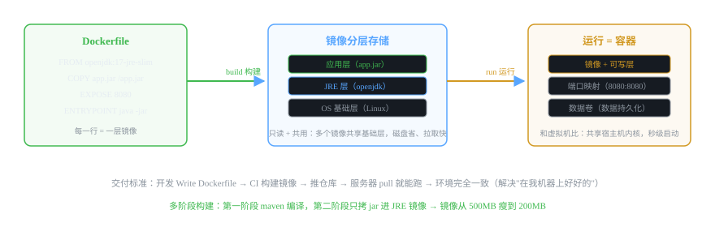
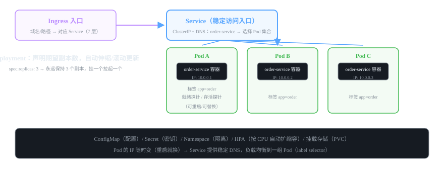

# 微服务组件 16 · 容器化 Docker / K8s

> 微服务动辄几十上百个进程，手工部署是噩梦。Docker 让每个服务变成"一个镜像、随处可跑"，K8s 负责编排：自动伸缩、滚动更新、故障自愈。
>
> 技术栈：Docker 24.x · K8s 1.28.x · Deployment/Service/Ingress

## 目录
1. 是什么 / 解决什么问题
2. 核心原理
3. 核心概念表
4. 代码示例
5. 面试题与回答
6. 小结与口诀

---

## 1. 是什么 / 解决什么问题

### 1.1 没有容器化会怎样？（痛点引入）

- **"在我机器上好好的"**：开发 JDK 17、测试 JDK 8、生产少个库文件——环境不一致是全行业的噩梦。
- 微服务 N 个服务，每台服务器手工装环境、手工启动、手工盯进程——**部署靠人肉**。
- 发布 = 停机 → 拷包 → 重启，回滚靠备份——**发布像做手术**。
- 流量高了要加实例，人肉多启动一个——**弹性伸缩不存在**。

### 1.2 Docker 解决什么

- **打包即交付**：镜像 = 应用 + 环境，到处一致运行。
- **隔离**：每个容器有独立文件系统/网络/进程空间（共享宿主机内核，比虚拟机轻）。
- **秒级启停**：镜像分层 + 共享内核，启动是进程级。

### 1.3 K8s 解决什么（Docker 只管"打包+跑一个"，K8s 管"一群"）

- **编排调度**：几千个容器放哪台机器、怎么分配资源。
- **自愈**：Pod 挂了自动拉起、节点挂了自动迁移。
- **滚动更新/回滚**：逐个替换副本，不停机发布。
- **弹性伸缩**：HPA 按 CPU/内存自动加减副本。
- **服务发现**：Service 提供稳定入口，后端 Pod 随便换。

---

## 2. 核心原理

### 2.1 Docker：镜像分层 + 容器



- **镜像（Image）**：只读模板，**分层存储**——多个镜像共享底层（OS 层、JRE 层），磁盘省、拉取快、缓存复用。
- **容器（Container）**：镜像的运行实例 = 镜像层 + **可写层**（运行产生）。
- **Dockerfile**：每行指令生成一层，多阶段构建把"编译环境"和"运行环境"分开，镜像更小。
- **数据卷（Volume）**：容器删了数据还在（数据库、日志挂到宿主机）。
- **端口映射**：`-p 8080:8080` 把容器端口暴露到宿主机。

> **Docker vs 虚拟机：** 虚拟机有完整 Guest OS（重量级、启动分钟级）；容器**共享宿主机内核**，只有进程隔离（轻量、秒级）。所以容器密度高、资源利用率高。

### 2.2 K8s：核心对象模型（一个图看懂）



| 对象 | 职责 | 类比 |
|---|---|---|
| **Pod** | 最小调度单位，1 个 Pod 通常 1 个容器（带 IP，容易挂） | 一个"临时工" |
| **Deployment** | 声明期望副本数（replicas: 3），滚动更新、回滚、扩缩容 | 招聘经理（保证总有 3 个人） |
| **Service** | 稳定访问入口：ClusterIP + DNS（order-service），选 Pod 集合（label selector）做负载均衡 | 前台的固定分机号 |
| **Ingress** | 七层入口：域名/路径 → Service | 公司总机 |
| **ConfigMap / Secret** | 配置 / 密钥（不写死在镜像里） | 员工手册 / 保险柜 |
| **Namespace** | 隔离（环境/团队） | 部门楼层 |
| **HPA** | 按指标自动扩缩容 | 忙时临时加人 |

> **核心理解：** Pod 的 IP 随时变（重启就换），所以**永远不要直连 Pod**——通过 Service 的稳定 DNS 访问，Service 用 label selector（app=order）把请求负载均衡到一组 Pod。

### 2.3 健康检查（K8s 灵魂机制）

- **LivenessProbe（存活探针）**：容器活着吗？失败则**重启**容器。
- **ReadinessProbe（就绪探针）**：能接流量吗？失败则**从 Service 摘除**（不再转发），恢复后自动加回。

> 面试金句：liveness 管"重启"，readiness 管"摘流量"——发布时配合 readiness 实现**零中断滚动更新**：新 Pod 就绪才接入，旧 Pod 摘流才销毁。

### 2.4 微服务上 K8s 还需要注册中心吗？（高频追问）

- **需要**：K8s 的 Service 只解决"寻址"，解决不了服务治理——负载均衡策略（Nacos 权重灰度）、配置中心、健康状态上报、业务级路由。
- 实际做法：微服务**照常用 Nacos 注册**，实例注册地址是 Pod IP；K8s Service 负责接入层稳定入口。
- 也可以让 Spring Cloud 直接用 K8s 服务发现（spring-cloud-kubernetes），但生产主流仍是 Nacos/Consul 这种业务级注册中心。

---

## 3. 核心概念表

| 概念 | 说明 |
|---|---|
| 镜像 Image | 只读模板，分层存储 |
| 容器 Container | 镜像运行实例（可写层） |
| Dockerfile | 镜像构建脚本（每行一层） |
| 多阶段构建 | 编译环境与运行环境分离，镜像瘦身 |
| Pod | K8s 最小调度单位（易替换） |
| Deployment | 副本管理：保持 N 个、滚动更新、回滚 |
| Service | 稳定 DNS 入口 + 负载均衡到 Pod 集合 |
| Ingress | 7 层入口（域名/路径路由） |
| ConfigMap / Secret | 配置 / 密钥 |
| Liveness / Readiness | 存活探针（重启）/ 就绪探针（摘流量） |
| HPA | 按指标自动扩缩容 |
| Namespace | 资源隔离 |

---

## 4. 代码示例

> 技术栈：Spring Boot 2.7 + Docker 24 + K8s 1.28（RuoYi-Cloud 同栈部署方式）。

### 4.1 Dockerfile：多阶段构建（让镜像小一半）

```dockerfile
# ===== 第一阶段：编译环境（maven + JDK17）=====
FROM maven:3.8-openjdk-17 AS build
WORKDIR /build
COPY pom.xml .
# 先只拉依赖（利用层缓存，依赖没变时这层不重建）
RUN mvn dependency:go-offline
COPY src ./src
RUN mvn clean package -DskipTests

# ===== 第二阶段：运行环境（只要 JRE）=====
FROM openjdk:17-jre-slim
WORKDIR /app
# 只拷编译产物，不带走 maven 和源码
COPY --from=build /build/target/order-service.jar app.jar
EXPOSE 8080
# 应用配置走环境变量（K8s 里由 ConfigMap 注入）
ENTRYPOINT ["java", "-jar", "app.jar"]
```

```bash
# 构建 + 推送（CI 里做）
docker build -t registry.example.com/order-service:1.0.0 .
docker push registry.example.com/order-service:1.0.0
```

### 4.2 deployment.yaml：跑 3 个副本 + 健康检查 + 滚动更新

```yaml
apiVersion: apps/v1
kind: Deployment
metadata:
  name: order-service
  namespace: dev
spec:
  replicas: 3                        # 期望 3 个副本（自愈：挂一个拉起一个）
  selector:
    matchLabels: { app: order }
  template:
    metadata:
      labels: { app: order }
    spec:
      containers:
        - name: order
          image: registry.example.com/order-service:1.0.0
          ports: [{ containerPort: 8080 }]
          env:                        # 配置从 ConfigMap 注入（镜像不写死配置）
            - name: SPRING_PROFILES_ACTIVE
              value: "prod"
            - name: NACOS_ADDR
              valueFrom:
                configMapKeyRef: { name: app-config, key: nacos-addr }
          resources:                  # 资源限制：HPA 扩缩容的依据
            requests: { cpu: "500m", memory: "512Mi" }
            limits:   { cpu: "1000m", memory: "1Gi" }
          readinessProbe:             # 就绪探针：能接流量才加进 Service
            httpGet: { path: /actuator/health, port: 8080 }
            initialDelaySeconds: 20
            periodSeconds: 10
          livenessProbe:              # 存活探针：挂了就重启容器
            httpGet: { path: /actuator/health, port: 8080 }
            initialDelaySeconds: 30
            periodSeconds: 15
---
apiVersion: v1
kind: Service
metadata:
  name: order-service
  namespace: dev
spec:
  selector: { app: order }           # 选 Pod 的标签
  ports:
    - port: 8080                      # 集群内访问端口（DNS: order-service:8080）
      targetPort: 8080
```

```bash
kubectl apply -f deployment.yaml          # 发布 / 更新
kubectl rollout status deployment/order-service   # 看滚动更新进度
kubectl rollout undo deployment/order-service     # 一键回滚到上一个版本
kubectl get pods -n dev | grep order              # 看副本状态 3/3 Running
```

### 4.3 ingress.yaml：外部域名访问

```yaml
apiVersion: networking.k8s.io/v1
kind: Ingress
metadata:
  name: app-ingress
  namespace: dev
spec:
  rules:
    - host: api.example.com             # 域名
      http:
        paths:
          - path: /api/order
            pathType: Prefix
            backend:
              service: { name: order-service, port: { number: 8080 } }
          - path: /api/user
            pathType: Prefix
            backend:
              service: { name: user-service, port: { number: 8081 } }
```

### 4.4 HPA：按 CPU 自动扩缩容

```yaml
apiVersion: autoscaling/v2
kind: HorizontalPodAutoscaler
metadata:
  name: order-hpa
  namespace: dev
spec:
  scaleTargetRef: { apiVersion: apps/v1, kind: Deployment, name: order-service }
  minReplicas: 3
  maxReplicas: 10
  metrics:
    - type: Resource
      resource: { name: cpu, target: { type: Utilization, averageUtilization: 60 } }
```

> 效果：CPU 超 60% 自动加副本到 10 个，流量降了自动缩回 3 个——弹性伸缩就是 HPA 做的，这是 K8s 相比"人肉加机器"的核心价值。

### 4.5 ConfigMap / Secret（配置外置）

```yaml
apiVersion: v1
kind: ConfigMap
metadata: { name: app-config, namespace: dev }
data:
  nacos-addr: "nacos-headless:8848"
  log-level: "info"
---
apiVersion: v1
kind: Secret
metadata: { name: db-secret, namespace: dev }
type: Opaque
data:
  db-password: MTIzNDU2          # base64 编码（生产用 KMS/外部密钥）
```

---

## 5. 面试题与回答

### Q1：Docker 和虚拟机有什么区别？

**答：** 隔离层级不同：**虚拟机**每个 VM 一个完整 Guest OS（内核 + 系统库），由 Hypervisor 管理，启动分钟级、占用 GB 级、密度低；**容器**共享宿主机内核，通过 Namespace（隔离视图）+ Cgroups（限制资源）做进程级隔离，启动秒级、占用 MB~几百 MB、一台机器跑几十上百个。**代价**：容器隔离不如 VM 硬（内核共享），跨 OS 类型不行（Linux 容器一般跑不了 Windows 应用）。面试结论："虚拟机隔离 OS，容器隔离进程；容器轻、快、密度高，是云原生部署的事实标准。"

### Q2：Docker 镜像为什么是分层的？好处是什么？

**答：** Dockerfile 每行指令生成一个只读层，构建时**已有的层直接复用**（缓存），好处：① **磁盘省**——多个镜像共享底层（比如所有 Java 服务共用 openjdk 层，只存一份）；② **拉取快**——更新只传输变化的那几层（改一层 app.jar 不用拉整个 JRE）；③ **发布快**——CI 里依赖没变，maven 依赖层不重建。经典坏处对应：改了依赖导致层缓存失效，重新下载很慢，所以 Dockerfile 里"先拷 pom 拉依赖、再拷源码编译"就是为缓存优化。面试答出"分层 = 共享 + 缓存 + 增量传输"就很完整。

### Q3：多阶段构建是什么？解决什么问题？

**答：** Dockerfile 里写多个 FROM（阶段）：**第一阶段用 maven 镜像**把源码编译成 jar（带编译工具，体积大）；**第二阶段只从第一阶段 COPY 出 jar**，跑在轻量的 JRE 镜像上（不要编译工具，小）。好处：运行镜像只包含"运行时需要的东西"——Spring Boot 项目能从 500MB+ 瘦到 200MB 左右，**攻击面小、拉取快、启动快**。面试延伸：生产一定要多阶段构建，别把 maven + 源码全塞进运行镜像。

### Q4：Pod 和容器是什么关系？为什么不能直连 Pod？

**答：** **Pod 是 K8s 最小调度单位**，通常一个 Pod 里 1 个容器（也可多个：如主容器 + 日志边车容器）；Pod 有独立的 IP，但 **Pod 是"用完即弃"的**——节点宕机/探针失败都会被重建，新 Pod IP 变了。所以：直连 Pod = IP 随时失效。K8s 的解法是 **Service**：定义一组 Pod 的稳定入口（ClusterIP + DNS，如 order-service），用 label selector 选 Pod，**Pod 随便换，访问地址不变**——这就是 K8s 自己的"服务发现 + 负载均衡"。面试口诀："Pod 是兵，Deployment 是排长（保证编制），Service 是部队的固定番号。"

### Q5：Deployment 和 Service 的区别？

**答：** 职责不同：**Deployment 管 Pod 的生命周期**——声明期望副本数（replicas: 3），保证一直有 3 个（挂一个拉起一个），支持滚动更新、一键回滚、扩缩容；**Service 管访问入口**——把请求负载均衡到 Pod 集合（label selector），提供稳定 DNS。类比：Deployment 是"生产车间管理者"，Service 是"前台的固定分机号"——车间里工人换了（Pod 重建），分机号不变。发布流程：更新 Deployment 的镜像版本 → 滚动替换 Pod → Service 自动指向新 Pod，用户无感。

### Q6：K8s 怎么做滚动更新和回滚？怎么保证不停机？

**答：** 滚动更新：Deployment 更新后，K8s **逐个替换副本**（默认 maxUnavailable/maxSurge=25%）：新 Pod 先启动 → **就绪探针通过才接管流量**（Readiness 通过才加进 Service）→ 再摘掉一个旧 Pod → 循环，全程有可用副本，**用户无感**。回滚：`kubectl rollout undo` 一键回到上一个版本（每次发布都留 ReplicaSet 历史）。保证不停机的关键就是 **readinessProbe + Service 摘流**的配合：新 Pod 没就绪前流量不会打给它，旧 Pod 被摘流后才销毁。面试讲"先起新的、验证就绪、再摘旧的"就是标准答案。

### Q7：Liveness 和 Readiness 探针的区别？

**答：** **LivenessProbe（存活）**：容器本身还活着吗——失败 K8s **重启容器**（应对死锁、内存泄漏这种"进程在但没响应"）；**ReadinessProbe（就绪）**：容器能处理请求吗——失败把 Pod 从 Service **摘流**（不再转发新请求），恢复后自动加回（应对依赖没就绪：数据库还没连上、缓存还没加载完）。例子：服务启动要 20 秒连 Nacos，就绪探针就是要等这 20 秒，否则流量打进来全 500。面试区分："liveness 决定'要不要重开'，readiness 决定'要不要接客'。"

### Q8：微服务部署到 K8s 还需要 Nacos 注册中心吗？

**答：** 需要，职责不同。K8s Service 提供的是**基础设施级的服务发现**（DNS + 负载均衡到 Pod），但它不做服务治理：业务级的**负载均衡策略**（Nacos 权重灰度）、**配置中心**（动态刷新）、**健康状态与权重管理**、注册中心控制台这些 K8s 原生都不提供。所以生产主流：**Spring Cloud 应用照常注册到 Nacos**（注册地址用 Pod IP），K8s Service/Ingress 负责外部接入层；两层各司其职。也有人用 spring-cloud-kubernetes 让 Spring Cloud 直接用 K8s 服务发现，但治理能力弱，团队成熟度不够时不推荐。面试结论："K8s 管调度和接入，Nacos 管业务治理，不冲突。"

### Q9：ConfigMap 和 Secret 是干什么的？为什么配置不放镜像里？

**答：** **ConfigMap** 存非敏感配置（Nacos 地址、日志级别、开关），**Secret** 存敏感信息（密码、密钥，base64 + 可选 KMS 加密），两者都以环境变量或挂载文件的方式注入 Pod。**配置不进镜像**的原因：镜像应该"一份构建、处处运行"——dev/test/prod 只是注入的配置不同；配置写进镜像 = 环境不同就得重新构建、密钥泄露风险大、改配置要重发版。和 Nacos 配置中心的关系：**K8s 管部署层配置（环境变量/连接地址），Nacos 管业务层配置（动态刷新）**，各司其职。

### Q10：你们项目怎么部署的？（结合你的项目）

**答：** 我项目里：本地开发用 **Docker Compose** 起全套依赖（MySQL/Redis/Kafka/Nacos，一键 `docker compose up -d`，这是单机开发的事实标准）；应用本身服务打包成**多阶段构建的镜像**，推到自建仓库；生产规划用 **K8s**：每个服务一个 Deployment（3 副本）+ Service + ConfigMap 注入 Nacos 地址，配置和密钥走 ConfigMap/Secret，健康检查用 actuator/health，HPA 按 CPU 扩缩容，发版走滚动更新、出问题一键回滚。面试这样讲："Compose 管开发环境、镜像管交付、K8s 管生产编排"，层次清晰，符合大部分中小团队的真实演进路径。

---

## 6. 小结与口诀

**一句话定位：** Docker 让每个服务打包成镜像"一处构建、处处运行"；K8s 让一群容器自动编排——自愈、滚动更新、弹性伸缩、服务发现，微服务的"最后一公里"。

**口诀：** "镜像分层跑容器，环境一致不再急；Compose 管开发，K8s 管生产；Pod 易换 Service 稳，Deployment 保副本；就绪摘流存活重启，滚动更新不停机；配置外置 ConfigMap，HPA 忙时自动扩。"

**三大坑：**
1. 直连 Pod IP（随时会变）——必须走 Service
2. 不配 Readiness 探针 → 服务没就绪就接流量，发布期全是 500
3. 配置写死进镜像 → 环境切换要重新构建，正确做法是 ConfigMap/环境变量注入

---

## 7. 系列总结（16 篇全览）

**三大层面：**
- **骨架（01-05）**：Gateway 入口 → Nacos 注册/配置 → Feign 调用 → Sentinel 防护
- **数据与一致性（06-09）**：Seata 事务 → RocketMQ 解耦削峰 → SkyWalking 追踪 → Redis 缓存与锁
- **支撑（10-16）**：JWT/OAuth2 认证 → XXL-Job 调度 → ELK 日志 → Prometheus 监控 → LoadBalancer → 分库分表 → Docker/K8s 部署

**两句话总结整个微服务体系：**
1. 微服务 = 把大系统按业务拆成小服务，用 Gateway/Nacos/Feign/Sentinel 把这些服务组织成**可用、可控、可容错**的整体。
2. 好用靠监控（SkyWalking/ELK/Prometheus），靠谱靠一致性（MQ/Seata/幂等），上线靠容器编排（Docker/K8s）。

*微服务组件文档系列 · 16/16 · 技术栈 Docker 24 + K8s 1.28 + Spring Cloud Alibaba · 生成于 2026-09-19*
